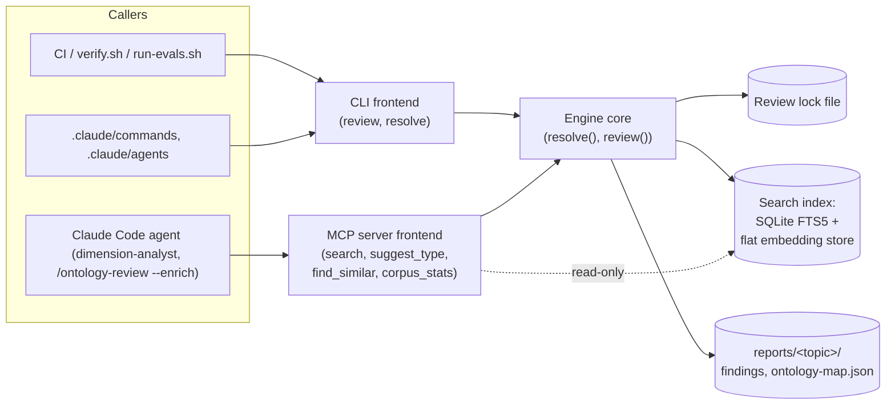

# Architecture: Compiled Ontology Engine Proof-of-Concept

## Context

The research-harness-template's ontology subsystem
(`scripts/resolve-ontology.sh`, `scripts/ontology-review.sh`) reviews and
classifies MIF findings against domain ontologies by spawning `yq`, `jq`, and
`ajv` as separate subprocesses per finding. Measured directly: a full-corpus
review against a real 4296-finding, 36-topic corpus
(`~/Projects/zircote/research-harness`) took over 20 minutes. This document
is the technical architecture for the scoped proof-of-concept authorized by
`docs/adr/0014-compiled-ontology-engine-cli-and-mcp.md` and scoped by
`docs/proposals/ontology-engine/prd.md` and
`docs/proposals/ontology-engine/feature-spec.md` — it does not re-derive
those documents' problem framing or options comparison; it covers the
technical shape of the thing they authorize building.

**Drivers**: eliminate the measured process-spawn cost (PDD-1 in ADR-0014);
prove gate-parity against the harness's existing fail-closed contract
(PDD-2); enable cross-topic semantic recall that does not exist today
(SDD-1); keep the deterministic gate path runnable headless, with no agent/
LLM session required, per the harness's four-layer architecture
(`docs/adr/0001-four-layer-single-repository-architecture.md`,
`docs/explanation/architecture.md`).

**External dependencies**: none required for the CLI path (the engine is
fully self-contained per invocation); an optional embedding provider (local
model or external API — see AD-1) for the MCP server's `suggest_type` and
`find_similar` tools only.

**Placement in the four-layer architecture**: this engine is one new
component inside the **Harness services** layer — the layer that today holds
the flat skills (`search`, `discover`, `lab`, `graph`, `topics`, …) operating
directly on the MIF substrate. It replaces the role
`scripts/ontology-review.sh` / `scripts/resolve-ontology.sh` play in that
layer; it does not touch the Engine (agents/commands), Contracts (schemas/),
or Outputs (reports/) layers except to read/write the same `reports/`
artifacts those scripts already read/write today.

## Architecture

### Building blocks

- **Engine core** — a library implementing `resolve()` (one finding against
  its topic's bound ontologies) and `review()` (a full topic or corpus scan,
  including the `--followup` backlog), reproducing
  `scripts/resolve-ontology.sh` / `scripts/ontology-review.sh`'s observable
  behavior exactly: same flags, same exit codes, same stdout table/summary
  format. This is the one place the classification and coverage logic lives;
  both frontends below are thin wrappers over it, so there is exactly one
  implementation of the ontology contract, never two forks to keep in sync.
- **CLI frontend** — a thin wrapper exposing `review` and `resolve`
  subcommands with argument shapes identical to the existing bash scripts
  (see `feature-spec.md`'s Design section for the exact flags), so every
  existing caller (`.claude/commands/`, `.claude/agents/`,
  `scripts/verify.sh`, `evals/run-evals.sh`) changes only the binary name it
  invokes.
- **MCP server frontend** — a thin wrapper over the same engine core,
  exposing `search`, `suggest_type`, `find_similar`, and `corpus_stats` (see
  `feature-spec.md` for exact signatures). It reads the index the CLI's
  `review` command builds and has **no write access to `reports/`** —
  `suggest_type` returns a hypothesis, never an auto-stamp, mirroring the
  existing discovery-basis philosophy this same tooling already established
  (a guess is not a fact until an analyst confirms it).
- **Search index** — SQLite FTS5 for full-text query, plus a flat-file
  embedding store with brute-force cosine similarity for `suggest_type` and
  `find_similar`. Both are built/refreshed by `<engine> review`, as a
  derived, **gitignored** artifact — never committed, never a required
  external service, matching the existing `ontology-map.json` convention of
  "rebuild deterministically from disk." At the measured corpus scale
  (~4300 findings), brute-force cosine similarity over a flat embedding file
  is fast enough with no vector database required (see AD-2).
- **Review lock** — an exclusive lock file held for the duration of a
  `review` run, so a second concurrent invocation fails closed with a clear
  error instead of racing on the same index/map files (see AD-3; this is the
  direct fix for an incident this session caused by accident, running two
  `ontology-review.sh` processes in parallel with no lock and corrupting
  derived `ontology-map.json` files for two topics).

### Component view (C4 Level 3)

## Non-Functional Requirements

1. WHEN `<engine> review` runs against the same real 4296-finding, 36-topic
   corpus used for this session's measurement, THE SYSTEM SHALL complete
   within 5 minutes (versus the 20+ minutes measured for the bash scripts).
2. WHEN any of the 144 `scripts/verify.sh` assertions or 41
   `evals/run-evals.sh` evals covering `resolve-ontology.sh`/
   `ontology-review.sh` are re-pointed at the new CLI, THE SYSTEM SHALL
   produce identical pass/fail outcomes.
3. WHEN an agent calls `find_similar` or `suggest_type` against a corpus of
   this scale (~4300 findings), THE SYSTEM SHALL respond in interactive time
   (sub-second to low-single-digit seconds).
4. IF the engine binary is absent or fails to start, THEN the existing bash
   scripts SHALL continue to operate correctly with no change in behavior —
   no hard dependency is introduced during the proof-of-concept phase.
5. IF a second `<engine> review` is started while one is already running
   against the same corpus, THEN THE SYSTEM SHALL fail the second invocation
   closed with a named lock error, and SHALL NOT allow both to write.

## Decision Log

### AD-1: Engine core language (Go vs. Rust) — Deferred

Both are viable for a single, statically-linked binary with zero runtime
dependencies. The deciding factor is which embedding strategy the MCP
server's `suggest_type`/`find_similar` tools ultimately use:

- **API-based embeddings** (calling an external embedding endpoint over
  HTTP): Go and Rust are roughly equivalent here — both make the HTTP call
  trivially — and Go iterates faster for a team without deep Rust
  experience.
- **Local on-device embedding inference** (no network dependency at gate
  time, which better matches this subsystem's existing fail-closed posture):
  Rust's `candle`/`ort` ecosystem for embedding inference is more mature
  than Go's equivalent today.

This document does not force the final pick. The feature-spec's M1
milestone (parity proof: the CLI reproducing `resolve()`/`review()`'s
observable behavior against the existing test/eval suite) needs neither
embeddings nor an embedding strategy decision at all — only the resolve/
review logic. Recommendation: defer the language call to whoever implements
M1, since M1's work is not re-done regardless of which embedding strategy
(and therefore language) is chosen afterward for M3 (the search proof
milestone).

### AD-2: Search index technology (SQLite FTS5 + flat embedding file) — Accepted

**Decision**: SQLite FTS5 for full-text search, plus a flat-file embedding
store with brute-force cosine similarity for semantic search — not a
dedicated vector database.

**Rationale**: at the measured corpus scale (~4300 findings in the reference
corpus), brute-force cosine similarity over a flat embedding file is fast
enough to meet NFR-3 (sub-second to low-single-digit-second response), and
both choices are zero-external-service, single-file, gitignored derived
artifacts — matching ADR-0014's SDD-2 requirement that any index be
rebuildable and never a required external service at gate time.

**Consequence / revisit trigger**: this is a corpus-scale assumption, not a
permanent architectural commitment. If a real instantiated harness's corpus
grows an order of magnitude beyond the reference corpus (e.g. tens of
thousands of findings), brute-force cosine similarity may no longer meet
NFR-3, and a proper approximate-nearest-neighbor index (still local,
still zero-external-service) should be evaluated at that point — not before,
since building for a scale that does not yet exist would contradict this
proof-of-concept's own scoped, evidence-driven approach.

### AD-3: Concurrency control (exclusive lock file) — Accepted

**Decision**: a simple exclusive lock file (flock-style), held for the
duration of a `review` run; a second concurrent invocation fails closed with
a named "another review is in progress" error.

**Rationale**: this is a single-machine, single-corpus tool with no
distributed or multi-writer use case in scope — a simple file lock is
sufficient and directly closes the gap that caused a real incident this
session: two `ontology-review.sh` bash invocations were run in parallel by
accident against the same real corpus, with no lock to prevent it, and
corrupted two topics' derived `ontology-map.json` files mid-write (recovered
via `git checkout` since the files are derived/rebuildable, but the incident
demonstrated the gap directly).

**Consequence**: a `review` run that is interrupted (killed) without
releasing its lock could leave a stale lock blocking future runs; the engine
must detect and clear a stale lock (e.g. by checking whether the PID that
holds it is still alive) rather than requiring manual intervention — this is
an implementation detail for whoever builds M1, not a design gap this
document leaves unaddressed.
