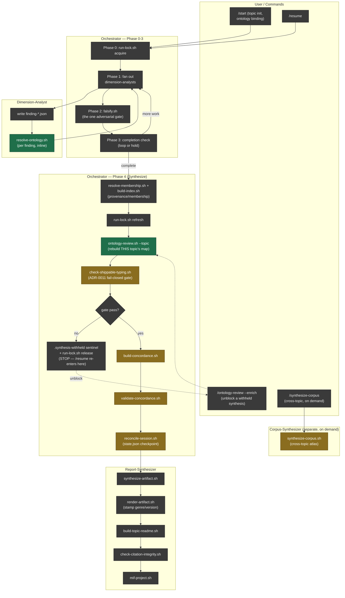

# Research lifecycle swimlane: current bash scripts vs. proposed Rust CLI scope

Supporting diagram for `docs/adr/0014-compiled-ontology-engine-cli-and-mcp.md`
and the `docs/proposals/ontology-engine/` doc-set. Traces one topic's full
research lifecycle — `/start` through synthesis — by actor lane, grounded in
the actual call sites in `.claude/agents/orchestrator.md` and
`.claude/agents/report-synthesizer.md` (not idealized). Node color marks each
script's status relative to this proposal:

- **Green** — in scope for the ADR-0014 proof-of-concept
  (`ontology-review.sh` / `resolve-ontology.sh`).
- **Amber** — named in ADR-0014's Option 2 ("big-bang rewrite") as a
  candidate for a *later*, separate generalization decision — explicitly
  **not** authorized by this proposal.
- **Gray** — everything else: unaffected either way.

## Reading the lanes

- **`resolve-ontology.sh`** runs inline, once per finding, inside the
  dimension-analyst's write loop (Phase 1) — this is the highest-frequency
  call site and the direct source of the measured per-finding subprocess
  cost.
- **`ontology-review.sh --topic`** runs once per topic per Phase 4 (every
  completed research run), immediately before the ADR-0011 fail-closed gate
  — a slow rebuild here delays every synthesis, not just a manual audit.
- Both are **in scope** for the ADR-0014 proof-of-concept (green). Every
  other script in Phase 4's gate chain — `check-shippable-typing.sh`,
  `build-concordance.sh`, `validate-concordance.sh`, `reconcile-session.sh`
  — and the separate, on-demand `synthesize-corpus.sh` are named in
  ADR-0014's Option 2 as *candidates* for a later, explicitly separate
  generalization decision (amber) — not authorized by the current proposal.
- The `report-synthesizer` lane (artifact rendering, README maintenance,
  citation integrity) is untouched by either the current proof-of-concept or
  the deferred candidates — it operates on already-typed findings and has no
  ontology-resolution cost of its own.
