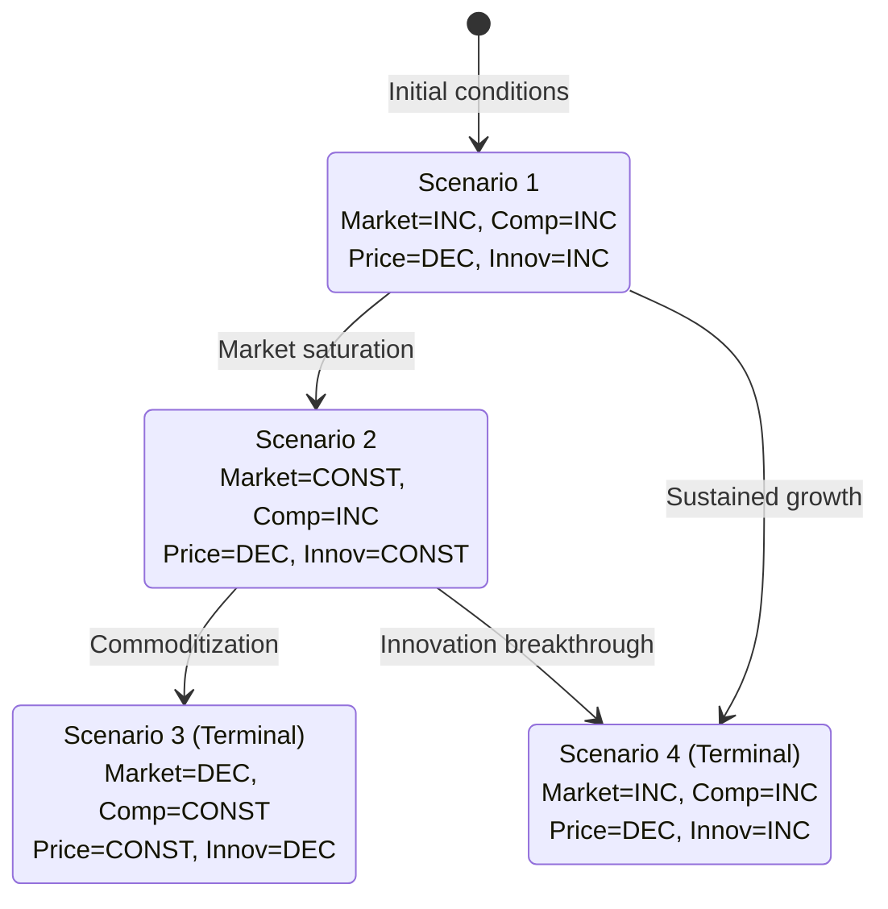

# Trend Modeling with Three-Valued Logic

Apply three-valued logic — increasing (INC), decreasing (DEC), constant (CONST) — to analyze markets when precise numerical data is unavailable. Enables meaningful directional analysis with minimal information.

## Required Frameworks

| Framework | Output Section | Required |
| --- | --- | --- |
| Variables Table | Variables | yes |
| Relationship Matrix | Relationship Matrix | yes |
| Scenario Generation | Generated Scenarios | yes |
| Transitional Graph | Transitional Scenario Graph (Mermaid stateDiagram) | yes |
| Terminal Scenario Analysis | Terminal Scenario Analysis | yes |
| Multi-Objective Trade-offs | Trade-offs | yes |

## When to Use

Choose three-valued logic when data is scarce or unreliable, relationships are qualitative, uncertainty is high, or quick directional insight is needed.

## The Three Values

Each variable is assigned **INC**, **DEC**, or **CONST**. A formal-notation variant expresses pairwise relationships as `INC(X, Y)` (X and Y move together) or `DEC(X, Y)` (X and Y move oppositely). An extended notation adds acceleration/deceleration modifiers: AG (accelerating growth), DG (decelerating growth), AD (accelerating decline), DD (decelerating decline).

### When the user provides correlation data, you MUST

1. Label each correlation "positive" or "negative".
2. Convert it to `INC(X, Y)` or `DEC(X, Y)` notation.
3. Show the conversion before building the matrix.

Example:

- Market size & competition → positive correlation → `INC(Market Size, Competition)`: if Market Size = INC then Competition = INC; if DEC then DEC.
- Price & demand → negative correlation → `DEC(Price, Demand)`: if Price = INC then Demand = DEC; if Price = DEC then Demand = INC.

## Construction

1. **Identify variables** — e.g., market size, competition intensity, price pressure, innovation rate, customer adoption, regulatory burden.
2. **Determine relationships** — for each pair, find the correlation direction and convert to INC/DEC.
3. **Build the trend matrix:**

   | Variable | Market Size | Competition | Price | Innovation |
   | --- | --- | --- | --- | --- |
   | Market Size | - | INC | DEC | INC |
   | Competition | INC | - | DEC | CONST |
   | Price | DEC | DEC | - | DEC |
   | Innovation | INC | CONST | DEC | - |

4. **Generate scenarios** — a scenario is a consistent assignment of INC/DEC/CONST to all variables satisfying every relationship.
5. **Identify terminal scenarios** — equilibrium states where all relationships hold, the system is stable, and no further transitions occur.

## Transitional Scenario Graph

Show scenario evolution as a Mermaid state diagram:



## Multi-Objective Trade-offs

No scenario satisfies all objective functions simultaneously. For terminal scenarios: identify competing objectives, map which scenarios favor which objectives, highlight required trade-offs, and recommend based on priority alignment.

## Worked Example: New Market Entry

**Variables:** Market Growth (MG), Competitive Intensity (CI), Entry Barriers (EB), Customer Awareness (CA).
**Relationships:** `INC(MG, CI)` (growth attracts competitors), `INC(MG, CA)`, `DEC(EB, CI)` (lower barriers increase competition), `INC(CA, MG)`.
**Scenarios:** (1) Explosive growth — MG=AG, CI=AG, EB=DEC, CA=AG. (2) Mature equilibrium — MG=DG, CI=CONST, EB=CONST, CA=CONST. (3) Consolidation — MG=DEC, CI=DEC, EB=INC, CA=CONST.

## Output Structure

```markdown
## Trend Model Summary
### Variables                  [name | current state | trend | confidence]
### Relationship Matrix        [INC/DEC relationships]
### Generated Scenarios        [per-variable assignment | terminal?]
### Transitional Graph         [Mermaid state diagram]
### Terminal Scenario Analysis [conditions, trade-offs, recommendation]
### Key Insights               [transitions, trade-offs]
```

## Best Practices

- Start with 4-6 variables; validate relationships with domain experts.
- Document where relationships are speculative; refine iteratively as information emerges.
- Focus on transitions — the paths between scenarios often matter more than endpoints.
- Large models (7+ variables): keep the matrix to direct relationships only (CONST for unclear pairs), generate 3-5 key scenarios rather than enumerating exhaustively, and prioritize terminal scenarios and likely transitions.

## Advantages

No numerical constants or parameters are required; a complete list of all futures/histories is obtained; results stay understandable without sophisticated mathematical tools.

## Confidence Tiers

High = inputs validated by 3+ independent dimensions' findings. Medium = inputs from 2 dimensions with reasonable assumptions. Low = speculative or single-dimension basis. All other dimensions supply input variables for scenario modeling. Alert on a scenario with >50% probability of adverse outcome, a bifurcation point within the planning horizon, or a terminal scenario that invalidates core business assumptions.
