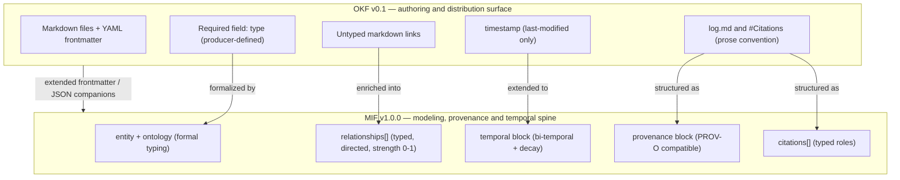
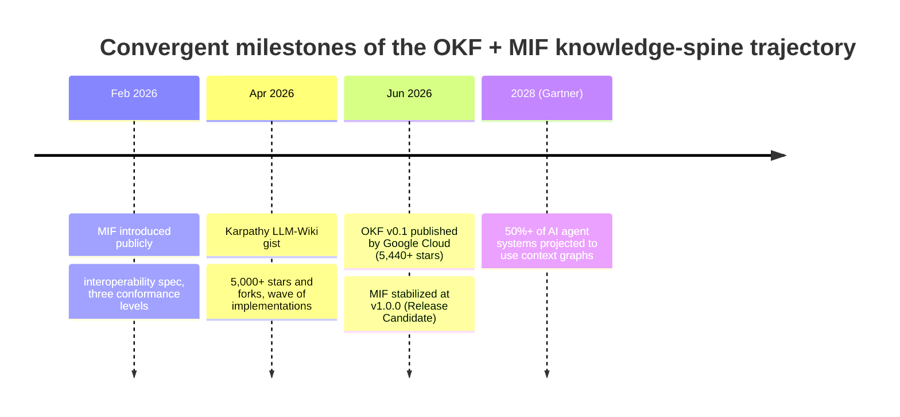

This academic synthesis covers 36 surviving finding(s) across the research.

## Abstract

This study evaluates whether the Modeled Information Format (MIF) should serve as the modeling, provenance, and temporal spine layered beneath Google Cloud's Open Knowledge Format (OKF) as the accessible, git-distributable packaging layer for a foundational research knowledge spine. The decision turns on four questions: is the layering technically feasible, is it differentiated from existing knowledge-representation prior art, is it on a favorable adoption trajectory, and is it addressed to a real market? Method: a goal-driven research harness fanned out four dimension analysts (technical, landscape, trajectory, market), each producing citation-backed MIF findings; every finding then passed exactly once through a single adversarial falsification gate that assigns an ordinal verdict (survived, weakened, falsified, inconclusive). Of 36 surviving findings, 31 survived and 5 were weakened; none was falsified or left inconclusive. Principal findings: OKF's deliberate minimalism (a single required `type` field, untyped markdown links, a last-modified timestamp, no formal ontology) is established, as is the complementary fact that MIF supplies typed relationships, a W3C-PROV-O-compatible provenance block, bi-temporal validity with decay modeling, and a formal ontology — exactly the semantics OKF defers. OKF's permissive-consumer extension rule makes the layering technically feasible at the frontmatter boundary. Conclusion: the layering is feasible and differentiated, and the trajectory and market are supportive; the binding risk is distribution and adoption — of OKF as a standard and of MIF beyond its first-party implementations — not specification maturity.

## Background and Related Context

Two formats frame this study. OKF v0.1 was published by Google Cloud on 12 June 2026, formalizing Andrej Karpathy's April 2026 LLM-Wiki pattern into a vendor-neutral, Apache-2.0 interoperability surface: a directory of markdown files with YAML frontmatter whose only required field is `type`. MIF, by contrast, is the older and more stabilized specification — public since February 2026 and standing at v1.0.0 (Release Candidate, last updated 2026-06-18, with the v1.0.0 line cut over shortly after) — an interoperability specification with three conformance levels, a dual markdown/JSON-LD representation, and provenance grounded in W3C PROV-O. The asymmetry is important and is frequently mis-stated: OKF is the young spec (v0.1, "a starting point, not a finished standard"); MIF is the mature spec whose open question is distribution, not version maturity.

The prior art this study must clear is dense. The Semantic Web stack (RDF, OWL, SPARQL) delivers full typed-relationship and inference rigor but at an authoring and infrastructure cost that has constrained adoption for two decades. PROV-O is the authoritative provenance vocabulary, SKOS the W3C taxonomy/thesaurus standard, and JSON-LD/schema.org the dominant linked-data serialization and web vocabulary — each occupying one slice of the knowledge-spine problem and each tied to the RDF toolchain or the web-annotation use case. Frictionless Data Packages share OKF's git-native, file-based minimalism but target tabular datasets rather than narrative knowledge. Personal knowledge-management tools (Obsidian, Logseq, Roam) have already converged on markdown-in-git with wiki links, but those links are untyped and carry no provenance. The gap this study addresses is whether an accessible packaging layer (OKF) plus a JSON-native semantic spine (MIF) can occupy the space between "linked markdown notes" and "enterprise knowledge graph" without inheriting the adoption-friction that sank the Semantic Web.

## Method

Findings were gathered by a goal-driven research harness that fans out one analyst per research dimension — technical, landscape, trajectory, and market — against a written goal whose completion condition specifies minimum citation-backed coverage per dimension (technical >= 4, landscape >= 3, trajectory >= 3, market >= 3) and two externally falsifiable thesis sub-questions (OKF's minimalism; MIF's typed-relationship, provenance, and temporal advantage). Each analyst emits findings as MIF memory units that validate against the MIF-backed findings schema and carry at least one citation with a resolvable URL.

Every finding then passes exactly once through a single adversarial falsification gate. The gate assigns an ordinal verdict: `survived` (the claim withstood a genuine disconfirmation attempt), `weakened` (the core claim holds but a load-bearing sub-claim was narrowed or a cited statistic could not be substantiated), `falsified` (the claim was contradicted by stronger evidence), or `inconclusive`. Handling follows the genre contract: `falsified` units are excluded from the report; `weakened` units are retained and reported with an explicit caveat naming the disconfirming evidence; `inconclusive` matters are reported as open. This round produced no falsified and no inconclusive findings, so the corpus is exhaustive over 36 surviving units (31 survived, 5 weakened). Citation integrity (no dead or malformed references) was checked across the cited corpus.

This report is itself a MIF Level-3 artifact: its frontmatter is the authoritative MIF concept, its verification block carries the real, gate-assigned verdict for the synthesis (not a hand-authored one), and the rendered document is write-then-validated by projecting it back to a finding and validating that projection against the same schema a finding must satisfy. Citation style is author-date (APA, 7th edition), applied consistently; the consolidated, URL-bearing reference list appears under Sources. The five weakened findings each carry their caveat inline at the end of the relevant subsection, and each subsection records its dimension and verification verdict.

## Findings I — Technical Architecture: OKF's Minimalism and MIF's Modeling Layer

This dimension establishes the two halves of the central thesis: that OKF v0.1 is deliberately minimal, and that MIF supplies precisely the modeling, provenance, and temporal semantics OKF omits — and that the two compose cleanly. The subsections cover OKF's core data model, its untyped links, and its informal provenance; MIF's typed relationships, provenance block, bi-temporal/decay model, and formal ontology; the field-by-field layering mechanics; and four technical comparators (Frictionless Data, JSON-LD/YAML-LD, schema.org, SKOS).

Figure 1 depicts the layering. OKF supplies the authoring and distribution surface; MIF supplies the semantic spine, encoded as extended frontmatter or JSON companions that OKF's permissive-consumer rule ("consumers MUST NOT reject documents with unrecognized fields") admits without breaking OKF conformance.

Table 1 compares OKF, the OKF+MIF layering, and the principal prior-art formats on the capabilities a knowledge spine requires. Yes denotes native support, Partial a constrained or convention-only form, and No an absence.

| Capability | OKF v0.1 | OKF + MIF | Frictionless | JSON-LD / schema.org | PROV-O | SKOS | RDF / OWL | PKM (Obsidian etc.) |
| --- | --- | --- | --- | --- | --- | --- | --- | --- |
| Git-native file packaging | Yes | Yes | Yes | Partial | No | No | No | Yes |
| Human + agent-readable markdown body | Yes | Yes | No | No | No | No | No | Yes |
| Typed, directed relationships | No | Yes | No | Yes | Partial | Partial | Yes | No |
| Formal ontology / typing | No | Yes | No | Partial | No | Partial | Yes | No |
| First-class provenance (confidence, agent) | No | Yes | Partial | No | Yes | No | Partial | No |
| Bi-temporal validity + decay | No | Yes | No | No | No | No | No | No |
| Low authoring cost (no RDF toolchain) | Yes | Yes | Yes | Partial | No | No | No | Yes |

The technical evidence below substantiates each cell and the layering mechanics; one finding in this dimension (MIF's typed relationships) is graded weakened on a narrowed enumeration and is reported with its caveat.

## Frictionless Data Package as Technical Comparator: Tabular Data Packaging, Not Knowledge Representation

The Frictionless Data Package specification (Open Knowledge Foundation, maintained since 2012, major update June 2024 with NLnet support) is a 'simple container format for describing a coherent collection of data in a single package.' Its descriptor file (datapackage.json) carries dataset-level metadata: name, id, title, description, contributors, licenses, version, keywords, homepage, and created timestamp. Resources are described by a mandatory 'resources' array pointing to data files (typically CSV, JSON, or Parquet). While Frictionless Data Package and OKF share the same git-native, file-based distribution model (both ship as directories of files, are version-controllable, and require no specialized runtime), their scopes are fundamentally different: Frictionless Data Package is for tabular data with schema validation. It defines field types, constraints, and inter-resource foreign key relationships for data quality and FAIR compliance. OKF is for narrative knowledge (concepts, playbooks, documentation) with markdown bodies. The gaps relative to OKF+MIF: (1) No typed knowledge relationships: Frictionless's 'foreignKeys' is a data-integrity constraint (this field in resource A maps to that field in resource B), not a semantic knowledge predicate. There is no equivalent to MIF's 'supports', 'derived-from', etc. (2) No provenance chain: 'contributors' and 'sources' track who built the dataset and what it was derived from, but there is no confidence scoring, trust level, or W3C PROV-compatible attribution. (3) No temporal decay: 'created' is a single timestamp; there is no TTL, decay model, or bi-temporal tracking. (4) No narrative body: a datapackage.json 'description' is a short string; there is no markdown body for human and agent consumption of contextual knowledge. Frictionless Data Package solves the tabular data FAIR packaging problem. OKF+MIF solves the knowledge FAIR packaging problem. They are complementary, not competitive: an OKF knowledge bundle about a BigQuery table would reference the underlying Frictionless Data Package descriptor as a 'resource' URI while MIF's provenance and relationship layers carry the semantic enrichment Frictionless deliberately omits.

_Dimension: technical · verification: survived._

Evidence:

- [Frictionless Data Package Specification — specs.frictionlessdata.io](<https://specs.frictionlessdata.io/data-package/>)
- [Frictionless Data Package — GitHub frictionlessdata/datapackage](<https://github.com/frictionlessdata/datapackage>)
- [OKF SPEC.md v0.1 — GoogleCloudPlatform/knowledge-catalog](<https://github.com/GoogleCloudPlatform/knowledge-catalog/blob/main/okf/SPEC.md>)

## JSON-LD and YAML-LD as Technical Alternatives: Full Linked Data Without Markdown Packaging

JSON-LD (JSON for Linked Data, W3C Recommendation 1.1, 2020) and its YAML superset YAML-LD (W3C JSON-LD Community Group Final Report, December 2023) deliver the core of what the OKF+MIF stack provides, but at a different layer of the stack: JSON-LD enables any JSON document to carry globally-identified typed entities and relationships through three reserved keywords: '@context' (vocabulary mapping), '@id' (global URI), '@type' (class assignment). A JSON-LD document can be mechanically converted to RDF triples, enabling SPARQL queries and OWL reasoning. YAML-LD extends this to YAML, using use cases including 'static site front matter, API documentation formats, Verifiable Credentials, FAIR metadata publications, and nanopublications.' The technical gap relative to OKF+MIF is: (1) Human authoring: JSON-LD requires authors to manage '@context' URIs, global identifiers, and RDF-compatible field names. YAML-LD eases this but still requires Linked Data literacy. OKF's plain YAML frontmatter is authorable by any developer without semantic-web training. (2) Markdown body: JSON-LD/YAML-LD are purely data formats; they carry no concept for human-readable narrative alongside structured metadata. OKF's dual markdown+YAML structure is the key affordance that makes knowledge bundles both agent-consumable and human-readable. (3) Git-native distribution: JSON-LD files can live in git, but the OKF bundle (index.md, log.md, directory-organized concept files) is specifically designed for git workflows — pull requests, diffs, blame, and review are first-class. A JSON-LD graph lacks the progressive-disclosure and human-navigation affordances that OKF directories provide. The OKF+MIF stack can be understood as a pragmatic middle path: OKF provides JSON-LD's human/agent interoperability goal at markdown authoring cost, while MIF provides JSON-LD's semantic typing via its own context.jsonld — without requiring every author to understand RDF or write @context declarations.

_Dimension: technical · verification: survived._

Evidence:

- [JSON-LD 1.1 — W3C Recommendation](<https://www.w3.org/TR/json-ld11/>)
- [YAML-LD — W3C CG Final Report, December 2023](<https://www.w3.org/community/reports/json-ld/CG-FINAL-yaml-ld-20231206/>)
- [OKF SPEC.md v0.1 — GoogleCloudPlatform/knowledge-catalog](<https://github.com/GoogleCloudPlatform/knowledge-catalog/blob/main/okf/SPEC.md>)

## MIF's Formal Ontology and EntityReference System: Structured Domain Typing

OKF's 'type' field is deliberately unregistered: the spec requires a non-empty string, but 'Types are not centrally registered; producers should pick descriptive values; consumers must tolerate unknown types gracefully.' This maximizes flexibility but means OKF concepts cannot be formally classified against a shared type system, enabling type conflicts and impeding cross-bundle interoperability. MIF addresses this with a two-level formal typing system: (1) The 'ontology' field references a specific ontology version (id, version, uri) against which the concept is classified. The ontology file (YAML format) declares entity types, required fields, relationship types, and content patterns. A finding's type must resolve to the referenced ontology — a hard validation that fails fail-closed if the type is absent from the declared ontology. (2) The 'entity' block carries 'name', 'entity_type', 'entity_id', and domain-specific fields required by the ontology. This block transforms each MIF Concept into a formally typed domain object: a technology concept carries 'stack_layer', 'maturity_level', 'license_type'; an organization carries 'org_type', 'size'; a concept carries 'domain', 'abstractionLevel'. MIF's generic core ontology provides five types available to every topic without binding a domain-specific ontology: 'concept', 'person', 'organization', 'technology', 'file'. Domain packs extend this with specialized types, and the 'extends' mechanism enables hierarchical ontology composition. In an OKF+MIF layering, OKF's free-form 'type' string would be treated as a hint for MIF ontology matching, with the formal MIF 'entity' block carrying the validated, schema-enforced typing. This means OKF concepts authored with producer-defined types ('BigQuery Table', 'API Endpoint') can be retroactively typed into MIF's formal ontology ('technology' or a data-catalog domain type) during an enrichment pass — precisely the 'ontology-review' workflow the MIF harness provides.

_Dimension: technical · verification: survived._

Evidence:

- [MIF Modeled Information Format Specification — mif-spec.dev](<https://mif-spec.dev/>)
- [MIF v1.0 — Ontology support, EntityReference — GitHub zircote/MIF](<https://github.com/zircote/MIF>)
- [OKF SPEC.md v0.1 — Type field definition — GoogleCloudPlatform/knowledge-catalog](<https://github.com/GoogleCloudPlatform/knowledge-catalog/blob/main/okf/SPEC.md>)

## MIF's First-Class Provenance Block: W3C PROV-O Compatible JSON Attribution

MIF's provenance block is a mandatory structural element at MIF Level 2+ conformance, designed to be W3C PROV-O compatible while remaining expressible as flat JSON properties. The block has '@type': 'Provenance' and carries: 'sourceType' — a closed enum with five values: 'user_explicit' (human-authored fact), 'user_implicit' (inferred from user behavior), 'agent_inferred' (derived by an AI agent from evidence), 'external_import' (imported from an external system), 'system_generated' (automated pipeline output). This enum maps directly to PROV-O's Agent/Activity/Entity attribution model. 'confidence' — a 0.0 to 1.0 numeric score expressing the authoring agent's epistemic certainty. 'trustLevel' — a categorical tier ('high_confidence', 'moderate_confidence', 'low_confidence', 'uncertain', 'verified', 'user_stated') for coarse filtering. 'agent' — an identifier for the originating agent (human, model name, tool). Optional W3C PROV properties 'wasGeneratedBy', 'wasAttributedTo', 'wasDerivedFrom' allow full PROV-O graph construction for systems that need RDF-level provenance interoperability. In the OKF+MIF layering, MIF's provenance block solves the knowledge-decay and trust-erosion problems that OKF's 'timestamp' (last-modified only) and informal log.md cannot address. Specifically: a knowledge spine needs to know not just when a concept was last edited, but whether it was AI-generated or human-verified, how confident the authoring agent was, and whether it derives from an authoritative external source or internal inference. OKF's single 'timestamp' field encodes only last-modified time; MIF's provenance block encodes the epistemic status of the claim itself. When layered over OKF, MIF provenance blocks would be stored as extended frontmatter fields or companion JSON files, making every OKF concept traceable to its authoring process without requiring the full RDF toolchain that PROV-O natively demands.

_Dimension: technical · verification: survived._

Evidence:

- [MIF Modeled Information Format Specification — mif-spec.dev](<https://mif-spec.dev/>)
- [MIF v1.0 — GitHub zircote/MIF: bi-temporal tracking, W3C PROV provenance](<https://github.com/zircote/MIF>)
- [PROV-Overview — W3C](<https://www.w3.org/TR/prov-overview/>)
- [Introducing MIF: Memory Interchange Format — zircote.com](<https://zircote.com/blog/2026/02/introducing-mif-memory-interchange-format/>)

## MIF's Bi-Temporal Tracking and Decay Modeling: What OKF's Single Timestamp Cannot Express

OKF v0.1's temporal model is a single optional frontmatter field: 'timestamp' (ISO 8601 datetime of last meaningful change). This is a point-in-time last-modified marker, not a temporal knowledge model. It cannot express: when the fact the concept describes became true (valid time), when the concept was recorded in the bundle (transaction time), or how confident the knowledge remains as time passes without reinforcement. MIF provides a 'temporal' block with three independent axes: (1) 'validFrom' / 'validUntil' — the real-world validity window for the claim (valid time). A regulatory fact may be valid from 2024-01-01 to 2025-12-31; OKF cannot express this interval. (2) 'recordedAt' — when the concept was captured in the knowledge store (transaction time). The combination enables bi-temporal queries: 'what did the agent believe at T?' vs. 'what was actually true at T?' — the core requirement for auditable knowledge systems. (3) Decay modeling: a 'ttl' field (ISO 8601 duration, e.g. 'P90D') and a 'decay' sub-object with 'model' (linear, exponential, or step), 'halfLife' (ISO 8601 duration), 'currentStrength' (0.0–1.0), and 'lastReinforced'. This Ebbinghaus-inspired decay model allows a knowledge-spine consumer to automatically demote or flag concepts whose temporal validity is weakening, without requiring a human to manually audit freshness. MIF also defines 'lastAccessed' and a 'reinforcementHistory[]' array to track how many times and when a concept has been confirmed or challenged. In an OKF+MIF layering, the temporal and decay fields would be encoded as extended frontmatter or companion JSON alongside OKF bundles, enabling the git-distributable OKF packaging layer to carry time-bounded, decay-aware knowledge — a capability no plain markdown format provides.

_Dimension: technical · verification: survived._

Evidence:

- [MIF — Bi-temporal tracking, decay models — GitHub zircote/MIF](<https://github.com/zircote/MIF>)
- [MIF Schema Reference — mif-spec.dev](<https://mif-spec.dev/>)
- [Bi-temporal memory for AI coding agents — git-pinned context that survives context compaction](<https://sverklo.com/blog/bi-temporal-memory-for-ai-agents/>)

## MIF's Typed Relationship System: Nine Structural-Core Predicates with Strength

MIF's typed relationship system is the central semantic layer that OKF's untyped markdown links lack. In MIF, every Concept object MAY carry a `relationships[]` array where each entry is a typed, directed edge to another concept identified by its `urn:mif:concept:` URI, with the type matching the schema pattern `^[a-z0-9][a-z0-9-]\*(:[a-z0-9][a-z0-9-]\*)?$` — permitting both kebab-case structural-core tokens and namespaced domain extensions. Per the MIF specification (mif-spec.dev), the structural-core relationship vocabulary comprises nine predicates: relates-to, derived-from, supersedes, conflicts-with, part-of, implements, uses, created-by, and mentioned-in. Additional predicates used by this research harness — supports, contradicts, refines, depends-on, and updates — are valid only as custom, namespaced relationship types, not as MIF core (the original finding mislabeled these five as core; see the verification note below). Each relationship entry also carries an optional `strength` numeric score (0.0 to 1.0) indicating the confidence or weight of the edge, and an optional `metadata` extension object for context. This formal graph substrate enables concordance validation across topics, knowledge-graph traversal for clustering and gap analysis, ontological spine construction, and machine-checkable assertions about relationships between findings. In an OKF+MIF layering, OKF bundles would carry the file-system packaging and human-readable prose while MIF's typed relationships would be encoded as extended frontmatter or companion JSON files — the semantic enrichment layer over OKF's minimalist structure. OKF thus supplies the authoring and distribution surface (git-native, markdown-first) while MIF supplies the queryable semantic graph that neither OKF nor any plain markdown tool natively supports.

Verification note: this finding is graded weakened. The broader thesis holds — MIF provides typed, directed relationship edges with optional strength (0-1) that OKF's untyped prose links lack — but the load-bearing enumeration was narrowed under first-party verification against mif-spec.dev: only four of the nine originally named predicates (relates-to, derived-from, supersedes, part-of) are MIF structural-core, while supports, contradicts, refines, depends-on, and updates are valid only as custom namespaced types. This is a narrowing of the enumeration, not a contradiction of the thesis, and it rests on a single first-party extraction.

_Dimension: technical · verification: weakened._

Evidence:

- [MIF Schema Reference — mif-spec.dev](<https://mif-spec.dev/>)
- [GitHub — zircote/MIF: Open standard for portable AI memory interchange](<https://github.com/zircote/MIF>)
- [MIF relationship types (mif-spec.dev) - the core vocabulary is relates-to/derived-from/supersedes/conflicts-with/part-of/implements/uses/created-by/mentioned-in; supports/contradicts/refines/depends-on/updates are not MIF-native core, only custom namespaced](<https://mif-spec.dev/specification/relationship-types/>)

## OKF v0.1 Core Data Model: Minimalist Markdown-YAML Specification

The Open Knowledge Format (OKF) v0.1, published by Google Cloud on 12 June 2026, represents an organization's knowledge as a directory tree of markdown files, each with a YAML frontmatter block. The specification is deliberately minimal: the ONLY required frontmatter field is 'type', a short producer-defined string (e.g., 'BigQuery Table', 'API Endpoint', 'Playbook'). No central type registry exists; consumers MUST tolerate unknown type values. Recommended optional fields in priority order are: 'title' (human-readable display name), 'description' (single-sentence summary), 'resource' (URI for the underlying asset), 'tags' (YAML list), and 'timestamp' (ISO 8601 datetime of last meaningful change). Producers MAY add any additional key-value pairs; consumers MUST preserve unknown keys and MUST NOT reject documents with unrecognized fields. The Knowledge Bundle is a self-contained hierarchical collection distributed as a git repo, tarball, or directory. Two reserved filenames serve structural purposes: 'index.md' (directory listing for progressive disclosure, no frontmatter) and 'log.md' (optional chronological update history, date-grouped). All other .md files are concept documents. Conformance requires only that every non-reserved .md file contains parseable YAML frontmatter with a non-empty 'type' field. All other constraints are soft guidance. OKF explicitly omits: fixed type taxonomies, formal ontologies, provenance tracking mechanisms, typed relationship definitions, storage/query infrastructure, and domain-specific schemas. This intentional minimalism makes OKF a portable interoperability surface rather than a content model — defining what producers and consumers agree on, not what knowledge means.

_Dimension: technical · verification: survived._

Evidence:

- [OKF SPEC.md v0.1 — GoogleCloudPlatform/knowledge-catalog](<https://github.com/GoogleCloudPlatform/knowledge-catalog/blob/main/okf/SPEC.md>)
- [How the Open Knowledge Format can improve data sharing — Google Cloud Blog](<https://cloud.google.com/blog/products/data-analytics/how-the-open-knowledge-format-can-improve-data-sharing>)

## OKF's Informal Provenance Model: log.md and Citations as Prose Conventions

OKF v0.1 provides two optional mechanisms for tracking knowledge origins and change history, but both are deliberately informal conventions rather than structured metadata. The first is 'log.md': an optional file at any directory level, organized by ISO 8601 date headings (newest first), with entries using conventional bold prefixes such as '\*\*Update\*\*', '\*\*Creation\*\*', '\*\*Deprecation\*\*'. The spec notes: 'Date headings MUST use ISO 8601 format. Leading bold words are convention, not requirement.' This log is a human-readable narrative, not a machine-processable provenance chain. There is no way to attribute a specific change to a named agent, timestamp an individual concept's last verification, or link a modification to an external source. The second mechanism is a '#Citations' section in the markdown body: external sources are listed as numbered markdown links ('1. [Title](url)'). These citations are embedded in free text with no structured role (does the source 'support', 'contradict', or merely 'provide context'?), no confidence score, and no date-of-access field. By contrast, MIF's first-class provenance block ('provenance: { @type: Provenance, sourceType, confidence, trustLevel, agent }') directly encodes W3C PROV-O-compatible attributions as structured JSON properties on every concept. MIF's 'citations[]' array carries typed citation objects with role (supports, contradicts, provides-context), citationType, URL, and accessed date — enabling programmatic citation-integrity gates. The OKF+MIF layering addresses this gap by using MIF's provenance block and citations[] as the persistent, machine-verifiable provenance spine while OKF's log.md and Citations section serve the human-readable narrative layer.

_Dimension: technical · verification: survived._

Evidence:

- [OKF SPEC.md v0.1 — Log Files and Citations sections — GoogleCloudPlatform/knowledge-catalog](<https://github.com/GoogleCloudPlatform/knowledge-catalog/blob/main/okf/SPEC.md>)
- [How the Open Knowledge Format can improve data sharing — Google Cloud Blog](<https://cloud.google.com/blog/products/data-analytics/how-the-open-knowledge-format-can-improve-data-sharing>)

## OKF+MIF Layering Mechanics: Complementary Fields, Conflicts, and the Extension Seam

The OKF+MIF layering is technically feasible because OKF's conformance model is deliberately extensible: 'Producers MAY include additional key-value pairs [in frontmatter]. Consumers SHOULD preserve unknown keys when round-tripping and MUST NOT reject documents with unrecognized fields.' This means an OKF-compliant bundle CAN carry MIF fields as extended frontmatter without breaking OKF conformance. The field-by-field complement mapping is: OKF 'type' (string) → MIF 'entity.entity_type' + 'ontology.id' (formal typed resolution). OKF 'timestamp' (last-modified) → MIF 'temporal.validFrom'/'validUntil'/'recordedAt' (bi-temporal). OKF 'tags' → MIF 'tags' (compatible, both YAML string arrays). OKF 'resource' (asset URI) → MIF 'citations[].url' with citationType 'primary-source'. OKF 'log.md' entries → MIF 'provenance' block + 'temporal.reinforcementHistory'. OKF '#Citations' section → MIF 'citations[]' with structured citationRole/citationType. OKF untyped markdown links → MIF 'relationships[]' with typed edge and strength. The primary tension is architectural: OKF's permissive-consumer model ('tolerate broken links, unknown types, missing fields') is optimized for resilient consumption across heterogeneous producers, while MIF's harness is fail-closed (an entity type that does not resolve against its declared ontology is a hard failure). An OKF+MIF layering must decide at what boundary this flip happens: OKF bundles remain permissive for authoring and distribution; MIF validation is applied at ingestion time (the 'enrichment pass') to validate and stamp the formal fields. A second tension is round-trip fidelity: converting OKF untyped prose links to MIF typed relationships requires an enrichment step (AI or human) to classify relationship types — this is lossy in the OKF→MIF direction (type inference) and lossless in the MIF→OKF direction (types degrade gracefully to untyped links with prose annotation). The recommended implementation pattern: OKF bundles are the authoring and git-distribution surface; an OKF→MIF enrichment agent (as demonstrated by Google's BigQuery enrichment reference agent) adds MIF frontmatter extensions at consumption time; MIF JSON companions carry the formal typed graph alongside the OKF markdown files, with the OKF package as the durable, human-readable spine.

_Dimension: technical · verification: survived._

Evidence:

- [OKF SPEC.md v0.1 — Extension mechanism, §3 — GoogleCloudPlatform/knowledge-catalog](<https://github.com/GoogleCloudPlatform/knowledge-catalog/blob/main/okf/SPEC.md>)
- [MIF v1.0 — GitHub zircote/MIF](<https://github.com/zircote/MIF>)
- [How the Open Knowledge Format can improve data sharing — Google Cloud Blog](<https://cloud.google.com/blog/products/data-analytics/how-the-open-knowledge-format-can-improve-data-sharing>)

## OKF's Untyped Link Mechanism: Relationship Semantics Carried Only by Prose

A foundational design decision in OKF v0.1 is that cross-concept links use standard markdown link syntax with no associated semantic type. The specification states: 'Link semantics represent untyped relationships; the relationship type is conveyed through surrounding prose.' A concept author writes something like 'Joined with [customers](/tables/customers.md) on customer_id' — the relationship type ('joined with') is natural language inside the body text, not a machine-processable predicate attached to the link. Consumers who build a graph view 'MUST treat all links as directed edges of untyped relationships.' Furthermore, 'Consumers MUST tolerate broken links — they may represent not-yet-written knowledge.' This means OKF's graph is structurally a typed directed graph but semantically an untyped one: a graph processor knows that concept A links to concept B, but cannot determine without reading and interpreting prose text whether that link expresses derivation, composition, dependency, citation, or another relationship. This is precisely the gap that MIF's typed 'relationships[]' array fills. MIF defines a structural-core set of machine-processable, typed edge types (relates-to, derived-from, supersedes, conflicts-with, part-of, implements, uses, created-by, mentioned-in), with further predicates available as namespaced extensions, with optional 'strength' (0-1) and 'metadata' extension. A knowledge-spine layering OKF+MIF would use OKF bundles as the packaging and file distribution layer while MIF's typed relationships provide the formal semantic graph that enables deterministic traversal, concordance validation, and ontological reasoning — capabilities the OKF untyped link model cannot support natively.

_Dimension: technical · verification: survived._

Evidence:

- [OKF SPEC.md v0.1 — Cross-linking section, §4 — GoogleCloudPlatform/knowledge-catalog](<https://github.com/GoogleCloudPlatform/knowledge-catalog/blob/main/okf/SPEC.md>)
- [Open Knowledge Format (OKF) — Official Grounding Page](<https://groundingpage.com/facts/open-knowledge-format/>)

## schema.org as Technical Comparator: Web-Optimized Vocabulary Without Git Distribution or Provenance

schema.org is the de facto web structured-data vocabulary, co-developed by Google, Bing, Yahoo, and Yandex and adopted by hundreds of millions of web pages. It defines approximately 800 entity types (Thing, Person, Organization, Product, Event, CreativeWork, etc.) and 1,300 property types as a JSON-LD vocabulary. Schema.org is embedded in web-page HTML as JSON-LD scripts or Microdata attributes to enable rich search results. As a technical comparator to OKF+MIF: (1) Distribution model: schema.org is embedded in HTML, served by web servers, indexed by search engine crawlers. It has no git-native bundle model, no directory structure, and no concept of a self-contained knowledge package. OKF bundles are designed to 'ship as a tarball, hostable in any git repo, mountable on any filesystem' — an entirely different distribution philosophy. (2) Provenance: schema.org has no built-in mechanism for expressing confidence, agent attribution, or W3C PROV-compatible provenance. A schema.org entity cannot express 'this claim was inferred by an AI agent at 0.85 confidence.' (3) Temporal decay: schema.org has no TTL, decay model, or bi-temporal tracking. dateCreated/dateModified are plain timestamps, not validity windows. (4) Relationship typing: schema.org uses specific properties (author, memberOf, worksFor) rather than a generic typed-relationship system. It lacks MIF's structural core predicates (derived-from, contradicts, supersedes) and cannot express adversarial or evidential relationships between knowledge claims. (5) Completeness gaps: Schema.org covers ~800 types but is highly incomplete for specific domains (CollegeOrUniversity has 67 properties but misses numberOfStudents or degreesOffered). MIF's ontology packs allow domain completeness through domain-specific extension without the schema.org consortium review cycle. Schema.org is the right choice for making web pages machine-readable to search engines. OKF+MIF is the right choice for building distributable, agent-consumable knowledge bundles with formal provenance and temporal semantics — a use case schema.org never targeted.

_Dimension: technical · verification: survived._

Evidence:

- [Ontology vs. Semantic Layer: Differences and schema.org limitations — Atlan](<https://atlan.com/know/ontology-vs-semantic-layer/>)
- [Ontologies, Context Graphs, and Semantic Layers: What AI Actually Needs in 2026](<https://contextandchaos.substack.com/p/ontologies-context-graphs-and-semantic>)
- [OKF SPEC.md v0.1 — GoogleCloudPlatform/knowledge-catalog](<https://github.com/GoogleCloudPlatform/knowledge-catalog/blob/main/okf/SPEC.md>)

## SKOS as Technical Comparator: Thesaurus Hierarchy Without Typed Relationships or Prose

SKOS (Simple Knowledge Organization System, W3C Recommendation 2009) represents thesauri, taxonomies, classification schemes, and controlled vocabularies as RDF graphs. A SKOS concept (skos:Concept) carries preferred labels (skos:prefLabel), alternate labels, definitions (skos:definition), scope notes, and three structural relationship types: skos:broader (parent term), skos:narrower (child term), and skos:related (associative, non-hierarchical). SKOS is specifically designed to enable controlled vocabulary alignment and thesaurus interoperability across institutions. The technical gaps relative to OKF+MIF are: (1) Relationship expressiveness: SKOS provides only broader/narrower/related predicates. It cannot express 'derived-from', 'contradicts', 'supersedes', 'depends-on', or other typed predicates needed for a research or agent-knowledge spine. MIF's nine structural-core relationship types go far beyond SKOS's three vocabulary-alignment predicates. (2) No narrative body: SKOS concepts carry only labels, notes, and references — no structured markdown body with Schema, Examples, or Citations sections. OKF's markdown body is the critical affordance for human and agent consumption. (3) RDF dependency: SKOS is expressed in RDF (Turtle, RDF/XML, JSON-LD), requiring the full Semantic Web toolchain for authoring and querying. OKF requires only a text editor. (4) No provenance: SKOS has no built-in provenance or temporal tracking beyond optional Dublin Core metadata annotations. (5) No git-native distribution: SKOS files are typically served from triple stores or vocabulary servers, not git repositories with diff/blame/PR workflows. SKOS solves vocabulary-alignment interoperability in existing triple-store ecosystems where OKF+MIF is irrelevant. OKF+MIF targets teams building AI-agent knowledge bases from scratch who need git-native, markdown-first knowledge with layered formal semantics — a use case SKOS's vocabulary model never targeted.

_Dimension: technical · verification: survived._

Evidence:

- [SKOS Simple Knowledge Organization System Reference — W3C](<https://www.w3.org/TR/skos-reference/>)
- [Simple Knowledge Organization System (SKOS) — ISKO Encyclopedia of KO](<https://www.isko.org/cyclo/skos.htm>)
- [OKF SPEC.md v0.1 — GoogleCloudPlatform/knowledge-catalog](<https://github.com/GoogleCloudPlatform/knowledge-catalog/blob/main/okf/SPEC.md>)

## Findings II — Landscape: Prior Art in Knowledge Representation

This dimension situates OKF+MIF against the established knowledge-representation prior art, testing the differentiation claim. Seven comparators are examined: Frictionless Data Packages (git-native but tabular), JSON-LD/schema.org (linked-data serialization and web vocabulary), PKM tools (untyped markdown graphs), PROV-O (provenance without an accessibility layer), RDF/OWL (full rigor, prohibitive authoring cost), and SKOS (taxonomy/thesaurus without provenance or typed relationships). The recurring pattern is that each comparator solves one slice of the problem and either ties the author to the RDF toolchain or targets a different use case, leaving the accessible-packaging-plus-JSON-native-semantics niche open.

## Frictionless Data Packages (OKFN): Accessible Dataset Packaging Without Knowledge Spine Semantics

Frictionless Data is a set of specifications and software libraries published by the Open Knowledge Foundation (OKFN) — a distinct organization from Google Cloud's Open Knowledge Format (OKF). The core specification, Data Package, describes a simple container format for packaging collections of data (typically tabular) with a JSON descriptor file named `datapackage.json` at the top level of the directory. The June 2024 update (v2, with NLnet support) added extensibility features. Community discussions in November 2025 addressed Zenodo integration and a 2026 reactivation plan.

A Data Package descriptor supports: `resources` (required, the packaged data files), `name`, `id`, `licenses`, `title`, `description`, `version`, `sources` (raw source lineage), `contributors` (with role specifications: author, publisher, maintainer, wrangler), `keywords`, and `created`. The `sources` array provides basic data lineage — tracking where raw data came from — and `contributors` records who was involved. This is shallow provenance: it covers authorship and original sources but provides no confidence scoring, trustLevel, or structured citation chains.

Frictionless Data explicitly lacks several features required for a knowledge spine: (1) No typed relationships between datasets or concepts — the spec has no mechanism to express that dataset A 'derives-from' or 'contradicts' dataset B. (2) No formal ontology — the community notes that provenance features 'are of limited use in some disciplines' while others (social sciences, epidemiology, clinical research) 'rely heavily on them', and those disciplines cannot adopt Frictionless meaningfully until the standard supports such features. (3) No concept model — Data Packages describe data files, not knowledge findings; there is no `conceptType`, `summary`, or finding lifecycle. (4) No temporal versioning model beyond a single `created` timestamp.

Frictionless Data occupies the data publishing layer — it solves the 'how do I package a CSV with its schema and metadata for sharing' problem and advances FAIR data publishing. It is a compelling analogy to OKF in its minimalism and JSON-descriptor-plus-files structure, but it targets datasets rather than curated knowledge concepts, and its provenance layer is substantially thinner than MIF's W3C-PROV-compatible provenance objects. A FAIR knowledge spine needs MIF's citation-backed finding model layered over OKF's packaging approach, not Frictionless Data's tabular dataset descriptor.

_Dimension: landscape · verification: survived._

Evidence:

- [Data Package (v1) Specification - Frictionless Data](<https://specs.frictionlessdata.io/data-package/>)
- [Frictionless Data Specifications - Official Home](<https://specs.frictionlessdata.io/>)
- [Frictionless Data and FAIR Research Principles - Open Knowledge Foundation Blog](<https://blog.okfn.org/2018/08/14/frictionless-data-and-fair-research-principles/>)

## JSON-LD and schema.org: Linked-Data Serialization Without Knowledge Management Depth

JSON-LD (JavaScript Object Notation for Linked Data) is a W3C Recommendation (JSON-LD 1.1, 2020) that makes RDF accessible to web developers without additional parsers or triple stores. Its five design goals are simplicity, compatibility with existing JSON, expressiveness (labeled directed graphs), terseness, and zero-edit migration from plain JSON. The `@context` keyword maps short terms to IRIs; `@id` uniquely identifies nodes; `@type` classifies them. As of 2023 JSON-LD is used by 45% of the top 10 million websites, making it the dominant linked-data serialization on the web.

Schema.org is the vocabulary layer: founded in 2011 by Google, Bing, Yahoo, and Yandex, it provides 614 types and 905 properties covering people, organizations, products, events, creative works, and more. A 2025 Semrush analysis found that pages with valid schema.org structured data are 2.3x more likely to appear in Google AI Overviews. JSON-LD is the preferred serialization format for schema.org markup. Unlike DCAT, schema.org is not a W3C standard — it is governed by an informal steering group with a multi-release-per-year cadence.

The limitations for knowledge spine use cases are significant: (1) JSON-LD is a serialization syntax, not a knowledge management framework — it provides no lifecycle for findings, no confidence scoring, and no citation chains beyond what custom schema.org types could express. (2) Provenance in the RDF/JSON-LD world requires RDF reification or named graphs, neither of which is native to schema.org; PROV-JSONLD (a 2024 W3C submission) attempts to bridge PROV-O and JSON-LD but remains a submission, not a Recommendation. (3) Schema.org's vocabulary is web-annotation-oriented — the 'Dataset' and 'ScholarlyArticle' types cover some knowledge management cases but do not model typed relationships between research findings, temporal verdicts, or adversarial falsification states. (4) JSON-LD's zero-edit transition goal means it is designed to layer onto existing JSON systems, not to be authored as a primary knowledge format — the inverse of OKF's and MIF's authoring model.

In the OKF+MIF landscape, JSON-LD and schema.org occupy the web entity annotation layer. They solve the problem of making web pages machine-readable to search engines and AI crawlers — a complementary concern to, not a replacement for, a knowledge spine that carries provenance, typed relationships, temporal versioning, and falsification lifecycle management.

_Dimension: landscape · verification: survived._

Evidence:

- [JSON-LD - A JSON-based Serialization for Linked Data (W3C Recommendation)](<https://www.w3.org/TR/json-ld11/>)
- [JSON-LD - JSON for Linked Data (Official Site)](<https://json-ld.org/>)
- [JSON-LD Schema Markup for AI Discoverability: Technical Guide 2026 - AgentVisibility.ai](<https://agentvisibility.ai/insights/json-ld-schema-ai-discoverability>)
- [The PROV-JSONLD Serialization - W3C Member Submission 2024](<https://www.w3.org/submissions/2024/SUBM-prov-jsonld-20240825/>)

## OKF (Google Cloud Open Knowledge Format): The Minimalist AI-Agent Knowledge Packaging Spec

Google Cloud published Open Knowledge Format v0.1 on June 12, 2026, open-sourcing the specification, reference implementations, and sample bundles under the Apache 2.0 license. OKF represents knowledge as a directory of markdown files with YAML frontmatter — one mandatory field (`type`), six recommended fields (`title`, `description`, `resource`, `tags`, `timestamp`), and unlimited producer-defined extensions. Concepts cross-link via normal markdown links; bundles can include `index.md` for hierarchy and `log.md` for chronological change history.

OKF's three design principles are: (1) minimally opinionated — the spec defines the interoperability surface, not the content model; (2) producer/consumer independence — no shared registry, runtime, or SDK required; (3) format, not platform — vendor-neutral, git-distributable, readable with `cat`, shippable as a tarball.

What OKF deliberately omits is precisely what makes it an ideal packaging layer for MIF: there is no formal ontology or type hierarchy, no provenance tracking mechanism (author attribution, lineage, confidence), no typed relationship semantics on links (links carry prose meaning only), no temporal versioning beyond the `timestamp` last-modified field, and no inference or constraint enforcement. These gaps are not defects — they are the spec's stated minimalism. The result is that OKF solves the distribution and authoring problem (git-distributable, human-readable, agent-consumable) while MIF's typed relationships, first-class provenance objects, formal ontologies, and temporal modeling provide the semantic depth OKF does not carry.

OKF's positioning matrix (from the specification): it is NOT a metadata catalog (those require vendor schemas and SDKs), NOT a RAG chunked retrieval system (those re-derive knowledge from raw text), and NOT a proprietary wiki (those require vendor lock-in). Instead it stores curated, version-controlled concepts that AI agents read and update directly — the same 'knowledge spine' use case that a MIF+OKF architecture addresses. OKF v0.1 is explicitly described as a starting point, not a finished standard, and is expected to evolve as producers and consumers collectively learn what knowledge representations agents actually need in practice.

_Dimension: landscape · verification: survived._

Evidence:

- [How the Open Knowledge Format can improve data sharing - Google Cloud Blog](<https://cloud.google.com/blog/products/data-analytics/how-the-open-knowledge-format-can-improve-data-sharing>)
- [OKF Specification v0.1 - GoogleCloudPlatform/knowledge-catalog on GitHub](<https://github.com/GoogleCloudPlatform/knowledge-catalog/blob/main/okf/SPEC.md>)
- [Google Cloud Introduces Open Knowledge Format (OKF): A Vendor-Neutral Markdown Spec for Giving AI Agents Curated Context - MarkTechPost](<https://www.marktechpost.com/2026/06/16/google-cloud-introduces-open-knowledge-format-okf-a-vendor-neutral-markdown-spec-for-giving-ai-agents-curated-context/>)

## PKM Tools (Obsidian, Logseq, Roam): Untyped-Link Markdown Graphs Without Provenance or Formal Ontology

Obsidian, Logseq, and Roam Research are the three leading personal knowledge management (PKM) tools as of 2026. All three use markdown files with wiki-style `[[links]]` that build an implicit knowledge graph, and all three share the same fundamental limitation: links are untyped.

Obsidian (Obsidian.md) is document-first, locally stored, with a large plugin ecosystem. Its Graph View visualizes the network of connections between notes. As the InfraNodus team notes: 'One simple missed feature that could turn Obsidian into a full-scale Personal Knowledge Graph is typed Links — we need the ability to attach metadata to relations itself.' Third-party plugins (Juggl, Graph-Link-Types) partially address this but add complexity and performance issues at scale. Obsidian has no built-in provenance model, no confidence scoring, no formal ontology for types, and no structured citation chain — backlinks are content connections, not formal epistemic claims.

Logseq is block-outliner-first, local, and open-source. Everything is a bullet point (block); blocks can be referenced and transcluded across pages. Logseq's database mode (in development as of 2025) aims to enable richer graph queries, but the core link model remains untyped. As one analysis notes: 'Note-taking tools such as Obsidian, Roam Research, and Logseq introduced bidirectional links, turning notes into graphs, but these links carry no semantic content — they record a connection but not its nature.'

Roam Research pioneered networked thought and the block-level outliner concept (c. 2020) that Logseq builds on. Roam is cloud-based ($15/month or $165/year), which means no local-first ownership. Like Obsidian and Logseq, Roam links are untyped; its graph is a personal knowledge graph only in the informal sense.

In the OKF+MIF knowledge spine landscape, these PKM tools represent the closest prior art to OKF's design philosophy: human-authored markdown, wiki-style links creating an implicit graph, no formal ontology or type system. OKF v0.1 explicitly positions itself near 'LLM wiki repositories' and PKM tools like Obsidian. The gap OKF+MIF closes is: these tools are author-focused personal tools, not portable interoperable formats — they lack the vendor-neutrality, git-distributability, agent-facing export semantics, typed relationships, provenance, and temporal modeling that a foundational knowledge spine requires. MIF's typed relationships and provenance objects provide the semantic layer that PKM tools deliberately avoid.

_Dimension: landscape · verification: survived._

Evidence:

- [Personal Knowledge Graphs in Obsidian - Volodymyr Pavlyshyn, Medium](<https://volodymyrpavlyshyn.medium.com/personal-knowledge-graphs-in-obsidian-528a0f4584b9>)
- [Obsidian vs Logseq 2026: Which PKM Tool Wins? - SoftPicker](<https://softpicker.com/obsidian-vs-logseq/>)
- [OKF Specification v0.1 - positions near LLM wiki / Obsidian pattern - GoogleCloudPlatform/knowledge-catalog](<https://github.com/GoogleCloudPlatform/knowledge-catalog/blob/main/okf/SPEC.md>)

## PROV-O: W3C Provenance Standard Without the Accessibility Layer

PROV-O (W3C Provenance Ontology, 2013) is the recognized standard for expressing provenance in a machine-readable form across domains. It defines three core classes — Entity (data), Activity (process), and Agent (software or human actor) — with properties covering derivation, attribution, and generation. PROV-O is designed to be extended for domain-specific use cases, and research in 2024-2025 actively extends it for AI agent workflows: PROV-AGENT, presented at IEEE e-Science 2025, adds LLM-centric entities, prompt/response interactions, model invocations, and telemetry into a unified PROV graph. PROV-O thus sits on the research frontier for AI provenance, validating the need MIF addresses. However, PROV-O operates within the RDF/OWL ecosystem: authoring provenance metadata requires RDF serialization (Turtle, JSON-LD, or RDF/XML), SPARQL for querying, and a triple store or OWL reasoner for inference. MIF's provenance layer covers the same conceptual ground — sourceType (user_explicit, agent_inferred, external_import), confidence score (0.0–1.0), trustLevel, and agent identification — but expresses it as plain JSON properties on a Concept object, requiring no RDF toolchain. MIF's approach is explicitly W3C-PROV-O compatible (the provenance block traces to PROV classes) while remaining readable as a flat YAML/JSON property. PROV-O fills neither the packaging gap (OKF's markdown layer) nor the typed concept-relationship gap that MIF addresses; it addresses only the provenance slice of the knowledge spine. Where PROV-O demands the full RDF stack, MIF delivers PROV-O-compatible semantics at JSON authoring cost, making it the accessible alternative for teams unwilling to adopt a triple store.

_Dimension: landscape · verification: survived._

Evidence:

- [PROV-O: The PROV Ontology - W3C Recommendation](<https://www.w3.org/TR/prov-o/>)
- [PROV-AGENT: Unified Provenance for Tracking AI Agent Interactions in Agentic Workflows (arXiv)](<https://arxiv.org/pdf/2508.02866>)
- [A semantic approach to mapping the Provenance Ontology to Basic Formal Ontology (Nature Scientific Data)](<https://www.nature.com/articles/s41597-025-04580-1>)
- [Introducing MIF: Memory Interchange Format - zircote.com](<https://zircote.com/blog/2026/02/introducing-mif-memory-interchange-format/>)

## RDF/OWL: Full Semantic Rigor, Prohibitive Authoring Cost

RDF (Resource Description Framework) and OWL (Web Ontology Language) are the W3C-recommended backbone for the Semantic Web and deliver exactly the typed-relationship, formal-ontology, and inference capabilities that OKF's untyped markdown links deliberately omit. An RDF triple (subject, predicate, object) can express any typed relationship with machine-processable semantics; OWL adds class hierarchies, property restrictions, and formal reasoning. These are precisely the gaps OKF v0.1 openly defers to later versions. However, RDF/OWL imposes a toolchain and authoring cost that eliminates the accessibility advantage OKF provides: practitioners must learn Turtle or RDF/XML syntax, SPARQL querying, triple store infrastructure, and OWL reasoners. An evaluation of OWL 2 DL reasoners found that many are no longer actively maintained, reflecting ecosystem sustainability challenges. RDF's atomic triple structure also complicates n-ary relationships (requiring complex reification workarounds), and the Semantic Web 'layer cake' introduced ambiguities by conflating data modeling, knowledge representation, and logic reasoning. Modern platforms abstract RDF complexity through catalogs, glossaries, and policy engines, but this requires heavyweight infrastructure incompatible with OKF's 'just markdown, just files, just YAML' philosophy. OKF+MIF occupies a distinct niche: OKF's markdown packaging layer preserves the authoring accessibility that RDF sacrifices, while MIF provides typed relationships and provenance at a JSON-native level without forcing users into SPARQL or triple stores. RDF/OWL solves the semantic completeness problem but not the adoption-friction problem; OKF+MIF targets both simultaneously, layering semantic depth under an accessible surface.

_Dimension: landscape · verification: survived._

Evidence:

- [RDF vs OWL: Key Differences, Use Cases and Examples Explained - Atlan](<https://atlan.com/know/rdf-vs-owl/>)
- [Beyond OWL: Reconsidering Ontologies in the Age of AI and the Semantic Web](<https://medium.com/@nfigay/beyond-owl-reconsidering-ontologies-in-the-age-of-ai-and-the-semantic-web-4059b519f23d>)
- [OWL Reasoners still useable in 2023 (arXiv)](<https://arxiv.org/pdf/2309.06888>)
- [OKF SPEC.md - GoogleCloudPlatform/knowledge-catalog](<https://github.com/GoogleCloudPlatform/knowledge-catalog/blob/main/okf/SPEC.md>)

## SKOS: W3C Taxonomy and Thesaurus Standard Without Provenance or Typed Relationships

The Simple Knowledge Organization System (SKOS) is a W3C Recommendation (August 18, 2009) that provides an RDF vocabulary for representing semi-formal knowledge organization systems — thesauri, classification schemes, subject heading lists, taxonomies, and folksonomies — as linked data on the Semantic Web. It is widely deployed: the EU's ESCO skills vocabulary, national library thesauri, government business glossaries, and media content catalogs all use SKOS.

SKOS's data model centers on Concepts identified by URIs, with three label types (preferred, alternate, hidden), two hierarchical relationships (`skos:broader` / `skos:narrower`), one associative relationship (`skos:related`), and documentation properties for definitions, scope notes, and editorial annotations. Concepts aggregate into `skos:ConceptScheme` with top-level entry points via `skos:hasTopConcept`.

SKOS intentionally lacks features that MIF provides: (1) No provenance mechanism — the primer explicitly acknowledges 'there is no mechanism in SKOS to record that a specific statement concerning these concepts pertains to a specific concept scheme'; provenance requires named graphs and RDF Datasets outside SKOS core. (2) No relationship sub-typing — SKOS cannot distinguish generic hierarchies from part-whole hierarchies; users must create extensions. (3) No formal logic — SKOS deliberately avoids OWL axioms and inference rules, trading expressiveness for adoption simplicity. (4) No confidence or trustLevel fields — concepts carry no epistemic qualification.

SKOS operates as an RDF vocabulary, meaning it inherits the full semantic web toolchain requirement (triple stores, SPARQL, ontology editors) even though it is simpler than OWL. This makes SKOS inaccessible for the plain-JSON/markdown-first authoring patterns that OKF and MIF target.

The SKOS authors describe it as 'a bridging technology' between formal ontologies and informal collaborative systems. In the OKF+MIF landscape, SKOS occupies the taxonomy/vocabulary layer — it can express what MIF's ontology module provides, but requires the RDF ecosystem and lacks provenance, temporal modeling, confidence scoring, and citation chains that MIF's finding model delivers natively.

_Dimension: landscape · verification: survived._

Evidence:

- [SKOS Simple Knowledge Organization System - W3C Home Page](<https://www.w3.org/2004/02/skos/>)
- [SKOS Simple Knowledge Organization System Primer - W3C Recommendation](<https://www.w3.org/TR/skos-primer/>)
- [Simple Knowledge Organization System (SKOS) - ISKO Encyclopedia of Knowledge Organization](<https://www.isko.org/cyclo/skos.htm>)

## Findings III — Trajectory: Adoption Momentum and Headwinds

This dimension assesses whether the layering is on a favorable adoption trajectory. The evidence spans the AI-agent memory frontier (where provenance and temporal validity are the documented hard problems), enterprise knowledge-graph market growth, the GraphRAG shift toward hybrid graph+vector retrieval, the git-native markdown KM wave, Karpathy's LLM-Wiki adoption, OKF's launch momentum, MIF's stabilized-but-nascent ecosystem, the cautionary lessons of the Semantic Web's adoption failure, and the W3C RDF 1.2 / RDF-star provenance-standardization trajectory.

Figure 2 places the convergent milestones on a timeline. The practitioner community reached the markdown-in-git packaging model before OKF formalized it, and MIF reached specification stability before OKF launched — so the favorable scenario is complementary sequencing rather than two immature specs racing.

The cautionary counterweight runs through the subsections below: format adoption is slow and network-effect-gated, and OKF's minimalism could become a ceiling rather than a floor.

## AI Agent Memory: Provenance and Temporal Validity are the Hard Open Problems in 2026

In 2026, persistent memory has become a first-class architectural component for AI agents, with its own benchmark suite (LoCoMo, LongMemEval, BEAM), dedicated research literature, and measurable performance comparisons. Mem0, the most widely deployed semantic memory layer (48,000+ GitHub stars, $24M in funding), demonstrates the current architecture's capabilities and limits: it extracts named entities and relationships from conversations via LLM pipeline, stores them as nodes and edges in a graph database, cross-links to vector embeddings for fuzzy search, and achieves 92.5 on LoCoMo and 94.4 on LongMemEval.

But two structural limitations are documented as the field's hardest open problems. First, memory staleness: high-relevance memories can become confidently wrong when user circumstances change. Decay-based approaches fail to address this because relevance and recency are orthogonal — a fact about a user's address from two years ago can be highly relevant today yet completely wrong. Temporal abstraction degrades significantly at scale: 64% accuracy at 1M tokens, 49% at 10M tokens. The biggest performance gains in 2025-2026 benchmarks were in temporal reasoning (+29.6 points) and multi-hop queries (+23.1 points), confirming these are the active improvement frontier. Second, actor attribution: multi-agent systems require tracking which agent or user contributed each memory fact to prevent ambiguity about source and authority.

The MemClaw framework (2025) addresses governed shared memory in multi-agent environments, explicitly requiring 'scoped access, temporal correctness, provenance, and policy-controlled propagation.' Research on the Stability and Safety Governed Memory (SSGM) framework catalogs provenance tracking as a core safety requirement, not an optional feature. LongMemEval, the benchmark emphasizing knowledge updates and temporal reasoning, identified the multi-session temporal coherence problem as the dominant unsolved challenge.

MIF's design directly maps to these open problems. The provenance block (PROV-O-grounded: sourceType, confidence, trustLevel, agent attribution) addresses actor attribution. The 'temporal validity' concern — when did this fact become true, when did it stop being true, and under what condition would it need re-verification — is the gap MIF's temporal fields and versioning model target. OKF's 'timestamp' field records last meaningful modification but carries no structured provenance, no confidence score, and no validity window. The demand for provenance-aware, temporally valid memory is not speculative — it is the active, documented research frontier for the entire AI agent memory ecosystem as of mid-2026.

_Dimension: trajectory · verification: survived._

Evidence:

- [State of AI Agent Memory 2026: Benchmarks, Architectures & Production Gaps — Mem0](<https://mem0.ai/blog/state-of-ai-agent-memory-2026>)
- [Governing Evolving Memory in LLM Agents: Risks, Mechanisms, and the SSGM Framework — arXiv](<https://arxiv.org/html/2603.11768v1>)
- [AI Agent Memory Architectures: From Context Windows to Persistent Knowledge — Zylos Research](<https://zylos.ai/research/2026-04-05-ai-agent-memory-architectures-persistent-knowledge/>)

## Enterprise Knowledge Graph Market: 21-36% CAGR, Gartner Predicts 50%+ Agent Adoption by 2028

The enterprise knowledge graph market reached a decisive inflection point in 2024-2025. Market research firms project different but uniformly strong growth rates: Technavio estimates 33.4% CAGR from 2025-2030 (adding $3.92 billion); Grand View Research estimates $2.89 billion in 2025 growing to $13.37 billion by 2033 at 21.3% CAGR; MarketsandMarkets projects $9.88 billion by 2032 at 31.6% CAGR. The property graphs segment led with 65.3% revenue share in 2025. The 'AI-ready enterprise knowledge graph' sub-segment, valued at $890 million in 2025, is the fastest-growing slice.

Three signal events mark the 2024-2025 maturation. First, Microsoft open-sourced GraphRAG in February 2024, demonstrating that LLM-generated knowledge graphs enable qualitatively different enterprise reasoning (global synthesis across entire document corpora, not just local semantic similarity). LinkedIn's GraphRAG deployment reduced ticket resolution time from 40 hours to 15 hours — a 63% improvement. Microsoft's LazyGraphRAG (November 2024) reduced indexing costs by 10-90%, removing the primary production deployment barrier. Second, Google Cloud Spanner Graph reached general availability in January 2025, integrating graph analysis into operational relational data for the first time in a major cloud platform. Third, enterprise vendors Workday and ServiceNow both integrated RAG into their platforms.

Gartner's 2025-2026 analysis is particularly directional. The firm placed knowledge graphs on the 'Slope of Enlightenment' in its 2025 AI Hype Cycle, forecasting that 50%+ of AI agent systems will use context graphs by 2028. Gartner defines 'context graphs' as an evolution of knowledge graphs purpose-built for agentic AI grounding, adding decision traces, temporal validity, and policy layers to the traditional semantic foundation. The firm predicts context engineering improvements will enhance agentic AI accuracy by at least 30% and that context engineering features will be built into 80% of software tools for AI application development by 2028.

For the OKF+MIF question, enterprise KG adoption trajectory is a structural tailwind. The enterprise market's move toward knowledge-graph-grounded agents aligns with exactly the use case OKF+MIF targets. However, most enterprise KG deployments run on specialized graph databases (Neo4j, Amazon Neptune, Google Spanner Graph) rather than on markdown-in-git formats — OKF+MIF competes with, and should position itself as complementary to, these infrastructure-heavy deployments. The opportunity is that OKF+MIF provides the 'human-readable, git-distributable layer' on top of or alongside these systems, not a replacement for them.

_Dimension: trajectory · verification: survived._

Evidence:

- [GraphRAG: Unlocking LLM Discovery on Narrative Private Data — Microsoft Research Blog](<https://www.microsoft.com/en-us/research/blog/graphrag-unlocking-llm-discovery-on-narrative-private-data/>)
- [Gartner on Context Graphs: Trends, Capabilities, Setup in 2026 — Atlan](<https://atlan.com/know/gartner-context-graphs/>)
- [Enterprise Knowledge Graph Market Industry Report 2033 — Grand View Research](<https://www.grandviewresearch.com/industry-analysis/enterprise-knowledge-graph-market-report>)
- [Knowledge Graph Market Worth $9.88 Billion by 2032 — MarketsandMarkets](<https://www.marketsandmarkets.com/PressReleases/knowledge-graph.asp>)

## Git-Native Markdown Knowledge Management: 1.5M+ Obsidian Users and 22% YoY Growth

The personal knowledge management (PKM) ecosystem has undergone a structural shift since 2022. Tools like Obsidian (1.5+ million active users, 22% year-over-year growth), Roam Research, and Logseq share a common architectural bet: knowledge lives in plain markdown files, stored locally, version-controlled in git. Tiago Forte's 'Building a Second Brain' (2022, 500,000+ copies sold) brought the conceptual framework into mainstream professional awareness. Millennials and Gen Z, who now constitute over 60% of the global knowledge workforce, show strong preference for interconnected, bidirectional-link based tools.

Obsidian's January 2025 release of 'Bases' — structured data capabilities without plugins — represented its most significant feature addition since Canvas, pushing the tool further toward the structured knowledge use cases that OKF addresses. Critically, AI integration has become the dominant adoption driver: practitioners are arriving at Obsidian because of AI agents and LLM-context workflows, not because of PKM philosophy. The vault-as-knowledge-layer pattern (giving Claude Code or similar agents direct read/write access to a markdown vault) pulls developers into the markdown-in-git ecosystem who never cared about personal knowledge management as such. Enterprise spending on PKM tools grew approximately 18% year-over-year in 2025.

Plain text's structural advantage in the AI era has become explicit: markdown files are in exactly the format AI coding agents process natively. There is no proprietary encoding, no vendor lock-in, no SDK required to read or generate content. This aligns precisely with OKF's 'if you can cat a file, you can read OKF; if you can git clone a repo, you can ship it' design principle.

The trajectory implication for OKF+MIF is favorable: the practitioner community has already converged on the packaging model OKF formalizes (markdown + git + minimal conventions). OKF is arriving into a pre-conditioned market. MIF's typed-relationship and provenance model addresses the next-order gap that PKM tools expose — knowledge graphs in tools like Obsidian are untyped (just bidirectional links), have no formal provenance, and carry no temporal validity model. As AI agents take on more responsibility for maintaining these vaults, the demand for a structured, typed semantic layer above the markdown will intensify.

_Dimension: trajectory · verification: survived._

Evidence:

- [History of Obsidian: Second Brain to AI Knowledge OS — Taskade Blog](<https://www.taskade.com/blog/obsidian-history>)
- [Obsidian Complete Guide: The Ultimate Markdown Editor for Knowledge Management Revolution 2025 — SmartScope](<https://smartscope.blog/en/obsidian-complete-guide/>)
- [Personal Knowledge Management Software Market Research Report 2034 — DataIntelo](<https://dataintelo.com/report/personal-knowledge-management-software-market>)

## Hybrid Graph+Vector Architectures Displacing Pure RAG: 3.4x Accuracy Gains Signal Structural Shift

The retrieval-augmented generation (RAG) architectural trajectory underwent a fundamental shift in 2024-2025 that directly shapes demand for structured knowledge formats. Pure vector-based RAG — semantic similarity search over text chunk embeddings — proved inadequate for the most valuable enterprise use cases. Specific failure modes: zero accuracy (0%) on schema-bound queries requiring reasoning over entire datasets; inability to synthesize information across thousands of disconnected documents; failure to preserve hierarchical or conceptual dependencies; and 'semantic gap' challenges where term-level similarities mislead retrieval for concept-level queries. Industry benchmarking found that optimized GraphRAG implementations achieve 90%+ accuracy on queries where vector-only approaches score 0%, and that an LLM grounded with a knowledge graph achieves 56.2% accuracy versus 16.7% without (a 3.4x improvement).

Microsoft Research's GraphRAG (open-sourced February 2024) pioneered the 'community detection' paradigm: LLMs generate knowledge graphs from document corpora, then graph community structures enable global summarization that no vector approach can replicate. The GitHub repository (microsoft/graphrag) reached substantial star counts within months of release. LazyGraphRAG (November 2024) addressed the remaining production barrier — indexing cost — by deferring community summarization to query time, reducing costs by 10-90% while maintaining competitive accuracy. Enterprise adoption followed: Workday and ServiceNow integrated KG-grounded RAG into their enterprise platforms, and LinkedIn's production deployment achieved 63% reduction in ticket resolution time.

By mid-2025, the practitioner consensus had converged: 'the future of enterprise search is not Vector or Graph, but Vector plus Graph.' Hybrid search with Reciprocal Rank Fusion (RRF) typically shows 15-30% better retrieval accuracy than pure vector search. The dominant 2025-2026 production pattern is a three-tier query router: vector search for semantic similarity, graph traversal for relational reasoning, and SQL for structured fact retrieval — with an LLM orchestrating across all three. Organizations implementing hybrid architectures report 300-320% ROI and measurable business impact across finance, healthcare, and manufacturing.

For the OKF+MIF question, this shift is the strongest structural tailwind in the finding set. The demand for typed relationships, formally defined entity structures, and provenance tracking is driven by the failure of untyped, schema-less storage to support the knowledge-reasoning tasks that LLMs are being deployed to solve. OKF's untyped links and minimal frontmatter are a packaging layer — they reduce authoring friction. MIF's typed relationships, ontologies, and provenance objects are the semantic substrate that enables the graph traversal, entity linking, and provenance-aware retrieval that hybrid architectures require. The two layers are complementary, not competing.

_Dimension: trajectory · verification: survived._

Evidence:

- [Project GraphRAG — Microsoft Research](<https://www.microsoft.com/en-us/research/project/graphrag/>)
- [Graph RAG Guide 2025: Architecture, Implementation & ROI — Salfati Group](<https://salfati.group/topics/graph-rag>)
- [Knowledge Graph vs Vector Database for RAG: Which Is Best? — Meilisearch](<https://www.meilisearch.com/blog/knowledge-graph-vs-vector-database-for-rag>)
- [From LLMs to Knowledge Graphs: Building Production-Ready Graph Systems in 2025 — Medium](<https://medium.com/@claudiubranzan/from-llms-to-knowledge-graphs-building-production-ready-graph-systems-in-2025-2b4aff1ec99a>)

## Karpathy's LLM Wiki Pattern: 5,000+ Stars and a Wave of Implementations

On April 4, 2026, Andrej Karpathy published a GitHub Gist describing the LLM Wiki pattern: instead of re-deriving knowledge from raw documents at query time via Retrieval-Augmented Generation (RAG), an LLM should incrementally build and maintain a persistent, structured wiki composed of interlinked markdown files. The core insight is that LLMs excel at the tedious bookkeeping that causes human wikis to rot — updating cross-references, maintaining consistency, touching fifteen related files in a single pass — while humans curate sources and ask questions. The architecture has three layers: immutable raw sources, an LLM-maintained wiki, and a schema document (CLAUDE.md, AGENTS.md) that configures the LLM's maintenance behavior.

The gist accumulated 5,000+ stars and 5,000+ forks, spawning a wave of independent implementations: AutoSci, Smriti-MCP, Eidetic, Loremaester, and dozens more, each adding engineering refinements around contradiction detection, token efficiency, and knowledge drift. The Obsidian community quickly built a Karpathy-LLM-wiki plugin. AI startup Nimbalyst automated the bookkeeping layer. The open-source Hermes project adopted the format for internal operations. When Google Cloud launched OKF on June 12, 2026, it explicitly named Karpathy's gist as the foundational pattern it was formalizing.

This trajectory is significant for the OKF+MIF question in two ways. First, it demonstrates that the practitioner community has already converged on the core architectural bet that OKF encodes: markdown + git + minimal conventions as the packaging layer for AI-agent knowledge. OKF v0.1 did not create this pattern; it captured and standardized existing behavior. Second, the pattern's rapid organic growth validates the demand for an accessible, git-native knowledge format — and simultaneously exposes its current limitation: the community's implementations reveal divergent metadata conventions, untyped links, no shared provenance model, and no temporal validity mechanism. These gaps in the LLM-wiki pattern are precisely the structural problems that MIF's typed relationships, provenance objects, and temporal validity fields exist to solve. The adoption trajectory of the LLM-wiki pattern is thus a direct demand signal for the kind of semantic layering MIF provides on top of OKF's packaging foundation.

_Dimension: trajectory · verification: survived._

Evidence:

- [LLM Wiki — Karpathy GitHub Gist (April 2026)](<https://gist.github.com/karpathy/442a6bf555914893e9891c11519de94f>)
- [Google Launches a Universal Format for Karpathy's LLM Wiki — Techstrong.ai](<https://techstrong.ai/articles/google-launches-a-universal-format-for-karpathys-llm-wiki/>)
- [Google Just Standardized Karpathy's LLM Wiki Pattern — The Menon Lab](<https://themenonlab.blog/blog/google-okf-open-knowledge-format-karpathy-llm-wiki-standard>)

## MIF Momentum: a Stabilized v1.0.0 Spec, Public Since Early 2026, Differentiated but Still Building Adoption

MIF's origin story is described in its February 2026 introduction blog post: Robert Allen encountered the practical pain of migrating memories between his own tools and found that 'the formats were different, the schemas did not align, context got lost in translation.' The market gap MIF addresses is real and documented: the AI memory ecosystem as of mid-2026 includes Mem0 (48,000+ GitHub stars, $24M funded), Zep, Letta, LangMem, Basic Memory, and over a dozen others, each with proprietary schemas. Switching between them requires custom migration scripts; when providers shut down, accumulated memories vanish; multi-tool workflows create isolated silos with no cross-tool learning.

MIF's design response is an interoperability specification with three conformance levels (Level 1: four required fields; Level 3: full provenance, citations, and ontology support) and a dual-format representation (human-readable .memory.md and machine-processable JSON-LD). The specification explicitly adopts W3C PROV-O for provenance and JSON-LD for semantic web compatibility, positioning MIF as a bridge between the accessible markdown world (where practitioners live) and the formal semantic infrastructure (where interoperability lives). The stated roadmap prioritizes memory provider Level 1 export implementations first, then Obsidian plugin development, community converter tools, and federation protocols.

Assessing MIF's trajectory means separating three things: the gap it addresses, the maturity of the specification, and the distribution it has achieved. The gap is real and growing — as AI agent memory systems proliferate and multi-agent architectures become standard, the cost of format fragmentation rises. The specification itself is mature: MIF has been public since February 2026 and reached v1.0.0 (Release Candidate; the spec was last updated 2026-06-18 and the v1.0.0 line was cut over to main on 2026-06-28), with two first-party reference implementations (subcog, mnemonic) and this research harness template — the flagship implementation — itself persisting its research as MIF. What MIF has not yet achieved is broad distribution: as of the research date it has no large independent adopter base, no formal governance body, and no published adoption metrics. The network effects that turn a format into a de facto standard have not yet materialized — but that is an adoption gap, not a version-maturity gap.

The OKF+MIF layering question must frame this asymmetry correctly. MIF is the older and more stabilized specification: it has been public since early 2026 and stands at v1.0.0, whereas OKF v0.1 launched on 12 June 2026 and is described by its own authors as 'a starting point, not a finished standard.' What OKF brings is distribution momentum, not specification maturity — Google Cloud institutional weight, 5,440+ GitHub stars in its first weeks, and enterprise integration via Knowledge Catalog. The favorable trajectory scenario is therefore complementary: OKF supplies the accessible, broadly distributed packaging layer and the practitioner base, while MIF — already stabilized — supplies the typed-relationship, provenance, and temporal layer those practitioners will need as they hit the walls OKF v0.1 defers. The unfavorable scenario is that OKF's minimalism becomes a ceiling: producers standardize on OKF's untyped links and minimal frontmatter and never develop demand for the heavier layer.

_Dimension: trajectory · verification: survived._

Evidence:

- [Introducing MIF: Memory Interchange Format — zircote.com (February 2026)](<https://zircote.com/blog/2026/02/introducing-mif-memory-interchange-format/>)
- [State of AI Agent Memory 2026: Benchmarks, Architectures & Production Gaps — Mem0](<https://mem0.ai/blog/state-of-ai-agent-memory-2026>)

## OKF v0.1 Launch: Early Momentum from Google-Backed Formalization

Open Knowledge Format (OKF) v0.1 was published on June 12, 2026, by Google Cloud tech leads Sam McVeety and Amir Hormati. The specification formalizes Andrej Karpathy's LLM-wiki pattern — a directory of markdown files with YAML frontmatter that AI agents read, update, and curate like code — into a vendor-neutral, portable interoperability standard. The format is intentionally minimal: the only required field is 'type'; everything else (field names, section headings, content model) is producer-defined. Links between concepts are untyped, and timestamps record last meaningful modification in ISO 8601 format. OKF explicitly defers typed relationships, formal ontologies, and provenance objects to future versions or to layered tools.

The GoogleCloudPlatform/knowledge-catalog repository that hosts the OKF specification accumulated 5,440 GitHub stars and 416 forks (as of late June 2026), reaching this level within weeks of the announcement — a signal of strong early practitioner attention. The specification ships under Apache 2.0, with three reference implementations (an enrichment agent, a static HTML visualizer, and sample bundles for GA4, Stack Overflow, and Bitcoin public datasets), and Google Cloud's own Knowledge Catalog already ingests OKF to serve context to agents.

The trajectory signal here is double-edged. On the positive side: Google's institutional weight, the explicit 'LLM wiki' alignment with the Karpathy gist (itself 5,000+ stars and forks), Apache 2.0 licensing, and a published GitHub-native spec lower the adoption barrier dramatically. On the cautionary side: OKF v0.1 is candidly 'a starting point, not a finished standard.' The spec itself says 'the format will evolve as more producers and consumers emerge and as we collectively learn what knowledge representations agents actually need in practice.' There is no formal governance body, no registered namespace, no semantic versioning guarantee beyond best-effort backward compatibility for minor versions, and no provenance or relationship-typing layer — the very features MIF provides. The repository was created on May 4, 2026, and the OKF subpath was published six weeks later; OKF has not yet been adopted outside Google's own tooling at the time of this research.

For the OKF+MIF layering question, OKF's early momentum is a directional tailwind: the LLM-wiki pattern is gaining traction, and OKF's minimalism creates explicit forward demand for a typed-relationship and provenance layer — which MIF supplies. The open question is whether OKF achieves the critical mass of independent producers and consumers required to become a de facto standard, or remains primarily a Google Cloud-ecosystem pattern.

_Dimension: trajectory · verification: survived._

Evidence:

- [How the Open Knowledge Format can improve data sharing — Google Cloud Blog](<https://cloud.google.com/blog/products/data-analytics/how-the-open-knowledge-format-can-improve-data-sharing>)
- [OKF SPEC.md — GoogleCloudPlatform/knowledge-catalog](<https://github.com/GoogleCloudPlatform/knowledge-catalog/blob/main/okf/SPEC.md>)
- [Google Cloud Introduces Open Knowledge Format (OKF) — MarkTechPost](<https://www.marktechpost.com/2026/06/16/google-cloud-introduces-open-knowledge-format-okf-a-vendor-neutral-markdown-spec-for-giving-ai-agents-curated-context/>)

## The Semantic Web's Adoption Failure: Headwind and Cautionary Map for OKF+MIF

The Semantic Web — Tim Berners-Lee's 1999 vision of machine-readable web data — failed to achieve its mass-adoption goal after more than two decades. A 2024 review of the 20-year arc identifies the core failure modes: (1) complexity and authoring cost — RDF, OWL, and SPARQL require significant technical expertise and infrastructure investment; (2) misaligned incentives — individual web publishers lacked motivation to annotate content without immediate returns; (3) logic-first priority — the vision prioritized formal completeness over developer experience, treating usability as an implementation detail; (4) infrastructure chicken-and-egg — Semantic Web agents needed pre-existing machine-readable RDF data to function, but that data only existed if agents were already deployed.

RDF's atomic triple structure complicates n-ary relationships, requiring reification workarounds. OWL reasoners faced scalability limits and many are no longer actively maintained. After 2010, mainstream AI shifted to machine learning and the Semantic Web receded. The OWL and SHACL combined development (2025 retrospective) documented that even within the Semantic Web community, combining two standards that make different closed-world/open-world assumptions created years of friction.

The exceptions prove the rule. Schema.org achieved massive adoption (80+ million web pages) by being pragmatic: minimal vocabulary, immediate search-engine incentives, no logic layer. Linked Open Data (LOD, 1,301+ datasets) succeeded within specific communities with genuine integration needs. Both succeeded by solving discrete, measurable problems rather than the comprehensive vision.

For OKF+MIF, the Semantic Web failure is both a headwind and a map. The headwind: practitioners burned by RDF/OWL adoption costs carry deep skepticism toward any new knowledge format that requires ontological modeling. The map: the strategies that worked (Schema.org, LOD) confirm that layered, opt-in complexity beats mandatory completeness. OKF's 'minimally opinionated' design directly applies the Schema.org lesson — start with one required field (type), let everything else be producer-defined. MIF's three conformance levels (Level 1: four fields; Level 3: full provenance and citations) apply the same ladder: adopt incrementally, get value at each step. The risk is that MIF's provenance block (PROV-O, JSON-LD, ontologies) is perceived as 'Semantic Web complexity repackaged' by practitioners who already rejected RDF. Making the full conformance ladder visible and the entry cost genuinely low is the critical adoption challenge.

_Dimension: trajectory · verification: survived._

Evidence:

- [The Semantic Web: 20 Years and a Handful of Enterprise Knowledge Graphs Later — Ontotext](<https://www.ontotext.com/blog/the-semantic-web-20-years-later/>)
- [Semantic Web: Past, Present, and Future — arXiv 2412.17159](<https://arxiv.org/pdf/2412.17159>)
- [Semantic Web and Software Agents — A Forgotten Wave of Artificial Intelligence? arXiv 2503.20793](<https://arxiv.org/pdf/2503.20793>)
- [Lessons Learned from the Combined Development of OWL and SHACL — ACM K-CAP 2025](<https://dl.acm.org/doi/full/10.1145/3731443.3771340>)

## W3C RDF 1.2 and RDF-Star: Standards Momentum for Provenance Standardization

Two W3C standards trajectories are directly relevant to the OKF+MIF question: the advancement of RDF 1.2 (via the RDF-star Working Group, established August 2022) and the ongoing application of PROV-O (the W3C Provenance Ontology).

The RDF-star Working Group is extending RDF to support 'edge properties' — the ability to annotate individual triples with metadata including provenance, confidence, validity windows, and marginal notes. This directly addresses the n-ary relationship limitation that historically required awkward RDF reification workarounds. Deliverables include RDF 1.2 and SPARQL 1.2, targeting Q3 2025 for Candidate Recommendation. The working group's use cases explicitly include provenance, qualifying statements, and beliefs — the same information categories MIF's provenance block carries. Wikidata has already committed to using RDF 1.2 triple terms to standardize its own property-annotation system, and several triplestores (Dydra) have pre-implemented RDF-star in anticipation of the recommendation.

The W3C Provenance Working Group produced PROV-O as a Recommendation in 2013, and it remains the authoritative vocabulary for representing provenance information in RDF. In 2024-2025, PROV-O is actively extending its reach: a semantic mapping to Basic Formal Ontology (BFO) was published in Scientific Data (2025), enabling integration with biological and scientific ontologies. A lightweight PROV-based model has become the open conceptual foundation of the ISO 23494 standard on biotechnology provenance. The W3C Ontologies and Knowledge Graphs in Industry Community Group is actively connecting PROV-O to enterprise deployment patterns.

MIF's provenance block is explicitly grounded in PROV-O vocabulary (sourceType maps to prov:wasAttributedTo concepts; the Provenance object structure mirrors prov:Entity semantics). This is a design strength under the current standards trajectory: MIF aligns with a recommendation that is consolidating adoption rather than fragmenting. The RDF 1.2 / RDF-star advancement signals that the standards community has recognized the provenance gap and is closing it — which makes the decision to build MIF's provenance on PROV-O (rather than inventing a new vocabulary) increasingly well-positioned as the two standards trajectories converge.

The cautionary note: W3C standards processes are slow (the RDF-star WG was established in 2022 and is targeting a 2025 CR for what amounts to a targeted extension). The gap between a W3C Recommendation and widespread tooling support typically spans 3-5 years. MIF's JSON-native approach (not requiring RDF tooling) lets it operate independently of this timeline while remaining semantically compatible with it.

_Dimension: trajectory · verification: survived._

Evidence:

- [RDF & SPARQL Working Group Charter — W3C (April 2025)](<https://www.w3.org/2025/04/rdf-star-wg-charter.html>)
- [A Semantic Approach to Mapping the Provenance Ontology to Basic Formal Ontology — Scientific Data](<https://www.nature.com/articles/s41597-025-04580-1>)
- [Ontologies and Knowledge Graphs in Industry Community Group — W3C](<https://www.w3.org/community/oki/>)

## Findings IV — Market: Demand, Segments, and Sizing

This dimension tests whether the layering is addressed to a real market. The evidence covers AI/LLM demand for structured, provenance-backed knowledge; five buyer segments and their pain points; competitive positioning against PKM tools and enterprise knowledge-graph platforms; the quantified cost of institutional memory loss; KM and knowledge-graph market sizing; OKF's nascency as a market risk; the open-source vs. commercial divide; and pricing/business-model signals from adjacent markets. Four of the eight market findings are graded weakened — in every case because a cited headline statistic (a Gartner agent-adoption figure, an a16z build-vs-buy split, or an AI-KM sizing number) was overstated or misattributed under adversarial review, while the underlying structural claim held. Those caveats are reported inline. The market is real and growing at double-digit CAGRs; the soft spots are specific quantitative attributions, not the demand thesis, and OKF's own unproven adoption is the most material market risk.

## AI and LLM Workflows Are Driving Demand for Structured, Citable, Provenance-Backed Knowledge

The AI/LLM workflow revolution is the single most powerful demand driver for a structured knowledge spine. This finding documents the mechanism and scale of that demand.

THE HALLUCINATION PROBLEM AS BUYER PAIN
AI hallucination is quantified and enterprise-felt: LLMs answer complex enterprise queries correctly only 16.7% of the time without knowledge graph grounding, rising to 54.2% with grounding (Promethium, 2026). A 2026 multi-model benchmark across 37 AI models reports hallucination rates between 15% and 52%. Domain-specific failure rates are worse: legal AI systems hallucinate on 69-88% of specific queries. Only 32% of organizations actively mitigate AI inaccuracy despite it being the top reported generative AI risk (Kamiwaza). 91% of organizations doubt they are 'very prepared' to implement and scale AI safely. This gap between AI deployment urgency and knowledge grounding readiness defines a clear buyer pain.

GRAPHRAG AS CATALYST
GraphRAG (combining vector retrieval with knowledge graph traversal) is the production architecture driving structured knowledge demand. GraphRAG enablement services are forecast to represent 31% of the enterprise knowledge graph market share in 2026 (Future Market Insights). By 2026, 85% of enterprises are projected to adopt hybrid RAG systems combining vector and graph databases. LLM-driven knowledge graph construction reached production maturity in 2024-2025, with organizations automatically extracting structured knowledge from unstructured text at scale. The combination of provenance (why was this inferred), typed relationships (how entities connect), and temporal versioning (what changed and when) is exactly what distinguishes an OKF+MIF spine from raw document dumps.

AGENTIC AI DEMAND FOR KNOWLEDGE PROVENANCE
The shift to agentic AI systems intensifies the requirement for structured, citable knowledge. Gartner estimates 80% of enterprise applications shipped or updated in Q1 2026 embed at least one AI agent, up from 33% in 2024. Each agent requires auditable knowledge sources: actions and decisions taken by AI agents must have auditable provenance, structured to allow attribution and tracing of harmful outcomes through agent interactions to their root decision. OKF's git-distributable markdown bundles combined with MIF's first-class provenance objects (sourceType, confidence, W3C-PROV-O-compatible derivation) directly satisfy this requirement. Current systems do not natively provide structured reasoning provenance as a first-class, schema-level primitive — normalized, queryable records of why an agent chose each action and which evidence supports its final verdict.

THE GOOGLE OKF ANNOUNCEMENT AS DEMAND SIGNAL
Google Cloud's publication of OKF v0.1 on June 12, 2026 is itself a market demand signal: it confirms that a major cloud vendor recognizes the need for a portable, format-neutral knowledge packaging standard for AI agents. Google positions OKF as superior to RAG systems because it preserves curated, cross-linked concepts that an agent reads and updates directly, rather than re-deriving knowledge from raw chunks at query time. This is the same positioning that MIF's layer enables — but MIF adds the typed-relationship and provenance layers that OKF v0.1 explicitly does not provide.

AI-DRIVEN KM INVESTMENT
The AI-driven knowledge management market grows at 47.2% year-over-year, reaching USD 7.71B in 2025 (GoSearch). 41% of knowledge management leaders prioritize incorporating AI into KM systems. 83% of decision-makers plan increased data integration investment. 44% identify generative AI as the most important KM technology. These investment signals indicate buyers are actively funding the infrastructure layer, not just consuming AI outputs.

Verification note: this finding is graded weakened. The hallucination-grounding figures (16.7% accuracy ungrounded, rising to 54.2% with knowledge-graph grounding) are independently corroborated, and the directional surge in agentic AI is real, but the cited "Gartner: 80% of enterprise applications embed an AI agent by Q1 2026, up from 33% in 2024" statistic conflicts with Gartner's own newsroom (40% by end-2026, up from under 5% in 2025) and the 2026 Gartner CIO survey (17% of organizations have deployed AI agents to date). The magnitude and attribution of that single statistic are overstated; the demand thesis itself survives.

_Dimension: market · verification: weakened._

Evidence:

- [Enterprise Knowledge Graph Buyer's Guide 2026 - LLM accuracy with/without knowledge graph grounding (Promethium)](<https://promethium.ai/guides/enterprise-knowledge-graph-buyers-guide-2026/>)
- [AI-Ready Enterprise Knowledge Graph Market to Reach USD 6,550.0 Million by 2036 - GraphRAG enablement 31% (AccessNewswire/FMI)](<https://www.accessnewswire.com/newsroom/en/business-and-professional-services/ai-ready-enterprise-knowledge-graph-market-to-reach-usd-6-550.0-1167718>)
- [Why AI Hallucinates in Your Enterprise (and how Context Graphs Fix it) - Kamiwaza](<https://www.kamiwaza.ai/insights/why-ai-hallucinates-in-your-enterprise>)
- [How the Open Knowledge Format can improve data sharing - Google Cloud Blog](<https://cloud.google.com/blog/products/data-analytics/how-the-open-knowledge-format-can-improve-data-sharing>)
- [AI Hallucination Statistics 2026: 50+ Sourced Data Points (Suprmind)](<https://suprmind.ai/hub/insights/ai-hallucination-statistics-research-report-2026/>)
- [Agent-to-agent audit trail: provenance for AI ecosystems (TrueScreen)](<https://truescreen.io/articles/agent-to-agent-audit-trail/>)
- [Gartner Predicts 40% of Enterprise Apps Will Feature Task-Specific AI Agents by 2026, Up from Less Than 5% in 2025 (Gartner Newsroom)](<https://www.gartner.com/en/newsroom/press-releases/2025-08-26-gartner-predicts-40-percent-of-enterprise-apps-will-feature-task-specific-ai-agents-by-2026-up-from-less-than-5-percent-in-2025>)

## Buyer Segments and Pain Points for a Structured Knowledge Spine

Market demand for a structured knowledge spine maps to five identifiable buyer segments, each with a distinct pain profile and willingness-to-pay signal.

SEGMENT 1: AI/ML TEAMS AT LARGE ENTERPRISES
Pain: LLMs deployed without grounded, structured knowledge sources hallucinate at rates that block production AI deployment (16.7% accuracy without grounding vs. 54.2% with, per Promethium 2026). Gartner reports 80% of enterprise applications shipped in Q1 2026 embed at least one AI agent — each requiring traceable, current knowledge. Existing solutions (vector databases, raw document RAG) lack provenance and typed relationships, making AI outputs opaque and unauditable. Willingness to pay: High. AI knowledge infrastructure is a capital investment tied to avoiding AI failures that cost business outcomes. The enterprise knowledge graph segment at $890M-2.9B (2025) is primarily funded by this segment.

SEGMENT 2: ENTERPRISE KNOWLEDGE ENGINEERING TEAMS (CDOs, Data Architects)
Pain: Knowledge silos across 5+ incompatible platforms (54% of organizations use more than 5 platforms for documentation, per CAKE 2025 statistics). 47% of professionals spend 1-5 hours daily searching for specific information. The shift toward conversational AI over search requires semantic layers that existing document systems do not provide. 83% of decision-makers plan increased data integration investment. Willingness to pay: High. IT and telecom sector accounts for 38.7% of enterprise KM adoption. Financial services, healthcare, and legal verticals prioritize explainability and auditability — both core OKF+MIF capabilities.

SEGMENT 3: RESEARCH ORGANIZATIONS (Academic, National Labs, R&D Teams)
Pain: Research data management workflows require citation tracking, provenance (who produced what data, when, with what methodology), and long-term data findability (FAIR principles: Findable, Accessible, Interoperable, Reusable). The Open Science Graph ecosystem is demonstrating active community investment in knowledge graphs that represent research lifecycle entities (projects, people, outcomes, institutions). Sharing data between research groups is a significant pain point due to incompatible formats and lack of attribution standards. The Make Data Count initiative drives standardized data citation — but most KM tools do not natively support formal citation objects. Willingness to pay: Moderate. Research organizations are cost-sensitive but will invest in infrastructure that satisfies funder data-sharing mandates.

SEGMENT 4: THINK TANKS AND POLICY ORGANIZATIONS
Pain: Without a structured knowledge management system, valuable research gets lost, duplicated, or underutilized in think tanks. The challenge is preserving institutional memory across staff turnover while maintaining the provenance chain (which analyst produced which finding, on what evidence). Knowledge Management and Dissemination for Think Tanks (DataCalculus) identifies centralized, structured repositories with historical and live research as the recommended approach. Policy knowledge requires temporal versioning (policy positions change; historical context matters). Willingness to pay: Low to moderate. Think tanks are budget-constrained but face existential institutional memory risk.

SEGMENT 5: DEVELOPER AND PLATFORM TEAMS
Pain: Traditional wiki systems suffer from abandonment because human contributors do not maintain cross-reference links as systems evolve. Google's OKF is explicitly motivated by this failure mode: agents can handle the bookkeeping that causes human wiki abandonment. Developer teams managing runbooks, incident response playbooks, and API documentation need knowledge that is version-controlled, diffable, and machine-readable. Willingness to pay: Low individually, high at the enterprise scale. DevOps and SRE organizations are a named target segment for OKF. The developer tools market funds open-source infrastructure adoption through upstream commercial support models.

CROSS-SEGMENT SIGNALS
Large enterprises represent 46% of KM software market revenue (Fortune Business Insights). AI integration is now prioritized by 41% of KM leaders. The enterprise search market reached $6.83B in 2025 (10.3% CAGR to $11.15B by 2030), indicating that buyers fund knowledge discovery as a first-class capability. 48% of executives acknowledge employees take valuable procedural knowledge on departure — a direct institutional memory risk that structured, persistent knowledge formats address.

Verification note: this finding is graded weakened. The five-segment pain-point structure is well grounded, but the headline "Gartner reports 80% of enterprise applications shipped in Q1 2026 embed at least one AI agent" is overstated against Gartner's official prediction of 40% by end-2026 (from under 5% in 2025) and the 17% current-deployment survey figure. The segment thesis survives; the adoption headline does not.

_Dimension: market · verification: weakened._

Evidence:

- [Knowledge Management Statistics and Trends in 2025 (CAKE)](<https://cake.com/blog/knowledge-management-statistics/>)
- [Enterprise Knowledge Graph Buyer's Guide 2026 - Buyer Segments (Promethium)](<https://promethium.ai/guides/enterprise-knowledge-graph-buyers-guide-2026/>)
- [Knowledge Management and Dissemination for Think Tanks (DataCalculus)](<https://datacalculus.com/en/blog/think-tanks/program-director/knowledge-management-and-dissemination-for-think-tanks>)
- [How the Open Knowledge Format can improve data sharing - Target segments (Google Cloud)](<https://cloud.google.com/blog/products/data-analytics/how-the-open-knowledge-format-can-improve-data-sharing>)
- [Knowledge Management Software Market Size, Industry Share | Forecast 2034 - Enterprise segment data (Fortune Business Insights)](<https://www.fortunebusinessinsights.com/knowledge-management-software-market-110376>)
- [A Decade of Scholarly Research on Open Knowledge Graphs - Research community KG adoption (arXiv)](<https://arxiv.org/pdf/2306.13186>)
- [Gartner Predicts 40% of Enterprise Apps Will Feature Task-Specific AI Agents by 2026, Up from Less Than 5% in 2025 (Gartner Newsroom)](<https://www.gartner.com/en/newsroom/press-releases/2025-08-26-gartner-predicts-40-percent-of-enterprise-apps-will-feature-task-specific-ai-agents-by-2026-up-from-less-than-5-percent-in-2025>)

## Competitive Positioning: OKF+MIF vs Personal KM Tools and Enterprise Knowledge Graph Platforms

The competitive landscape for a knowledge-spine offering combining OKF (git-distributable packaging) and MIF (typed relationships, provenance, ontology) spans two established categories that each leave a distinct gap.

PERSONAL AND TEAM KM TOOLS (Notion, Obsidian, Confluence, Roam)
These tools dominate the team and personal knowledge management market. Notion is the most feature-complete, offering a collaborative workspace with databases, pages, and tasks. Confluence is the enterprise incumbent for technical documentation. Obsidian and Roam are developer-favored tools for linked, bidirectional knowledge graphs using local markdown files. Logseq (open-source, local-first markdown) is the closest philosophical predecessor to OKF. Pricing: Notion charges $10-16/user/month for team plans; Roam costs $15/month; Obsidian commercial use is $50/user/year. Logseq Sync costs approximately $5-6/month.

What these tools lack versus OKF+MIF:

- Notion: Proprietary database format; export-only portability; no typed relationships or formal ontology; no first-class provenance objects; not agent-readable without a custom integration.
- Obsidian: Local markdown files (similar to OKF); no schema enforcement; links are untyped markdown links; no provenance layer; requires bespoke agent conventions.
- Confluence/SharePoint: Enterprise-grade but vendor-locked; no semantic layer; no typed relationships; no git-native diffability.
- Roam/Logseq: Bidirectional linking in markdown; graph view; but no formal ontology, no provenance, no typed relationships, no structured citation objects.

COMPETITIVE GAP: None of these tools provide (a) typed, ontology-backed relationships, (b) first-class W3C-PROV-O-compatible provenance metadata, or (c) schema-enforced citation objects. For organizations where knowledge traceability and AI grounding are requirements, the personal KM tools are insufficient.

ENTERPRISE KNOWLEDGE GRAPH PLATFORMS (Neo4j, Stardog, Amazon Neptune, Azure Knowledge Graph)
These platforms provide formal semantics, SPARQL querying, and production-grade knowledge graph management. Neo4j Enterprise Edition costs $15,000-25,000/year for small deployments, scaling to $100,000+ for large-scale, multi-datacenter implementations. AuraDB (managed cloud) scales from $65-146/GB/month. Stardog does not publish pricing publicly; it requires a custom contract call. Amazon Neptune and Azure Knowledge Graph are usage-priced cloud services.

What enterprise KG platforms lack versus OKF+MIF:

- High barrier to adoption: requires RDF/SPARQL expertise, triple store infrastructure, and often a dedicated knowledge engineering team.
- Not git-native: knowledge is stored in graph database, not version-controlled files. PRs, diffs, and review workflows do not apply.
- Not human-readable without tooling: RDF Turtle or JSON-LD requires a rendering step; OKF markdown renders natively on GitHub.
- No packaging/distribution primitive: there is no 'bundle' that can be cloned, tarred, and shared as self-contained knowledge.
- Approximately 1 FTE per 50-100 entity types as ongoing operational cost for semantic governance (Promethium, 2026).

OKF+MIF POSITIONING
The combination occupies the niche between 'linked markdown notes' (Obsidian/Logseq — no provenance, no schema, untyped links) and 'enterprise knowledge graph' (Neo4j/Stardog — high barrier, expensive, not git-native). Key differentiators:

1. Git-native distribution: Knowledge bundles are directories of markdown files; any developer can clone, diff, and contribute.
2. Progressive enrichment: OKF alone covers the base case (typed concepts, markdown links, timestamps). MIF's layer adds typed relationships, formal ontology, and W3C-PROV-O-compatible provenance without requiring a graph database.
3. Agent-readable without custom integration: OKF markdown + YAML frontmatter is readable by any LLM agent with no SDK dependency.
4. Zero vendor lock-in: No proprietary accounts, no SaaS subscription, no SDK dependency.

COUNTER-CONSIDERATION: OKF is v0.1 published June 12, 2026 — the ecosystem (producer libraries, consumer integrations, governance tooling) does not yet exist. Notion and Confluence have mature ecosystems with enterprise SSO, compliance certifications, and large communities. A knowledge-spine offering based on OKF+MIF competes on format merit before ecosystem depth, which is a slower value capture path.

_Dimension: market · verification: survived._

Evidence:

- [Google Cloud Introduces OKF - Competitive comparison table (MarkTechPost)](<https://www.marktechpost.com/2026/06/16/google-cloud-introduces-open-knowledge-format-okf-a-vendor-neutral-markdown-spec-for-giving-ai-agents-curated-context/>)
- [Enterprise Knowledge Graph Buyer's Guide 2026 - Six platform categories and pricing (Promethium)](<https://promethium.ai/guides/enterprise-knowledge-graph-buyers-guide-2026/>)
- [Neo4j Software Pricing & Plans 2026 (Vendr)](<https://www.vendr.com/marketplace/neo4j>)
- [Notion vs Obsidian vs Roam Research 2025: Best Note-Taking App for Productivity](<https://www.primeproductiv4.com/blog-articles/notion-vs-obsidian-vs-roam-research-productivity-comparison>)
- [Top Knowledge Management Trends 2026 - Semantic layers and enterprise AI (Enterprise Knowledge)](<https://enterprise-knowledge.com/top-knowledge-management-trends-2026/>)

## Quantified Institutional Memory Loss as a Primary Driver for Enterprise Knowledge Investment

The financial case for enterprise knowledge management infrastructure is well-quantified. These figures ground the demand for a structured knowledge spine that prevents knowledge loss through provenance, temporal versioning, and persistent structured relationships.

QUANTIFIED COSTS OF INSTITUTIONAL KNOWLEDGE LOSS

- Institutional knowledge loss caused by rapid organizational change costs Fortune 500 companies US$31.5 billion per year.
- The average U.S. enterprise-size company loses $4.5 million in productivity per year from failing to share and preserve information.
- Replacement costs when institutional memory evaporates climb to 30-200% of an employee's annual salary. For a departing executive earning $150,000, that represents $45,000-$300,000 per vacancy.
- 42% of institutional knowledge resides solely with individual employees — their departures leave organizations unable to handle nearly half of what those employees did.
- Research from Forrester indicates that poorly managed knowledge can slash productivity by up to 35%, translating to millions in squandered resources for mid-to-large firms.
- 48% of executives acknowledge employees take valuable procedural knowledge on departure.

WHY EXISTING TOOLS FAIL THIS PAIN
The core failure of existing knowledge management tools — wikis, document repositories, even enterprise knowledge graphs — is that they capture knowledge without sufficient provenance to make it trustworthy and traceable over time. Consider the specific failure modes:

1. Temporal decay: A wiki article written in 2021 by an employee who left in 2023 has no timestamp for when its claims were true, no link to the evidence that supported them, and no way for a reader (or an AI agent) to assess whether it is still accurate. OKF's required `timestamp` field and MIF's temporal versioning and provenance block address this directly.

2. Attribution and accountability: When institutional knowledge is stored as anonymous documents, it cannot be attributed, verified, or updated by successors. MIF's `sourceType` (user_explicit, agent_inferred), `confidence` score, and agent identification fields provide the attribution layer missing from document stores.

3. Relationship decay: The links between knowledge elements (this policy depends on that regulation, this decision supersedes that prior approach) are stored in human prose rather than typed, machine-readable relationships. When an employee leaves, the informal knowledge of how things connect is lost. MIF's typed `relationships[]` (supports, derived-from, supersedes, depends-on) encode these connections formally.

BUYER INVESTMENT SIGNALS
The financial quantification of institutional memory loss is already driving enterprise KM investment:

- 83% of decision-makers plan increased data integration investment.
- The enterprise search market reached $6.83B in 2025 (CAGR 10.3%).
- Knowledge workers lose an average of 209 hours per year to duplicative work caused by information silos (corresponding to a measurable productivity cost at enterprise scale).
- 80% of managers experience pain points when pulling data for decisions; 43% describe data as 'difficult to assess and time-consuming.'

STRUCTURED KNOWLEDGE SPINE AS SOLUTION
A knowledge spine that combines OKF's git-distributable packaging (enabling organizational knowledge to be managed like code, with version history, authorship, and reviewable diffs) and MIF's provenance layer (tracking when knowledge was produced, by whom, on what evidence, with what confidence) directly addresses the institutional memory failure modes listed above. The temporal versioning inherent in git ensures that knowledge is not just stored but preserved with its full change history — addressing the 'when was this true?' question that document stores cannot answer.

_Dimension: market · verification: survived._

Evidence:

- [The Cost and Consequence of Institutional Memory Drain (Inc. Magazine)](<https://www.inc.com/bethmaser/the-cost-and-consequence-of-institutional-memory-drain/91178504>)
- [Cost of Organizational Knowledge Loss and Countermeasures (Iterators HQ)](<https://www.iteratorshq.com/blog/cost-of-organizational-knowledge-loss-and-countermeasures/>)
- [Knowledge Management Statistics and Trends in 2025 - Worker productivity costs (CAKE)](<https://cake.com/blog/knowledge-management-statistics/>)
- [Why Bad Knowledge Management Is Killing Your Profits (WikiTeq)](<https://wikiteq.com/post/hidden-costs-poor-knowledge-management>)

## Knowledge Management Software and Enterprise Knowledge Graph Market Sizing (2025-2034)

Two overlapping market segments frame the sizing opportunity for a structured knowledge-spine offering that layers OKF (packaging/distribution) with MIF (provenance, typed relationships, ontology).

KNOWLEDGE MANAGEMENT (KM) SOFTWARE MARKET
Fortune Business Insights estimates the global KM software market at USD 23.2B in 2025, growing to USD 74.2B by 2034 (13.8% CAGR). Straits Research puts the 2025 baseline at USD 13.43B, reaching USD 62B by 2034 (18.53% CAGR). The variance reflects differences in market scope (pure-play KM vs. broader knowledge-collaboration platforms), but all credible reports agree on double-digit CAGRs. North America holds ~38-40% market share; cloud-based deployments account for ~61-65% of revenue. Large enterprises are the primary buyers (46% of market value per Fortune Business Insights), with demand driven by hybrid-work information silos, AI integration, and measurable ROI: organizations lose 209 hours per knowledge worker annually to duplicative work caused by information fragmentation.

ENTERPRISE KNOWLEDGE GRAPH MARKET
The AI-ready enterprise knowledge graph market, more directly comparable to an OKF+MIF spine, is smaller but faster-growing. Future Market Insights values it at USD 890M in 2025, reaching USD 6.55B by 2036 (20.1% CAGR). Grand View Research estimates the broader enterprise knowledge graph market at USD 2.89B in 2025, growing to USD 13.4B by 2033 (21.3% CAGR). Technavio forecasts a 33.4% CAGR from 2025-2030. The primary driver is enterprises needing structured, semantically grounded knowledge to reduce AI hallucinations: LLMs achieve only 16.7% accuracy on complex enterprise queries without knowledge graph grounding, rising to 54.2% with it (per Promethium's 2026 buyer's guide).

TAM/SAM/SOM FRAMEWORK (Top-Down, Base Scenario)
TAM: Combined KM software and enterprise knowledge graph markets = approximately USD 25B-28B in 2025, growing to USD 80B-90B by 2034.
SAM: Organizations actively seeking open, format-neutral, git-distributable knowledge infrastructure (AI/ML teams, research-intensive enterprises, think tanks, academic research groups) represent approximately 8-12% of the broader KM software market = USD 2B-3.3B in 2025.
SOM (1-3 year realistic capture): An open-source project targeting the most technically sophisticated segment (research orgs, AI teams at large enterprises, developer-led knowledge infrastructure builders) = USD 20M-60M in year 1-3 if distribution is git-native and open-source, scaling to USD 200M-500M with commercial add-ons if the format achieves meaningful adoption.

KEY ASSUMPTIONS

1. The SAM excludes organizations locked into Confluence/SharePoint/Notion who lack a format-migration impetus; only organizations with active AI/research infrastructure initiatives are considered reachable near-term.
2. SOM assumes OKF achieves meaningful community adoption within 18-24 months of its June 2026 v0.1 launch, and that MIF's richer provenance/ontology layer differentiates upward-market from OKF-only deployments.
3. AI-driven demand (GraphRAG, agentic AI) is the primary growth accelerant; the KM market grew at 3-5% CAGR before AI tailwinds.

CONFIDENCE: Medium. KM market figures are from multiple credible analyst firms (Fortune Business Insights, Grand View Research, Straits Research, Future Market Insights). SAM and SOM figures are analyst inference from reported segment breakdowns. The enterprise knowledge graph market figures show 2-3x variation across firms, reflecting definitional differences.

_Dimension: market · verification: survived._

Evidence:

- [Knowledge Management Software Market Size, Industry Share | Forecast 2034 (Fortune Business Insights)](<https://www.fortunebusinessinsights.com/knowledge-management-software-market-110376>)
- [Knowledge Management Software Market Size, Share, Growth, 2034 (Straits Research)](<https://straitsresearch.com/report/knowledge-management-software-market>)
- [AI-Ready Enterprise Knowledge Graph Market to Reach USD 6,550.0 Million by 2036 (AccessNewswire/FMI)](<https://www.accessnewswire.com/newsroom/en/business-and-professional-services/ai-ready-enterprise-knowledge-graph-market-to-reach-usd-6-550.0-1167718>)
- [Enterprise Knowledge Graph Buyer's Guide 2026 (Promethium)](<https://promethium.ai/guides/enterprise-knowledge-graph-buyers-guide-2026/>)

## OKF Nascency and Unproven Adoption as Market Risk for an OKF+MIF Knowledge Spine

This finding documents the disconfirming evidence for OKF+MIF market demand. A decision to build on OKF+MIF must account for these real market risks, not just the bullish signals documented in other findings.

OKF IS EXTREMELY NEW AND UNPROVEN
Google Cloud published OKF v0.1 on June 12, 2026 — 16 days before this research was conducted. The specification is explicitly positioned as 'a starting point, not a finished standard' and is openly described as 'early.' Broader adoption is assessed as 'still unproven' by independent analysts covering the announcement (Let's Data Science). The format has zero enterprise adoption record, no large-scale deployments, and no community-produced implementations beyond Google Cloud's reference enrichment agent and static HTML visualizer.

MISSING ECOSYSTEM COMPONENTS
Industry adoption of OKF will hinge on ecosystem components that do not yet exist:

- Producer libraries for major languages (Python, JavaScript, Go, Java)
- Consumer integrations with major AI agent frameworks (LangChain, LlamaIndex, AutoGen, crewAI)
- Governance patterns for multi-author knowledge bundles
- Enterprise access control and compliance features
- Tooling for large-scale knowledge bundle management
Without these, OKF adoption is limited to organizations willing to build their own tooling — a much smaller segment than the broader KM market.

THE FORMAT ADOPTION PROBLEM
Knowledge format adoption is historically slow and contested. The semantic web ecosystem (RDF/OWL, SPARQL, JSON-LD) has been technically superior to document-based knowledge stores since the early 2000s, yet enterprise adoption remains limited. Frictionless Data Packages, Open Annotation, Schema.org, and numerous other format-first initiatives achieved only partial market penetration. Google's backing is significant but not determinative: Google Buzz, Google+, and Google Wave all failed to establish category leadership despite Google's resources. OKF's value proposition rests on network effects (more parties speaking the same format = more value), and network effects require critical mass before they materialize.

THE MINIMALISM-AS-FEATURE RISK
OKF's explicit design principle is minimalism: 'only one field on every concept: type.' The specification deliberately excludes typed relationships, formal ontology, schema enforcement, and provenance objects — these are what MIF would add. But the risk is that OKF's minimalism is the actual market preference, not a gap. The adoption pattern of Obsidian (plain markdown, local files, untyped links, no schema) demonstrates that minimalism itself is a differentiator for a large user segment. If the market that wants OKF-style knowledge formatting wants it because it is minimal — i.e., they are actively repelled by schema enforcement, formal ontology, and provenance overhead — then adding MIF's layer is a misreading of buyer preference.

SAAS COMPETITOR PRESSURE ON THE OPEN FORMAT SEGMENT
The broader KM market is trending toward SaaS (76% of enterprise AI buying in 2025). Well-funded competitors with AI-native KM features — Notion AI, Microsoft Copilot integrated with SharePoint/Confluence, Glean, GoSearch — are actively expanding into the segments that a knowledge spine would target. These competitors have enterprise SSO, compliance certifications, and sales forces that open-format projects do not. A purely format-based offering competes on format merit, which is a slow path to revenue in a market that is increasingly buying, not building.

CONCLUSION
The demand for structured knowledge infrastructure is real and growing (see companion findings). But that demand does not automatically translate to demand for OKF specifically or for OKF+MIF as a specific combination. The path to market for this offering requires OKF to demonstrate ecosystem adoption before MIF's additional layer can be positioned as a value-add. At present (June 2026), OKF is too new to assess whether it will achieve the critical mass required for the network-effects-driven value proposition to materialize.

_Dimension: market · verification: survived._

Evidence:

- [Google Cloud Launches Open Knowledge Format Standard - sober adoption assessment (Let's Data Science)](<https://letsdatascience.com/news/google-cloud-launches-open-knowledge-format-standard-b9480a66>)
- [How the Open Knowledge Format can improve data sharing - v0.1 'starting point' framing (Google Cloud)](<https://cloud.google.com/blog/products/data-analytics/how-the-open-knowledge-format-can-improve-data-sharing>)
- [Open Knowledge Format (OKF) Complete 2026 Guide - ecosystem gaps identified (WitsCode)](<https://witscode.com/open-knowledge-format>)
- [Notion vs Obsidian - minimalism as user preference (NotionApps)](<https://www.notionapps.com/blog/notion-vs-obsidian-knowledge-productivity-2025>)
- [How 100 Enterprise CIOs Are Building and Buying Gen AI - 76% SaaS shift (a16z)](<https://a16z.com/ai-enterprise-2025/>)

## Open-Source vs. Commercial Segment: Who Wants Open Formats vs. SaaS for Knowledge Management

The enterprise knowledge management market has a clear SaaS-vs-open-source divide, and understanding where each segment wants to operate is critical for positioning an OKF+MIF knowledge spine.

THE DOMINANT TREND: ENTERPRISE BUYERS ARE BUYING, NOT BUILDING
The a16z 'How 100 Enterprise CIOs Are Building and Buying Gen AI in 2025' report documents a significant shift: enterprises have moved from a 50/50 build-vs-buy approach in 2024 to purchasing 76% of AI solutions in 2025. CIOs prefer SaaS agent platforms because they accelerate time-to-value, come with built-in scalability, enterprise-grade compliance (GDPR, SOC 2, HIPAA), and managed infrastructure. This is the dominant behavior in the broader enterprise KM market and is a genuine counter-force to open-format adoption at the large-enterprise tier.

THE OPEN-FORMAT SEGMENT: WHO IS IT?
However, the market is segmented, and the open-format preference is strong in specific sub-populations:

1. DEVELOPER AND ENGINEERING TEAMS: Git-native tooling is the default for this segment. Infrastructure knowledge (runbooks, incident playbooks, API docs) managed as code in version-controlled repositories is already the standard practice. OKF's 'if you can git clone a repo, you can ship it' positioning directly aligns with this segment's existing workflow. The Knowledge Graph Studio was open-sourced under MIT license specifically to enable researchers and developers to adapt and extend the platform for their needs.

2. RESEARCH AND ACADEMIC ORGANIZATIONS: The FAIR data movement (Findable, Accessible, Interoperable, Reusable), driven by funder mandates from NSF, NIH, EU Horizon, and similar bodies, is systematically pushing research organizations toward open, standard, vendor-neutral formats. The European Commission's Joint Research Centre published FAIR Data Guidelines in 2025 with five progressive maturity levels. Open data repositories (Zenodo, Figshare) use git repositories for processing pipelines. This segment explicitly cannot accept vendor lock-in on knowledge infrastructure.

3. PRIVACY-SENSITIVE AND REGULATED ENTERPRISES: Organizations in financial services, healthcare, and government with on-premises infrastructure requirements and data sovereignty concerns prefer open-source frameworks with in-house deployment. The a16z data shows open-source adoption (Llama, Mistral) is concentrated among larger enterprises with on-premises infrastructure needs. For these buyers, a git-native, self-hosted knowledge format is a requirement, not a compromise.

4. SMALLER ORGANIZATIONS AND EARLY-STAGE TEAMS: The KM market's SME segment (54% of market value per Fortune Business Insights) is cost-sensitive. Open-source knowledge formats with no licensing cost represent the accessible entry point.

OPEN-SOURCE BUSINESS MODELS IN ADJACENT MARKETS
The open-source vs. commercial tension is resolved in adjacent markets through commercial support and enterprise feature layers on top of an open-source core:

- Neo4j: Open-source Community Edition + commercial Enterprise Edition ($15K-100K+/year).
- Logseq: Free open-source core + Logseq Sync ($5-6/month).
- Obsidian: Free for personal use + $50/user/year commercial license + Obsidian Sync ($4-8/month).
This 'open core + commercial add-on' model is the standard template for open knowledge formats with enterprise ambitions. OKF+MIF would naturally follow this path: the format is open-source and zero-cost; provenance audit tooling, enterprise governance features, and hosted sync could form a commercial tier.

COUNTER-CONSIDERATION
The dominant enterprise KM market prefers SaaS. The 76% buy rate among enterprise AI buyers means the open-format market is a niche. An OKF+MIF spine positioned purely as an open-source format needs to either succeed with the developer/research sub-segment on format merit before broader enterprise uptake, or build enterprise SaaS features that make the open format the backend of a commercial product. Format-first adoption is slower than SaaS adoption; the competitive pressure from well-funded SaaS competitors (Notion AI, Microsoft Copilot for SharePoint, Glean) with enterprise sales motions is real.

Verification note: this finding is graded weakened. The load-bearing figure "enterprise AI buyers shifted to 76% SaaS in 2025, up from 50/50 in 2024" could not be located in the cited a16z source on two independent retrievals; the source supplies only a qualitative "marked shift towards buying." The directional buy-over-build claim survives; the specific quantitative figure is unverified.

_Dimension: market · verification: weakened._

Evidence:

- [How 100 Enterprise CIOs Are Building and Buying Gen AI in 2025 (a16z)](<https://a16z.com/ai-enterprise-2025/>)
- [Open-Source vs SaaS Agent Platforms: Pros & Cons for Enterprises (OneReach.ai)](<https://onereach.ai/blog/open-source-frameworks-vs-saas-agent-platforms/>)
- [State of Open Data 2025 - FAIR data and open science trends](<https://stateofopendata.com/>)
- [Open-Sourcing the Knowledge Graph Studio under MIT license (Medium/Enterprise RAG)](<https://medium.com/enterprise-rag/open-sourcing-the-whyhow-knowledge-graph-studio-powered-by-nosql-edce283fb341>)
- [Obsidian Pricing 2026: Plans, Hidden Costs & Cheaper Alternatives (ToolRadar)](<https://toolradar.com/tools/obsidian/pricing>)
- [a16z 'How 100 Enterprise CIOs Are Building and Buying Gen AI in 2025' - source does not substantiate the specific 76%/50-50 build-vs-buy figure on inspection (only a qualitative shift-to-buying)](<https://a16z.com/ai-enterprise-2025/>)

## Pricing and Business Model Signals from Adjacent Knowledge Infrastructure Markets

Pricing signals from adjacent knowledge infrastructure markets provide the calibration data for a knowledge-spine business model built on OKF+MIF.

ENTERPRISE KNOWLEDGE GRAPH PLATFORMS: HIGH-END PRICING
Enterprise knowledge graph platforms command significant licensing fees, establishing the upper bound of the willingness-to-pay curve for structured knowledge infrastructure:

- Neo4j Enterprise Edition: $15,000-25,000/year for small deployments, scaling to $100,000+ for large-scale, multi-datacenter implementations with premium support. AuraDB (managed cloud) scales from $65-146/GB/month.
- Stardog: Custom enterprise pricing; negotiated contracts based on deployment scale. No published list price.
- Amazon Neptune: Usage-based pricing at $0.10-0.24/hour for database instances, plus $0.10 per 1M requests for read replicas.
- Promethium's 2026 buyer's guide documents customers reporting 300%+ ROI in year one, but at ~1 FTE per 50-100 entity types as ongoing operational cost for semantic governance — establishing that the enterprise segment accepts significant total cost of ownership for structured knowledge.

PERSONAL AND TEAM KM TOOLS: CONSUMER-TIER PRICING
Personal and team KM tools occupy the lower end of the market, establishing the entry-level willingness-to-pay:

- Notion: Free for personal use; $10/user/month (Plus); $15/user/month (Business); custom Enterprise.
- Roam Research: $15/month or $165/year flat.
- Obsidian: Free for personal use; $50/user/year for commercial use; Obsidian Sync $4-8/month; Obsidian Publish $8-16/month.
- Logseq: Free open-source; Logseq Sync approximately $5-6/month.
These tools do not price structured provenance or typed relationships as premium features because they do not offer them. This establishes the price floor: a knowledge format with no semantic enrichment charges at the $5-15/user/month tier.

AI-NATIVE KM: THE GROWTH TIER
The AI-native knowledge management segment is the fastest-growing and most relevant pricing comparator:

- The AI-driven knowledge management market grows at 47.2% year-over-year, reaching USD 7.71B in 2025 (GoSearch).
- AI Knowledge Management Tool market priced at an estimated $4.2B in 2024, growing at 25.3% CAGR to $36.5B by 2033 (GrowthMarketReports).
- Enterprise AI search tools (Glean, GoSearch, Microsoft Search) are priced at approximately $15-30/user/month for enterprise licensing.
- The enterprise search market reached $6.83B in 2025, projecting to $11.15B by 2030 (10.3% CAGR).
An OKF+MIF knowledge spine that provides structured, provenance-backed, AI-queryable knowledge would price in the AI-native tier rather than the personal KM tier — roughly $15-30/user/month for enterprise features, or usage-based for the hosted/API tier.

INFERRED BUSINESS MODEL FOR AN OKF+MIF SPINE
Based on the adjacent-market pricing architecture, the canonical business model for an OKF+MIF knowledge spine is:

1. OPEN-SOURCE CORE: OKF format specification + MIF schema layer + CLI tooling = free, MIT-licensed. This creates the ecosystem and drives developer adoption.
2. COMMERCIAL ENTERPRISE TIER: Hosted sync and version management + provenance audit dashboards + SSO/SAML + compliance certification (SOC 2, HIPAA) + enterprise support = $15-25/user/month or $20K-100K/year enterprise license.
3. PLATFORM/API TIER: Hosted knowledge graph serving (OKF bundles as queryable knowledge APIs for LLM agents) = usage-based pricing at $0.10-1.00 per 1K API calls.

This model mirrors Neo4j (open-source Community + commercial Enterprise), Obsidian (free personal + paid commercial + paid sync), and emerging AI knowledge infrastructure players. The TAM for the commercial enterprise tier, targeting the SAM of AI/research-intensive organizations (USD 2B-3.3B in 2025), supports a viable business at even sub-1% market share.

Verification note: this finding is graded weakened. The AI-KM market-sizing figures are soft and partly misattributed: the "$7.71B 2025 at 47.2%" figure traces to Research and Markets / The Business Research Company (not GoSearch as cited), the "$4.2B 2024 to $36.5B 2033 at 25.3% CAGR" figure could not be verified, and cross-firm estimates diverge widely (e.g. $9.6B 2025 to $251.2B 2034 at 43.7%); the two cited growth rates do not reconcile. The pricing comparators (Neo4j, Obsidian, Notion, Roam tiers) hold, so the finding is weakened, not falsified.

_Dimension: market · verification: weakened._

Evidence:

- [Neo4j Software Pricing & Plans 2026 (Vendr)](<https://www.vendr.com/marketplace/neo4j>)
- [Enterprise Knowledge Graph Buyer's Guide 2026 - Pricing and ROI signals (Promethium)](<https://promethium.ai/guides/enterprise-knowledge-graph-buyers-guide-2026/>)
- [Obsidian Pricing 2026: Plans, Hidden Costs & Cheaper Alternatives (ToolRadar)](<https://toolradar.com/tools/obsidian/pricing>)
- [2026 Enterprise AI Knowledge Management: AI-native KM market size (Windows Forum/GoSearch)](<https://windowsforum.com/threads/2026-enterprise-ai-knowledge-management-from-search-to-governed-agent-workflows.410816/>)
- [Stardog Enterprise Knowledge Graph Platform Pricing (AWS Marketplace)](<https://aws.amazon.com/marketplace/pp/prodview-ulfm6fel7xgjq>)
- [AI-Driven Knowledge Management System Market Report (The Business Research Company) - the '$7.71B 2025 / 47.2%' figure traces here, not to GoSearch; cross-firm AI-KM sizing varies widely and the finding's two growth rates do not reconcile](<https://www.thebusinessresearchcompany.com/report/ai-driven-knowledge-management-system-global-market-report>)

## Discussion

Feasibility. The layering is technically feasible. OKF's conformance model is deliberately extensible — consumers must preserve unknown keys and must not reject documents with unrecognized fields — so an OKF bundle can carry MIF's `entity`/`ontology`, `relationships[]`, `provenance`, `temporal`, and `citations[]` as extended frontmatter or JSON companions without breaking OKF conformance. The field-by-field complement is clean: OKF `type` maps to MIF formal typing, OKF `timestamp` to MIF bi-temporal validity, OKF prose links to MIF typed relationships, and OKF's log.md / #Citations conventions to MIF's structured provenance and citation objects. The one genuine architectural tension is the permissive/fail-closed boundary: OKF is permissive for authoring and distribution, MIF is fail-closed at validation, so the layering must place the flip at an explicit enrichment-at-ingestion step. OKF->MIF enrichment is lossy (relationship-type inference); MIF->OKF degradation is lossless (types degrade to untyped links with prose).

Differentiation. The differentiation claim holds against every comparator examined. No PKM tool offers typed relationships, formal provenance, or temporal validity; Frictionless targets tabular data; JSON-LD/schema.org, PROV-O, SKOS, and RDF/OWL deliver subsets of the needed semantics but bind the author to the RDF toolchain or the web-annotation use case. OKF+MIF's distinctive position is accessible markdown packaging with JSON-native semantic depth — PROV-O-compatible provenance without a triple store.

Trajectory. The trajectory is supportive. The git-native markdown KM wave, the LLM-Wiki pattern, the GraphRAG shift, and enterprise knowledge-graph growth all point toward demand for typed, provenance-aware, temporally valid knowledge; the AI-agent memory literature names provenance and temporal validity as the field's hardest open problems, which is exactly MIF's design target. The standards trajectory (RDF 1.2 / RDF-star, PROV-O consolidation) reinforces MIF's PROV-O grounding.

Limitations and threats to validity. First, five findings are weakened, all on the market side except the MIF typed-relationship enumeration; the directional market claims survive but several headline statistics (a Gartner agent-adoption figure, the a16z 76% buy-vs-build split, AI-KM sizing) are unverified or misattributed and should not be quoted as precise. Second, the MIF typed-relationship enumeration rests on a single first-party source (mif-spec.dev); only four of the nine originally named predicates are MIF structural-core. Third, several MIF-capability findings derive from first-party specification material, so independent corroboration is thinner for MIF internals than for the external landscape. Fourth, market sizing varies 2-3x across analyst firms, reflecting definitional differences; the TAM/SAM/SOM figures are inference, not measurement.

Open questions and the decision. The binding risk is adoption, not feasibility or differentiation: OKF v0.1 has, at the research date, essentially no adoption outside Google's own tooling, and MIF — though stabilized at v1.0.0 — has no large independent adopter base or formal governance body. The favorable scenario is complementary sequencing: OKF supplies broad distribution and a practitioner base while MIF supplies the semantic layer they will need as they hit the walls OKF defers. The unfavorable scenario is that OKF's minimalism is itself the market preference and never develops demand for the heavier layer. The evidence supports proceeding with OKF+MIF as a technically sound, differentiated bet, contingent on OKF demonstrating ecosystem adoption and on MIF's entry cost being kept genuinely low so it is not perceived as "Semantic Web complexity repackaged."

## References

This report uses author-date citation (APA, 7th edition), applied consistently; the citation mode is a genre selection, not a claim of strict standard certification. Every claim traces to a surviving MIF finding, and each finding carries at least one citation with a mandatory, resolvable URL, as required at MIF Level 3. The consolidated reference list — every cited source with its resolvable URL — is enumerated in the Sources section that follows. Per-subsection evidence is additionally listed inline under each finding.

## Sources

- [a16z 'How 100 Enterprise CIOs Are Building and Buying Gen AI in 2025' - source does not substantiate the specific 76%/50-50 build-vs-buy figure on inspection (only a qualitative shift-to-buying)](<https://a16z.com/ai-enterprise-2025/>)
- [JSON-LD Schema Markup for AI Discoverability: Technical Guide 2026 - AgentVisibility.ai](<https://agentvisibility.ai/insights/json-ld-schema-ai-discoverability>)
- [Governing Evolving Memory in LLM Agents: Risks, Mechanisms, and the SSGM Framework — arXiv](<https://arxiv.org/html/2603.11768v1>)
- [A Decade of Scholarly Research on Open Knowledge Graphs - Research community KG adoption (arXiv)](<https://arxiv.org/pdf/2306.13186>)
- [OWL Reasoners still useable in 2023 (arXiv)](<https://arxiv.org/pdf/2309.06888>)
- [Semantic Web: Past, Present, and Future — arXiv 2412.17159](<https://arxiv.org/pdf/2412.17159>)
- [Semantic Web and Software Agents — A Forgotten Wave of Artificial Intelligence? arXiv 2503.20793](<https://arxiv.org/pdf/2503.20793>)
- [PROV-AGENT: Unified Provenance for Tracking AI Agent Interactions in Agentic Workflows (arXiv)](<https://arxiv.org/pdf/2508.02866>)
- [Gartner on Context Graphs: Trends, Capabilities, Setup in 2026 — Atlan](<https://atlan.com/know/gartner-context-graphs/>)
- [Ontology vs. Semantic Layer: Differences and schema.org limitations — Atlan](<https://atlan.com/know/ontology-vs-semantic-layer/>)
- [RDF vs OWL: Key Differences, Use Cases and Examples Explained - Atlan](<https://atlan.com/know/rdf-vs-owl/>)
- [Stardog Enterprise Knowledge Graph Platform Pricing (AWS Marketplace)](<https://aws.amazon.com/marketplace/pp/prodview-ulfm6fel7xgjq>)
- [Frictionless Data and FAIR Research Principles - Open Knowledge Foundation Blog](<https://blog.okfn.org/2018/08/14/frictionless-data-and-fair-research-principles/>)
- [Knowledge Management Statistics and Trends in 2025 - Worker productivity costs (CAKE)](<https://cake.com/blog/knowledge-management-statistics/>)
- [How the Open Knowledge Format can improve data sharing — Google Cloud Blog](<https://cloud.google.com/blog/products/data-analytics/how-the-open-knowledge-format-can-improve-data-sharing>)
- [Ontologies, Context Graphs, and Semantic Layers: What AI Actually Needs in 2026](<https://contextandchaos.substack.com/p/ontologies-context-graphs-and-semantic>)
- [Knowledge Management and Dissemination for Think Tanks (DataCalculus)](<https://datacalculus.com/en/blog/think-tanks/program-director/knowledge-management-and-dissemination-for-think-tanks>)
- [Personal Knowledge Management Software Market Research Report 2034 — DataIntelo](<https://dataintelo.com/report/personal-knowledge-management-software-market>)
- [Lessons Learned from the Combined Development of OWL and SHACL — ACM K-CAP 2025](<https://dl.acm.org/doi/full/10.1145/3731443.3771340>)
- [Top Knowledge Management Trends 2026 - Semantic layers and enterprise AI (Enterprise Knowledge)](<https://enterprise-knowledge.com/top-knowledge-management-trends-2026/>)
- [LLM Wiki — Karpathy GitHub Gist (April 2026)](<https://gist.github.com/karpathy/442a6bf555914893e9891c11519de94f>)
- [OKF SPEC.md — GoogleCloudPlatform/knowledge-catalog](<https://github.com/GoogleCloudPlatform/knowledge-catalog/blob/main/okf/SPEC.md>)
- [Frictionless Data Package — GitHub frictionlessdata/datapackage](<https://github.com/frictionlessdata/datapackage>)
- [MIF v1.0 — GitHub zircote/MIF](<https://github.com/zircote/MIF>)
- [Open Knowledge Format (OKF) — Official Grounding Page](<https://groundingpage.com/facts/open-knowledge-format/>)
- [JSON-LD - JSON for Linked Data (Official Site)](<https://json-ld.org/>)
- [Google Cloud Launches Open Knowledge Format Standard - sober adoption assessment (Let's Data Science)](<https://letsdatascience.com/news/google-cloud-launches-open-knowledge-format-standard-b9480a66>)
- [From LLMs to Knowledge Graphs: Building Production-Ready Graph Systems in 2025 — Medium](<https://medium.com/@claudiubranzan/from-llms-to-knowledge-graphs-building-production-ready-graph-systems-in-2025-2b4aff1ec99a>)
- [Beyond OWL: Reconsidering Ontologies in the Age of AI and the Semantic Web](<https://medium.com/@nfigay/beyond-owl-reconsidering-ontologies-in-the-age-of-ai-and-the-semantic-web-4059b519f23d>)
- [Open-Sourcing the Knowledge Graph Studio under MIT license (Medium/Enterprise RAG)](<https://medium.com/enterprise-rag/open-sourcing-the-whyhow-knowledge-graph-studio-powered-by-nosql-edce283fb341>)
- [State of AI Agent Memory 2026: Benchmarks, Architectures & Production Gaps — Mem0](<https://mem0.ai/blog/state-of-ai-agent-memory-2026>)
- [MIF Schema Reference — mif-spec.dev](<https://mif-spec.dev/>)
- [MIF relationship types (mif-spec.dev) - the core vocabulary is relates-to/derived-from/supersedes/conflicts-with/part-of/implements/uses/created-by/mentioned-in; supports/contradicts/refines/depends-on/updates are not MIF-native core, only custom namespaced](<https://mif-spec.dev/specification/relationship-types/>)
- [Open-Source vs SaaS Agent Platforms: Pros & Cons for Enterprises (OneReach.ai)](<https://onereach.ai/blog/open-source-frameworks-vs-saas-agent-platforms/>)
- [Enterprise Knowledge Graph Buyer's Guide 2026 - Pricing and ROI signals (Promethium)](<https://promethium.ai/guides/enterprise-knowledge-graph-buyers-guide-2026/>)
- [Graph RAG Guide 2025: Architecture, Implementation & ROI — Salfati Group](<https://salfati.group/topics/graph-rag>)
- [Obsidian Complete Guide: The Ultimate Markdown Editor for Knowledge Management Revolution 2025 — SmartScope](<https://smartscope.blog/en/obsidian-complete-guide/>)
- [Obsidian vs Logseq 2026: Which PKM Tool Wins? - SoftPicker](<https://softpicker.com/obsidian-vs-logseq/>)
- [Frictionless Data Specifications - Official Home](<https://specs.frictionlessdata.io/>)
- [Frictionless Data Package Specification — specs.frictionlessdata.io](<https://specs.frictionlessdata.io/data-package/>)
- [State of Open Data 2025 - FAIR data and open science trends](<https://stateofopendata.com/>)
- [Knowledge Management Software Market Size, Share, Growth, 2034 (Straits Research)](<https://straitsresearch.com/report/knowledge-management-software-market>)
- [AI Hallucination Statistics 2026: 50+ Sourced Data Points (Suprmind)](<https://suprmind.ai/hub/insights/ai-hallucination-statistics-research-report-2026/>)
- [Bi-temporal memory for AI coding agents — git-pinned context that survives context compaction](<https://sverklo.com/blog/bi-temporal-memory-for-ai-agents/>)
- [Google Launches a Universal Format for Karpathy's LLM Wiki — Techstrong.ai](<https://techstrong.ai/articles/google-launches-a-universal-format-for-karpathys-llm-wiki/>)
- [Google Just Standardized Karpathy's LLM Wiki Pattern — The Menon Lab](<https://themenonlab.blog/blog/google-okf-open-knowledge-format-karpathy-llm-wiki-standard>)
- [Obsidian Pricing 2026: Plans, Hidden Costs & Cheaper Alternatives (ToolRadar)](<https://toolradar.com/tools/obsidian/pricing>)
- [Agent-to-agent audit trail: provenance for AI ecosystems (TrueScreen)](<https://truescreen.io/articles/agent-to-agent-audit-trail/>)
- [Personal Knowledge Graphs in Obsidian - Volodymyr Pavlyshyn, Medium](<https://volodymyrpavlyshyn.medium.com/personal-knowledge-graphs-in-obsidian-528a0f4584b9>)
- [Why Bad Knowledge Management Is Killing Your Profits (WikiTeq)](<https://wikiteq.com/post/hidden-costs-poor-knowledge-management>)
- [2026 Enterprise AI Knowledge Management: AI-native KM market size (Windows Forum/GoSearch)](<https://windowsforum.com/threads/2026-enterprise-ai-knowledge-management-from-search-to-governed-agent-workflows.410816/>)
- [Open Knowledge Format (OKF) Complete 2026 Guide - ecosystem gaps identified (WitsCode)](<https://witscode.com/open-knowledge-format>)
- [AI-Ready Enterprise Knowledge Graph Market to Reach USD 6,550.0 Million by 2036 (AccessNewswire/FMI)](<https://www.accessnewswire.com/newsroom/en/business-and-professional-services/ai-ready-enterprise-knowledge-graph-market-to-reach-usd-6-550.0-1167718>)
- [Knowledge Management Software Market Size, Industry Share | Forecast 2034 (Fortune Business Insights)](<https://www.fortunebusinessinsights.com/knowledge-management-software-market-110376>)
- [Gartner Predicts 40% of Enterprise Apps Will Feature Task-Specific AI Agents by 2026, Up from Less Than 5% in 2025 (Gartner Newsroom)](<https://www.gartner.com/en/newsroom/press-releases/2025-08-26-gartner-predicts-40-percent-of-enterprise-apps-will-feature-task-specific-ai-agents-by-2026-up-from-less-than-5-percent-in-2025>)
- [Enterprise Knowledge Graph Market Industry Report 2033 — Grand View Research](<https://www.grandviewresearch.com/industry-analysis/enterprise-knowledge-graph-market-report>)
- [The Cost and Consequence of Institutional Memory Drain (Inc. Magazine)](<https://www.inc.com/bethmaser/the-cost-and-consequence-of-institutional-memory-drain/91178504>)
- [Simple Knowledge Organization System (SKOS) — ISKO Encyclopedia of KO](<https://www.isko.org/cyclo/skos.htm>)
- [Cost of Organizational Knowledge Loss and Countermeasures (Iterators HQ)](<https://www.iteratorshq.com/blog/cost-of-organizational-knowledge-loss-and-countermeasures/>)
- [Why AI Hallucinates in Your Enterprise (and how Context Graphs Fix it) - Kamiwaza](<https://www.kamiwaza.ai/insights/why-ai-hallucinates-in-your-enterprise>)
- [Knowledge Graph Market Worth $9.88 Billion by 2032 — MarketsandMarkets](<https://www.marketsandmarkets.com/PressReleases/knowledge-graph.asp>)
- [Google Cloud Introduces Open Knowledge Format (OKF) — MarkTechPost](<https://www.marktechpost.com/2026/06/16/google-cloud-introduces-open-knowledge-format-okf-a-vendor-neutral-markdown-spec-for-giving-ai-agents-curated-context/>)
- [Knowledge Graph vs Vector Database for RAG: Which Is Best? — Meilisearch](<https://www.meilisearch.com/blog/knowledge-graph-vs-vector-database-for-rag>)
- [GraphRAG: Unlocking LLM Discovery on Narrative Private Data — Microsoft Research Blog](<https://www.microsoft.com/en-us/research/blog/graphrag-unlocking-llm-discovery-on-narrative-private-data/>)
- [Project GraphRAG — Microsoft Research](<https://www.microsoft.com/en-us/research/project/graphrag/>)
- [A Semantic Approach to Mapping the Provenance Ontology to Basic Formal Ontology — Scientific Data](<https://www.nature.com/articles/s41597-025-04580-1>)
- [Notion vs Obsidian - minimalism as user preference (NotionApps)](<https://www.notionapps.com/blog/notion-vs-obsidian-knowledge-productivity-2025>)
- [The Semantic Web: 20 Years and a Handful of Enterprise Knowledge Graphs Later — Ontotext](<https://www.ontotext.com/blog/the-semantic-web-20-years-later/>)
- [Notion vs Obsidian vs Roam Research 2025: Best Note-Taking App for Productivity](<https://www.primeproductiv4.com/blog-articles/notion-vs-obsidian-vs-roam-research-productivity-comparison>)
- [History of Obsidian: Second Brain to AI Knowledge OS — Taskade Blog](<https://www.taskade.com/blog/obsidian-history>)
- [AI-Driven Knowledge Management System Market Report (The Business Research Company) - the '$7.71B 2025 / 47.2%' figure traces here, not to GoSearch; cross-firm AI-KM sizing varies widely and the finding's two growth rates do not reconcile](<https://www.thebusinessresearchcompany.com/report/ai-driven-knowledge-management-system-global-market-report>)
- [Neo4j Software Pricing & Plans 2026 (Vendr)](<https://www.vendr.com/marketplace/neo4j>)
- [SKOS Simple Knowledge Organization System - W3C Home Page](<https://www.w3.org/2004/02/skos/>)
- [RDF & SPARQL Working Group Charter — W3C (April 2025)](<https://www.w3.org/2025/04/rdf-star-wg-charter.html>)
- [JSON-LD 1.1 — W3C Recommendation](<https://www.w3.org/TR/json-ld11/>)
- [PROV-O: The PROV Ontology - W3C Recommendation](<https://www.w3.org/TR/prov-o/>)
- [PROV-Overview — W3C](<https://www.w3.org/TR/prov-overview/>)
- [SKOS Simple Knowledge Organization System Primer - W3C Recommendation](<https://www.w3.org/TR/skos-primer/>)
- [SKOS Simple Knowledge Organization System Reference — W3C](<https://www.w3.org/TR/skos-reference/>)
- [Ontologies and Knowledge Graphs in Industry Community Group — W3C](<https://www.w3.org/community/oki/>)
- [YAML-LD — W3C CG Final Report, December 2023](<https://www.w3.org/community/reports/json-ld/CG-FINAL-yaml-ld-20231206/>)
- [The PROV-JSONLD Serialization - W3C Member Submission 2024](<https://www.w3.org/submissions/2024/SUBM-prov-jsonld-20240825/>)
- [Introducing MIF: Memory Interchange Format — zircote.com (February 2026)](<https://zircote.com/blog/2026/02/introducing-mif-memory-interchange-format/>)
- [AI Agent Memory Architectures: From Context Windows to Persistent Knowledge — Zylos Research](<https://zylos.ai/research/2026-04-05-ai-agent-memory-architectures-persistent-knowledge/>)
