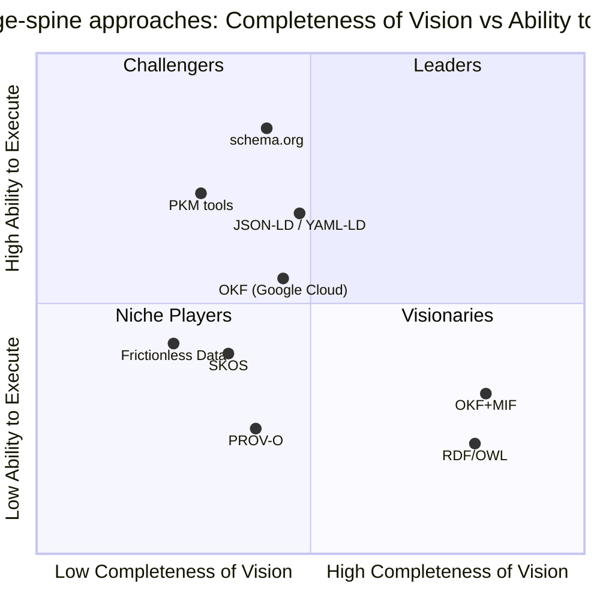

This competitive-analysis synthesis covers 36 surviving finding(s) across the research.

## Market Definition and Inclusion Criteria

This assessment evaluates the market for a structured, git-distributable knowledge spine — a format and toolchain for capturing research and institutional knowledge as version-controlled, machine-readable, citable units that AI agents and humans can both consume. The category crystallized in 2026 around the "LLM wiki" pattern: rather than re-deriving answers from raw documents through retrieval, teams maintain a git-native, LLM-updated markdown knowledge base. Andrej Karpathy's April 2026 LLM-wiki gist drew 5,000+ stars and dozens of independent implementations within months, establishing git-native structured markdown as the practitioner default for LLM-context persistence. Google Cloud's release of OKF v0.1 on 12 June 2026 formalized that pattern into a vendor-neutral specification and named the category.

Demand is anchored by a shift in production LLM architectures: pure vector RAG fails on multi-hop reasoning and global synthesis, while hybrid graph-plus-vector systems show roughly 3.4x accuracy gains and 90%+ accuracy on schema-bound queries — making structured, typed knowledge a production requirement rather than a research curiosity. The deepest unsolved problems in 2026 agent memory are provenance (who asserted what, and when it changed) and temporal validity; systems scoring 92.5 and 94.4 on recall benchmarks still fail temporal reasoning at scale. The knowledge-management software market (~$23B in 2025) and the enterprise knowledge-graph market (~$1.3-2.9B in 2025) together frame a total addressable market exceeding $25B, with AI-ready structured-knowledge infrastructure the fastest-growing niche.

Inclusion criteria. To be placed, an entrant must be an openly specified format, standard, or tool for representing structured, interlinked knowledge intended for reuse — published and inspectable, not a closed product. Nine entrants qualify: OKF+MIF (the layered spine under evaluation), OKF alone, RDF/OWL, PROV-O, SKOS, schema.org, JSON-LD/YAML-LD, Frictionless Data, and the PKM-tool family (Obsidian, Logseq, Roam). Several entrants — schema.org, Frictionless Data, RDF/OWL — are best read as adjacent prior art rather than direct spine competitors; they satisfy the openness criterion and are scored, but their vision for the specific knowledge-spine problem is correspondingly narrow, and they are placed accordingly. Proprietary, unspecified products fall outside scope as primary entrants and appear only as market context.

## Two-Axis Evaluation: Completeness of Vision and Ability to Execute

The x-axis, Completeness of Vision, rolls up seven capabilities a full knowledge spine needs: formal ontology and domain typing, typed relationships, first-class provenance, temporal and decay modeling, a human-readable narrative body, git-native distribution, and agent-readiness. The y-axis, Ability to Execute, rolls up installed base, ecosystem and tooling, governance and backing, and production maturity. Every score below traces to a cited finding.

On the vision axis the layered OKF+MIF spine scores highest because it is the only entrant that pairs accessible markdown distribution with formal semantics. MIF supplies an ontology reference and an entity block that give every concept formal domain typing — a generic core of five entity types (concept, person, organization, technology, file) that domain packs extend — whereas OKF's only required field is an unregistered, producer-defined type string with no schema enforcement. MIF's provenance object is a first-class, W3C PROV-O-compatible JSON record (a sourceType enum, numeric confidence, trustLevel, agent identity, and wasGeneratedBy / wasAttributedTo / wasDerivedFrom), replacing OKF's informal log.md and prose "#Citations" conventions, neither of which is machine-processable. MIF adds bi-temporal tracking (valid time versus recorded time), ISO-8601 duration TTL, and configurable decay models (linear, exponential, step) with half-life and strength fields — where OKF v0.1 carries only a single last-change timestamp, leaving it unable to express claim-validity windows or automate staleness detection.

MIF also defines directed, optionally strength-weighted typed relationship edges, the primary semantic capability OKF lacks; OKF carries all inter-concept relationships as untyped markdown hyperlinks whose meaning lives only in surrounding prose and whose consumers must tolerate broken links. One caveat applies to this particular axis input: the finding establishing MIF's typed edges was graded weakened on adversarial review — not because typed edges are absent (they are real and strength-weighted), but because its enumeration mislabeled which predicates are MIF structural-core. Against the published MIF specification, only four of the nine named types (relates-to, derived-from, supersedes, part-of) are core; the other five are permitted as custom namespaced types and match the harness's own finding vocabulary rather than MIF core. The OKF+MIF vision score therefore rests most safely on the survived provenance, temporal, and ontology findings, with typed relationships reinforcing it under this narrowing.

The layering is mechanically feasible: OKF v0.1's permissive extension model — producers MAY add frontmatter keys and consumers MUST preserve unknown keys — is the seam through which MIF's typed-relationship, provenance, temporal, and ontology fields inject as OKF frontmatter extensions. The one genuine tension is governance philosophy: OKF's permissive-consumer model versus MIF's fail-closed validation.

The comparators score lower on vision for this specific market. JSON-LD and YAML-LD deliver formally typed, globally identified entities and can encode provenance, but require the Semantic Web toolchain and lack OKF's human-readable markdown body and git-native bundle model. schema.org offers roughly 800 entity types and 1,300 property types optimized for web search interoperability, embedded in HTML via JSON-LD or Microdata — incompatible with the markdown-first bundle and without native provenance or temporal decay. SKOS formalizes broader / narrower / related term hierarchies but offers no typed predicates beyond those, no provenance, no narrative body, and no git distribution. Frictionless Data packages tabular datasets (datapackage.json plus CSV/JSON resources) with contributor and license metadata but no knowledge representation, typed inter-dataset relationships, provenance chains, or decay modeling.

A methodological caution carries from the trajectory evidence and governs how vision is scored. The Semantic Web's adoption failure — RDF/OWL/SPARQL complexity, misaligned developer incentives, and logical completeness prioritized over usability — is the cautionary map for any vision score, while schema.org succeeded by being minimal and immediately useful. High semantic completeness is not free; it is precisely what depressed RDF/OWL execution. Vision is therefore scored as fitness for the knowledge-spine problem, not as raw expressiveness.

## Vendor Profiles: Strengths and Cautions

Each entrant carries an explicit Strengths list and a Cautions list, source-attributed to the cited vendor evidence.

### OKF + MIF (the layered spine under evaluation)

Strengths:

- The only entrant that pairs accessible git-native markdown distribution with formal semantics — ontology typing, first-class provenance, bi-temporal decay, and typed relationships layered onto OKF's bundle.
- MIF is a stabilized v1.0.0 Released (stabilized 2026-06-18), public since around February 2026 and therefore predating OKF v0.1; it fills a documented gap (fragmented AI-memory formats) with genuine technical differentiation.
- The layering is mechanically clean, injecting MIF fields through OKF's permissive extension seam rather than forking either spec.

Cautions:

- Adoption, not spec maturity, is the constraint: versus OKF's Google-backed launch, MIF still lacks a large independent adopter base and formal governance.
- The spine is a two-specification dependency, inheriting OKF's own nascency as well as its momentum.

### OKF (Google Cloud)

Strengths:

- Google-backed and Apache 2.0 licensed; the repository reached 5,440 stars and 416 forks within weeks of the 12 June 2026 release, signaling strong practitioner interest.
- Deliberate minimalism — a directory of markdown files with YAML frontmatter whose only required field is type — gives very low authoring friction and names the category.

Cautions:

- v0.1 was only 16 days old at the time of this research, with no producer libraries, consumer integrations, governance tooling, or enterprise-adoption record.
- Its minimalism may itself be the buyer preference, raising the risk that MIF's richer layer is a solution ahead of a segment that wants it.

### RDF / OWL

Strengths:

- Complete typed semantics and formal ontologies — the fullest expressive vision of any entrant.
- The standards layer is consolidating, not fragmenting: the W3C RDF-star Working Group is advancing RDF 1.2 with SPARQL 1.2, and PROV-O remains the recommended provenance ontology, now being mapped to ISO 23494.

Cautions:

- Authoring and tooling costs are prohibitive and eliminate the accessibility advantage the spine market rewards.
- It is the canonical case of Semantic Web adoption failure — completeness that practitioners did not adopt.

### PROV-O

Strengths:

- The W3C provenance standard, covering the same provenance semantics as MIF's provenance layer.

Cautions:

- Requires the full RDF toolchain and a triple store; MIF delivers PROV-O-compatible provenance at plain-JSON authoring cost.
- Scope is narrow — provenance only, not a full knowledge spine.

### SKOS

Strengths:

- A W3C Recommendation since 2009 for publishing taxonomies and controlled vocabularies as linked data with hierarchical and associative relationships.

Cautions:

- Explicitly omits provenance mechanisms and cannot distinguish relationship sub-types beyond broader / narrower / related; complementary but insufficient as a citation-backed spine, and without narrative bodies or git-native distribution.

### schema.org

Strengths:

- A roughly 900-property vocabulary used by about 45% of top websites — by far the broadest execution and reach in the set.

Cautions:

- Solves web entity annotation, not knowledge-spine management; it lacks native provenance, temporal versioning, the finding lifecycle, and is embedded in HTML rather than a markdown bundle.

### JSON-LD / YAML-LD

Strengths:

- JSON-LD is a W3C Recommendation and YAML-LD a W3C Community Report (finalized December 2023); the @context mechanism turns flat key-value data into RDF-compatible, globally identified typed linked data and can encode provenance.

Cautions:

- Requires the Semantic Web toolchain and lacks OKF's human-readable markdown body and git-native bundle distribution model.

### Frictionless Data

Strengths:

- The Open Knowledge Foundation's lightweight datapackage.json descriptor packages tabular data with minimal provenance (sources, contributors) and licensing — a solid dataset-distribution solution.

Cautions:

- Solves dataset distribution, not knowledge-spine management; it omits typed relationships, formal ontology, provenance chains, and the citation-backed finding lifecycle.

### PKM tools (Obsidian, Logseq, Roam)

Strengths:

- A large installed base — Obsidian alone reports 1.5 million-plus active users growing about 22% year-over-year — anchoring the second-brain movement; AI integration (Claude Code, the Karpathy LLM wiki) is pulling in developers who previously ignored PKM.

Cautions:

- All three use the untyped wiki-link pattern OKF formalizes, lacking typed relationship semantics, formal ontology, provenance tracking, and agent-exportable structure — the primary prior art OKF's spec was designed to address.

## Quadrant Placement

Scoring the nine entrants on the two axes yields a structure dominated by an empty Leaders quadrant: no current entrant both fully realizes the knowledge-spine vision and commands proven, broad adoption. That whitespace is the market opportunity.

Visionaries — high vision, lower execution. OKF+MIF sits here: the most complete spine vision (accessible markdown plus formal ontology, first-class provenance, bi-temporal decay, and typed relationships) but the thinnest adoption, since MIF — though a stabilized v1.0.0 Released predating OKF — lacks a large independent adopter base and formal governance. RDF/OWL is also Visionary: complete semantics, with execution depressed by prohibitive toolchain cost and the Semantic Web's adoption failure.

Challengers — strong execution, narrower vision. OKF alone (Google-backed, 5,440 stars, but deliberately minimal, with no ontology, provenance, or typed links), schema.org (web ubiquity at ~45% of top sites, but web-annotation scope), JSON-LD/YAML-LD (W3C-standard reach, but a Semantic Web toolchain and no markdown or git bundle), and the PKM tools (Obsidian's 1.5 million-plus users, but untyped links and no provenance) all execute well while addressing only part of the spine vision.

Niche Players — narrow scope, lower execution. PROV-O (provenance only, RDF-bound), SKOS (taxonomy hierarchies with no provenance or sub-typed relations), and Frictionless Data (tabular packaging with no knowledge representation) each solve a focused slice.

The strategic read. OKF+MIF's path to Leaders runs through OKF's git-native distribution: by injecting MIF's semantics as OKF frontmatter extensions, the layered spine can inherit OKF's accessibility and momentum while supplying the vision OKF deliberately omits — moving up and to keep its vision lead rather than competing for the crowded Challenger band. The result is the "structured but accessible" niche: more semantically rich than KM wikis (Notion, Obsidian, Confluence), and more open and git-distributable than proprietary graph databases (Neo4j, Stardog) that demand significant engineering overhead.

## Context and Market Overview

The financial case for a knowledge spine rests on institutional-memory loss: it costs Fortune 500 companies an estimated $31.5B per year, the average U.S. enterprise loses about $4.5M per year to information silos, and 42% of institutional knowledge resides solely with individual employees — failure modes that provenance and temporal versioning directly target. The addressable market combines KM software (~$23B in 2025, 13-18% CAGR) and enterprise knowledge graphs (~$1.3-2.9B in 2025, 20-33% CAGR) into a TAM projected to surpass $85B by 2034, with AI-ready structured infrastructure the fastest-growing slice. The enterprise knowledge-graph segment reached production maturity across 2024-2025 at a 21-36% CAGR, with Gartner predicting that 50%-plus of AI-agent systems will use context graphs by 2028; Microsoft's open-source GraphRAG, Google Cloud Spanner Graph (GA January 2025), and LinkedIn's reported 63% efficiency gains mark the mainstreaming.

Five buyer segments carry pains the spine addresses: AI/ML teams (LLM grounding), enterprise knowledge-engineering teams (semantic layers), research organizations (provenance and citation tracking), think tanks (institutional memory), and developer or platform teams (replacing fragmented wikis with git-distributable docs). Caveat: the finding establishing these segments was graded weakened because a cited "Gartner: 80% of enterprise apps embed an AI agent by Q1 2026" headline is overstated against Gartner's own prediction of 40% by end-2026 (from under 5% in 2025) and a 2026 Gartner CIO survey showing roughly 17% of organizations have deployed agents to date; the segment structure holds, the headline adoption number does not.

AI workflows are pulling demand toward structured, citable, provenance-backed knowledge: the shift from static RAG to knowledge graphs is forecast to put GraphRAG enablement at about 31% of the 2026 enterprise KG market, and hallucination-grounding gains (roughly 16.7% accuracy without structured grounding versus 54.2% with it) are independently corroborated. Caveat: the same overstated Gartner 80%-by-Q1-2026 agent-adoption figure recurs in this finding and is graded weakened — the directional surge is real, the magnitude is not.

On the open-versus-commercial split, the git-native open-format segment — developer teams, research organizations, privacy-sensitive enterprises — remains distinct from the SaaS-dominated broader market and is where an open-core OKF+MIF spine fits. Caveat: this finding is weakened because the cited "76% SaaS in 2025, up from 50/50 in 2024" figure could not be located in the cited a16z source, which supplies only a qualitative "marked shift toward buying"; the directional claim survives, the specific number does not. Pricing signals from adjacent markets point to an open-core model — free format, paid governance, hosting, and audit — with enterprise KG platforms commanding $15K-100K-plus per year and personal-KM tools at $5-16 per user per month. Caveat: this finding is weakened because several AI-KM market-sizing figures are soft or misattributed and two cited growth rates do not reconcile; the pricing-comparator structure (Neo4j self-managed tiers, personal-KM tiers) holds.

## Methodology

Scoring. Each entrant was placed on two axes — Completeness of Vision (formal ontology and typing, typed relationships, first-class provenance, temporal and decay modeling, a human-readable body, git-native distribution, and agent-readiness) and Ability to Execute (installed base, ecosystem and tooling, governance and backing, and production maturity) — with every score traced to a cited finding. Vision is scored as fitness for the knowledge-spine problem, not raw expressiveness, so a high-expressiveness, low-adoption standard such as RDF/OWL scores high on vision and low on execution.

Not a Gartner Magic Quadrant. This is a generic two-axis competitive analysis (Completeness of Vision against Ability to Execute, four quadrants). The proprietary quadrant methodology bearing that trademarked name is a Gartner product; nothing here is that methodology, claims to be it, or implies endorsement by its owner.

Evidence and verification. Findings were gathered across four dimensions — technical, landscape, trajectory, and market — and each was adversarially tested exactly once by the falsification gate on 28 June 2026: of the 36 supporting findings, 31 survived and 5 were weakened, with none falsified. The five weakened units are carried with explicit caveats at the point of use. Four are market statistics — an overstated Gartner agent-adoption headline that appears in two findings, an unlocatable a16z SaaS-share figure, and soft or misattributed AI-KM market-sizing numbers — and one is technical: the typed-relationship core-predicate enumeration, narrowed against the published MIF specification. No finding underpinning the central layering thesis was falsified.

As-of date and limits. Vendor evidence is current as of 28 June 2026. The dominant limit is recency: OKF v0.1 was 16 days old at assessment and has no ecosystem, so its execution score reflects launch momentum (5,440 stars, Google backing) rather than proven adoption, and the genuine downside risk is that OKF's minimalism is itself the buyer preference — leaving MIF's richer layer a solution ahead of a segment that demands it. MIF, by contrast, is a stabilized v1.0.0 Released public since early 2026; its constraint is distribution and adoption, not spec maturity. The placements would shift if OKF develops a producer/consumer ecosystem, if buyers signal demand for typed semantics over minimalism, or if a proprietary platform open-sources a competing spine format.

## Sources

- [a16z 'How 100 Enterprise CIOs Are Building and Buying Gen AI in 2025' - source does not substantiate the specific 76%/50-50 build-vs-buy figure on inspection (only a qualitative shift-to-buying)](<https://a16z.com/ai-enterprise-2025/>)
- [JSON-LD Schema Markup for AI Discoverability: Technical Guide 2026 - AgentVisibility.ai](<https://agentvisibility.ai/insights/json-ld-schema-ai-discoverability>)
- [Governing Evolving Memory in LLM Agents: Risks, Mechanisms, and the SSGM Framework — arXiv](<https://arxiv.org/html/2603.11768v1>)
- [A Decade of Scholarly Research on Open Knowledge Graphs - Research community KG adoption (arXiv)](<https://arxiv.org/pdf/2306.13186>)
- [OWL Reasoners still useable in 2023 (arXiv)](<https://arxiv.org/pdf/2309.06888>)
- [Semantic Web: Past, Present, and Future — arXiv 2412.17159](<https://arxiv.org/pdf/2412.17159>)
- [Semantic Web and Software Agents — A Forgotten Wave of Artificial Intelligence? arXiv 2503.20793](<https://arxiv.org/pdf/2503.20793>)
- [PROV-AGENT: Unified Provenance for Tracking AI Agent Interactions in Agentic Workflows (arXiv)](<https://arxiv.org/pdf/2508.02866>)
- [Gartner on Context Graphs: Trends, Capabilities, Setup in 2026 — Atlan](<https://atlan.com/know/gartner-context-graphs/>)
- [Ontology vs. Semantic Layer: Differences and schema.org limitations — Atlan](<https://atlan.com/know/ontology-vs-semantic-layer/>)
- [RDF vs OWL: Key Differences, Use Cases and Examples Explained - Atlan](<https://atlan.com/know/rdf-vs-owl/>)
- [Stardog Enterprise Knowledge Graph Platform Pricing (AWS Marketplace)](<https://aws.amazon.com/marketplace/pp/prodview-ulfm6fel7xgjq>)
- [Frictionless Data and FAIR Research Principles - Open Knowledge Foundation Blog](<https://blog.okfn.org/2018/08/14/frictionless-data-and-fair-research-principles/>)
- [Knowledge Management Statistics and Trends in 2025 - Worker productivity costs (CAKE)](<https://cake.com/blog/knowledge-management-statistics/>)
- [How the Open Knowledge Format can improve data sharing — Google Cloud Blog](<https://cloud.google.com/blog/products/data-analytics/how-the-open-knowledge-format-can-improve-data-sharing>)
- [Ontologies, Context Graphs, and Semantic Layers: What AI Actually Needs in 2026](<https://contextandchaos.substack.com/p/ontologies-context-graphs-and-semantic>)
- [Knowledge Management and Dissemination for Think Tanks (DataCalculus)](<https://datacalculus.com/en/blog/think-tanks/program-director/knowledge-management-and-dissemination-for-think-tanks>)
- [Personal Knowledge Management Software Market Research Report 2034 — DataIntelo](<https://dataintelo.com/report/personal-knowledge-management-software-market>)
- [Lessons Learned from the Combined Development of OWL and SHACL — ACM K-CAP 2025](<https://dl.acm.org/doi/full/10.1145/3731443.3771340>)
- [Top Knowledge Management Trends 2026 - Semantic layers and enterprise AI (Enterprise Knowledge)](<https://enterprise-knowledge.com/top-knowledge-management-trends-2026/>)
- [LLM Wiki — Karpathy GitHub Gist (April 2026)](<https://gist.github.com/karpathy/442a6bf555914893e9891c11519de94f>)
- [OKF SPEC.md — GoogleCloudPlatform/knowledge-catalog](<https://github.com/GoogleCloudPlatform/knowledge-catalog/blob/main/okf/SPEC.md>)
- [Frictionless Data Package — GitHub frictionlessdata/datapackage](<https://github.com/frictionlessdata/datapackage>)
- [MIF v1.0 — GitHub zircote/MIF](<https://github.com/zircote/MIF>)
- [Open Knowledge Format (OKF) — Official Grounding Page](<https://groundingpage.com/facts/open-knowledge-format/>)
- [JSON-LD - JSON for Linked Data (Official Site)](<https://json-ld.org/>)
- [Google Cloud Launches Open Knowledge Format Standard - sober adoption assessment (Let's Data Science)](<https://letsdatascience.com/news/google-cloud-launches-open-knowledge-format-standard-b9480a66>)
- [From LLMs to Knowledge Graphs: Building Production-Ready Graph Systems in 2025 — Medium](<https://medium.com/@claudiubranzan/from-llms-to-knowledge-graphs-building-production-ready-graph-systems-in-2025-2b4aff1ec99a>)
- [Beyond OWL: Reconsidering Ontologies in the Age of AI and the Semantic Web](<https://medium.com/@nfigay/beyond-owl-reconsidering-ontologies-in-the-age-of-ai-and-the-semantic-web-4059b519f23d>)
- [Open-Sourcing the Knowledge Graph Studio under MIT license (Medium/Enterprise RAG)](<https://medium.com/enterprise-rag/open-sourcing-the-whyhow-knowledge-graph-studio-powered-by-nosql-edce283fb341>)
- [State of AI Agent Memory 2026: Benchmarks, Architectures & Production Gaps — Mem0](<https://mem0.ai/blog/state-of-ai-agent-memory-2026>)
- [MIF Schema Reference — mif-spec.dev](<https://mif-spec.dev/>)
- [MIF relationship types (mif-spec.dev) - the core vocabulary is relates-to/derived-from/supersedes/conflicts-with/part-of/implements/uses/created-by/mentioned-in; supports/contradicts/refines/depends-on/updates are not MIF-native core, only custom namespaced](<https://mif-spec.dev/specification/relationship-types/>)
- [Open-Source vs SaaS Agent Platforms: Pros & Cons for Enterprises (OneReach.ai)](<https://onereach.ai/blog/open-source-frameworks-vs-saas-agent-platforms/>)
- [Enterprise Knowledge Graph Buyer's Guide 2026 - Pricing and ROI signals (Promethium)](<https://promethium.ai/guides/enterprise-knowledge-graph-buyers-guide-2026/>)
- [Graph RAG Guide 2025: Architecture, Implementation & ROI — Salfati Group](<https://salfati.group/topics/graph-rag>)
- [Obsidian Complete Guide: The Ultimate Markdown Editor for Knowledge Management Revolution 2025 — SmartScope](<https://smartscope.blog/en/obsidian-complete-guide/>)
- [Obsidian vs Logseq 2026: Which PKM Tool Wins? - SoftPicker](<https://softpicker.com/obsidian-vs-logseq/>)
- [Frictionless Data Specifications - Official Home](<https://specs.frictionlessdata.io/>)
- [Frictionless Data Package Specification — specs.frictionlessdata.io](<https://specs.frictionlessdata.io/data-package/>)
- [State of Open Data 2025 - FAIR data and open science trends](<https://stateofopendata.com/>)
- [Knowledge Management Software Market Size, Share, Growth, 2034 (Straits Research)](<https://straitsresearch.com/report/knowledge-management-software-market>)
- [AI Hallucination Statistics 2026: 50+ Sourced Data Points (Suprmind)](<https://suprmind.ai/hub/insights/ai-hallucination-statistics-research-report-2026/>)
- [Bi-temporal memory for AI coding agents — git-pinned context that survives context compaction](<https://sverklo.com/blog/bi-temporal-memory-for-ai-agents/>)
- [Google Launches a Universal Format for Karpathy's LLM Wiki — Techstrong.ai](<https://techstrong.ai/articles/google-launches-a-universal-format-for-karpathys-llm-wiki/>)
- [Google Just Standardized Karpathy's LLM Wiki Pattern — The Menon Lab](<https://themenonlab.blog/blog/google-okf-open-knowledge-format-karpathy-llm-wiki-standard>)
- [Obsidian Pricing 2026: Plans, Hidden Costs & Cheaper Alternatives (ToolRadar)](<https://toolradar.com/tools/obsidian/pricing>)
- [Agent-to-agent audit trail: provenance for AI ecosystems (TrueScreen)](<https://truescreen.io/articles/agent-to-agent-audit-trail/>)
- [Personal Knowledge Graphs in Obsidian - Volodymyr Pavlyshyn, Medium](<https://volodymyrpavlyshyn.medium.com/personal-knowledge-graphs-in-obsidian-528a0f4584b9>)
- [Why Bad Knowledge Management Is Killing Your Profits (WikiTeq)](<https://wikiteq.com/post/hidden-costs-poor-knowledge-management>)
- [2026 Enterprise AI Knowledge Management: AI-native KM market size (Windows Forum/GoSearch)](<https://windowsforum.com/threads/2026-enterprise-ai-knowledge-management-from-search-to-governed-agent-workflows.410816/>)
- [Open Knowledge Format (OKF) Complete 2026 Guide - ecosystem gaps identified (WitsCode)](<https://witscode.com/open-knowledge-format>)
- [AI-Ready Enterprise Knowledge Graph Market to Reach USD 6,550.0 Million by 2036 (AccessNewswire/FMI)](<https://www.accessnewswire.com/newsroom/en/business-and-professional-services/ai-ready-enterprise-knowledge-graph-market-to-reach-usd-6-550.0-1167718>)
- [Knowledge Management Software Market Size, Industry Share | Forecast 2034 (Fortune Business Insights)](<https://www.fortunebusinessinsights.com/knowledge-management-software-market-110376>)
- [Gartner Predicts 40% of Enterprise Apps Will Feature Task-Specific AI Agents by 2026, Up from Less Than 5% in 2025 (Gartner Newsroom)](<https://www.gartner.com/en/newsroom/press-releases/2025-08-26-gartner-predicts-40-percent-of-enterprise-apps-will-feature-task-specific-ai-agents-by-2026-up-from-less-than-5-percent-in-2025>)
- [Enterprise Knowledge Graph Market Industry Report 2033 — Grand View Research](<https://www.grandviewresearch.com/industry-analysis/enterprise-knowledge-graph-market-report>)
- [The Cost and Consequence of Institutional Memory Drain (Inc. Magazine)](<https://www.inc.com/bethmaser/the-cost-and-consequence-of-institutional-memory-drain/91178504>)
- [Simple Knowledge Organization System (SKOS) — ISKO Encyclopedia of KO](<https://www.isko.org/cyclo/skos.htm>)
- [Cost of Organizational Knowledge Loss and Countermeasures (Iterators HQ)](<https://www.iteratorshq.com/blog/cost-of-organizational-knowledge-loss-and-countermeasures/>)
- [Why AI Hallucinates in Your Enterprise (and how Context Graphs Fix it) - Kamiwaza](<https://www.kamiwaza.ai/insights/why-ai-hallucinates-in-your-enterprise>)
- [Knowledge Graph Market Worth $9.88 Billion by 2032 — MarketsandMarkets](<https://www.marketsandmarkets.com/PressReleases/knowledge-graph.asp>)
- [Google Cloud Introduces Open Knowledge Format (OKF) — MarkTechPost](<https://www.marktechpost.com/2026/06/16/google-cloud-introduces-open-knowledge-format-okf-a-vendor-neutral-markdown-spec-for-giving-ai-agents-curated-context/>)
- [Knowledge Graph vs Vector Database for RAG: Which Is Best? — Meilisearch](<https://www.meilisearch.com/blog/knowledge-graph-vs-vector-database-for-rag>)
- [GraphRAG: Unlocking LLM Discovery on Narrative Private Data — Microsoft Research Blog](<https://www.microsoft.com/en-us/research/blog/graphrag-unlocking-llm-discovery-on-narrative-private-data/>)
- [Project GraphRAG — Microsoft Research](<https://www.microsoft.com/en-us/research/project/graphrag/>)
- [A Semantic Approach to Mapping the Provenance Ontology to Basic Formal Ontology — Scientific Data](<https://www.nature.com/articles/s41597-025-04580-1>)
- [Notion vs Obsidian - minimalism as user preference (NotionApps)](<https://www.notionapps.com/blog/notion-vs-obsidian-knowledge-productivity-2025>)
- [The Semantic Web: 20 Years and a Handful of Enterprise Knowledge Graphs Later — Ontotext](<https://www.ontotext.com/blog/the-semantic-web-20-years-later/>)
- [Notion vs Obsidian vs Roam Research 2025: Best Note-Taking App for Productivity](<https://www.primeproductiv4.com/blog-articles/notion-vs-obsidian-vs-roam-research-productivity-comparison>)
- [History of Obsidian: Second Brain to AI Knowledge OS — Taskade Blog](<https://www.taskade.com/blog/obsidian-history>)
- [AI-Driven Knowledge Management System Market Report (The Business Research Company) - the '$7.71B 2025 / 47.2%' figure traces here, not to GoSearch; cross-firm AI-KM sizing varies widely and the finding's two growth rates do not reconcile](<https://www.thebusinessresearchcompany.com/report/ai-driven-knowledge-management-system-global-market-report>)
- [Neo4j Software Pricing & Plans 2026 (Vendr)](<https://www.vendr.com/marketplace/neo4j>)
- [SKOS Simple Knowledge Organization System - W3C Home Page](<https://www.w3.org/2004/02/skos/>)
- [RDF & SPARQL Working Group Charter — W3C (April 2025)](<https://www.w3.org/2025/04/rdf-star-wg-charter.html>)
- [JSON-LD 1.1 — W3C Recommendation](<https://www.w3.org/TR/json-ld11/>)
- [PROV-O: The PROV Ontology - W3C Recommendation](<https://www.w3.org/TR/prov-o/>)
- [PROV-Overview — W3C](<https://www.w3.org/TR/prov-overview/>)
- [SKOS Simple Knowledge Organization System Primer - W3C Recommendation](<https://www.w3.org/TR/skos-primer/>)
- [SKOS Simple Knowledge Organization System Reference — W3C](<https://www.w3.org/TR/skos-reference/>)
- [Ontologies and Knowledge Graphs in Industry Community Group — W3C](<https://www.w3.org/community/oki/>)
- [YAML-LD — W3C CG Final Report, December 2023](<https://www.w3.org/community/reports/json-ld/CG-FINAL-yaml-ld-20231206/>)
- [The PROV-JSONLD Serialization - W3C Member Submission 2024](<https://www.w3.org/submissions/2024/SUBM-prov-jsonld-20240825/>)
- [Introducing MIF: Memory Interchange Format — zircote.com (February 2026)](<https://zircote.com/blog/2026/02/introducing-mif-memory-interchange-format/>)
- [AI Agent Memory Architectures: From Context Windows to Persistent Knowledge — Zylos Research](<https://zylos.ai/research/2026-04-05-ai-agent-memory-architectures-persistent-knowledge/>)
