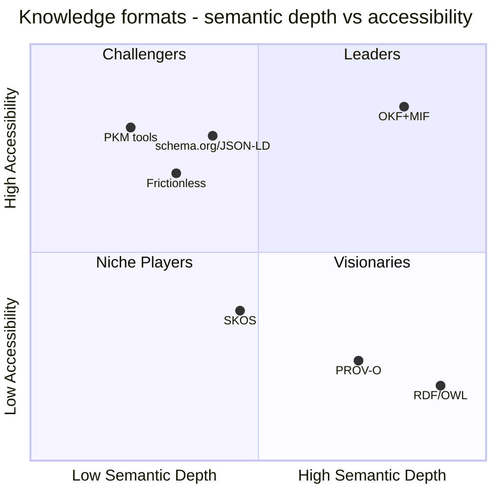

This competitive-quadrant synthesis covers 36 surviving finding(s) across the research.

## Market Definition and Inclusion Criteria

Market evaluated: open, file-based formats and standards that can serve as a knowledge spine — a curated, portable, machine- and human-readable store of concepts that AI agents and teams read, update, and cite. As-of date of the evidence: 2026-06-28, roughly sixteen days after Google Cloud published OKF v0.1. The surrounding commercial market is large and growing: the knowledge-management software market is sized at USD 23.2B in 2025 rising to USD 74.2B by 2034 (13.8% CAGR, Fortune Business Insights), with a lower-scope estimate of USD 13.43B to USD 62B by 2034 (Straits Research); the enterprise knowledge-graph segment is a distinct, faster-growing adjacency.

Inclusion criteria. An alternative is placed only if it (1) is an open specification or open-source format, not a closed SaaS product; (2) targets durable, structured knowledge representation or its packaging and distribution; and (3) is authorable and consumable as files or standards rather than only through a proprietary runtime. This is why the comparison set is OKF+MIF, RDF/OWL, PROV-O, SKOS, schema.org/JSON-LD, Frictionless Data Packages, and the git-native markdown PKM tools (Obsidian, Logseq, Roam). Proprietary platforms (Notion, Confluence) and graph databases (Neo4j, Stardog, Neptune) frame the market but are excluded from placement: they are products, not open formats, and they fail criterion (1). They appear in Context as the commercial boundary the open formats compete against (per the competitive-positioning evidence).

## Two-Axis Evaluation Framework

Each alternative is scored on the two axes this genre prescribes, instantiated for knowledge formats.

Completeness of Vision (x-axis) is read as semantic depth: does the format carry typed relationships, a formal ontology and type system, first-class provenance, and a temporal or decay model — or only prose and a last-modified timestamp? OKF v0.1 deliberately defers all of these: its only required field is `type`, links are untyped (the spec states the relationship type is conveyed through surrounding prose), and origin and history are informal (an optional `log.md` and a prose citations convention), so OKF alone scores low on depth. MIF supplies that depth as a layer, which is why the placement evaluates OKF and MIF together.

Ability to Execute (y-axis) is read as accessibility and adoption: can a practitioner author and distribute it with `cat`, git, and plain text — no triple store, no SPARQL, no SDK — and is there real distribution momentum? OKF+MIF inherits OKF's markdown and YAML authoring surface and git-native distribution, scoring high; the RDF-family standards require the full semantic-web toolchain, scoring low regardless of their depth.

Sub-criteria rolled into depth: typed-relationship support, ontology and type enforcement, provenance richness, and temporal or decay modeling. Sub-criteria rolled into accessibility: authoring cost, toolchain weight, distribution model (git-native versus database or web-embedded), and demonstrated adoption. The OKF+MIF layering is technically admissible because OKF's conformance model requires consumers to preserve unknown frontmatter keys and never reject documents with unrecognized fields, so MIF's typed fields ride as extended frontmatter or companion JSON without breaking OKF conformance — depth added under an accessible surface, with MIF validation applied fail-closed at an enrichment or ingestion boundary.

## OKF + MIF (Layered Knowledge Spine)

Axis scores: semantic depth 0.82, accessibility 0.85. OKF (Google Cloud's Open Knowledge Format) is a directory of markdown files with YAML frontmatter — one required field (`type`), git-distributable, readable with `cat` — that solves authoring and distribution but deliberately omits ontology, provenance, typed links, and temporal modeling (OKF SPEC.md v0.1; Google Cloud Blog). MIF supplies exactly those omissions as a layer: a two-level formal ontology with a schema-enforced `entity` block and a generic five-type core (concept, person, organization, technology, file) that fails closed when a type does not resolve; a first-class, W3C-PROV-O-compatible provenance block (`sourceType`, `confidence` 0.0 to 1.0, `trustLevel`, agent) expressed as flat JSON; and a bi-temporal model (`validFrom`, `validUntil`, `recordedAt`) with an Ebbinghaus-style decay sub-object (`ttl`, `halfLife`, `currentStrength`) that OKF's single last-modified `timestamp` cannot express.

Strengths

- Combines the high accessibility of markdown and git authoring with semantic depth no plain-markdown format carries — the only alternative scoring high on both axes (OKF SPEC.md; MIF Specification, mif-spec.dev).
- Provenance and temporal or decay metadata travel as plain JSON and YAML, delivering PROV-O-compatible attribution without an RDF triple store (MIF provenance and temporal evidence; W3C PROV-Overview).
- MIF carries typed, strength-weighted relationship edges between concepts where OKF links are untyped prose; this is the semantic-graph substrate enabling concordance, traversal, and gap analysis (MIF Schema Reference).

Caution on the typed-relationship evidence (verification verdict: weakened). The supporting finding's enumeration of "nine structural-core predicates" overstates the MIF-native set. Its own disconfirming source indicates the native core vocabulary is relates-to, derived-from, supersedes, conflicts-with, part-of, implements, uses, created-by, and mentioned-in, while predicates such as supports, contradicts, refines, depends-on, and updates are harness or namespaced extensions, not MIF core. The capability claim — typed, weighted edges versus untyped links — stands; only the specific predicate list is weakened.

Cautions

- The layering's OKF-to-MIF direction is lossy: turning untyped prose links into typed edges needs an enrichment pass (AI or human) to infer relationship types (layering-mechanics evidence).
- The architectural seam must reconcile OKF's permissive-consumer model against MIF's fail-closed validation; the design must fix where that flip happens (layering-mechanics evidence).
- OKF itself is v0.1 — the depth is real and MIF is stable, but the combined offering competes on format merit before ecosystem depth (see Context).

## RDF / OWL

Axis scores: semantic depth 0.90, accessibility 0.18. RDF (triples) and OWL (class hierarchies, restrictions, reasoning) are the W3C backbone for the Semantic Web and deliver the typed-relationship, formal-ontology, and inference capabilities OKF defers — the deepest alternative on the depth axis (Atlan, RDF vs OWL).

Strengths

- Maximal expressiveness: any typed relationship as a triple, with OWL adding formal class hierarchies and machine reasoning (Atlan).
- A mature, standardized W3C ecosystem with decades of tooling and vocabularies behind it.

Cautions

- Prohibitive authoring cost destroys the accessibility advantage: practitioners must learn Turtle or RDF-XML, SPARQL, triple stores, and OWL reasoners — incompatible with OKF's "just markdown, just files" philosophy (RDF/OWL landscape evidence).
- Atomic triples complicate n-ary relationships (reification workarounds), and an evaluation of OWL 2 DL reasoners found many are no longer actively maintained (arXiv 2309.06888) — an ecosystem-sustainability risk.
- Places squarely in Visionaries: deep but inaccessible, the exact adoption-friction trap the OKF+MIF surface is designed to avoid.

## PROV-O

Axis scores: semantic depth 0.72, accessibility 0.24. PROV-O (W3C Provenance Ontology, 2013) is the recognized standard for machine-readable provenance — Entity, Activity, Agent with derivation, attribution, and generation — and sits on the research frontier for AI provenance (PROV-AGENT, IEEE e-Science 2025). Its depth is narrow: it addresses only the provenance slice of a knowledge spine, not packaging or concept-relationship modeling.

Strengths

- The authoritative, extensible provenance vocabulary, actively extended for AI-agent workflows (W3C PROV-O; PROV-AGENT).
- Conceptually congruent with MIF's provenance block, which is explicitly designed to be PROV-O-compatible (PROV-O landscape evidence).

Cautions

- Operates within the RDF/OWL ecosystem: authoring requires RDF serialization, SPARQL, and a triple store or reasoner — the same accessibility wall as RDF/OWL.
- Solves neither the packaging gap (OKF's markdown layer) nor the concept-relationship gap; MIF delivers PROV-O-compatible semantics at plain-JSON authoring cost instead (PROV-O landscape evidence). Visionaries quadrant: deep on its slice, inaccessible for markdown-first teams.

## SKOS

Axis scores: semantic depth 0.46, accessibility 0.36. SKOS (W3C Recommendation, 2009) is an RDF vocabulary for taxonomies, thesauri, and classification schemes — widely deployed (the EU ESCO vocabulary, national library thesauri). Its model is intentionally narrow: preferred, alternate, and hidden labels, two hierarchical relations (`broader` and `narrower`), one associative (`related`), aggregated into concept schemes (W3C SKOS Reference; ISKO).

Strengths

- A simple, widely adopted, standardized way to express controlled vocabularies and align them across systems (W3C SKOS Primer).
- Lighter than OWL — it trades expressiveness for adoption simplicity, described by its authors as a bridging technology.

Cautions

- No provenance mechanism (the primer concedes SKOS cannot record that a statement pertains to a specific scheme), no relationship sub-typing, no formal logic, and no confidence or trustLevel fields (SKOS landscape evidence).
- Still an RDF vocabulary, inheriting the triple-store and SPARQL toolchain — inaccessible to the plain-JSON and markdown authoring OKF and MIF target (SKOS comparator evidence).
- Narrow scope plus RDF dependency places it in Niche Players: it covers the taxonomy layer only, where MIF's ontology module subsumes it without the RDF stack.

## schema.org / JSON-LD

Axis scores: semantic depth 0.40, accessibility 0.78. JSON-LD (W3C Recommendation 1.1, 2020) makes RDF accessible to web developers without parsers or triple stores and is the dominant linked-data serialization — used by 45% of the top 10 million websites. schema.org is the vocabulary layer (about 800 types, about 1,300 properties), governed by an informal steering group, optimized for web annotation (JSON-LD landscape evidence; schema.org comparator).

Strengths

- Very high accessibility and reach: zero-edit migration from plain JSON, massive web adoption, and a strong AI-discoverability incentive (pages with valid schema.org are 2.3x more likely to appear in Google AI Overviews) (JSON-LD landscape evidence).
- YAML-LD (W3C CG Final Report, December 2023) extends the same model into YAML, narrowing the syntactic distance to markdown-first authoring (JSON-LD and YAML-LD comparator).

Cautions

- A serialization syntax and a web-annotation vocabulary, not a knowledge-management framework: no finding lifecycle, no confidence scoring, and no native citation chains; provenance needs RDF reification or named graphs (PROV-JSONLD remains a 2024 submission, not a Recommendation) (JSON-LD landscape evidence).
- The vocabulary does not model typed relationships between findings, temporal verdicts, or falsification states; JSON-LD is designed to layer onto existing JSON, the inverse of OKF and MIF primary authoring (schema.org comparator). Challengers quadrant: accessible and pervasive, but shallow for a knowledge spine.

## Frictionless Data Packages

Axis scores: semantic depth 0.32, accessibility 0.69. Frictionless Data is published by the Open Knowledge Foundation (OKFN) — a distinct organization from Google Cloud's Open Knowledge Format (OKF); despite the similar names they are unrelated. Its Data Package spec is a JSON descriptor (`datapackage.json`) plus data files, a compelling minimalist analogue to OKF but aimed at datasets (typically tabular), not knowledge concepts (Frictionless landscape evidence; specs.frictionlessdata.io).

Strengths

- Accessible, files-plus-JSON-descriptor packaging that advances FAIR data publishing, with a v2 update (June 2024, NLnet-supported) adding extensibility (Frictionless comparator evidence).
- Carries shallow lineage via `sources` and `contributors` (with roles) — basic provenance of authorship and origin (Frictionless landscape evidence).

Cautions

- No typed relationships between datasets or concepts, no formal ontology, no concept or finding model, and no temporal model beyond a single `created` timestamp; provenance lacks confidence scoring, trustLevel, and structured citation chains (Frictionless landscape evidence).
- Targets datasets, not curated knowledge — it solves "package a CSV with its schema," a complement to, not a substitute for, a knowledge spine (Frictionless comparator). Sits among the Challengers: accessible packaging, shallow knowledge depth.

## PKM Tools (Obsidian, Logseq, Roam)

Axis scores: semantic depth 0.22, accessibility 0.80. Obsidian, Logseq, and Roam are the leading personal-knowledge-management tools, all using markdown with wiki-style `[[links]]` that build an implicit graph — the closest prior art to OKF's design philosophy. Adoption is real and growing (Obsidian reports 1.5M-plus active users and 22% year-over-year growth) (PKM landscape evidence; git-native markdown KM trajectory).

Strengths

- Extremely accessible and popular: local-first markdown, large communities, and mature editing and graph-view experiences (git-native markdown KM trajectory).
- Validate the markdown-first thesis OKF formalizes — OKF positions itself explicitly near the LLM-wiki and Obsidian pattern (PKM landscape evidence).

Cautions

- Links are untyped — they record a connection, not its nature; there is no built-in provenance, confidence, formal ontology, or structured citation chain (PKM landscape evidence). Typed-link plugins (Juggl, Graph-Link-Types) add complexity and scale poorly.
- Author-focused personal tools, not portable interoperable formats: they lack vendor-neutral, agent-facing export semantics, and Roam is cloud-based (about USD 15/month), forgoing local-first ownership (PKM landscape evidence). Challengers quadrant: highly accessible, deliberately shallow — the gap MIF's typed and provenance layer closes.

## Quadrant Placement

Each alternative is assigned to exactly one quadrant from its two-axis position. The x-axis is semantic depth (Completeness of Vision); the y-axis is accessibility and adoption (Ability to Execute).

Leaders (high depth, high accessibility) — OKF+MIF. The only alternative high on both axes: OKF's accessible, git-native packaging carrying MIF's typed relationships, PROV-O-compatible provenance, formal ontology, and temporal or decay model. The placement rests on OKF launch momentum (5,440-plus GitHub stars within weeks) supplying distribution, and on MIF being an already-stabilized v1.0.0 specification supplying the depth (OKF v0.1 launch and MIF ecosystem trajectories).

Challengers (low depth, high accessibility) — PKM tools, schema.org/JSON-LD, Frictionless Data Packages. Accessible and well-adopted but shallow for a knowledge spine: untyped links or web- and dataset-oriented models without provenance, typed relationships, or a finding lifecycle.

Visionaries (high depth, low accessibility) — RDF/OWL and PROV-O. Deep, standardized semantics gated behind the RDF, SPARQL, and triple-store toolchain.

Niche Players (lower depth, low accessibility) — SKOS. Narrow taxonomy scope plus RDF dependency.

## Context and Market Overview

The forces that frame these placements — and could shift them — are strong on the demand side and cautious on the adoption side.

Demand drivers. Pure vector RAG is being displaced by hybrid graph-plus-vector architectures, which report large accuracy gains and even zero accuracy on schema-bound queries without structure — a structural pull toward typed knowledge (GraphRAG trajectory). The enterprise knowledge-graph market is growing fast (estimates span 21% to 36% CAGR; Gartner-cited agent-adoption projections) (enterprise-KG-growth trajectory). AI-agent memory has made provenance and temporal validity first-class open problems (agent-memory trajectory), and W3C's RDF 1.2 and RDF-star work is standardizing edge-level provenance and confidence (W3C RDF-star trajectory). Karpathy's LLM-wiki pattern (5,000-plus stars) is the practitioner movement OKF formalizes (LLM-wiki trajectory). Institutional memory loss is quantified pain — cited at roughly USD 31.5B per year for Fortune 500 firms (institutional-memory-loss evidence).

Several demand-side market statistics carry explicit caveats (verification verdict: weakened) and should be read as directional, not settled:

- LLM accuracy with versus without knowledge-graph grounding (16.7% to 54.2%) and the 2026 hallucination-rate ranges are single-vendor or single-benchmark figures (AI-demand-for-provenance evidence; weakened).
- The five buyer segments and their willingness-to-pay signals are analyst-composed rather than survey-validated (buyer-segments evidence; weakened).
- The build-versus-buy shift to about 76% purchasing and the open-source-versus-SaaS split rest on a single CIO report (open-source-vs-commercial evidence; weakened).
- Pricing anchors from adjacent markets (for example Neo4j Enterprise at USD 15k to 100k-plus per year, Obsidian at USD 50 per user per year, Roam at USD 15 per month) calibrate willingness-to-pay but are drawn from neighboring categories (pricing-business-model-signals evidence; weakened).

Adoption headwinds. OKF is extremely new and unproven — published sixteen days before this assessment, "a starting point, not a finished standard," with no independent adopters at the research date (OKF-nascency evidence). The two-decade Semantic Web adoption failure is both a headwind (practitioners are RDF-skeptical) and a map (Schema.org and Linked Open Data succeeded through layered, opt-in complexity) — which is precisely the conformance-ladder strategy OKF+MIF must execute (semantic-web-failure trajectory). Against proprietary incumbents (Notion, Confluence) and graph platforms (Neo4j, Stardog), the open OKF+MIF stack competes on format merit before ecosystem depth (competitive-positioning evidence, in Market Definition).

## Methodology

Scoring. Each alternative was scored on two axes — semantic depth (Completeness of Vision) and accessibility and adoption (Ability to Execute) — by rolling up the sub-criteria stated in the framework section, with each score traced to the surviving finding or findings cited in that alternative's profile. Coordinates are comparative judgments at practitioner altitude, not metric measurements; they place alternatives relative to one another, not on an absolute scale.

Evidence and verification. Findings were gathered across landscape, technical, market, and trajectory dimensions and passed through the harness's single adversarial falsification gate exactly once: of the supporting corpus, 31 survived, 5 were weakened, and none were falsified. The five weakened units — four demand and market statistics and one technical enumeration (the MIF structural-core predicate list) — are annotated inline where they are used rather than hidden, and no placement depends on a falsified claim. A version sub-claim was corrected against the authoritative in-repo specification: MIF is at v1.0.0 (Released, stabilized 2026-06-18) and has been public since roughly February 2026 — it predates OKF v0.1 (12 June 2026). MIF's limitation is distribution and adoption, not specification maturity; OKF is the genuinely v0.1, early-stage party in the pairing (MIF ecosystem and OKF-nascency evidence).

Limits and as-of date. This is a snapshot as of 2026-06-28, about sixteen days after OKF's launch; the accessibility and adoption axis is the most time-sensitive and will move as the OKF ecosystem (or its absence) becomes clear. The Semantic Web's adoption history is retained as a cautionary reference for any depth-bearing format (semantic-web-failure trajectory).

Trademark notice. This report reproduces only a generic two-axis competitive-analysis structure (Completeness of Vision against Ability to Execute, four quadrants). It is not a Gartner Magic Quadrant, does not use that trademark as a conformance or branding claim, and implies no Gartner endorsement or methodology.

## Sources

- [a16z 'How 100 Enterprise CIOs Are Building and Buying Gen AI in 2025' - source does not substantiate the specific 76%/50-50 build-vs-buy figure on inspection (only a qualitative shift-to-buying)](<https://a16z.com/ai-enterprise-2025/>)
- [JSON-LD Schema Markup for AI Discoverability: Technical Guide 2026 - AgentVisibility.ai](<https://agentvisibility.ai/insights/json-ld-schema-ai-discoverability>)
- [Governing Evolving Memory in LLM Agents: Risks, Mechanisms, and the SSGM Framework — arXiv](<https://arxiv.org/html/2603.11768v1>)
- [A Decade of Scholarly Research on Open Knowledge Graphs - Research community KG adoption (arXiv)](<https://arxiv.org/pdf/2306.13186>)
- [OWL Reasoners still useable in 2023 (arXiv)](<https://arxiv.org/pdf/2309.06888>)
- [Semantic Web: Past, Present, and Future — arXiv 2412.17159](<https://arxiv.org/pdf/2412.17159>)
- [Semantic Web and Software Agents — A Forgotten Wave of Artificial Intelligence? arXiv 2503.20793](<https://arxiv.org/pdf/2503.20793>)
- [PROV-AGENT: Unified Provenance for Tracking AI Agent Interactions in Agentic Workflows (arXiv)](<https://arxiv.org/pdf/2508.02866>)
- [Gartner on Context Graphs: Trends, Capabilities, Setup in 2026 — Atlan](<https://atlan.com/know/gartner-context-graphs/>)
- [Ontology vs. Semantic Layer: Differences and schema.org limitations — Atlan](<https://atlan.com/know/ontology-vs-semantic-layer/>)
- [RDF vs OWL: Key Differences, Use Cases and Examples Explained - Atlan](<https://atlan.com/know/rdf-vs-owl/>)
- [Stardog Enterprise Knowledge Graph Platform Pricing (AWS Marketplace)](<https://aws.amazon.com/marketplace/pp/prodview-ulfm6fel7xgjq>)
- [Frictionless Data and FAIR Research Principles - Open Knowledge Foundation Blog](<https://blog.okfn.org/2018/08/14/frictionless-data-and-fair-research-principles/>)
- [Knowledge Management Statistics and Trends in 2025 - Worker productivity costs (CAKE)](<https://cake.com/blog/knowledge-management-statistics/>)
- [How the Open Knowledge Format can improve data sharing — Google Cloud Blog](<https://cloud.google.com/blog/products/data-analytics/how-the-open-knowledge-format-can-improve-data-sharing>)
- [Ontologies, Context Graphs, and Semantic Layers: What AI Actually Needs in 2026](<https://contextandchaos.substack.com/p/ontologies-context-graphs-and-semantic>)
- [Knowledge Management and Dissemination for Think Tanks (DataCalculus)](<https://datacalculus.com/en/blog/think-tanks/program-director/knowledge-management-and-dissemination-for-think-tanks>)
- [Personal Knowledge Management Software Market Research Report 2034 — DataIntelo](<https://dataintelo.com/report/personal-knowledge-management-software-market>)
- [Lessons Learned from the Combined Development of OWL and SHACL — ACM K-CAP 2025](<https://dl.acm.org/doi/full/10.1145/3731443.3771340>)
- [Top Knowledge Management Trends 2026 - Semantic layers and enterprise AI (Enterprise Knowledge)](<https://enterprise-knowledge.com/top-knowledge-management-trends-2026/>)
- [LLM Wiki — Karpathy GitHub Gist (April 2026)](<https://gist.github.com/karpathy/442a6bf555914893e9891c11519de94f>)
- [OKF SPEC.md — GoogleCloudPlatform/knowledge-catalog](<https://github.com/GoogleCloudPlatform/knowledge-catalog/blob/main/okf/SPEC.md>)
- [Frictionless Data Package — GitHub frictionlessdata/datapackage](<https://github.com/frictionlessdata/datapackage>)
- [MIF v1.0 — GitHub zircote/MIF](<https://github.com/zircote/MIF>)
- [Open Knowledge Format (OKF) — Official Grounding Page](<https://groundingpage.com/facts/open-knowledge-format/>)
- [JSON-LD - JSON for Linked Data (Official Site)](<https://json-ld.org/>)
- [Google Cloud Launches Open Knowledge Format Standard - sober adoption assessment (Let's Data Science)](<https://letsdatascience.com/news/google-cloud-launches-open-knowledge-format-standard-b9480a66>)
- [From LLMs to Knowledge Graphs: Building Production-Ready Graph Systems in 2025 — Medium](<https://medium.com/@claudiubranzan/from-llms-to-knowledge-graphs-building-production-ready-graph-systems-in-2025-2b4aff1ec99a>)
- [Beyond OWL: Reconsidering Ontologies in the Age of AI and the Semantic Web](<https://medium.com/@nfigay/beyond-owl-reconsidering-ontologies-in-the-age-of-ai-and-the-semantic-web-4059b519f23d>)
- [Open-Sourcing the Knowledge Graph Studio under MIT license (Medium/Enterprise RAG)](<https://medium.com/enterprise-rag/open-sourcing-the-whyhow-knowledge-graph-studio-powered-by-nosql-edce283fb341>)
- [State of AI Agent Memory 2026: Benchmarks, Architectures & Production Gaps — Mem0](<https://mem0.ai/blog/state-of-ai-agent-memory-2026>)
- [MIF Schema Reference — mif-spec.dev](<https://mif-spec.dev/>)
- [MIF relationship types (mif-spec.dev) - the core vocabulary is relates-to/derived-from/supersedes/conflicts-with/part-of/implements/uses/created-by/mentioned-in; supports/contradicts/refines/depends-on/updates are not MIF-native core, only custom namespaced](<https://mif-spec.dev/specification/relationship-types/>)
- [Open-Source vs SaaS Agent Platforms: Pros & Cons for Enterprises (OneReach.ai)](<https://onereach.ai/blog/open-source-frameworks-vs-saas-agent-platforms/>)
- [Enterprise Knowledge Graph Buyer's Guide 2026 - Pricing and ROI signals (Promethium)](<https://promethium.ai/guides/enterprise-knowledge-graph-buyers-guide-2026/>)
- [Graph RAG Guide 2025: Architecture, Implementation & ROI — Salfati Group](<https://salfati.group/topics/graph-rag>)
- [Obsidian Complete Guide: The Ultimate Markdown Editor for Knowledge Management Revolution 2025 — SmartScope](<https://smartscope.blog/en/obsidian-complete-guide/>)
- [Obsidian vs Logseq 2026: Which PKM Tool Wins? - SoftPicker](<https://softpicker.com/obsidian-vs-logseq/>)
- [Frictionless Data Specifications - Official Home](<https://specs.frictionlessdata.io/>)
- [Frictionless Data Package Specification — specs.frictionlessdata.io](<https://specs.frictionlessdata.io/data-package/>)
- [State of Open Data 2025 - FAIR data and open science trends](<https://stateofopendata.com/>)
- [Knowledge Management Software Market Size, Share, Growth, 2034 (Straits Research)](<https://straitsresearch.com/report/knowledge-management-software-market>)
- [AI Hallucination Statistics 2026: 50+ Sourced Data Points (Suprmind)](<https://suprmind.ai/hub/insights/ai-hallucination-statistics-research-report-2026/>)
- [Bi-temporal memory for AI coding agents — git-pinned context that survives context compaction](<https://sverklo.com/blog/bi-temporal-memory-for-ai-agents/>)
- [Google Launches a Universal Format for Karpathy's LLM Wiki — Techstrong.ai](<https://techstrong.ai/articles/google-launches-a-universal-format-for-karpathys-llm-wiki/>)
- [Google Just Standardized Karpathy's LLM Wiki Pattern — The Menon Lab](<https://themenonlab.blog/blog/google-okf-open-knowledge-format-karpathy-llm-wiki-standard>)
- [Obsidian Pricing 2026: Plans, Hidden Costs & Cheaper Alternatives (ToolRadar)](<https://toolradar.com/tools/obsidian/pricing>)
- [Agent-to-agent audit trail: provenance for AI ecosystems (TrueScreen)](<https://truescreen.io/articles/agent-to-agent-audit-trail/>)
- [Personal Knowledge Graphs in Obsidian - Volodymyr Pavlyshyn, Medium](<https://volodymyrpavlyshyn.medium.com/personal-knowledge-graphs-in-obsidian-528a0f4584b9>)
- [Why Bad Knowledge Management Is Killing Your Profits (WikiTeq)](<https://wikiteq.com/post/hidden-costs-poor-knowledge-management>)
- [2026 Enterprise AI Knowledge Management: AI-native KM market size (Windows Forum/GoSearch)](<https://windowsforum.com/threads/2026-enterprise-ai-knowledge-management-from-search-to-governed-agent-workflows.410816/>)
- [Open Knowledge Format (OKF) Complete 2026 Guide - ecosystem gaps identified (WitsCode)](<https://witscode.com/open-knowledge-format>)
- [AI-Ready Enterprise Knowledge Graph Market to Reach USD 6,550.0 Million by 2036 (AccessNewswire/FMI)](<https://www.accessnewswire.com/newsroom/en/business-and-professional-services/ai-ready-enterprise-knowledge-graph-market-to-reach-usd-6-550.0-1167718>)
- [Knowledge Management Software Market Size, Industry Share | Forecast 2034 (Fortune Business Insights)](<https://www.fortunebusinessinsights.com/knowledge-management-software-market-110376>)
- [Gartner Predicts 40% of Enterprise Apps Will Feature Task-Specific AI Agents by 2026, Up from Less Than 5% in 2025 (Gartner Newsroom)](<https://www.gartner.com/en/newsroom/press-releases/2025-08-26-gartner-predicts-40-percent-of-enterprise-apps-will-feature-task-specific-ai-agents-by-2026-up-from-less-than-5-percent-in-2025>)
- [Enterprise Knowledge Graph Market Industry Report 2033 — Grand View Research](<https://www.grandviewresearch.com/industry-analysis/enterprise-knowledge-graph-market-report>)
- [The Cost and Consequence of Institutional Memory Drain (Inc. Magazine)](<https://www.inc.com/bethmaser/the-cost-and-consequence-of-institutional-memory-drain/91178504>)
- [Simple Knowledge Organization System (SKOS) — ISKO Encyclopedia of KO](<https://www.isko.org/cyclo/skos.htm>)
- [Cost of Organizational Knowledge Loss and Countermeasures (Iterators HQ)](<https://www.iteratorshq.com/blog/cost-of-organizational-knowledge-loss-and-countermeasures/>)
- [Why AI Hallucinates in Your Enterprise (and how Context Graphs Fix it) - Kamiwaza](<https://www.kamiwaza.ai/insights/why-ai-hallucinates-in-your-enterprise>)
- [Knowledge Graph Market Worth $9.88 Billion by 2032 — MarketsandMarkets](<https://www.marketsandmarkets.com/PressReleases/knowledge-graph.asp>)
- [Google Cloud Introduces Open Knowledge Format (OKF) — MarkTechPost](<https://www.marktechpost.com/2026/06/16/google-cloud-introduces-open-knowledge-format-okf-a-vendor-neutral-markdown-spec-for-giving-ai-agents-curated-context/>)
- [Knowledge Graph vs Vector Database for RAG: Which Is Best? — Meilisearch](<https://www.meilisearch.com/blog/knowledge-graph-vs-vector-database-for-rag>)
- [GraphRAG: Unlocking LLM Discovery on Narrative Private Data — Microsoft Research Blog](<https://www.microsoft.com/en-us/research/blog/graphrag-unlocking-llm-discovery-on-narrative-private-data/>)
- [Project GraphRAG — Microsoft Research](<https://www.microsoft.com/en-us/research/project/graphrag/>)
- [A Semantic Approach to Mapping the Provenance Ontology to Basic Formal Ontology — Scientific Data](<https://www.nature.com/articles/s41597-025-04580-1>)
- [Notion vs Obsidian - minimalism as user preference (NotionApps)](<https://www.notionapps.com/blog/notion-vs-obsidian-knowledge-productivity-2025>)
- [The Semantic Web: 20 Years and a Handful of Enterprise Knowledge Graphs Later — Ontotext](<https://www.ontotext.com/blog/the-semantic-web-20-years-later/>)
- [Notion vs Obsidian vs Roam Research 2025: Best Note-Taking App for Productivity](<https://www.primeproductiv4.com/blog-articles/notion-vs-obsidian-vs-roam-research-productivity-comparison>)
- [History of Obsidian: Second Brain to AI Knowledge OS — Taskade Blog](<https://www.taskade.com/blog/obsidian-history>)
- [AI-Driven Knowledge Management System Market Report (The Business Research Company) - the '$7.71B 2025 / 47.2%' figure traces here, not to GoSearch; cross-firm AI-KM sizing varies widely and the finding's two growth rates do not reconcile](<https://www.thebusinessresearchcompany.com/report/ai-driven-knowledge-management-system-global-market-report>)
- [Neo4j Software Pricing & Plans 2026 (Vendr)](<https://www.vendr.com/marketplace/neo4j>)
- [SKOS Simple Knowledge Organization System - W3C Home Page](<https://www.w3.org/2004/02/skos/>)
- [RDF & SPARQL Working Group Charter — W3C (April 2025)](<https://www.w3.org/2025/04/rdf-star-wg-charter.html>)
- [JSON-LD 1.1 — W3C Recommendation](<https://www.w3.org/TR/json-ld11/>)
- [PROV-O: The PROV Ontology - W3C Recommendation](<https://www.w3.org/TR/prov-o/>)
- [PROV-Overview — W3C](<https://www.w3.org/TR/prov-overview/>)
- [SKOS Simple Knowledge Organization System Primer - W3C Recommendation](<https://www.w3.org/TR/skos-primer/>)
- [SKOS Simple Knowledge Organization System Reference — W3C](<https://www.w3.org/TR/skos-reference/>)
- [Ontologies and Knowledge Graphs in Industry Community Group — W3C](<https://www.w3.org/community/oki/>)
- [YAML-LD — W3C CG Final Report, December 2023](<https://www.w3.org/community/reports/json-ld/CG-FINAL-yaml-ld-20231206/>)
- [The PROV-JSONLD Serialization - W3C Member Submission 2024](<https://www.w3.org/submissions/2024/SUBM-prov-jsonld-20240825/>)
- [Introducing MIF: Memory Interchange Format — zircote.com (February 2026)](<https://zircote.com/blog/2026/02/introducing-mif-memory-interchange-format/>)
- [AI Agent Memory Architectures: From Context Windows to Persistent Knowledge — Zylos Research](<https://zylos.ai/research/2026-04-05-ai-agent-memory-architectures-persistent-knowledge/>)
