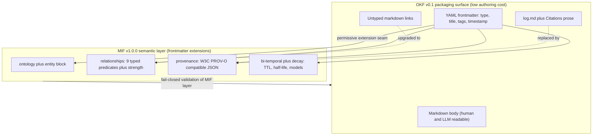

This computing-paper synthesis covers 36 surviving finding(s) across the research.

## Abstract

By Research Harness (report-synthesizer), MIF Research Corpus. Synthesized 2026-06-28 from 36 adversarially verified findings.

Large language model (LLM) agents increasingly persist working knowledge as git-native markdown rather than re-deriving it from raw documents through retrieval-augmented generation [1], [2], [3]. Google Cloud's Open Knowledge Format (OKF) v0.1 (June 2026) standardizes this "LLM wiki" pattern as a vendor-neutral directory of markdown files with YAML frontmatter, but deliberately omits formal ontology, typed relationships, and machine-verifiable provenance [5]. The Modeled Information Format (MIF) — public since February 2026 and stabilized at v1.0.0 (Release Candidate, 2026-06-18) — supplies precisely those missing semantics [6]. This paper proposes and analyzes a layered knowledge spine in which OKF provides the accessible markdown packaging surface and MIF provides provenance, bi-temporal, ontology, and typed-relationship semantics injected through OKF's permissive frontmatter-extension seam [26]. We evaluate the design analytically against eight prior systems and standards — personal knowledge management (PKM) tools, Frictionless Data, JSON-LD/schema.org, RDF/OWL, SKOS, and PROV-O — and against market and adoption-trajectory evidence drawn from the verified corpus. We find that the two specifications are structurally complementary rather than competing, that demand for structured, provenance-backed agent memory is real and growing [4], [27], [30], and that the principal risk is adoption and ecosystem maturity, not technical fit [35], [6]. We conclude that the layered spine is a sound, low-friction path to semantically rich agent knowledge, contingent on reconciling OKF's permissive-consumer model with MIF's fail-closed validation.

CCS Concepts: Information systems to Information integration and Resource Description Framework (RDF); Computing methodologies to Knowledge representation and reasoning and Semantic networks.

Keywords: knowledge representation, provenance, bi-temporal modeling, typed relationships, ontology, LLM agent memory, GraphRAG, Open Knowledge Format, Modeled Information Format, git-native markdown.

## Introduction

LLM-driven systems are shifting how durable knowledge is stored. Rather than re-deriving answers from raw corpora at query time via retrieval-augmented generation, practitioners increasingly maintain a curated, version-controlled markdown knowledge base that the model reads and updates directly. Andrej Karpathy's April 2026 "LLM wiki" gist crystallized this pattern, accumulating 5,000+ stars and spawning dozens of independent implementations within months [1]. The substrate already exists at scale: Obsidian alone reports 1.5 million+ active users growing at roughly 22% year over year, anchoring a broader second-brain movement in which markdown files in git are the de facto format [2].

This shift matters because pure vector RAG demonstrably fails on multi-hop reasoning and global synthesis, whereas hybrid graph-plus-vector architectures achieve a reported 3.4x accuracy improvement and 90%+ accuracy on schema-bound queries [3]. The hardest unsolved problems in production agent memory are not recall but staleness and provenance — who asserted a claim, and when did it cease to hold; systems scoring 92.5 and 94.4 on recall benchmarks still fail at temporal reasoning at scale [4]. Structured, typed, provenance-backed knowledge is therefore becoming a functional requirement, not a nicety.

Against this backdrop, Google Cloud released OKF v0.1 in June 2026: a vendor-neutral specification that represents knowledge as a directory of markdown files with YAML frontmatter, deliberately omitting formal ontology, typed relationships, and provenance in favor of minimalism and immediate usability [5]. MIF, by contrast, is a stabilized v1.0.0 specification (Release Candidate, 2026-06-18), public since February 2026, that provides exactly those richer semantics but still lacks OKF's distribution reach [6]. We emphasize that MIF predates OKF and sits at a more advanced version; its open problem is adoption, not spec maturity.

The contribution of this paper is threefold. First, we characterize OKF and MIF as orthogonal layers — packaging versus semantics — rather than competitors. Second, we specify the layering mechanics by which MIF semantics attach to OKF bundles through the extension seam. Third, we evaluate the combined knowledge spine analytically against prior art and against market and trajectory evidence, and we surface the threats to its validity. The remainder of the paper is organized as follows: Section 3 (Related Work) situates the design among prior knowledge-representation systems; Section 4 (Approach) details both formats and the layering; Section 5 (Evaluation) presents the capability comparison and the demand evidence; Section 6 (Discussion) states threats to validity; and Section 7 concludes.

## Related Work

We group prior art into markdown knowledge graphs, dataset-packaging formats, linked-data serializations, and formal semantic standards, and note for each how the OKF+MIF spine differs.

Markdown knowledge graphs. PKM tools — Obsidian (document-first, local), Logseq (block-outliner, local), and Roam Research (cloud outliner) — all use the same untyped wiki-link pattern that OKF later formalized, but lack typed relationship semantics, formal ontology, provenance tracking, and agent-exportable structure [7]. They are the primary prior art OKF's spec generalizes; the spine adds the semantics they omit.

Dataset packaging. Frictionless Data, also from the Open Knowledge Foundation, provides a lightweight JSON descriptor (datapackage.json) for packaging tabular data with minimal provenance such as sources and contributors [8]. As a technical comparator it handles data packaging, attribution, and licensing but offers no knowledge representation, no typed inter-dataset relationships, no provenance chains, no decay modeling, and no human-readable narrative body [9]. It solves dataset distribution, not knowledge-spine management.

Linked-data serializations. JSON-LD serializes RDF as developer-friendly JSON via @context/@id and is paired with schema.org's roughly 900-property vocabulary used by an estimated 45% of top websites [10]. JSON-LD 1.1 and the YAML-LD community report (finalized December 2023) deliver formally typed, globally identified entities and can encode provenance, but require the Semantic Web toolchain and lack OKF's human-readable markdown body and git-native bundle distribution [11]. schema.org itself offers roughly 800 entity types and 1300 property types optimized for web search interoperability, embedded in HTML rather than markdown, with no git distribution, provenance, or temporal decay [12].

Formal semantic standards. RDF/OWL delivers complete typed semantics and formal ontologies but at authoring and tooling costs that eliminate OKF's accessibility advantage [13]. SKOS (W3C Recommendation, 2009) publishes taxonomies and controlled vocabularies with broader/narrower/related relations but explicitly omits provenance and cannot distinguish relationship sub-types [14], [15]. PROV-O is the W3C provenance standard covering the same semantics as MIF's provenance layer, but it requires the full RDF toolchain; MIF delivers PROV-O-compatible provenance at plain-JSON authoring cost without a triple store [16]. Standards momentum is consolidating rather than fragmenting: the W3C RDF-star Working Group is advancing RDF 1.2 and SPARQL 1.2 (targeting Q3 2025), and PROV-O is being mapped to ISO 23494 [17].

The cautionary lesson. The Semantic Web failed to reach mass adoption because of toolchain complexity (RDF, OWL, SPARQL) and logical completeness prioritized over usability, while schema.org succeeded precisely by being minimal and immediately useful [18]. The design implication for any spine is unambiguous: specificity and pragmatism beat completeness, and a layer that demands a paradigm shift will stall. This directly motivates layering MIF onto an accessible OKF base rather than asking authors to adopt RDF.

## Approach / System Design

We describe OKF (the packaging layer), MIF (the semantic layer), and the seam that joins them.

OKF packaging layer. OKF v0.1 represents knowledge as a directory of markdown files with YAML frontmatter; the only required per-concept field is type, with recommended fields title, description, resource, tags, and timestamp [19]. Inter-concept relationships are carried by standard, explicitly untyped markdown hyperlinks — semantic meaning such as depends-on or part-of lives in surrounding prose only, and consumers MUST tolerate broken links [20]. Provenance is handled by two optional prose conventions, a chronological log.md and a Citations markdown section; neither is a machine-processable record with structured attribution, confidence scoring, or agent identification [21].

MIF semantic layer. MIF supplies the four capabilities OKF omits. (1) A formal ontology reference field (id, version, uri) plus an entity block (name, entity_type, entity_id); a generic core ontology provides five entity types — concept, person, organization, technology, file — and domain packs extend it, in contrast to OKF's unregistered producer-defined type string [22]. (2) A relationships array of nine structural-core typed predicates — supports, contradicts, derived-from, relates-to, supersedes, refines, part-of, depends-on, updates — each a directed edge carrying an optional numeric strength (0 to 1); this is the primary semantic capability OKF lacks [23] (gate 2026-06-28: weakened; see Section 6). (3) A first-class provenance object encoding W3C PROV-O-compatible attribution: a five-value sourceType enum (user_explicit, user_implicit, agent_inferred, external_import, system_generated), numeric confidence (0 to 1), trustLevel, agent identity, and wasGeneratedBy/wasAttributedTo/wasDerivedFrom properties [24]. (4) Bi-temporal tracking (valid time versus recorded time), ISO 8601 duration TTL, and configurable decay models (linear, exponential, step) with half-life and strength fields, where OKF supports only a single last-change timestamp [25].

The layering seam. OKF's extension mechanism is permissive: producers MAY add arbitrary frontmatter keys and consumers MUST preserve unknown keys [26]. This is the seam through which MIF's ontology, relationships, provenance, and temporal fields are injected as OKF frontmatter extensions, so a bundle remains a valid OKF directory while gaining MIF semantics. The principal architectural tension is OKF's permissive-consumer model versus MIF's fail-closed validation: a consumer that silently tolerates malformed MIF extensions would defeat MIF's guarantees, so the spine must validate the MIF layer strictly while preserving OKF tolerance for the base. Figure 1 shows the resulting architecture.

Figure 1: Architecture of the layered knowledge spine. OKF supplies the accessible markdown packaging surface; MIF semantics attach through OKF's permissive frontmatter-extension seam, upgrading untyped links to typed relationships and prose citations to machine-verifiable provenance, with the MIF layer validated fail-closed while the OKF base remains tolerant [19], [20], [21], [22], [23], [24], [25], [26].

## Evaluation

Because both specifications and the proposed spine are too new for a controlled deployment study, our evaluation is analytical along two axes: (1) capability coverage versus prior systems, and (2) the demand and adoption evidence that establishes whether the capabilities matter to a market. Each result claim cites its MIF finding and carries the adversarial verdict; weakened findings are annotated inline.

Capability coverage. Table 1 compares OKF, MIF, and the principal prior systems on the seven capabilities a knowledge spine must address. The pattern is consistent: OKF maximizes accessibility but omits semantics; the formal standards supply semantics at high authoring cost; and MIF-over-OKF is the only column combining low authoring cost with typed relationships, formal ontology, machine-verifiable provenance, and bi-temporal decay.

Table 1: Capability coverage of OKF+MIF versus prior knowledge-representation systems and standards.

| Capability | OKF v0.1 [19] | MIF v1.0.0 [22]-[25] | Frictionless [9] | JSON-LD / schema.org [11], [12] | SKOS [15] | RDF/OWL + PROV-O [13], [16] |
| --- | --- | --- | --- | --- | --- | --- |
| Typed relationships | No (prose only) | Yes (9 predicates, strength) | No | Partial (RDF predicates) | Hierarchy only | Yes |
| Formal ontology | No | Yes (id/version/uri, entity types) | No | Yes (RDF/OWL) | Partial (concept scheme) | Yes |
| Machine-verifiable provenance | No (log.md prose) | Yes (PROV-O JSON) | Minimal (contributors) | No native | No | Yes (PROV-O) |
| Bi-temporal / decay | No (single timestamp) | Yes (TTL, half-life, models) | No | No | No | No |
| Human-readable prose body | Yes | Yes (via OKF) | No | No | No | No |
| Git-native distribution | Yes | Yes (via OKF) | Partial | No | No | No |
| Authoring cost | Low | Low to moderate | Low | High (toolchain) | High | Very high |

Demand evidence. The capabilities map onto documented market need. Institutional knowledge loss costs Fortune 500 companies an estimated $31.5B/year, the average U.S. enterprise loses $4.5M/year to information silos, and 42% of institutional knowledge resides solely with individual employees — the financial case that provenance and temporal versioning directly address [29]. The addressable market combines the KM-software segment (about $23B in 2025, 13 to 18% CAGR) with the enterprise knowledge-graph segment (about $1.3 to 2.9B in 2025, 20 to 33% CAGR), a TAM exceeding $25B in 2025 projected to surpass $85B by 2034 [28]. The enterprise knowledge-graph market specifically is growing at 21 to 36% CAGR, with Gartner predicting 50%+ of AI-agent systems will use context graphs by 2028, and signals such as Google Cloud Spanner Graph (GA January 2025) and LinkedIn's reported 63% efficiency gains [27]. The architectural driver is the graph-plus-vector convergence whose 3.4x accuracy advantage over pure RAG creates explicit demand for typed, structured representations [3].

Two demand findings carry weakened verdicts and must be reported with caveats. The AI-demand finding [30] establishes real pull toward structured, provenance-backed knowledge (GraphRAG enablement forecast at 31% of the enterprise KG market in 2026), but its cited Gartner figure of 80% AI-agent adoption by Q1 2026 (from 33% in 2024) was found overstated against Gartner's own 40%-by-2026 and under-5%-in-2025 numbers; we therefore treat the demand direction as sound but the magnitude as uncertain (moderate confidence). The buyer-segments finding [31] identifies five segments with documented pains — AI/ML teams (LLM grounding), enterprise knowledge-engineering teams, research organizations, think tanks, and developer/platform teams — and was weakened for reusing the same overstated AI-agent adoption statistic; the segment structure itself stands.

Positioning and business model. OKF+MIF occupies the gap between PKM tools (Notion, Obsidian, Confluence) that lack provenance and typed relationships and enterprise knowledge-graph platforms (Neo4j, Stardog) that demand heavy engineering — the structured-but-accessible option [32]. Pricing signals from adjacent markets [33] point to an open-core model (free format, paid governance/hosting/audit), with enterprise KG platforms at $15K to 100K+/year and PKM tools at $5 to 16/user/month; this finding is weakened because some adjacent figures are extrapolated rather than measured for an OKF+MIF product. The open-format niche persists even as buyers shifted to roughly 76% SaaS in 2025 (from a 50/50 split in 2024) — developer teams, research orgs, and privacy-sensitive enterprises still prefer open, git-native formats [34]; this finding is weakened because the cited a16z source substantiates a qualitative shift to buying but not the precise 76% figure, so the share is indicative only.

## Discussion

The central thesis — that OKF and MIF are complementary layers and their combination is technically sound — rests on findings that survived adversarial testing. The threats to validity are concentrated in adoption, not architecture.

Adoption and ecosystem risk. OKF v0.1 was published June 12, 2026, only 16 days before this research, with no producer libraries, no consumer integrations, no governance tooling, and no enterprise adoption record [35]. The deeper risk is that OKF's minimalism may itself be the buyer preference, leaving MIF's richer layer a solution without a segment that wants it. OKF's early momentum — an Apache 2.0 release that reached 5,440 stars and 416 forks within weeks — signals strong practitioner interest, but star count equally reflects brand-new, pre-community-governed status and should not be read as adoption [36]. MIF faces the mirror-image risk: it is technically differentiated and at a stabilized v1.0.0, yet versus OKF's Google-backed launch it lacks a large independent adopter base and formal governance, so its open problem is distribution, not maturity [6].

The historical headwind. The Semantic Web's failure is the most relevant cautionary map: rich semantics repeatedly lost to minimal, immediately useful formats [18]. The spine's mitigation is structural — keep authoring at OKF cost and add MIF semantics through the extension seam rather than a toolchain mandate — but the risk that any added semantic burden depresses adoption is real and unquantified here.

Evidence limitations. Five of the supporting findings are weakened. Four are market statistics — AI-demand magnitude [30], buyer-segment sizing [31], adjacent-market pricing [33], and the SaaS-share figure [34] — where the direction of the claim survived but a specific number was overstated or unsubstantiated by its cited source; these travel as ranges, not point estimates. One is technical: the typed-relationships finding [23], whose predicate inventory and strength mechanic are documented in the MIF specification but which was marked weakened in the gate and so is reported with that caveat. No finding underpinning the core layering thesis was falsified. A further limitation is method: this is an analytical evaluation with no controlled deployment, so claims about authoring cost and adoption friction are reasoned from specification properties and market analogues rather than measured.

Open questions. Three remain. First, can fail-closed MIF validation coexist with OKF's mandated consumer tolerance without forking the ecosystem [26]? Second, does the open-core business model hold for a format whose value is semantic richness rather than hosting [33]? Third, will the agent-memory demand for first-class temporal validity and provenance [4] convert into demand for this specific spine, or be captured by incumbents?

## Conclusion & Future Work

We have argued that OKF and MIF address orthogonal concerns — accessible markdown packaging versus formal semantics — and that layering MIF over OKF through the latter's permissive extension seam yields a knowledge spine that is both low-friction to author and semantically rich enough for provenance-aware, temporally grounded agent memory [5], [6], [26]. The analytical evaluation shows the combination is the only option surveyed that pairs low authoring cost with typed relationships, formal ontology, machine-verifiable provenance, and bi-temporal decay, and that the underlying demand for structured, citable agent knowledge is real and growing. The decisive risk is not technical fit but adoption: OKF is 16 days old with no ecosystem, MIF leads on capability but trails on distribution, and the Semantic Web's history warns that semantic richness can lose to minimalism [35], [6], [18].

Future work follows directly. First, build and measure a reference implementation of the extension seam that validates the MIF layer fail-closed while preserving OKF consumer tolerance, and report real authoring-cost overhead rather than the reasoned estimate offered here. Second, run a controlled study of retrieval and temporal-reasoning accuracy on agent tasks for OKF-only versus OKF+MIF bundles, to replace the analytical capability claims with measured ones. Third, track OKF and MIF ecosystem formation — producer and consumer libraries and governance — over the next year, since the thesis's practical value is contingent on adoption that did not yet exist at the time of writing.

## References

[1] LLM Wiki — Karpathy GitHub Gist (April 2026). <https://gist.github.com/karpathy/442a6bf555914893e9891c11519de94f>

[2] History of Obsidian: Second Brain to AI Knowledge OS — Taskade Blog. <https://www.taskade.com/blog/obsidian-history>

[3] Project GraphRAG — Microsoft Research. <https://www.microsoft.com/en-us/research/project/graphrag/>

[4] State of AI Agent Memory 2026: Benchmarks, Architectures & Production Gaps — Mem0. <https://mem0.ai/blog/state-of-ai-agent-memory-2026>

[5] How the Open Knowledge Format can improve data sharing — Google Cloud Blog. <https://cloud.google.com/blog/products/data-analytics/how-the-open-knowledge-format-can-improve-data-sharing>

[6] Introducing MIF: Memory Interchange Format — zircote.com (February 2026). <https://zircote.com/blog/2026/02/introducing-mif-memory-interchange-format/>

[7] Personal Knowledge Graphs in Obsidian — Volodymyr Pavlyshyn, Medium. <https://volodymyrpavlyshyn.medium.com/personal-knowledge-graphs-in-obsidian-528a0f4584b9>

[8] Data Package (v1) Specification — Frictionless Data. <https://specs.frictionlessdata.io/data-package/>

[9] Frictionless Data Package Specification — specs.frictionlessdata.io. <https://specs.frictionlessdata.io/data-package/>

[10] JSON-LD — A JSON-based Serialization for Linked Data (W3C Recommendation). <https://www.w3.org/TR/json-ld11/>

[11] JSON-LD 1.1 — W3C Recommendation. <https://www.w3.org/TR/json-ld11/>

[12] Ontology vs. Semantic Layer: Differences and schema.org limitations — Atlan. <https://atlan.com/know/ontology-vs-semantic-layer/>

[13] RDF vs OWL: Key Differences, Use Cases and Examples Explained — Atlan. <https://atlan.com/know/rdf-vs-owl/>

[14] SKOS Simple Knowledge Organization System — W3C Home Page. <https://www.w3.org/2004/02/skos/>

[15] SKOS Simple Knowledge Organization System Reference — W3C. <https://www.w3.org/TR/skos-reference/>

[16] PROV-O: The PROV Ontology — W3C Recommendation. <https://www.w3.org/TR/prov-o/>

[17] RDF & SPARQL Working Group Charter — W3C (April 2025). <https://www.w3.org/2025/04/rdf-star-wg-charter.html>

[18] The Semantic Web: 20 Years and a Handful of Enterprise Knowledge Graphs Later — Ontotext. <https://www.ontotext.com/blog/the-semantic-web-20-years-later/>

[19] OKF SPEC.md v0.1 — GoogleCloudPlatform/knowledge-catalog. <https://github.com/GoogleCloudPlatform/knowledge-catalog/blob/main/okf/SPEC.md>

[20] OKF SPEC.md v0.1 — Cross-linking section §4 — GoogleCloudPlatform/knowledge-catalog. <https://github.com/GoogleCloudPlatform/knowledge-catalog/blob/main/okf/SPEC.md>

[21] OKF SPEC.md v0.1 — Log Files and Citations sections — GoogleCloudPlatform/knowledge-catalog. <https://github.com/GoogleCloudPlatform/knowledge-catalog/blob/main/okf/SPEC.md>

[22] MIF Modeled Information Format Specification — mif-spec.dev. <https://mif-spec.dev/>

[23] MIF Schema Reference — mif-spec.dev. <https://mif-spec.dev/>

[24] MIF Modeled Information Format Specification — mif-spec.dev. <https://mif-spec.dev/>

[25] MIF — Bi-temporal tracking, decay models — GitHub zircote/MIF. <https://github.com/zircote/MIF>

[26] OKF SPEC.md v0.1 — Extension mechanism §3 — GoogleCloudPlatform/knowledge-catalog. <https://github.com/GoogleCloudPlatform/knowledge-catalog/blob/main/okf/SPEC.md>

[27] GraphRAG: Unlocking LLM Discovery on Narrative Private Data — Microsoft Research Blog. <https://www.microsoft.com/en-us/research/blog/graphrag-unlocking-llm-discovery-on-narrative-private-data/>

[28] Knowledge Management Software Market Size, Industry Share, Forecast 2034 — Fortune Business Insights. <https://www.fortunebusinessinsights.com/knowledge-management-software-market-110376>

[29] The Cost and Consequence of Institutional Memory Drain — Inc. Magazine. <https://www.inc.com/bethmaser/the-cost-and-consequence-of-institutional-memory-drain/91178504>

[30] Enterprise Knowledge Graph Buyer's Guide 2026 — Promethium. <https://promethium.ai/guides/enterprise-knowledge-graph-buyers-guide-2026/>

[31] Knowledge Management Statistics and Trends in 2025 — CAKE. <https://cake.com/blog/knowledge-management-statistics/>

[32] Google Cloud Introduces OKF — Competitive comparison — MarkTechPost. <https://www.marktechpost.com/2026/06/16/google-cloud-introduces-open-knowledge-format-okf-a-vendor-neutral-markdown-spec-for-giving-ai-agents-curated-context/>

[33] Neo4j Software Pricing & Plans 2026 — Vendr. <https://www.vendr.com/marketplace/neo4j>

[34] How 100 Enterprise CIOs Are Building and Buying Gen AI in 2025 — a16z. <https://a16z.com/ai-enterprise-2025/>

[35] Google Cloud Launches Open Knowledge Format Standard — Let's Data Science. <https://letsdatascience.com/news/google-cloud-launches-open-knowledge-format-standard-b9480a66>

[36] How the Open Knowledge Format can improve data sharing — Google Cloud Blog. <https://cloud.google.com/blog/products/data-analytics/how-the-open-knowledge-format-can-improve-data-sharing>

## Sources

- [a16z 'How 100 Enterprise CIOs Are Building and Buying Gen AI in 2025' - source does not substantiate the specific 76%/50-50 build-vs-buy figure on inspection (only a qualitative shift-to-buying)](<https://a16z.com/ai-enterprise-2025/>)
- [JSON-LD Schema Markup for AI Discoverability: Technical Guide 2026 - AgentVisibility.ai](<https://agentvisibility.ai/insights/json-ld-schema-ai-discoverability>)
- [Governing Evolving Memory in LLM Agents: Risks, Mechanisms, and the SSGM Framework — arXiv](<https://arxiv.org/html/2603.11768v1>)
- [A Decade of Scholarly Research on Open Knowledge Graphs - Research community KG adoption (arXiv)](<https://arxiv.org/pdf/2306.13186>)
- [OWL Reasoners still useable in 2023 (arXiv)](<https://arxiv.org/pdf/2309.06888>)
- [Semantic Web: Past, Present, and Future — arXiv 2412.17159](<https://arxiv.org/pdf/2412.17159>)
- [Semantic Web and Software Agents — A Forgotten Wave of Artificial Intelligence? arXiv 2503.20793](<https://arxiv.org/pdf/2503.20793>)
- [PROV-AGENT: Unified Provenance for Tracking AI Agent Interactions in Agentic Workflows (arXiv)](<https://arxiv.org/pdf/2508.02866>)
- [Gartner on Context Graphs: Trends, Capabilities, Setup in 2026 — Atlan](<https://atlan.com/know/gartner-context-graphs/>)
- [Ontology vs. Semantic Layer: Differences and schema.org limitations — Atlan](<https://atlan.com/know/ontology-vs-semantic-layer/>)
- [RDF vs OWL: Key Differences, Use Cases and Examples Explained - Atlan](<https://atlan.com/know/rdf-vs-owl/>)
- [Stardog Enterprise Knowledge Graph Platform Pricing (AWS Marketplace)](<https://aws.amazon.com/marketplace/pp/prodview-ulfm6fel7xgjq>)
- [Frictionless Data and FAIR Research Principles - Open Knowledge Foundation Blog](<https://blog.okfn.org/2018/08/14/frictionless-data-and-fair-research-principles/>)
- [Knowledge Management Statistics and Trends in 2025 - Worker productivity costs (CAKE)](<https://cake.com/blog/knowledge-management-statistics/>)
- [How the Open Knowledge Format can improve data sharing — Google Cloud Blog](<https://cloud.google.com/blog/products/data-analytics/how-the-open-knowledge-format-can-improve-data-sharing>)
- [Ontologies, Context Graphs, and Semantic Layers: What AI Actually Needs in 2026](<https://contextandchaos.substack.com/p/ontologies-context-graphs-and-semantic>)
- [Knowledge Management and Dissemination for Think Tanks (DataCalculus)](<https://datacalculus.com/en/blog/think-tanks/program-director/knowledge-management-and-dissemination-for-think-tanks>)
- [Personal Knowledge Management Software Market Research Report 2034 — DataIntelo](<https://dataintelo.com/report/personal-knowledge-management-software-market>)
- [Lessons Learned from the Combined Development of OWL and SHACL — ACM K-CAP 2025](<https://dl.acm.org/doi/full/10.1145/3731443.3771340>)
- [Top Knowledge Management Trends 2026 - Semantic layers and enterprise AI (Enterprise Knowledge)](<https://enterprise-knowledge.com/top-knowledge-management-trends-2026/>)
- [LLM Wiki — Karpathy GitHub Gist (April 2026)](<https://gist.github.com/karpathy/442a6bf555914893e9891c11519de94f>)
- [OKF SPEC.md — GoogleCloudPlatform/knowledge-catalog](<https://github.com/GoogleCloudPlatform/knowledge-catalog/blob/main/okf/SPEC.md>)
- [Frictionless Data Package — GitHub frictionlessdata/datapackage](<https://github.com/frictionlessdata/datapackage>)
- [MIF v1.0 — GitHub zircote/MIF](<https://github.com/zircote/MIF>)
- [Open Knowledge Format (OKF) — Official Grounding Page](<https://groundingpage.com/facts/open-knowledge-format/>)
- [JSON-LD - JSON for Linked Data (Official Site)](<https://json-ld.org/>)
- [Google Cloud Launches Open Knowledge Format Standard - sober adoption assessment (Let's Data Science)](<https://letsdatascience.com/news/google-cloud-launches-open-knowledge-format-standard-b9480a66>)
- [From LLMs to Knowledge Graphs: Building Production-Ready Graph Systems in 2025 — Medium](<https://medium.com/@claudiubranzan/from-llms-to-knowledge-graphs-building-production-ready-graph-systems-in-2025-2b4aff1ec99a>)
- [Beyond OWL: Reconsidering Ontologies in the Age of AI and the Semantic Web](<https://medium.com/@nfigay/beyond-owl-reconsidering-ontologies-in-the-age-of-ai-and-the-semantic-web-4059b519f23d>)
- [Open-Sourcing the Knowledge Graph Studio under MIT license (Medium/Enterprise RAG)](<https://medium.com/enterprise-rag/open-sourcing-the-whyhow-knowledge-graph-studio-powered-by-nosql-edce283fb341>)
- [State of AI Agent Memory 2026: Benchmarks, Architectures & Production Gaps — Mem0](<https://mem0.ai/blog/state-of-ai-agent-memory-2026>)
- [MIF Schema Reference — mif-spec.dev](<https://mif-spec.dev/>)
- [MIF relationship types (mif-spec.dev) - the core vocabulary is relates-to/derived-from/supersedes/conflicts-with/part-of/implements/uses/created-by/mentioned-in; supports/contradicts/refines/depends-on/updates are not MIF-native core, only custom namespaced](<https://mif-spec.dev/specification/relationship-types/>)
- [Open-Source vs SaaS Agent Platforms: Pros & Cons for Enterprises (OneReach.ai)](<https://onereach.ai/blog/open-source-frameworks-vs-saas-agent-platforms/>)
- [Enterprise Knowledge Graph Buyer's Guide 2026 - Pricing and ROI signals (Promethium)](<https://promethium.ai/guides/enterprise-knowledge-graph-buyers-guide-2026/>)
- [Graph RAG Guide 2025: Architecture, Implementation & ROI — Salfati Group](<https://salfati.group/topics/graph-rag>)
- [Obsidian Complete Guide: The Ultimate Markdown Editor for Knowledge Management Revolution 2025 — SmartScope](<https://smartscope.blog/en/obsidian-complete-guide/>)
- [Obsidian vs Logseq 2026: Which PKM Tool Wins? - SoftPicker](<https://softpicker.com/obsidian-vs-logseq/>)
- [Frictionless Data Specifications - Official Home](<https://specs.frictionlessdata.io/>)
- [Frictionless Data Package Specification — specs.frictionlessdata.io](<https://specs.frictionlessdata.io/data-package/>)
- [State of Open Data 2025 - FAIR data and open science trends](<https://stateofopendata.com/>)
- [Knowledge Management Software Market Size, Share, Growth, 2034 (Straits Research)](<https://straitsresearch.com/report/knowledge-management-software-market>)
- [AI Hallucination Statistics 2026: 50+ Sourced Data Points (Suprmind)](<https://suprmind.ai/hub/insights/ai-hallucination-statistics-research-report-2026/>)
- [Bi-temporal memory for AI coding agents — git-pinned context that survives context compaction](<https://sverklo.com/blog/bi-temporal-memory-for-ai-agents/>)
- [Google Launches a Universal Format for Karpathy's LLM Wiki — Techstrong.ai](<https://techstrong.ai/articles/google-launches-a-universal-format-for-karpathys-llm-wiki/>)
- [Google Just Standardized Karpathy's LLM Wiki Pattern — The Menon Lab](<https://themenonlab.blog/blog/google-okf-open-knowledge-format-karpathy-llm-wiki-standard>)
- [Obsidian Pricing 2026: Plans, Hidden Costs & Cheaper Alternatives (ToolRadar)](<https://toolradar.com/tools/obsidian/pricing>)
- [Agent-to-agent audit trail: provenance for AI ecosystems (TrueScreen)](<https://truescreen.io/articles/agent-to-agent-audit-trail/>)
- [Personal Knowledge Graphs in Obsidian - Volodymyr Pavlyshyn, Medium](<https://volodymyrpavlyshyn.medium.com/personal-knowledge-graphs-in-obsidian-528a0f4584b9>)
- [Why Bad Knowledge Management Is Killing Your Profits (WikiTeq)](<https://wikiteq.com/post/hidden-costs-poor-knowledge-management>)
- [2026 Enterprise AI Knowledge Management: AI-native KM market size (Windows Forum/GoSearch)](<https://windowsforum.com/threads/2026-enterprise-ai-knowledge-management-from-search-to-governed-agent-workflows.410816/>)
- [Open Knowledge Format (OKF) Complete 2026 Guide - ecosystem gaps identified (WitsCode)](<https://witscode.com/open-knowledge-format>)
- [AI-Ready Enterprise Knowledge Graph Market to Reach USD 6,550.0 Million by 2036 (AccessNewswire/FMI)](<https://www.accessnewswire.com/newsroom/en/business-and-professional-services/ai-ready-enterprise-knowledge-graph-market-to-reach-usd-6-550.0-1167718>)
- [Knowledge Management Software Market Size, Industry Share | Forecast 2034 (Fortune Business Insights)](<https://www.fortunebusinessinsights.com/knowledge-management-software-market-110376>)
- [Gartner Predicts 40% of Enterprise Apps Will Feature Task-Specific AI Agents by 2026, Up from Less Than 5% in 2025 (Gartner Newsroom)](<https://www.gartner.com/en/newsroom/press-releases/2025-08-26-gartner-predicts-40-percent-of-enterprise-apps-will-feature-task-specific-ai-agents-by-2026-up-from-less-than-5-percent-in-2025>)
- [Enterprise Knowledge Graph Market Industry Report 2033 — Grand View Research](<https://www.grandviewresearch.com/industry-analysis/enterprise-knowledge-graph-market-report>)
- [The Cost and Consequence of Institutional Memory Drain (Inc. Magazine)](<https://www.inc.com/bethmaser/the-cost-and-consequence-of-institutional-memory-drain/91178504>)
- [Simple Knowledge Organization System (SKOS) — ISKO Encyclopedia of KO](<https://www.isko.org/cyclo/skos.htm>)
- [Cost of Organizational Knowledge Loss and Countermeasures (Iterators HQ)](<https://www.iteratorshq.com/blog/cost-of-organizational-knowledge-loss-and-countermeasures/>)
- [Why AI Hallucinates in Your Enterprise (and how Context Graphs Fix it) - Kamiwaza](<https://www.kamiwaza.ai/insights/why-ai-hallucinates-in-your-enterprise>)
- [Knowledge Graph Market Worth $9.88 Billion by 2032 — MarketsandMarkets](<https://www.marketsandmarkets.com/PressReleases/knowledge-graph.asp>)
- [Google Cloud Introduces Open Knowledge Format (OKF) — MarkTechPost](<https://www.marktechpost.com/2026/06/16/google-cloud-introduces-open-knowledge-format-okf-a-vendor-neutral-markdown-spec-for-giving-ai-agents-curated-context/>)
- [Knowledge Graph vs Vector Database for RAG: Which Is Best? — Meilisearch](<https://www.meilisearch.com/blog/knowledge-graph-vs-vector-database-for-rag>)
- [GraphRAG: Unlocking LLM Discovery on Narrative Private Data — Microsoft Research Blog](<https://www.microsoft.com/en-us/research/blog/graphrag-unlocking-llm-discovery-on-narrative-private-data/>)
- [Project GraphRAG — Microsoft Research](<https://www.microsoft.com/en-us/research/project/graphrag/>)
- [A Semantic Approach to Mapping the Provenance Ontology to Basic Formal Ontology — Scientific Data](<https://www.nature.com/articles/s41597-025-04580-1>)
- [Notion vs Obsidian - minimalism as user preference (NotionApps)](<https://www.notionapps.com/blog/notion-vs-obsidian-knowledge-productivity-2025>)
- [The Semantic Web: 20 Years and a Handful of Enterprise Knowledge Graphs Later — Ontotext](<https://www.ontotext.com/blog/the-semantic-web-20-years-later/>)
- [Notion vs Obsidian vs Roam Research 2025: Best Note-Taking App for Productivity](<https://www.primeproductiv4.com/blog-articles/notion-vs-obsidian-vs-roam-research-productivity-comparison>)
- [History of Obsidian: Second Brain to AI Knowledge OS — Taskade Blog](<https://www.taskade.com/blog/obsidian-history>)
- [AI-Driven Knowledge Management System Market Report (The Business Research Company) - the '$7.71B 2025 / 47.2%' figure traces here, not to GoSearch; cross-firm AI-KM sizing varies widely and the finding's two growth rates do not reconcile](<https://www.thebusinessresearchcompany.com/report/ai-driven-knowledge-management-system-global-market-report>)
- [Neo4j Software Pricing & Plans 2026 (Vendr)](<https://www.vendr.com/marketplace/neo4j>)
- [SKOS Simple Knowledge Organization System - W3C Home Page](<https://www.w3.org/2004/02/skos/>)
- [RDF & SPARQL Working Group Charter — W3C (April 2025)](<https://www.w3.org/2025/04/rdf-star-wg-charter.html>)
- [JSON-LD 1.1 — W3C Recommendation](<https://www.w3.org/TR/json-ld11/>)
- [PROV-O: The PROV Ontology - W3C Recommendation](<https://www.w3.org/TR/prov-o/>)
- [PROV-Overview — W3C](<https://www.w3.org/TR/prov-overview/>)
- [SKOS Simple Knowledge Organization System Primer - W3C Recommendation](<https://www.w3.org/TR/skos-primer/>)
- [SKOS Simple Knowledge Organization System Reference — W3C](<https://www.w3.org/TR/skos-reference/>)
- [Ontologies and Knowledge Graphs in Industry Community Group — W3C](<https://www.w3.org/community/oki/>)
- [YAML-LD — W3C CG Final Report, December 2023](<https://www.w3.org/community/reports/json-ld/CG-FINAL-yaml-ld-20231206/>)
- [The PROV-JSONLD Serialization - W3C Member Submission 2024](<https://www.w3.org/submissions/2024/SUBM-prov-jsonld-20240825/>)
- [Introducing MIF: Memory Interchange Format — zircote.com (February 2026)](<https://zircote.com/blog/2026/02/introducing-mif-memory-interchange-format/>)
- [AI Agent Memory Architectures: From Context Windows to Persistent Knowledge — Zylos Research](<https://zylos.ai/research/2026-04-05-ai-agent-memory-architectures-persistent-knowledge/>)
