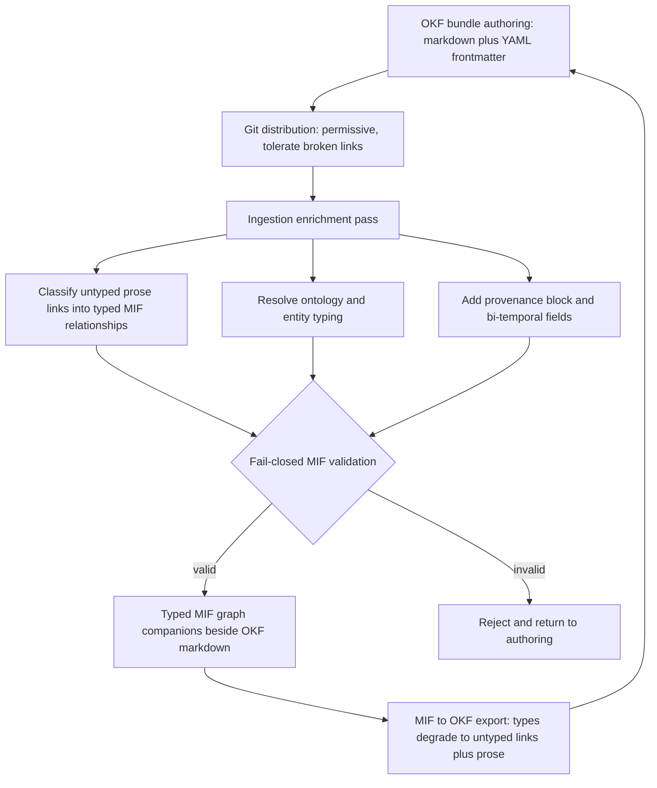

This engineering synthesis covers 36 surviving finding(s) across the research.

## Problem and Context

This report evaluates whether MIF (Modeled Information Format) should serve as the modeling, provenance, and temporal spine layered with OKF (Google Cloud's Open Knowledge Format) as the accessible, git-distributable packaging layer for a foundational research knowledge spine. The question has four faces: is the layering technically feasible, is it differentiated from prior art, is it on a favorable adoption trajectory, and does it address a real market.

The forces in play pull in two directions. A research and agent knowledge spine needs, on one side, low-friction human authoring and git-native versioned distribution; on the other, machine-processable typed relationships, structured provenance, and temporal validity so a processor can traverse the graph deterministically, detect staleness, and score trust.

OKF v0.1 (Google Cloud, June 2026) supplies the first face. It represents knowledge as a directory of markdown files with YAML frontmatter whose only required field is a producer-defined `type`; recommended fields are title, description, resource, tags, and a single timestamp. It deliberately omits formal typing systems, ontologies, provenance tracking, and typed relationship definitions, and its consumers MUST tolerate unknown fields and broken links. That minimalism is its accessibility and its gap.

MIF supplies the second face. MIF is at v1.0.0 (Released, stabilized 2026-06-18) and has been public since roughly February 2026 — it predates OKF. Its maturity is not the constraint; its constraint is distribution and adoption reach, since it ships as JSON with no native git-friendly bundle format. The non-functional requirements that frame the decision are therefore: fail-closed validation for the formal layer, round-trip fidelity between the two formats, authoring resilience (tolerate not-yet-written links), institutional-memory retention, and the rising demand for verifiable agent-memory provenance.

## Options Considered

Four families of approach were considered, each described on its own terms.

Option A — OKF alone. Markdown-plus-YAML bundles distributed over git. Cross-concept links are standard markdown hyperlinks whose relationship type lives only in surrounding prose; the spec is explicit that consumers treat all links as untyped directed edges and must tolerate broken ones. Provenance is handled by two optional prose conventions, a chronological log.md and a free-text Citations section. Accessible and git-native, but with no machine-processable semantics.

Option B — MIF alone. JSON Concepts carrying typed relationship edges with optional strength, a first-class W3C PROV-O compatible provenance block (sourceType enum, numeric confidence, trustLevel ladder), bi-temporal tracking with ISO-8601 TTL and configurable decay, and a formal ontology plus entity-reference typing. Strong semantics and fail-closed validation, but no human-readable markdown body and no git-native bundle distribution model, atop a still-nascent ecosystem.

Option C — OKF plus MIF layering (the proposal). OKF bundles act as the durable, human-readable, git-distributable spine; MIF fields are injected as extended OKF frontmatter and JSON companions that carry the formal typed graph.

Option D — established prior art. JSON-LD (W3C Recommendation, 2020-07-16) and YAML-LD (Final Community Group Report, 2023-12-06) deliver full linked data through the @context mechanism but require the Semantic Web toolchain and lack a markdown body and git-native bundle. schema.org offers roughly 800 entity types and over 1500 properties tuned for web search-engine interoperability, embedded in HTML or JSON-LD, with no git distribution, provenance, or decay. SKOS (W3C Recommendation, 2009) gives thesaurus-style broader/narrower/related hierarchies under a deliberately minimal ontological commitment, without prose bodies, provenance, or git distribution. Frictionless Data Package is a JSON descriptor plus (chiefly tabular) resources — data packaging, not knowledge representation. RDF/OWL with PROV-O is the full semantic stack whose repeated failure to reach mass adoption is itself a decision driver. Markdown-native PKM tools (Obsidian, Logseq, Roam) popularized git-friendly linked notes but bind knowledge to an application rather than an interchange standard.

## Trade-offs

The options are compared below on the decision drivers that the goal names: typed relationships, first-class provenance, bi-temporal validity and decay, and formal ontology typing, alongside the accessibility drivers (human-readable markdown, git-native distribution, fail-closed validation, authoring resilience) and adoption maturity.

| Decision driver | OKF alone | MIF alone | OKF + MIF | JSON-LD / YAML-LD | schema.org | SKOS | Frictionless |
| --- | --- | --- | --- | --- | --- | --- | --- |
| Human-readable markdown body | Yes | No | Yes | No | No | No | No |
| Git-native bundle distribution | Yes | No | Yes | No | No | No | Partial |
| Typed relationship edges | No | Yes | Yes | Yes | Yes | Partial | No |
| First-class structured provenance | No | Yes | Yes | Partial | No | No | Partial |
| Bi-temporal validity and decay | No | Yes | Yes | No | No | No | No |
| Formal ontology / entity typing | No | Yes | Yes | Yes | Yes | Partial | No |
| Fail-closed validation | No | Yes | Yes (at ingest) | Partial | No | No | Partial |
| Authoring resilience (tolerate broken links) | Yes | No | Yes (OKF layer) | No | Yes | No | No |
| Adoption maturity | Nascent | Nascent | Nascent | Mature | Mature | Mature | Established niche |

The table shows no single prior-art option winning both the accessibility rows and the semantic rows. OKF wins markdown, git distribution, and authoring resilience but loses every formal-semantics row: its links are untyped, its single timestamp cannot express a validity window, its `type` is an unregistered producer string, and its provenance is prose. MIF wins every formal-semantics row — typed edges with strength, a PROV-O compatible provenance block, bi-temporal plus decay, and a formal ontology — but loses the markdown body and git-native distribution rows. The Semantic Web options (JSON-LD, schema.org, SKOS, RDF/OWL) carry formal typing but none combine it with a markdown body and git bundle, and their adoption history is a cautionary signal.

One enumeration that the design must not over-rely on: MIF's spec-core relationship vocabulary is four predicates — relates-to, derived-from, supersedes, and part-of. A finding describing nine MIF-native core relationship types was weakened on review: the additional predicates (supports, contradicts, refines, depends-on, updates) are available only as namespaced custom types, not spec-core. The layering design should treat four predicates as guaranteed and any richer vocabulary as an extension to be declared, not assumed. The broader thesis — that MIF supplies typed directed edges with optional strength that OKF's untyped prose links lack — holds.

## Decision

Status: proposed.

Adopt the OKF + MIF layering (Option C). OKF bundles are the durable, human-readable, git-distributable spine; MIF is the modeling, provenance, and temporal layer, injected as extended OKF frontmatter plus JSON companions and validated fail-closed at ingestion. The decision follows directly from the trade-off table: no single prior-art option supplies both accessibility and formal semantics, so the spine must combine two layers rather than pick one.

The layering is technically feasible because OKF's conformance model is deliberately extensible. The OKF specification states that producers MAY include additional frontmatter key-value pairs, that consumers SHOULD preserve unknown keys when round-tripping, and that consumers MUST NOT reject documents with unrecognized fields. An OKF-compliant bundle can therefore carry MIF fields as extended frontmatter without breaking OKF conformance — this is the extension seam the decision rests on.

The alternatives lose for concrete reasons. OKF alone cannot type relationships, cannot express claim-validity windows, and offers no machine-verifiable provenance. MIF alone has the semantics but no accessible git-native packaging and a nascent distribution story. The Semantic Web stack (JSON-LD, RDF/OWL, schema.org, SKOS) has formal typing but lost the adoption battle and never offered a markdown-and-git authoring surface — a lesson the layering explicitly heeds by keeping the markdown spine primary and the formal layer additive.

Two evidentiary caveats attach to this decision. First, the MIF capability findings (typed relationships, provenance, temporal/decay, ontology) are corroborated chiefly against first-party MIF sources, a bounded-epistemics limit noted at review. Second, the relationship-vocabulary enumeration is weakened, so the decision commits only to MIF's four spec-core predicates as guaranteed. Neither caveat touches the central layering thesis, which survived adversarial review.

## Implementation Notes

The layering is a field-complement plus an enrichment pass. OKF fields map onto MIF fields as follows; this is plain tabular matter, not a decision figure.

| OKF field | MIF field it complements |
| --- | --- |
| type (producer string) | entity.entity_type plus ontology.id (formal typed resolution) |
| timestamp (last-modified) | temporal.validFrom / validUntil / recordedAt (bi-temporal) |
| tags | tags (compatible YAML string arrays) |
| resource (asset URI) | citations[].url (primary-source) |
| log.md entries | provenance block plus temporal history |
| Citations markdown section | citations[] with structured citationRole / citationType |
| untyped markdown links | relationships[] with typed edge and strength |

The architecture below is load-bearing because the whole decision turns on where the permissive-to-fail-closed boundary sits: OKF authoring and distribution stay permissive; MIF validation is applied only at ingestion, in an enrichment pass.

Round-trip fidelity is asymmetric. The OKF-to-MIF direction is lossy: classifying untyped prose links into typed relationships requires inference by an AI or human enrichment step. The MIF-to-OKF direction is lossless: typed relationships degrade gracefully to untyped markdown links annotated in prose. An engineer should keep the OKF bundle as the source of truth and treat MIF companions as a derived, regenerable projection.

Dependencies and rollout: stand up the OKF authoring surface first, then an automated enrichment agent (Google's BigQuery enrichment reference agent demonstrates the pattern) that stamps MIF frontmatter and emits the JSON companions. Risks to manage: the inference cost and error rate of link classification; MIF's distribution and adoption gap; OKF's v0.1 instability and nascency risk; and the explicit need to document the boundary at which the permissive consumer model flips to fail-closed validation.

## Consequences

What becomes easier. The spine gains deterministic graph traversal, automated staleness and decay detection, machine-verifiable trust scoring, and concordance validation — all from MIF's typed edges, bi-temporal fields, and provenance block — while keeping a human-readable, git-versioned markdown surface for authoring and collaboration. This pairing tracks the demand the trajectory and market evidence describe: git-native markdown knowledge management, LLM-wiki and agent-memory adoption, enterprise knowledge-graph growth, the rise of hybrid GraphRAG, and rising demand for structured provenance.

What becomes harder. The system carries two layers and an enrichment pipeline to maintain, fail-closed ingestion to operate, and a dependence on two specifications that are each still young. The market evidence that sizes this opportunity — KM software market sizing, buyer segments and pain points, pricing and business-model signals, AI demand for structured provenance, and the open-source versus commercial posture — travels with explicit caveats and was weakened on review; it should be treated as directional, not load-bearing for the build decision.

What to revisit later. Monitor MIF's relationship vocabulary: only four predicates are spec-core today, so re-confirm before relying on a richer set. Watch MIF's distribution and adoption trajectory and OKF's stabilization beyond v0.1. Track W3C RDF-star provenance and the competitive positioning of adjacent standards. Above all, heed the semantic-web failure lessons: keep the formal MIF layer optional and the markdown spine primary, so the over-formalization that sank prior efforts does not sink this one.

## Sources

- [a16z 'How 100 Enterprise CIOs Are Building and Buying Gen AI in 2025' - source does not substantiate the specific 76%/50-50 build-vs-buy figure on inspection (only a qualitative shift-to-buying)](<https://a16z.com/ai-enterprise-2025/>)
- [JSON-LD Schema Markup for AI Discoverability: Technical Guide 2026 - AgentVisibility.ai](<https://agentvisibility.ai/insights/json-ld-schema-ai-discoverability>)
- [Governing Evolving Memory in LLM Agents: Risks, Mechanisms, and the SSGM Framework — arXiv](<https://arxiv.org/html/2603.11768v1>)
- [A Decade of Scholarly Research on Open Knowledge Graphs - Research community KG adoption (arXiv)](<https://arxiv.org/pdf/2306.13186>)
- [OWL Reasoners still useable in 2023 (arXiv)](<https://arxiv.org/pdf/2309.06888>)
- [Semantic Web: Past, Present, and Future — arXiv 2412.17159](<https://arxiv.org/pdf/2412.17159>)
- [Semantic Web and Software Agents — A Forgotten Wave of Artificial Intelligence? arXiv 2503.20793](<https://arxiv.org/pdf/2503.20793>)
- [PROV-AGENT: Unified Provenance for Tracking AI Agent Interactions in Agentic Workflows (arXiv)](<https://arxiv.org/pdf/2508.02866>)
- [Gartner on Context Graphs: Trends, Capabilities, Setup in 2026 — Atlan](<https://atlan.com/know/gartner-context-graphs/>)
- [Ontology vs. Semantic Layer: Differences and schema.org limitations — Atlan](<https://atlan.com/know/ontology-vs-semantic-layer/>)
- [RDF vs OWL: Key Differences, Use Cases and Examples Explained - Atlan](<https://atlan.com/know/rdf-vs-owl/>)
- [Stardog Enterprise Knowledge Graph Platform Pricing (AWS Marketplace)](<https://aws.amazon.com/marketplace/pp/prodview-ulfm6fel7xgjq>)
- [Frictionless Data and FAIR Research Principles - Open Knowledge Foundation Blog](<https://blog.okfn.org/2018/08/14/frictionless-data-and-fair-research-principles/>)
- [Knowledge Management Statistics and Trends in 2025 - Worker productivity costs (CAKE)](<https://cake.com/blog/knowledge-management-statistics/>)
- [How the Open Knowledge Format can improve data sharing — Google Cloud Blog](<https://cloud.google.com/blog/products/data-analytics/how-the-open-knowledge-format-can-improve-data-sharing>)
- [Ontologies, Context Graphs, and Semantic Layers: What AI Actually Needs in 2026](<https://contextandchaos.substack.com/p/ontologies-context-graphs-and-semantic>)
- [Knowledge Management and Dissemination for Think Tanks (DataCalculus)](<https://datacalculus.com/en/blog/think-tanks/program-director/knowledge-management-and-dissemination-for-think-tanks>)
- [Personal Knowledge Management Software Market Research Report 2034 — DataIntelo](<https://dataintelo.com/report/personal-knowledge-management-software-market>)
- [Lessons Learned from the Combined Development of OWL and SHACL — ACM K-CAP 2025](<https://dl.acm.org/doi/full/10.1145/3731443.3771340>)
- [Top Knowledge Management Trends 2026 - Semantic layers and enterprise AI (Enterprise Knowledge)](<https://enterprise-knowledge.com/top-knowledge-management-trends-2026/>)
- [LLM Wiki — Karpathy GitHub Gist (April 2026)](<https://gist.github.com/karpathy/442a6bf555914893e9891c11519de94f>)
- [OKF SPEC.md — GoogleCloudPlatform/knowledge-catalog](<https://github.com/GoogleCloudPlatform/knowledge-catalog/blob/main/okf/SPEC.md>)
- [Frictionless Data Package — GitHub frictionlessdata/datapackage](<https://github.com/frictionlessdata/datapackage>)
- [MIF v1.0 — GitHub zircote/MIF](<https://github.com/zircote/MIF>)
- [Open Knowledge Format (OKF) — Official Grounding Page](<https://groundingpage.com/facts/open-knowledge-format/>)
- [JSON-LD - JSON for Linked Data (Official Site)](<https://json-ld.org/>)
- [Google Cloud Launches Open Knowledge Format Standard - sober adoption assessment (Let's Data Science)](<https://letsdatascience.com/news/google-cloud-launches-open-knowledge-format-standard-b9480a66>)
- [From LLMs to Knowledge Graphs: Building Production-Ready Graph Systems in 2025 — Medium](<https://medium.com/@claudiubranzan/from-llms-to-knowledge-graphs-building-production-ready-graph-systems-in-2025-2b4aff1ec99a>)
- [Beyond OWL: Reconsidering Ontologies in the Age of AI and the Semantic Web](<https://medium.com/@nfigay/beyond-owl-reconsidering-ontologies-in-the-age-of-ai-and-the-semantic-web-4059b519f23d>)
- [Open-Sourcing the Knowledge Graph Studio under MIT license (Medium/Enterprise RAG)](<https://medium.com/enterprise-rag/open-sourcing-the-whyhow-knowledge-graph-studio-powered-by-nosql-edce283fb341>)
- [State of AI Agent Memory 2026: Benchmarks, Architectures & Production Gaps — Mem0](<https://mem0.ai/blog/state-of-ai-agent-memory-2026>)
- [MIF Schema Reference — mif-spec.dev](<https://mif-spec.dev/>)
- [MIF relationship types (mif-spec.dev) - the core vocabulary is relates-to/derived-from/supersedes/conflicts-with/part-of/implements/uses/created-by/mentioned-in; supports/contradicts/refines/depends-on/updates are not MIF-native core, only custom namespaced](<https://mif-spec.dev/specification/relationship-types/>)
- [Open-Source vs SaaS Agent Platforms: Pros & Cons for Enterprises (OneReach.ai)](<https://onereach.ai/blog/open-source-frameworks-vs-saas-agent-platforms/>)
- [Enterprise Knowledge Graph Buyer's Guide 2026 - Pricing and ROI signals (Promethium)](<https://promethium.ai/guides/enterprise-knowledge-graph-buyers-guide-2026/>)
- [Graph RAG Guide 2025: Architecture, Implementation & ROI — Salfati Group](<https://salfati.group/topics/graph-rag>)
- [Obsidian Complete Guide: The Ultimate Markdown Editor for Knowledge Management Revolution 2025 — SmartScope](<https://smartscope.blog/en/obsidian-complete-guide/>)
- [Obsidian vs Logseq 2026: Which PKM Tool Wins? - SoftPicker](<https://softpicker.com/obsidian-vs-logseq/>)
- [Frictionless Data Specifications - Official Home](<https://specs.frictionlessdata.io/>)
- [Frictionless Data Package Specification — specs.frictionlessdata.io](<https://specs.frictionlessdata.io/data-package/>)
- [State of Open Data 2025 - FAIR data and open science trends](<https://stateofopendata.com/>)
- [Knowledge Management Software Market Size, Share, Growth, 2034 (Straits Research)](<https://straitsresearch.com/report/knowledge-management-software-market>)
- [AI Hallucination Statistics 2026: 50+ Sourced Data Points (Suprmind)](<https://suprmind.ai/hub/insights/ai-hallucination-statistics-research-report-2026/>)
- [Bi-temporal memory for AI coding agents — git-pinned context that survives context compaction](<https://sverklo.com/blog/bi-temporal-memory-for-ai-agents/>)
- [Google Launches a Universal Format for Karpathy's LLM Wiki — Techstrong.ai](<https://techstrong.ai/articles/google-launches-a-universal-format-for-karpathys-llm-wiki/>)
- [Google Just Standardized Karpathy's LLM Wiki Pattern — The Menon Lab](<https://themenonlab.blog/blog/google-okf-open-knowledge-format-karpathy-llm-wiki-standard>)
- [Obsidian Pricing 2026: Plans, Hidden Costs & Cheaper Alternatives (ToolRadar)](<https://toolradar.com/tools/obsidian/pricing>)
- [Agent-to-agent audit trail: provenance for AI ecosystems (TrueScreen)](<https://truescreen.io/articles/agent-to-agent-audit-trail/>)
- [Personal Knowledge Graphs in Obsidian - Volodymyr Pavlyshyn, Medium](<https://volodymyrpavlyshyn.medium.com/personal-knowledge-graphs-in-obsidian-528a0f4584b9>)
- [Why Bad Knowledge Management Is Killing Your Profits (WikiTeq)](<https://wikiteq.com/post/hidden-costs-poor-knowledge-management>)
- [2026 Enterprise AI Knowledge Management: AI-native KM market size (Windows Forum/GoSearch)](<https://windowsforum.com/threads/2026-enterprise-ai-knowledge-management-from-search-to-governed-agent-workflows.410816/>)
- [Open Knowledge Format (OKF) Complete 2026 Guide - ecosystem gaps identified (WitsCode)](<https://witscode.com/open-knowledge-format>)
- [AI-Ready Enterprise Knowledge Graph Market to Reach USD 6,550.0 Million by 2036 (AccessNewswire/FMI)](<https://www.accessnewswire.com/newsroom/en/business-and-professional-services/ai-ready-enterprise-knowledge-graph-market-to-reach-usd-6-550.0-1167718>)
- [Knowledge Management Software Market Size, Industry Share | Forecast 2034 (Fortune Business Insights)](<https://www.fortunebusinessinsights.com/knowledge-management-software-market-110376>)
- [Gartner Predicts 40% of Enterprise Apps Will Feature Task-Specific AI Agents by 2026, Up from Less Than 5% in 2025 (Gartner Newsroom)](<https://www.gartner.com/en/newsroom/press-releases/2025-08-26-gartner-predicts-40-percent-of-enterprise-apps-will-feature-task-specific-ai-agents-by-2026-up-from-less-than-5-percent-in-2025>)
- [Enterprise Knowledge Graph Market Industry Report 2033 — Grand View Research](<https://www.grandviewresearch.com/industry-analysis/enterprise-knowledge-graph-market-report>)
- [The Cost and Consequence of Institutional Memory Drain (Inc. Magazine)](<https://www.inc.com/bethmaser/the-cost-and-consequence-of-institutional-memory-drain/91178504>)
- [Simple Knowledge Organization System (SKOS) — ISKO Encyclopedia of KO](<https://www.isko.org/cyclo/skos.htm>)
- [Cost of Organizational Knowledge Loss and Countermeasures (Iterators HQ)](<https://www.iteratorshq.com/blog/cost-of-organizational-knowledge-loss-and-countermeasures/>)
- [Why AI Hallucinates in Your Enterprise (and how Context Graphs Fix it) - Kamiwaza](<https://www.kamiwaza.ai/insights/why-ai-hallucinates-in-your-enterprise>)
- [Knowledge Graph Market Worth $9.88 Billion by 2032 — MarketsandMarkets](<https://www.marketsandmarkets.com/PressReleases/knowledge-graph.asp>)
- [Google Cloud Introduces Open Knowledge Format (OKF) — MarkTechPost](<https://www.marktechpost.com/2026/06/16/google-cloud-introduces-open-knowledge-format-okf-a-vendor-neutral-markdown-spec-for-giving-ai-agents-curated-context/>)
- [Knowledge Graph vs Vector Database for RAG: Which Is Best? — Meilisearch](<https://www.meilisearch.com/blog/knowledge-graph-vs-vector-database-for-rag>)
- [GraphRAG: Unlocking LLM Discovery on Narrative Private Data — Microsoft Research Blog](<https://www.microsoft.com/en-us/research/blog/graphrag-unlocking-llm-discovery-on-narrative-private-data/>)
- [Project GraphRAG — Microsoft Research](<https://www.microsoft.com/en-us/research/project/graphrag/>)
- [A Semantic Approach to Mapping the Provenance Ontology to Basic Formal Ontology — Scientific Data](<https://www.nature.com/articles/s41597-025-04580-1>)
- [Notion vs Obsidian - minimalism as user preference (NotionApps)](<https://www.notionapps.com/blog/notion-vs-obsidian-knowledge-productivity-2025>)
- [The Semantic Web: 20 Years and a Handful of Enterprise Knowledge Graphs Later — Ontotext](<https://www.ontotext.com/blog/the-semantic-web-20-years-later/>)
- [Notion vs Obsidian vs Roam Research 2025: Best Note-Taking App for Productivity](<https://www.primeproductiv4.com/blog-articles/notion-vs-obsidian-vs-roam-research-productivity-comparison>)
- [History of Obsidian: Second Brain to AI Knowledge OS — Taskade Blog](<https://www.taskade.com/blog/obsidian-history>)
- [AI-Driven Knowledge Management System Market Report (The Business Research Company) - the '$7.71B 2025 / 47.2%' figure traces here, not to GoSearch; cross-firm AI-KM sizing varies widely and the finding's two growth rates do not reconcile](<https://www.thebusinessresearchcompany.com/report/ai-driven-knowledge-management-system-global-market-report>)
- [Neo4j Software Pricing & Plans 2026 (Vendr)](<https://www.vendr.com/marketplace/neo4j>)
- [SKOS Simple Knowledge Organization System - W3C Home Page](<https://www.w3.org/2004/02/skos/>)
- [RDF & SPARQL Working Group Charter — W3C (April 2025)](<https://www.w3.org/2025/04/rdf-star-wg-charter.html>)
- [JSON-LD 1.1 — W3C Recommendation](<https://www.w3.org/TR/json-ld11/>)
- [PROV-O: The PROV Ontology - W3C Recommendation](<https://www.w3.org/TR/prov-o/>)
- [PROV-Overview — W3C](<https://www.w3.org/TR/prov-overview/>)
- [SKOS Simple Knowledge Organization System Primer - W3C Recommendation](<https://www.w3.org/TR/skos-primer/>)
- [SKOS Simple Knowledge Organization System Reference — W3C](<https://www.w3.org/TR/skos-reference/>)
- [Ontologies and Knowledge Graphs in Industry Community Group — W3C](<https://www.w3.org/community/oki/>)
- [YAML-LD — W3C CG Final Report, December 2023](<https://www.w3.org/community/reports/json-ld/CG-FINAL-yaml-ld-20231206/>)
- [The PROV-JSONLD Serialization - W3C Member Submission 2024](<https://www.w3.org/submissions/2024/SUBM-prov-jsonld-20240825/>)
- [Introducing MIF: Memory Interchange Format — zircote.com (February 2026)](<https://zircote.com/blog/2026/02/introducing-mif-memory-interchange-format/>)
- [AI Agent Memory Architectures: From Context Windows to Persistent Knowledge — Zylos Research](<https://zylos.ai/research/2026-04-05-ai-agent-memory-architectures-persistent-knowledge/>)
