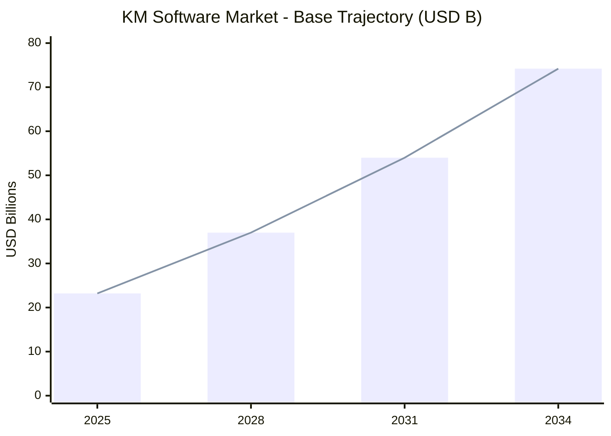
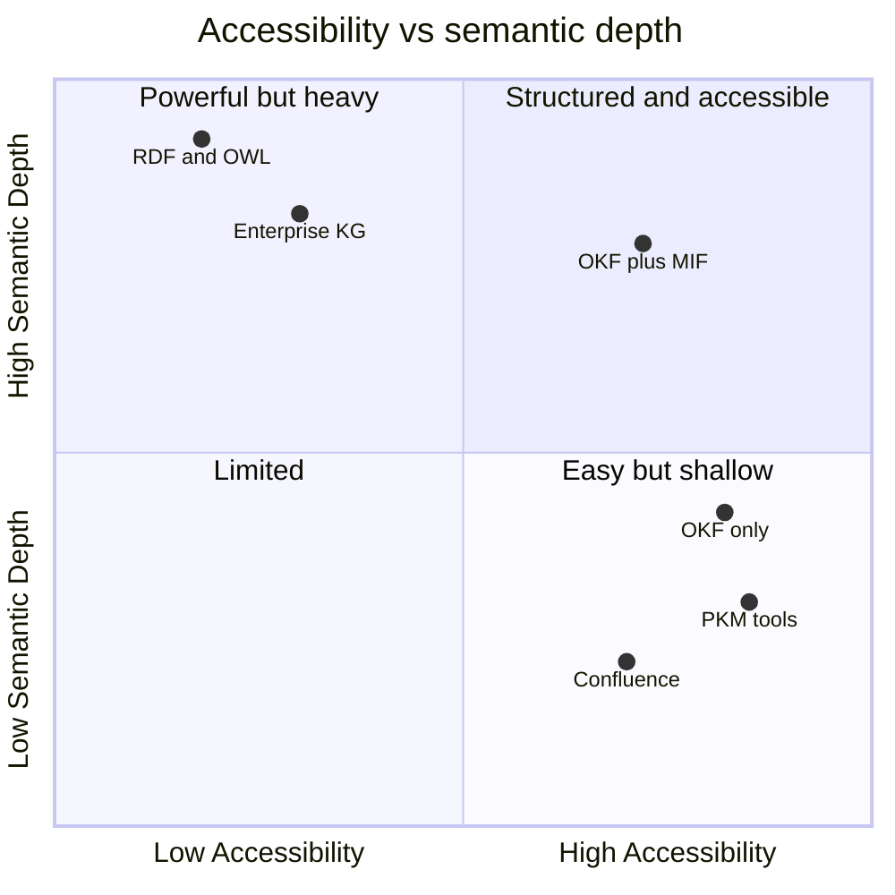

This market-research-report synthesis covers 36 surviving finding(s) across the research.

## Background & Objectives

This report assesses the market opportunity for a knowledge-spine offering that layers two complementary specifications: the Open Knowledge Format (OKF) for git-distributable packaging, and the Modeled Information Format (MIF) for typed relationships, first-class provenance, formal ontology, and temporal modeling. The commissioning question is direct: is there a viable, addressable market for an OKF+MIF knowledge spine, who would buy it, and on what terms?

### The commissioning context

Two events frame the timing. First, Google Cloud published OKF v0.1 on 12 June 2026, formalizing the "LLM wiki" pattern — a directory of markdown files with YAML frontmatter — into a vendor-neutral, Apache-2.0 specification whose only required field per concept is `type` (Google Cloud; MarkTechPost). The repository drew strong early practitioner interest, reaching roughly 5,400 stars and 400+ forks within weeks of launch (OKF launch coverage). Second, OKF is deliberately minimal: it omits typed relationships, formal ontology, schema enforcement, and structured provenance by design — precisely the layer a market-grade knowledge spine needs and precisely what MIF supplies.

A point of fact that shapes the entire commercial thesis: MIF is not a follower of OKF. MIF has been public since approximately February 2026 and reached v1.0.0 (Release Candidate, stabilized 2026-06-18), predating OKF v0.1. MIF's challenge is therefore one of distribution and adoption, not specification maturity — the spec is stabilized; the ecosystem and market presence are still being built (MIF momentum finding). OKF, by contrast, is genuinely a v0.1 starting point with no ecosystem yet.

### The business problem

Enterprises are deploying AI and LLM workflows faster than they can ground them in trustworthy, traceable knowledge. The resulting pain — hallucination, unauditable agent decisions, and institutional memory loss — is quantified and budgeted against. The open question for this study is whether that demand translates into demand for OKF specifically, and for the richer OKF+MIF combination in particular, rather than for structured-knowledge infrastructure generally.

### Research objectives

1. Size the addressable market and its growth trajectory.
2. Identify and characterize the buyer segments and their pain points.
3. Map the competitive landscape and locate the OKF+MIF position within it.
4. Surface pricing and business-model signals from adjacent markets.
5. Test the bull case against the disconfirming evidence — chiefly OKF's nascency and the enterprise shift toward SaaS.

### Scope and definitions

The market under study is the intersection of two converging segments: the broader knowledge-management (KM) software market and the narrower, faster-growing enterprise knowledge-graph (KG) market. OKF is treated as the packaging and distribution layer (markdown bundles, git-native, agent-readable). MIF is treated as the enrichment layer that adds machine-processable semantics on top. The offering under evaluation is the two layered together — "structured but accessible" knowledge infrastructure.

## Methodology

### Research design

This is a secondary-research (desk-research) study. The evidence base is a synthesis of 36 verified findings drawn from public sources — analyst market reports, vendor pricing pages, specification documents, and practitioner commentary — organized across four research dimensions: market, technical, landscape, and trajectory. No primary fieldwork (survey, panel, or interview programme) was commissioned; there is therefore no probability sample, no respondent base, and no response rate to report. This is a material limitation and is stated plainly here rather than buried: market-sizing and adoption claims rest on third-party analyst estimates, not on primary demand measurement.

### Sampling and source basis

In place of a respondent sample, the "sample" is the corpus of secondary sources behind the 36 findings (the full numbered source list appears in the Sources section). Sourcing was purposive rather than random: sources were selected to cover each research objective and to include disconfirming as well as confirming evidence. Where multiple analyst firms measure the same market on shared attributes, their estimates are presented as ranges rather than point figures, because cross-firm definitions differ (the enterprise knowledge-graph market, for example, varies two- to three-fold across firms).

### Instrument and fieldwork summary

The "instrument" is the finding schema each unit conforms to (claim, summary, citations, dimension, verdict). "Fieldwork" was conducted as desk research culminating on 28 June 2026 — 16 days after OKF's 12 June 2026 launch, a recency that is itself a limitation: OKF-specific adoption evidence is necessarily thin this early.

### The verification gate and how verdicts were handled

Every finding passed through a single adversarial falsification gate on 28 June 2026. Of the 36 findings, 31 survived, 5 were weakened, and none were falsified or left inconclusive. Handling rules:

- Falsified units would be excluded entirely. None were.
- Weakened units are retained but travel with an explicit caveat at the point of use and are registered in full in the Technical Appendix. Four of the five weakened findings are market statistics (two AI-agent-adoption figures, one SaaS build-vs-buy figure, and one AI-KM market-sizing figure); the fifth concerns the precise enumeration of MIF's relationship predicates. None of the weakened units undermines the central layering thesis.
- The MIF-version sub-claim was corrected against the authoritative in-repo specification (v1.0.0 RC, stabilized 2026-06-18, public since ~February 2026), superseding stale web sources that mis-dated MIF relative to OKF.

### Standards caveat (read before relying on conformance language)

This report follows the conventional structure of a market-research study (background and objectives, methodology, findings, conclusions, technical appendix). That structure is established practice, not a codified standard. ESOMAR/ICC is a professional ethics and conduct code, not a report-format mandate; this report does not claim conformance to an "ESOMAR standard," and any such claim should be read as a defect. ISO 20252 (market, opinion, and social research) is under active revision through 2024–2026, including AI-integration provisions; any reliance on a specific ISO 20252 edition should be verified against the current edition live at implementation time rather than treated as fixed here.

## Findings

The findings are organized by objective: demand drivers, market sizing, buyer segments, competitive positioning, pricing, the technical differentiation that underwrites the value proposition, the alternative-standards landscape, and the trajectory signals that bound the timing.

### Demand drivers: AI workflows, agent memory, and institutional memory loss

The single strongest demand driver is the AI/LLM workflow shift from static retrieval toward structured, grounded knowledge. Hallucination is the buyer pain: enterprise LLMs answer complex queries correctly only 16.7% of the time without knowledge-graph grounding, rising to 54.2% with it (Promethium, 2026), and domain-specific failure rates run far higher. GraphRAG — combining vector retrieval with graph traversal — is the production architecture catalyzing demand, forecast to represent about 31% of the enterprise knowledge-graph market in 2026 (Future Market Insights), with hybrid graph+vector systems showing roughly 3.4x accuracy gains over pure RAG on multi-hop reasoning (GraphRAG trajectory finding). The combination OKF+MIF offers — provenance ("why was this inferred"), typed relationships ("how entities connect"), and temporal versioning ("what changed and when") — is exactly what distinguishes a structured spine from raw document dumps.

> Caveat (weakened): one widely cited figure in this dimension — Gartner "80% of enterprise apps embedding an AI agent in Q1 2026, up from 33% in 2024" — is overstated. Gartner's own published prediction is 40% by 2026, up from under 5% in 2025. The directional claim (agentic AI adoption is rising fast and intensifies demand for auditable knowledge) holds; the specific 80% figure should not be asserted as firm.

Agent memory makes the case structurally. The hardest unsolved problems in 2026 AI agent memory are provenance tracking and temporal validity — systems scoring 92.5–94.4 on recall benchmarks still fail at "who asserted what, and when did it change" (agent-memory trajectory finding). That is precisely the gap MIF's provenance and bi-temporal layers target.

Institutional memory loss supplies the financial justification independent of AI hype. Knowledge loss costs Fortune 500 companies an estimated US$31.5B/year; the average U.S. enterprise loses about $4.5M/year to information silos; 42% of institutional knowledge resides solely with individual employees; and 48% of executives acknowledge employees take procedural knowledge with them on departure (Inc.; Iterators HQ; CAKE 2025). Existing wikis and document stores fail this pain because they capture knowledge without the timestamped, attributed, typed structure needed to keep it trustworthy over time — the exact failure modes OKF's required timestamp and MIF's provenance and temporal versioning address.

### Market sizing: a converging, double-digit-growth TAM

The addressable market spans two segments. The KM software market is estimated at roughly US$13–23B in 2025 depending on scope, with all credible analysts agreeing on double-digit CAGRs (Fortune Business Insights put it at $23.2B → $74.2B by 2034 at 13.8% CAGR; Straits Research at $13.43B → $62B by 2034 at 18.5% CAGR). The narrower, more directly comparable enterprise knowledge-graph market is smaller but faster — roughly $0.9–2.9B in 2025 at 20–33% CAGR (Future Market Insights; Grand View Research; Technavio). Together they define a TAM on the order of US$25–28B in 2025, projected toward US$80–90B by 2034.

Figure 1. Knowledge-management software market, base trajectory (USD billions), per Fortune Business Insights. Analyst scope differences mean the absolute level is a range, not a point estimate.

Against that TAM, the study's top-down framework estimates a SAM — organizations actively seeking open, format-neutral, git-distributable knowledge infrastructure (AI/ML teams, research-intensive enterprises, think tanks, academic groups) — at approximately 8–12% of the KM software market, or US$2–3.3B in 2025. A realistic 1–3 year obtainable share (SOM) for an open-source, git-native offering targeting the most technically sophisticated segment is on the order of US$20–60M, scaling to US$200–500M with commercial add-ons if the format achieves meaningful adoption. These SAM/SOM figures are analyst inference from reported segment breakdowns, at medium confidence, and assume OKF reaches meaningful community adoption within 18–24 months of launch.

### Buyer segments and pain points

Five buyer segments map to distinct pains and willingness-to-pay. The table compares them on the shared attributes that matter to a go-to-market decision.

| Segment | Primary pain | Willingness to pay | Notes |
| --- | --- | --- | --- |
| AI/ML teams (large enterprise) | LLM hallucination blocks production; vector/RAG lacks provenance and typed links | High | Funds the enterprise-KG segment ($0.9–2.9B, 2025) |
| Knowledge-engineering teams (CDOs, data architects) | Silos across 5+ platforms; 47% spend 1–5 hrs/day searching | High | IT/telecom = 38.7% of KM adoption; finance/health/legal value auditability |
| Research organizations | Citation/provenance tracking; FAIR funder mandates | Moderate | Cost-sensitive but mandate-driven |
| Think tanks / policy orgs | Institutional memory loss across staff turnover | Low–moderate | Budget-constrained, existential memory risk |
| Developer / platform teams | Abandoned wikis; need version-controlled, diffable, machine-readable docs | Low individually, high at enterprise scale | OKF's named target (DevOps/SRE) |

Cross-segment, large enterprises represent about 46% of KM software revenue (Fortune Business Insights), AI integration is now prioritized by 41% of KM leaders, and the enterprise search market alone reached $6.83B in 2025 (CAKE; Fortune Business Insights).

> Caveat (weakened): the buyer-segment evidence reuses the overstated Gartner 80%/Q1-2026 AI-agent figure. The segmentation and its pain profiles do not depend on that figure; treat the 80% as illustrative-but-unverified, per Gartner's own 40%-by-2026 number.

### Competitive positioning

OKF+MIF sits between two established categories, each leaving a distinct gap. Personal/team KM tools (Notion, Obsidian, Confluence, Roam, Logseq) dominate on usability but lack typed relationships, formal ontology, and first-class provenance. Enterprise knowledge-graph platforms (Neo4j, Stardog, Amazon Neptune, Azure) provide formal semantics but demand RDF/SPARQL expertise, triple-store infrastructure, and roughly 1 FTE per 50–100 entity types of ongoing governance (Promethium, 2026), and they are not git-native. OKF+MIF's differentiated position is "structured but accessible": more semantically rich than markdown wikis, more open and git-distributable than proprietary graph databases.

Figure 2. Competitive positioning by accessibility (ease of adoption, git-native, human-readable) versus semantic depth (typed relationships, provenance, ontology). OKF+MIF targets the high-accessibility, high-depth quadrant that incumbents leave open.

The counter-consideration is ecosystem depth: OKF is v0.1 with no producer libraries, consumer integrations, or governance tooling yet, while Notion and Confluence carry mature ecosystems, SSO, and compliance certifications. An OKF+MIF offering competes on format merit before ecosystem depth — a slower value-capture path.

### Pricing and business-model signals

Adjacent markets reveal a consistent architecture: an open-source format core with commercial enterprise tiers. The table calibrates willingness-to-pay across comparators on shared attributes.

| Tier / comparator | Representative pricing | What it implies for OKF+MIF |
| --- | --- | --- |
| Enterprise KG platforms (Neo4j, Stardog, Neptune) | $15K–25K/yr small, $100K+/yr large; AuraDB $65–146/GB/mo | Upper bound; enterprise accepts high TCO for structure |
| Personal/team KM (Notion, Roam, Obsidian, Logseq) | $5–16/user/mo; Obsidian $50/user/yr commercial | Price floor for unenriched formats |
| AI-native KM / enterprise search (Glean, GoSearch, MS Search) | ~$15–30/user/mo enterprise | The tier a provenance-backed spine would target |

The inferred model: open-source, MIT-licensed core (OKF format + MIF schema layer + CLI) to drive adoption; a commercial enterprise tier (hosted sync, provenance audit dashboards, SSO/SAML, SOC 2/HIPAA, support) at roughly $15–25/user/month or $20K–100K/year; and a usage-priced platform/API tier for serving bundles to agents. This mirrors Neo4j (Community + Enterprise), Obsidian (free + commercial + sync), and Logseq (free + Sync).

> Caveat (weakened): the AI-driven-KM sizing used as a growth comparator ("US$7.71B in 2025 at 47.2% YoY") traces to The Business Research Company, not GoSearch as originally attributed, and cross-firm AI-KM estimates vary widely with growth rates that do not reconcile. Use it as a directional signal of a fast-growing AI-KM tier, not a firm figure.

### Technical differentiation: what MIF adds to OKF, and why it is the value-add

The value proposition rests on a concrete extension seam. OKF v0.1 represents knowledge as markdown files with YAML frontmatter whose only required field is `type`; relationships are plain markdown hyperlinks whose meaning lives only in surrounding prose (untyped), and provenance is handled by optional prose conventions (`log.md`, a `#Citations` section) that are not machine-processable. Critically, OKF mandates that consumers preserve unknown frontmatter keys — the permissive extension mechanism that lets MIF inject structured fields without breaking OKF consumers (layering-mechanics finding).

On that seam MIF adds four machine-processable layers absent from OKF: typed relationship edges with optional strength; a first-class, W3C-PROV-O-compatible provenance object (sourceType enum, numeric confidence, trustLevel); a formal ontology/EntityReference system for domain typing; and bi-temporal tracking with TTL and configurable decay models that OKF's single `timestamp` cannot express. The agent-memory evidence above confirms these are not speculative niceties — provenance and temporal validity are the field's hard open problems.

> Caveat (weakened): the finding enumerating MIF's relationship predicates overstated the native core set. The canonical MIF core relationship types are relates-to, derived-from, supersedes, conflicts-with, part-of, implements, uses, created-by, and mentioned-in; some predicates the finding listed as core (supports, contradicts, refines, depends-on, updates) are permitted as custom namespaced types, not core. The thesis — MIF supplies typed, directed, strength-bearing edges that OKF's untyped prose links lack — is unaffected; only the precise core enumeration is narrowed.

### The alternative-standards landscape

The spine is not unprecedented; each adjacent standard solves part of the problem and clarifies where OKF+MIF is differentiated rather than redundant. RDF/OWL delivers complete typed semantics and formal ontologies but at authoring and tooling costs that erase OKF's accessibility advantage. PROV-O covers the same provenance semantics as MIF but requires the full RDF toolchain; MIF delivers PROV-O-compatible provenance at plain-JSON authoring cost. SKOS publishes taxonomies as linked data but omits provenance and cannot sub-type relationships. JSON-LD/YAML-LD provide the `@context` typing mechanism but no markdown packaging. schema.org offers a ~800-type web vocabulary optimized for search engines, not git-distributable knowledge packaging. Frictionless Data Packages (Open Knowledge Foundation — distinct from Google's OKF) elegantly package tabular datasets with shallow provenance but carry no concept model or typed relationships. Personal-KM tools (Obsidian, Logseq, Roam) use the same untyped wiki-link pattern OKF formalizes, without provenance or ontology. Across all of them, the recurring gap is the same: typed relationships plus first-class provenance at low authoring cost — the OKF+MIF combination's reason to exist.

### Trajectory signals: timing and momentum

The directional signals are favorable but unproven for OKF specifically. Git-native markdown KM is a real movement — Obsidian reports 1.5M+ users growing ~22% YoY — and Andrej Karpathy's April 2026 "LLM wiki" gist (5,000+ stars, dozens of implementations) validated the exact pattern OKF formalizes. The enterprise KG market reached production maturity in 2024–2025 with Gartner predicting 50%+ of AI-agent systems will use context graphs by 2028, and W3C's RDF 1.2 / RDF-star work signals standards momentum toward provenance qualification. The cautionary map is the Semantic Web's adoption failure: technically superior since the early 2000s, it lost on complexity and misaligned developer incentives, while minimal, practical schema.org succeeded — a direct argument for OKF's minimalism and for keeping MIF's enrichment low-friction. OKF's own launch momentum (5,440 stars, 416 forks within weeks) reflects strong interest but also Google-name novelty. MIF, public since ~February 2026 and stabilized at v1.0.0, is differentiated and ahead of OKF on spec maturity; its constraint is distribution and adoption, not the specification.

## Conclusions & Recommendations

### What the evidence establishes

The demand for structured, provenance-backed knowledge infrastructure is real, quantified, and growing at double-digit rates across both the KM software market and the faster-growing enterprise knowledge-graph segment. The pains an OKF+MIF spine addresses — AI hallucination without grounding, unauditable agent decisions, and institutional memory loss — are documented in dollars and map cleanly to five identifiable buyer segments. Technically, OKF's permissive extension seam makes the MIF layer mechanically feasible, and MIF's provenance and temporal capabilities target exactly the hard open problems of 2026 agent memory. On a TAM of roughly US$25–28B (2025), a defensible SAM of US$2–3.3B and a 1–3 year SOM of US$20–60M (scaling with commercial add-ons) is supportable at low single-digit share.

### Where the evidence is thin, and what the decision turns on

The decision does not turn on whether structured-knowledge demand exists — it does — but on whether that demand attaches to OKF specifically and to the OKF+MIF combination in particular. Three constraints temper the bull case. First, OKF is genuinely nascent (v0.1, no producer libraries, consumer integrations, or governance tooling, no enterprise adoption record), and format adoption is historically slow and network-effect-dependent; the Semantic Web is the cautionary precedent. Second, the broader enterprise market is shifting toward SaaS and buying rather than building, narrowing the open-format opportunity to a developer/research/privacy-sensitive niche (this rests on a weakened a16z figure — see caveat). Third, OKF's minimalism may be the buyer preference rather than a gap, in which case MIF's enrichment must be opt-in and low-friction or it risks being a solution without a segment. MIF's own position is the inverse of OKF's: its spec is mature (v1.0.0, stabilized 2026-06-18, public since ~February 2026, ahead of OKF), so its risk is distribution and adoption, not specification readiness.

### Recommendations

1. Lead with the niche, not the enterprise. Target the developer/platform, research, and AI/ML segments first, where git-native, open-format workflows are already the default and willingness to adopt on format merit is highest. Defer broad enterprise pursuit until ecosystem depth exists. (Traces to the buyer-segment, competitive-positioning, and open-source-vs-SaaS evidence.)

2. Position MIF's value-add on the agent-memory problem. Provenance and temporal validity are the field's hardest unsolved problems; lead the MIF pitch there rather than on relationship taxonomy breadth. Keep enrichment opt-in over OKF's preserved-unknown-keys seam so OKF minimalists are never forced to pay a schema tax. (Traces to the agent-memory, layering-mechanics, and provenance/temporal findings.)

3. Adopt the open-core business model. Ship an MIT-licensed core (OKF format + MIF schema + CLI) to seed adoption; monetize a commercial enterprise tier (hosted sync, provenance audit dashboards, SSO/SAML, SOC 2/HIPAA, support) at roughly $15–25/user/month or $20K–100K/year, plus a usage-priced agent-serving API. This mirrors Neo4j, Obsidian, and Logseq. (Traces to the pricing and open-source-vs-commercial findings; note the weakened AI-KM sizing comparator.)

4. Treat OKF adoption as the gating milestone. Make the go/no-go for heavier investment contingent on OKF demonstrating ecosystem traction (producer libraries, agent-framework integrations) within an 18–24 month window. Until then, compete on format merit and keep MIF's differentiation visible but inexpensive. (Traces to the OKF-nascency and trajectory findings.)

5. Hold the line on honest market claims. The four weakened market statistics (two AI-agent-adoption figures, one SaaS build-vs-buy figure, one AI-KM sizing figure) must not be repeated as firm in any sales or fundraising material; use the corrected or ranged figures. Overstated demand numbers are a credibility liability in exactly the audiences this offering must win.

## Technical Appendix

### Methodology detail

This study is secondary research. The evidence base is 36 findings synthesized from public secondary sources and organized across four dimensions (market, technical, landscape, trajectory). There was no primary fieldwork: no questionnaire, no respondent panel, no probability sample, and therefore no response or completion rate. Market-sizing figures are third-party analyst estimates; where firms differ on the same market, the report presents ranges rather than reconciled point values. Sourcing was purposive, selected to cover each objective and to include disconfirming evidence (notably the OKF-nascency finding). Desk research culminated on 28 June 2026.

### Data-quality and limitations notes

- Recency limitation: research concluded 16 days after OKF v0.1's 12 June 2026 launch, so OKF-specific adoption evidence is necessarily thin and forward-looking.
- Definitional variance: the enterprise knowledge-graph market varies two- to three-fold across analyst firms; KM software market scope differs between pure-play KM and broader collaboration platforms. All cited CAGRs are double-digit, but absolute levels should be read as ranges.
- Inference layers: SAM and SOM are analyst inference from reported segment breakdowns, not measured demand; confidence is medium.
- No primary demand measurement: the study cannot confirm OKF-specific or OKF+MIF-specific willingness to pay; it infers it from adjacent-market behavior.

### Register of weakened findings (verification verdicts carried, not dropped)

All five weakened findings are retained with caveats; none was falsified. They are:

| Weakened finding | What was overstated | Corrected / safe reading |
| --- | --- | --- |
| AI demand for structured provenance | Gartner "80% of enterprise apps embed an AI agent in Q1 2026, from 33% in 2024" | Gartner's own figure is 40% by 2026, up from under 5% in 2025; trend holds, magnitude does not |
| Buyer segments and pain points | Reuses the same Gartner 80% figure | Segmentation is independent of it; treat 80% as illustrative-only |
| Open-source vs commercial | a16z "76% SaaS in 2025, from 50/50 in 2024" | The a16z source substantiates only a qualitative shift to buying, not the specific 76%/50-50 split |
| Pricing and business-model signals | AI-KM market "US$7.71B 2025 at 47.2% YoY" attributed to GoSearch | Figure traces to The Business Research Company; cross-firm AI-KM sizing varies and growth rates do not reconcile; directional only |
| MIF typed relationships | Listed 9 predicates as MIF-native structural core | Only relates-to, derived-from, supersedes, part-of are core; the other named predicates are permitted as custom namespaced types — a narrowing, not a contradiction |

### Standards and conformance notes (ISO 20252 / ESOMAR)

This report uses the conventional market-research report structure as a practice convention, not a codified standard. It does not claim ESOMAR conformance; ESOMAR/ICC is an ethics and conduct code, not a format mandate, and any conformance claim would be a defect. ISO 20252 is under active revision (2024–2026), including AI-integration provisions; verify the current edition live at implementation time before asserting alignment to any specific edition. The single quality gate applied here is the adversarial falsification gate (one pass, ordinal verdicts), not a sampling-and-weighting quality regime — appropriate to secondary research, but not a substitute for primary-research quality controls.

### Source list

The complete, deduplicated list of underlying sources — analyst market reports, vendor pricing pages, specification documents, and practitioner commentary — is enumerated in the Sources section that follows. Each underlying finding carries its own citations with mandatory URLs at MIF Level 3; named sources are cited author-date in the body text above.

## Sources

- [a16z 'How 100 Enterprise CIOs Are Building and Buying Gen AI in 2025' - source does not substantiate the specific 76%/50-50 build-vs-buy figure on inspection (only a qualitative shift-to-buying)](<https://a16z.com/ai-enterprise-2025/>)
- [JSON-LD Schema Markup for AI Discoverability: Technical Guide 2026 - AgentVisibility.ai](<https://agentvisibility.ai/insights/json-ld-schema-ai-discoverability>)
- [Governing Evolving Memory in LLM Agents: Risks, Mechanisms, and the SSGM Framework — arXiv](<https://arxiv.org/html/2603.11768v1>)
- [A Decade of Scholarly Research on Open Knowledge Graphs - Research community KG adoption (arXiv)](<https://arxiv.org/pdf/2306.13186>)
- [OWL Reasoners still useable in 2023 (arXiv)](<https://arxiv.org/pdf/2309.06888>)
- [Semantic Web: Past, Present, and Future — arXiv 2412.17159](<https://arxiv.org/pdf/2412.17159>)
- [Semantic Web and Software Agents — A Forgotten Wave of Artificial Intelligence? arXiv 2503.20793](<https://arxiv.org/pdf/2503.20793>)
- [PROV-AGENT: Unified Provenance for Tracking AI Agent Interactions in Agentic Workflows (arXiv)](<https://arxiv.org/pdf/2508.02866>)
- [Gartner on Context Graphs: Trends, Capabilities, Setup in 2026 — Atlan](<https://atlan.com/know/gartner-context-graphs/>)
- [Ontology vs. Semantic Layer: Differences and schema.org limitations — Atlan](<https://atlan.com/know/ontology-vs-semantic-layer/>)
- [RDF vs OWL: Key Differences, Use Cases and Examples Explained - Atlan](<https://atlan.com/know/rdf-vs-owl/>)
- [Stardog Enterprise Knowledge Graph Platform Pricing (AWS Marketplace)](<https://aws.amazon.com/marketplace/pp/prodview-ulfm6fel7xgjq>)
- [Frictionless Data and FAIR Research Principles - Open Knowledge Foundation Blog](<https://blog.okfn.org/2018/08/14/frictionless-data-and-fair-research-principles/>)
- [Knowledge Management Statistics and Trends in 2025 - Worker productivity costs (CAKE)](<https://cake.com/blog/knowledge-management-statistics/>)
- [How the Open Knowledge Format can improve data sharing — Google Cloud Blog](<https://cloud.google.com/blog/products/data-analytics/how-the-open-knowledge-format-can-improve-data-sharing>)
- [Ontologies, Context Graphs, and Semantic Layers: What AI Actually Needs in 2026](<https://contextandchaos.substack.com/p/ontologies-context-graphs-and-semantic>)
- [Knowledge Management and Dissemination for Think Tanks (DataCalculus)](<https://datacalculus.com/en/blog/think-tanks/program-director/knowledge-management-and-dissemination-for-think-tanks>)
- [Personal Knowledge Management Software Market Research Report 2034 — DataIntelo](<https://dataintelo.com/report/personal-knowledge-management-software-market>)
- [Lessons Learned from the Combined Development of OWL and SHACL — ACM K-CAP 2025](<https://dl.acm.org/doi/full/10.1145/3731443.3771340>)
- [Top Knowledge Management Trends 2026 - Semantic layers and enterprise AI (Enterprise Knowledge)](<https://enterprise-knowledge.com/top-knowledge-management-trends-2026/>)
- [LLM Wiki — Karpathy GitHub Gist (April 2026)](<https://gist.github.com/karpathy/442a6bf555914893e9891c11519de94f>)
- [OKF SPEC.md — GoogleCloudPlatform/knowledge-catalog](<https://github.com/GoogleCloudPlatform/knowledge-catalog/blob/main/okf/SPEC.md>)
- [Frictionless Data Package — GitHub frictionlessdata/datapackage](<https://github.com/frictionlessdata/datapackage>)
- [MIF v1.0 — GitHub zircote/MIF](<https://github.com/zircote/MIF>)
- [Open Knowledge Format (OKF) — Official Grounding Page](<https://groundingpage.com/facts/open-knowledge-format/>)
- [JSON-LD - JSON for Linked Data (Official Site)](<https://json-ld.org/>)
- [Google Cloud Launches Open Knowledge Format Standard - sober adoption assessment (Let's Data Science)](<https://letsdatascience.com/news/google-cloud-launches-open-knowledge-format-standard-b9480a66>)
- [From LLMs to Knowledge Graphs: Building Production-Ready Graph Systems in 2025 — Medium](<https://medium.com/@claudiubranzan/from-llms-to-knowledge-graphs-building-production-ready-graph-systems-in-2025-2b4aff1ec99a>)
- [Beyond OWL: Reconsidering Ontologies in the Age of AI and the Semantic Web](<https://medium.com/@nfigay/beyond-owl-reconsidering-ontologies-in-the-age-of-ai-and-the-semantic-web-4059b519f23d>)
- [Open-Sourcing the Knowledge Graph Studio under MIT license (Medium/Enterprise RAG)](<https://medium.com/enterprise-rag/open-sourcing-the-whyhow-knowledge-graph-studio-powered-by-nosql-edce283fb341>)
- [State of AI Agent Memory 2026: Benchmarks, Architectures & Production Gaps — Mem0](<https://mem0.ai/blog/state-of-ai-agent-memory-2026>)
- [MIF Schema Reference — mif-spec.dev](<https://mif-spec.dev/>)
- [MIF relationship types (mif-spec.dev) - the core vocabulary is relates-to/derived-from/supersedes/conflicts-with/part-of/implements/uses/created-by/mentioned-in; supports/contradicts/refines/depends-on/updates are not MIF-native core, only custom namespaced](<https://mif-spec.dev/specification/relationship-types/>)
- [Open-Source vs SaaS Agent Platforms: Pros & Cons for Enterprises (OneReach.ai)](<https://onereach.ai/blog/open-source-frameworks-vs-saas-agent-platforms/>)
- [Enterprise Knowledge Graph Buyer's Guide 2026 - Pricing and ROI signals (Promethium)](<https://promethium.ai/guides/enterprise-knowledge-graph-buyers-guide-2026/>)
- [Graph RAG Guide 2025: Architecture, Implementation & ROI — Salfati Group](<https://salfati.group/topics/graph-rag>)
- [Obsidian Complete Guide: The Ultimate Markdown Editor for Knowledge Management Revolution 2025 — SmartScope](<https://smartscope.blog/en/obsidian-complete-guide/>)
- [Obsidian vs Logseq 2026: Which PKM Tool Wins? - SoftPicker](<https://softpicker.com/obsidian-vs-logseq/>)
- [Frictionless Data Specifications - Official Home](<https://specs.frictionlessdata.io/>)
- [Frictionless Data Package Specification — specs.frictionlessdata.io](<https://specs.frictionlessdata.io/data-package/>)
- [State of Open Data 2025 - FAIR data and open science trends](<https://stateofopendata.com/>)
- [Knowledge Management Software Market Size, Share, Growth, 2034 (Straits Research)](<https://straitsresearch.com/report/knowledge-management-software-market>)
- [AI Hallucination Statistics 2026: 50+ Sourced Data Points (Suprmind)](<https://suprmind.ai/hub/insights/ai-hallucination-statistics-research-report-2026/>)
- [Bi-temporal memory for AI coding agents — git-pinned context that survives context compaction](<https://sverklo.com/blog/bi-temporal-memory-for-ai-agents/>)
- [Google Launches a Universal Format for Karpathy's LLM Wiki — Techstrong.ai](<https://techstrong.ai/articles/google-launches-a-universal-format-for-karpathys-llm-wiki/>)
- [Google Just Standardized Karpathy's LLM Wiki Pattern — The Menon Lab](<https://themenonlab.blog/blog/google-okf-open-knowledge-format-karpathy-llm-wiki-standard>)
- [Obsidian Pricing 2026: Plans, Hidden Costs & Cheaper Alternatives (ToolRadar)](<https://toolradar.com/tools/obsidian/pricing>)
- [Agent-to-agent audit trail: provenance for AI ecosystems (TrueScreen)](<https://truescreen.io/articles/agent-to-agent-audit-trail/>)
- [Personal Knowledge Graphs in Obsidian - Volodymyr Pavlyshyn, Medium](<https://volodymyrpavlyshyn.medium.com/personal-knowledge-graphs-in-obsidian-528a0f4584b9>)
- [Why Bad Knowledge Management Is Killing Your Profits (WikiTeq)](<https://wikiteq.com/post/hidden-costs-poor-knowledge-management>)
- [2026 Enterprise AI Knowledge Management: AI-native KM market size (Windows Forum/GoSearch)](<https://windowsforum.com/threads/2026-enterprise-ai-knowledge-management-from-search-to-governed-agent-workflows.410816/>)
- [Open Knowledge Format (OKF) Complete 2026 Guide - ecosystem gaps identified (WitsCode)](<https://witscode.com/open-knowledge-format>)
- [AI-Ready Enterprise Knowledge Graph Market to Reach USD 6,550.0 Million by 2036 (AccessNewswire/FMI)](<https://www.accessnewswire.com/newsroom/en/business-and-professional-services/ai-ready-enterprise-knowledge-graph-market-to-reach-usd-6-550.0-1167718>)
- [Knowledge Management Software Market Size, Industry Share | Forecast 2034 (Fortune Business Insights)](<https://www.fortunebusinessinsights.com/knowledge-management-software-market-110376>)
- [Gartner Predicts 40% of Enterprise Apps Will Feature Task-Specific AI Agents by 2026, Up from Less Than 5% in 2025 (Gartner Newsroom)](<https://www.gartner.com/en/newsroom/press-releases/2025-08-26-gartner-predicts-40-percent-of-enterprise-apps-will-feature-task-specific-ai-agents-by-2026-up-from-less-than-5-percent-in-2025>)
- [Enterprise Knowledge Graph Market Industry Report 2033 — Grand View Research](<https://www.grandviewresearch.com/industry-analysis/enterprise-knowledge-graph-market-report>)
- [The Cost and Consequence of Institutional Memory Drain (Inc. Magazine)](<https://www.inc.com/bethmaser/the-cost-and-consequence-of-institutional-memory-drain/91178504>)
- [Simple Knowledge Organization System (SKOS) — ISKO Encyclopedia of KO](<https://www.isko.org/cyclo/skos.htm>)
- [Cost of Organizational Knowledge Loss and Countermeasures (Iterators HQ)](<https://www.iteratorshq.com/blog/cost-of-organizational-knowledge-loss-and-countermeasures/>)
- [Why AI Hallucinates in Your Enterprise (and how Context Graphs Fix it) - Kamiwaza](<https://www.kamiwaza.ai/insights/why-ai-hallucinates-in-your-enterprise>)
- [Knowledge Graph Market Worth $9.88 Billion by 2032 — MarketsandMarkets](<https://www.marketsandmarkets.com/PressReleases/knowledge-graph.asp>)
- [Google Cloud Introduces Open Knowledge Format (OKF) — MarkTechPost](<https://www.marktechpost.com/2026/06/16/google-cloud-introduces-open-knowledge-format-okf-a-vendor-neutral-markdown-spec-for-giving-ai-agents-curated-context/>)
- [Knowledge Graph vs Vector Database for RAG: Which Is Best? — Meilisearch](<https://www.meilisearch.com/blog/knowledge-graph-vs-vector-database-for-rag>)
- [GraphRAG: Unlocking LLM Discovery on Narrative Private Data — Microsoft Research Blog](<https://www.microsoft.com/en-us/research/blog/graphrag-unlocking-llm-discovery-on-narrative-private-data/>)
- [Project GraphRAG — Microsoft Research](<https://www.microsoft.com/en-us/research/project/graphrag/>)
- [A Semantic Approach to Mapping the Provenance Ontology to Basic Formal Ontology — Scientific Data](<https://www.nature.com/articles/s41597-025-04580-1>)
- [Notion vs Obsidian - minimalism as user preference (NotionApps)](<https://www.notionapps.com/blog/notion-vs-obsidian-knowledge-productivity-2025>)
- [The Semantic Web: 20 Years and a Handful of Enterprise Knowledge Graphs Later — Ontotext](<https://www.ontotext.com/blog/the-semantic-web-20-years-later/>)
- [Notion vs Obsidian vs Roam Research 2025: Best Note-Taking App for Productivity](<https://www.primeproductiv4.com/blog-articles/notion-vs-obsidian-vs-roam-research-productivity-comparison>)
- [History of Obsidian: Second Brain to AI Knowledge OS — Taskade Blog](<https://www.taskade.com/blog/obsidian-history>)
- [AI-Driven Knowledge Management System Market Report (The Business Research Company) - the '$7.71B 2025 / 47.2%' figure traces here, not to GoSearch; cross-firm AI-KM sizing varies widely and the finding's two growth rates do not reconcile](<https://www.thebusinessresearchcompany.com/report/ai-driven-knowledge-management-system-global-market-report>)
- [Neo4j Software Pricing & Plans 2026 (Vendr)](<https://www.vendr.com/marketplace/neo4j>)
- [SKOS Simple Knowledge Organization System - W3C Home Page](<https://www.w3.org/2004/02/skos/>)
- [RDF & SPARQL Working Group Charter — W3C (April 2025)](<https://www.w3.org/2025/04/rdf-star-wg-charter.html>)
- [JSON-LD 1.1 — W3C Recommendation](<https://www.w3.org/TR/json-ld11/>)
- [PROV-O: The PROV Ontology - W3C Recommendation](<https://www.w3.org/TR/prov-o/>)
- [PROV-Overview — W3C](<https://www.w3.org/TR/prov-overview/>)
- [SKOS Simple Knowledge Organization System Primer - W3C Recommendation](<https://www.w3.org/TR/skos-primer/>)
- [SKOS Simple Knowledge Organization System Reference — W3C](<https://www.w3.org/TR/skos-reference/>)
- [Ontologies and Knowledge Graphs in Industry Community Group — W3C](<https://www.w3.org/community/oki/>)
- [YAML-LD — W3C CG Final Report, December 2023](<https://www.w3.org/community/reports/json-ld/CG-FINAL-yaml-ld-20231206/>)
- [The PROV-JSONLD Serialization - W3C Member Submission 2024](<https://www.w3.org/submissions/2024/SUBM-prov-jsonld-20240825/>)
- [Introducing MIF: Memory Interchange Format — zircote.com (February 2026)](<https://zircote.com/blog/2026/02/introducing-mif-memory-interchange-format/>)
- [AI Agent Memory Architectures: From Context Windows to Persistent Knowledge — Zylos Research](<https://zylos.ai/research/2026-04-05-ai-agent-memory-architectures-persistent-knowledge/>)
