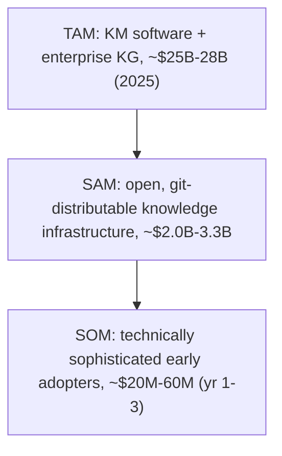

This market-sizing synthesis covers 36 surviving finding(s) across the research.

## Market Sizing Summary

The opportunity for a structured knowledge-spine offering — OKF supplying the open packaging and distribution layer, MIF supplying typed relationships, provenance, and ontology on top — sits at the convergence of two analyst-tracked segments: the broad knowledge-management (KM) software market and the faster-growing enterprise knowledge-graph market.

| Metric | Value (2025) | 2034 Outlook | Growth | Trend |
| --- | --- | --- | --- | --- |
| TAM | $25B-28B | $80B-90B | ~14-18% CAGR (blended) | INC |
| SAM | $2.0B-3.3B | $9B-13B | ~14-18% CAGR | INC |
| SOM | $20M-60M | $200M-500M | adoption-gated | INC |

All figures are reported as ranges, not point estimates. The underlying KM and enterprise-knowledge-graph sizings vary 2-3x across analyst firms, and several supporting demand statistics were weakened under adversarial review (see Confidence Level). Treat the bands — not their endpoints — as the finding.

## Methodology

This sizing uses a Top-Down methodology augmented with trend analysis. Published analyst market sizes for the two adjacent segments are taken as the starting universe, a target-segment percentage is applied to derive the serviceable market, and a near-term capture share yields the obtainable market. Top-Down is the appropriate choice here because OKF+MIF has no pricing history, unit economics, or customer base to support a bottom-up model — the format is pre-distribution. Where the segment data carries growth forecasts, those CAGRs are folded into the 2034 outlook rather than treated as static.

## TAM Calculation

The total addressable market is the union of the two segments an OKF+MIF spine could serve.

Knowledge-management software: Fortune Business Insights sizes the global KM software market at $23.2B in 2025, growing to $74.2B by 2034 (13.8% CAGR); Straits Research puts the 2025 baseline lower at $13.43B, reaching $62B by 2034 (18.5% CAGR). The spread reflects scope (pure-play KM versus broader knowledge-collaboration platforms); credible firms agree on the double-digit CAGR and the INC trend, not on the absolute base.

Enterprise knowledge graph: the more directly comparable segment is smaller but faster-growing. Future Market Insights values the AI-ready enterprise knowledge-graph slice at $890M in 2025 (20.1% CAGR to $6.55B by 2036); Grand View Research sizes the broader enterprise knowledge-graph market at $2.89B in 2025, reaching $13.4B by 2033 (21.3% CAGR); Technavio forecasts a 33.4% CAGR for 2025-2030. The 2-3x variation across firms is definitional, so the segment is carried as a $0.9B-2.9B band.

Combining the two segments gives a TAM of roughly $25B-28B in 2025, projected to $80B-90B by 2034 at a blended low-to-high-teens CAGR. The trend is unambiguously INC, propelled by AI grounding demand rather than legacy KM growth (which ran at 3-5% before AI tailwinds).

## SAM Derivation

The serviceable available market narrows the TAM to organizations that actually want open, format-neutral, git-distributable knowledge infrastructure rather than a proprietary SaaS wiki or a heavyweight graph database. These are AI/ML teams needing LLM grounding, enterprise knowledge-engineering teams building semantic layers, research organizations and think tanks with provenance and citation requirements, and developer or platform teams replacing fragmented wikis with versioned, git-native docs.

This segment is estimated at 8-12% of the broader KM software market, or about $2.0B-3.3B in 2025. The narrowing deliberately excludes the large installed base locked into Confluence, SharePoint, and Notion that has no format-migration impetus; only organizations with active AI or research-infrastructure initiatives are treated as reachable near-term. The open-format niche is real but bounded: enterprise AI buyers have skewed heavily toward SaaS, while the open and on-premises preference concentrates among developer, research, and privacy-sensitive buyers — the exact segment OKF+MIF targets.

## SOM Justification

The serviceable obtainable market is the realistic 1-3 year capture for an open-source format targeting the most technically sophisticated end of the SAM — research orgs, AI teams inside large enterprises, and developer-led knowledge-infrastructure builders. With git-native, open-source distribution, near-term obtainable revenue is on the order of $20M-60M, scaling toward $200M-500M only if the format achieves meaningful adoption and is monetized through commercial add-ons (governance, hosting, audit) layered on a free format core.

Two structural facts set this share. First, positioning: OKF+MIF occupies the gap between personal KM tools (Notion, Obsidian, Confluence) that lack provenance and typed relationships, and enterprise knowledge-graph platforms (Neo4j, Stardog) that demand heavy engineering — the structured-but-accessible middle. Second, monetization precedent: adjacent open-core knowledge-infrastructure markets pair a free format with paid enterprise tiers, where self-managed knowledge-graph platforms command $15K-100K+ per year. The SOM is adoption-gated rather than demand-gated, which is why it is expressed as a wide band.

## Scenarios

Because the obtainable share turns almost entirely on adoption rather than on market size, the scenario spread is driven by whether OKF reaches critical mass and whether MIF's richer layer finds a distinct buyer above OKF's minimalism.

| Scenario | TAM (2025) | SAM (2025) | SOM (yr 1-3) | Driver |
| --- | --- | --- | --- | --- |
| Bear | $25B | $2.0B | $20M | OKF stays a Google-ecosystem pattern; MIF's layer finds no segment that wants it beyond the minimal format |
| Base | $26B | $2.6B | $60M | OKF gains community traction over 18-24 months; MIF differentiates upmarket deployments |
| Bull | $28B | $3.3B | $300M | OKF becomes a de facto packaging standard; MIF captures the provenance and ontology layer with commercial add-ons |

Bear < Base < Bull holds for every metric. The dominant swing factor is OKF adoption, not the size of the underlying KM or knowledge-graph markets.

## Key Assumptions

1. The SAM excludes organizations locked into Confluence, SharePoint, and Notion that lack a format-migration impetus; only organizations with active AI or research-infrastructure initiatives are counted as reachable near-term.
2. The SOM assumes OKF reaches meaningful community adoption within 18-24 months of its 12 June 2026 v0.1 launch, and that MIF's richer provenance, typed-relationship, and ontology layer differentiates upmarket deployments above OKF-only ones.
3. AI-driven demand (GraphRAG, agentic-AI grounding) is the primary growth accelerant; the legacy KM market grew only 3-5% per year before AI tailwinds, so the double-digit CAGRs depend on the AI thesis holding.
4. Format maturity is not the binding constraint: MIF is already a stabilized v1.0.0 specification (Released, stabilized 18 June 2026, public since early 2026) that predates OKF v0.1 — the open risk is distribution and adoption, not spec readiness.
5. The financial justification for buyers is the quantified cost of lost institutional knowledge, which the spine's provenance and temporal-versioning capabilities directly address.

## Data Sources

The sizing rests on multiple independent analyst firms rather than a single source. KM software figures come from Fortune Business Insights and Straits Research; enterprise knowledge-graph figures from Future Market Insights, Grand View Research, MarketsandMarkets, and Technavio; buyer-grounding and accuracy signals from Promethium's 2026 enterprise knowledge-graph buyer's guide. Demand-side and institutional-cost evidence is corroborated across the supporting market and trajectory findings. The full citation set for every supporting finding is listed under Sources below.

## Confidence Level

Medium. The KM software figures are drawn from several credible analyst firms, but the enterprise-knowledge-graph base varies 2-3x across firms (a definitional spread, not an error), which fails the bar for High confidence (top-down and bottom-up converging within 20%). The SAM and SOM are analyst inference from reported segment breakdowns, not observed revenue. Several demand-side statistics that motivate the growth thesis were weakened under adversarial review — notably an overstated AI-agent adoption figure (a cited "80% by Q1 2026" claim does not hold against the roughly 40%-by-2026 and under-5%-in-2025 reality) — so the AI tailwind is directionally strong but its pace travels as a caveat. Read the market-size ranges as bands with explicit uncertainty, never as firm point forecasts.

## Sources

- [a16z 'How 100 Enterprise CIOs Are Building and Buying Gen AI in 2025' - source does not substantiate the specific 76%/50-50 build-vs-buy figure on inspection (only a qualitative shift-to-buying)](<https://a16z.com/ai-enterprise-2025/>)
- [JSON-LD Schema Markup for AI Discoverability: Technical Guide 2026 - AgentVisibility.ai](<https://agentvisibility.ai/insights/json-ld-schema-ai-discoverability>)
- [Governing Evolving Memory in LLM Agents: Risks, Mechanisms, and the SSGM Framework — arXiv](<https://arxiv.org/html/2603.11768v1>)
- [A Decade of Scholarly Research on Open Knowledge Graphs - Research community KG adoption (arXiv)](<https://arxiv.org/pdf/2306.13186>)
- [OWL Reasoners still useable in 2023 (arXiv)](<https://arxiv.org/pdf/2309.06888>)
- [Semantic Web: Past, Present, and Future — arXiv 2412.17159](<https://arxiv.org/pdf/2412.17159>)
- [Semantic Web and Software Agents — A Forgotten Wave of Artificial Intelligence? arXiv 2503.20793](<https://arxiv.org/pdf/2503.20793>)
- [PROV-AGENT: Unified Provenance for Tracking AI Agent Interactions in Agentic Workflows (arXiv)](<https://arxiv.org/pdf/2508.02866>)
- [Gartner on Context Graphs: Trends, Capabilities, Setup in 2026 — Atlan](<https://atlan.com/know/gartner-context-graphs/>)
- [Ontology vs. Semantic Layer: Differences and schema.org limitations — Atlan](<https://atlan.com/know/ontology-vs-semantic-layer/>)
- [RDF vs OWL: Key Differences, Use Cases and Examples Explained - Atlan](<https://atlan.com/know/rdf-vs-owl/>)
- [Stardog Enterprise Knowledge Graph Platform Pricing (AWS Marketplace)](<https://aws.amazon.com/marketplace/pp/prodview-ulfm6fel7xgjq>)
- [Frictionless Data and FAIR Research Principles - Open Knowledge Foundation Blog](<https://blog.okfn.org/2018/08/14/frictionless-data-and-fair-research-principles/>)
- [Knowledge Management Statistics and Trends in 2025 - Worker productivity costs (CAKE)](<https://cake.com/blog/knowledge-management-statistics/>)
- [How the Open Knowledge Format can improve data sharing — Google Cloud Blog](<https://cloud.google.com/blog/products/data-analytics/how-the-open-knowledge-format-can-improve-data-sharing>)
- [Ontologies, Context Graphs, and Semantic Layers: What AI Actually Needs in 2026](<https://contextandchaos.substack.com/p/ontologies-context-graphs-and-semantic>)
- [Knowledge Management and Dissemination for Think Tanks (DataCalculus)](<https://datacalculus.com/en/blog/think-tanks/program-director/knowledge-management-and-dissemination-for-think-tanks>)
- [Personal Knowledge Management Software Market Research Report 2034 — DataIntelo](<https://dataintelo.com/report/personal-knowledge-management-software-market>)
- [Lessons Learned from the Combined Development of OWL and SHACL — ACM K-CAP 2025](<https://dl.acm.org/doi/full/10.1145/3731443.3771340>)
- [Top Knowledge Management Trends 2026 - Semantic layers and enterprise AI (Enterprise Knowledge)](<https://enterprise-knowledge.com/top-knowledge-management-trends-2026/>)
- [LLM Wiki — Karpathy GitHub Gist (April 2026)](<https://gist.github.com/karpathy/442a6bf555914893e9891c11519de94f>)
- [OKF SPEC.md — GoogleCloudPlatform/knowledge-catalog](<https://github.com/GoogleCloudPlatform/knowledge-catalog/blob/main/okf/SPEC.md>)
- [Frictionless Data Package — GitHub frictionlessdata/datapackage](<https://github.com/frictionlessdata/datapackage>)
- [MIF v1.0 — GitHub zircote/MIF](<https://github.com/zircote/MIF>)
- [Open Knowledge Format (OKF) — Official Grounding Page](<https://groundingpage.com/facts/open-knowledge-format/>)
- [JSON-LD - JSON for Linked Data (Official Site)](<https://json-ld.org/>)
- [Google Cloud Launches Open Knowledge Format Standard - sober adoption assessment (Let's Data Science)](<https://letsdatascience.com/news/google-cloud-launches-open-knowledge-format-standard-b9480a66>)
- [From LLMs to Knowledge Graphs: Building Production-Ready Graph Systems in 2025 — Medium](<https://medium.com/@claudiubranzan/from-llms-to-knowledge-graphs-building-production-ready-graph-systems-in-2025-2b4aff1ec99a>)
- [Beyond OWL: Reconsidering Ontologies in the Age of AI and the Semantic Web](<https://medium.com/@nfigay/beyond-owl-reconsidering-ontologies-in-the-age-of-ai-and-the-semantic-web-4059b519f23d>)
- [Open-Sourcing the Knowledge Graph Studio under MIT license (Medium/Enterprise RAG)](<https://medium.com/enterprise-rag/open-sourcing-the-whyhow-knowledge-graph-studio-powered-by-nosql-edce283fb341>)
- [State of AI Agent Memory 2026: Benchmarks, Architectures & Production Gaps — Mem0](<https://mem0.ai/blog/state-of-ai-agent-memory-2026>)
- [MIF Schema Reference — mif-spec.dev](<https://mif-spec.dev/>)
- [MIF relationship types (mif-spec.dev) - the core vocabulary is relates-to/derived-from/supersedes/conflicts-with/part-of/implements/uses/created-by/mentioned-in; supports/contradicts/refines/depends-on/updates are not MIF-native core, only custom namespaced](<https://mif-spec.dev/specification/relationship-types/>)
- [Open-Source vs SaaS Agent Platforms: Pros & Cons for Enterprises (OneReach.ai)](<https://onereach.ai/blog/open-source-frameworks-vs-saas-agent-platforms/>)
- [Enterprise Knowledge Graph Buyer's Guide 2026 - Pricing and ROI signals (Promethium)](<https://promethium.ai/guides/enterprise-knowledge-graph-buyers-guide-2026/>)
- [Graph RAG Guide 2025: Architecture, Implementation & ROI — Salfati Group](<https://salfati.group/topics/graph-rag>)
- [Obsidian Complete Guide: The Ultimate Markdown Editor for Knowledge Management Revolution 2025 — SmartScope](<https://smartscope.blog/en/obsidian-complete-guide/>)
- [Obsidian vs Logseq 2026: Which PKM Tool Wins? - SoftPicker](<https://softpicker.com/obsidian-vs-logseq/>)
- [Frictionless Data Specifications - Official Home](<https://specs.frictionlessdata.io/>)
- [Frictionless Data Package Specification — specs.frictionlessdata.io](<https://specs.frictionlessdata.io/data-package/>)
- [State of Open Data 2025 - FAIR data and open science trends](<https://stateofopendata.com/>)
- [Knowledge Management Software Market Size, Share, Growth, 2034 (Straits Research)](<https://straitsresearch.com/report/knowledge-management-software-market>)
- [AI Hallucination Statistics 2026: 50+ Sourced Data Points (Suprmind)](<https://suprmind.ai/hub/insights/ai-hallucination-statistics-research-report-2026/>)
- [Bi-temporal memory for AI coding agents — git-pinned context that survives context compaction](<https://sverklo.com/blog/bi-temporal-memory-for-ai-agents/>)
- [Google Launches a Universal Format for Karpathy's LLM Wiki — Techstrong.ai](<https://techstrong.ai/articles/google-launches-a-universal-format-for-karpathys-llm-wiki/>)
- [Google Just Standardized Karpathy's LLM Wiki Pattern — The Menon Lab](<https://themenonlab.blog/blog/google-okf-open-knowledge-format-karpathy-llm-wiki-standard>)
- [Obsidian Pricing 2026: Plans, Hidden Costs & Cheaper Alternatives (ToolRadar)](<https://toolradar.com/tools/obsidian/pricing>)
- [Agent-to-agent audit trail: provenance for AI ecosystems (TrueScreen)](<https://truescreen.io/articles/agent-to-agent-audit-trail/>)
- [Personal Knowledge Graphs in Obsidian - Volodymyr Pavlyshyn, Medium](<https://volodymyrpavlyshyn.medium.com/personal-knowledge-graphs-in-obsidian-528a0f4584b9>)
- [Why Bad Knowledge Management Is Killing Your Profits (WikiTeq)](<https://wikiteq.com/post/hidden-costs-poor-knowledge-management>)
- [2026 Enterprise AI Knowledge Management: AI-native KM market size (Windows Forum/GoSearch)](<https://windowsforum.com/threads/2026-enterprise-ai-knowledge-management-from-search-to-governed-agent-workflows.410816/>)
- [Open Knowledge Format (OKF) Complete 2026 Guide - ecosystem gaps identified (WitsCode)](<https://witscode.com/open-knowledge-format>)
- [AI-Ready Enterprise Knowledge Graph Market to Reach USD 6,550.0 Million by 2036 (AccessNewswire/FMI)](<https://www.accessnewswire.com/newsroom/en/business-and-professional-services/ai-ready-enterprise-knowledge-graph-market-to-reach-usd-6-550.0-1167718>)
- [Knowledge Management Software Market Size, Industry Share | Forecast 2034 (Fortune Business Insights)](<https://www.fortunebusinessinsights.com/knowledge-management-software-market-110376>)
- [Gartner Predicts 40% of Enterprise Apps Will Feature Task-Specific AI Agents by 2026, Up from Less Than 5% in 2025 (Gartner Newsroom)](<https://www.gartner.com/en/newsroom/press-releases/2025-08-26-gartner-predicts-40-percent-of-enterprise-apps-will-feature-task-specific-ai-agents-by-2026-up-from-less-than-5-percent-in-2025>)
- [Enterprise Knowledge Graph Market Industry Report 2033 — Grand View Research](<https://www.grandviewresearch.com/industry-analysis/enterprise-knowledge-graph-market-report>)
- [The Cost and Consequence of Institutional Memory Drain (Inc. Magazine)](<https://www.inc.com/bethmaser/the-cost-and-consequence-of-institutional-memory-drain/91178504>)
- [Simple Knowledge Organization System (SKOS) — ISKO Encyclopedia of KO](<https://www.isko.org/cyclo/skos.htm>)
- [Cost of Organizational Knowledge Loss and Countermeasures (Iterators HQ)](<https://www.iteratorshq.com/blog/cost-of-organizational-knowledge-loss-and-countermeasures/>)
- [Why AI Hallucinates in Your Enterprise (and how Context Graphs Fix it) - Kamiwaza](<https://www.kamiwaza.ai/insights/why-ai-hallucinates-in-your-enterprise>)
- [Knowledge Graph Market Worth $9.88 Billion by 2032 — MarketsandMarkets](<https://www.marketsandmarkets.com/PressReleases/knowledge-graph.asp>)
- [Google Cloud Introduces Open Knowledge Format (OKF) — MarkTechPost](<https://www.marktechpost.com/2026/06/16/google-cloud-introduces-open-knowledge-format-okf-a-vendor-neutral-markdown-spec-for-giving-ai-agents-curated-context/>)
- [Knowledge Graph vs Vector Database for RAG: Which Is Best? — Meilisearch](<https://www.meilisearch.com/blog/knowledge-graph-vs-vector-database-for-rag>)
- [GraphRAG: Unlocking LLM Discovery on Narrative Private Data — Microsoft Research Blog](<https://www.microsoft.com/en-us/research/blog/graphrag-unlocking-llm-discovery-on-narrative-private-data/>)
- [Project GraphRAG — Microsoft Research](<https://www.microsoft.com/en-us/research/project/graphrag/>)
- [A Semantic Approach to Mapping the Provenance Ontology to Basic Formal Ontology — Scientific Data](<https://www.nature.com/articles/s41597-025-04580-1>)
- [Notion vs Obsidian - minimalism as user preference (NotionApps)](<https://www.notionapps.com/blog/notion-vs-obsidian-knowledge-productivity-2025>)
- [The Semantic Web: 20 Years and a Handful of Enterprise Knowledge Graphs Later — Ontotext](<https://www.ontotext.com/blog/the-semantic-web-20-years-later/>)
- [Notion vs Obsidian vs Roam Research 2025: Best Note-Taking App for Productivity](<https://www.primeproductiv4.com/blog-articles/notion-vs-obsidian-vs-roam-research-productivity-comparison>)
- [History of Obsidian: Second Brain to AI Knowledge OS — Taskade Blog](<https://www.taskade.com/blog/obsidian-history>)
- [AI-Driven Knowledge Management System Market Report (The Business Research Company) - the '$7.71B 2025 / 47.2%' figure traces here, not to GoSearch; cross-firm AI-KM sizing varies widely and the finding's two growth rates do not reconcile](<https://www.thebusinessresearchcompany.com/report/ai-driven-knowledge-management-system-global-market-report>)
- [Neo4j Software Pricing & Plans 2026 (Vendr)](<https://www.vendr.com/marketplace/neo4j>)
- [SKOS Simple Knowledge Organization System - W3C Home Page](<https://www.w3.org/2004/02/skos/>)
- [RDF & SPARQL Working Group Charter — W3C (April 2025)](<https://www.w3.org/2025/04/rdf-star-wg-charter.html>)
- [JSON-LD 1.1 — W3C Recommendation](<https://www.w3.org/TR/json-ld11/>)
- [PROV-O: The PROV Ontology - W3C Recommendation](<https://www.w3.org/TR/prov-o/>)
- [PROV-Overview — W3C](<https://www.w3.org/TR/prov-overview/>)
- [SKOS Simple Knowledge Organization System Primer - W3C Recommendation](<https://www.w3.org/TR/skos-primer/>)
- [SKOS Simple Knowledge Organization System Reference — W3C](<https://www.w3.org/TR/skos-reference/>)
- [Ontologies and Knowledge Graphs in Industry Community Group — W3C](<https://www.w3.org/community/oki/>)
- [YAML-LD — W3C CG Final Report, December 2023](<https://www.w3.org/community/reports/json-ld/CG-FINAL-yaml-ld-20231206/>)
- [The PROV-JSONLD Serialization - W3C Member Submission 2024](<https://www.w3.org/submissions/2024/SUBM-prov-jsonld-20240825/>)
- [Introducing MIF: Memory Interchange Format — zircote.com (February 2026)](<https://zircote.com/blog/2026/02/introducing-mif-memory-interchange-format/>)
- [AI Agent Memory Architectures: From Context Windows to Persistent Knowledge — Zylos Research](<https://zylos.ai/research/2026-04-05-ai-agent-memory-architectures-persistent-knowledge/>)
