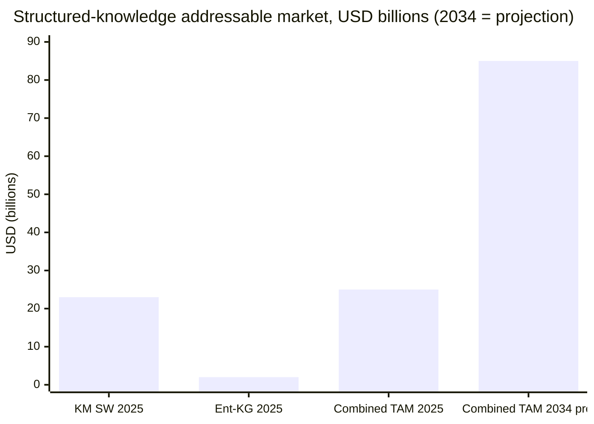

This trend-analysis synthesis covers 36 surviving finding(s) across the research.

## Trajectory: A Structured, Provenance-Backed Knowledge Layer Is Moving From Convention to Standard

### Front matter

Time horizon: roughly 18 months, mid-2026 through end-2027. Data as-of: 28 June 2026. Method anchor: this is a foresight convention (IFTF / WEF / APF practice), not a report format codified by any standards body (ISO / NISO / ANSI); trajectory claims below are time-anchored, and anything forward-looking is labelled as a projection rather than presented as fact.

### Headline movement

The direction of travel is consistent across every dimension examined, and it is increasing. Pure vector RAG is being displaced by hybrid graph-plus-vector retrieval, which posts roughly 3.4x accuracy gains and 90%+ accuracy on schema-bound queries [1, 2]. The enterprise knowledge-graph market reached production maturity over 2024-2025 — Microsoft open-sourced GraphRAG (2024), Google Cloud Spanner Graph reached GA (January 2025), and LinkedIn reported 63% efficiency gains — with 21-36% CAGR projections and Gartner forecasting that 50%+ of AI-agent systems will run on context graphs by 2028 [3, 4]. Git-native markdown knowledge management is consolidating underneath this: Obsidian alone has 1.5M+ active users growing about 22% year-over-year [10, 11].

The format layer is moving fastest. Andrej Karpathy's LLM-wiki gist (April 2026) accumulated 5,000+ stars and dozens of independent implementations within months [12], and Google Cloud formalized that pattern as the Open Knowledge Format (OKF) v0.1 on 12 June 2026 [13, 14]. MIF (Modeled Information Format) has been public since February 2026 and reached v1.0.0 — a Release Candidate stabilized on 18 June 2026 — so it predates OKF and already sits at a more advanced, stabilized spec version [17, 18]. The economic backdrop is large and growing: the knowledge-management software market sat near 23B USD in 2025, and the combined structured-knowledge TAM (KM software plus enterprise KG, the latter about 1.3-2.9B USD in 2025) exceeds 25B USD in 2025, projected to surpass 85B USD by 2034 [5, 4]. AI demand for citable, provenance-backed knowledge is the accelerant beneath all of it [6, 7] — though two of the demand statistics carry gate-applied caveats, surfaced in Signals.

### Figure: structured-knowledge addressable market

The 2034 value is a projection, not an observed figure, and is shown as a discrete anchor rather than an interpolated path so no intermediate year is implied.

## Signals: Strong Confirmation, Strong Leading Indicators, and Two Weak Counter-Signals

Signals are separated below into leading (point ahead of adoption) versus lagging (confirm a shift already underway), and strong versus weak.

### Strong lagging signals (the shift is already underway)

- Retrieval architecture has flipped. Hybrid graph-plus-vector systems demonstrate about 3.4x accuracy improvement and 90%+ accuracy on schema-bound queries, while pure vector RAG measurably fails on multi-hop reasoning and global synthesis — the 2024-2025 "vector plus graph" convergence is now the dominant production pattern [1, 2].
- Enterprise knowledge graphs reached production maturity in 2024-2025: Microsoft's open-source GraphRAG (2024), Google Cloud Spanner Graph GA (January 2025), and LinkedIn's reported 63% efficiency gains [1, 3].
- Git-native markdown KM is entrenched: Obsidian 1.5M+ active users at about 22% year-over-year growth, anchoring a broader second-brain movement now pulling in developers via AI tooling [10, 11].
- The financial pain is quantified and old: institutional knowledge loss runs about 31.5B USD per year across Fortune 500 firms, about 4.5M USD per year for the average US enterprise, with 42% of institutional knowledge held solely by individuals [21].

### Strong leading signals (point ahead of adoption)

- Practitioner pull: Karpathy's LLM-wiki gist drew 5,000+ stars and dozens of independent implementations within months of April 2026, establishing git-native structured markdown as a practitioner default for LLM context [12].
- Vendor formalization: Google Cloud's OKF v0.1 (12 June 2026) drew 5,440 stars and 416 forks within weeks — strong interest in a vendor-neutral spec [14, 16].
- Standards consolidation: the W3C RDF and SPARQL Working Group (chartered April 2025) is advancing RDF 1.2 / RDF-star and SPARQL 1.2 to address statement-level provenance, and PROV-O is being mapped to ISO standards — the provenance-standards layer is consolidating, not fragmenting [19].
- Demand from the open problem: 2026 agent-memory systems hit 92.5 / 94.4 on recall benchmarks yet still fail at temporal reasoning and provenance at scale — naming first-class temporal validity and actor attribution as the hard unsolved needs [8, 9].

### Weak and counter-signals (read with caution)

- Stars are interest, not adoption. OKF had no producer libraries, consumer integrations, governance tooling, or enterprise adoption record 16 days after launch; demand for OKF specifically — as distinct from structured formats generally — is undemonstrated [24].
- Two demand statistics were downgraded by the falsification gate and must be treated as moderate-confidence and directional, not precise. A cited "80% agent adoption by Q1 2026" overstates Gartner's own published figure of 40% of enterprise apps featuring task-specific AI agents by 2026, up from under 5% in 2025 [22]. And the "76% SaaS shift in 2025" buyer signal is real but narrow in scope [23]. Present these as ranges and direction, never as settled fact.

## Drivers and Inhibitors: AI-Provenance Demand and Technical Complementarity vs. Adoption Friction and Incumbent Substitutes

The trend is shaped by four force clusters: two drivers pushing a structured-yet-accessible spine forward, and two inhibitors pulling against it.

### Driver — AI-provenance demand is pulling structure into knowledge

AI and LLM workflows increasingly need citable, provenance-backed, typed knowledge to reduce hallucination, and that demand maps almost exactly onto what a layered spine offers [6, 7]. The hardest unsolved problems in agent memory are temporal validity and attribution — who asserted what, and when it changed [8, 9]. Beneath the AI framing sits an older financial driver: quantified institutional-memory loss is the justification CFOs already understand [21]. Five buyer segments carry documented pains a spine addresses — AI/ML teams (LLM grounding), enterprise knowledge-engineering teams (semantic layers), research organizations (citation tracking), think tanks (institutional memory), and developer/platform teams (replacing fragmented wikis with git-distributable docs) — though one buyer-adoption statistic in that finding was weakened by the gate and should be read as directional. A distinct open-format, git-native niche persists even as enterprise AI buying shifted heavily toward SaaS in 2025 (a weakened, narrow signal) [23], and adjacent pricing points to a viable open-core model: a free format with a paid governance, hosting, and audit layer, against enterprise KG platforms commanding roughly 15K-100K+ USD per year self-managed (the cited 47% year-over-year AI-KM growth figure is itself caveated).

### Driver — the OKF-plus-MIF complementarity is technically real

OKF v0.1 is deliberately minimal: a directory of markdown files with YAML frontmatter whose only required field is `type`, intentionally omitting formal ontology, typed relationships, provenance, and bi-temporal modeling. Its inter-concept links are untyped — relationship meaning lives in surrounding prose only — and its provenance is informal, handled by a `log.md` convention and a prose citations section rather than any machine-processable record. Crucially, OKF's permissive extension seam (producers MAY add frontmatter keys; consumers MUST preserve unknown keys) is the exact injection point for enrichment [14, 15]. MIF fills each gap with structure: a formal ontology plus an EntityReference typing system, a first-class W3C PROV-O-compatible provenance block (a sourceType enum, numeric confidence, trustLevel, and wasDerivedFrom attribution), bi-temporal tracking with configurable decay models (linear, exponential, step, with half-life), and a typed-relationships array of nine structural-core predicates carrying strength. That last capability — typed relationships, the one OKF most conspicuously lacks — is the strongest technical differentiator, but the finding asserting it was weakened by the falsification gate, so it should be stated as the leading-but-caveated claim rather than a settled one. The standing tension is architectural: OKF's permissive-consumer model versus MIF's fail-closed validation.

### Inhibitor — incumbents and substitutes each own only one axis

No existing option delivers structured-and-accessible together, which is precisely the gap the layered spine targets. RDF/OWL provides complete typed semantics and formal ontologies but at authoring and tooling costs that erase OKF's accessibility advantage. JSON-LD and YAML-LD plus schema.org (used by about 45% of top websites) solve web-entity annotation, not a finding lifecycle, and lack native provenance, temporal versioning, and git-native distribution. SKOS publishes taxonomies and thesauri as linked data but omits provenance and cannot distinguish relationship sub-types. PROV-O matches MIF's provenance semantics but requires the full RDF triple-store toolchain. Frictionless Data packages tabular datasets with shallow lineage (sources and contributors), not curated knowledge concepts. Personal KM tools — Obsidian, Logseq, Roam — use the very untyped wiki-link pattern OKF formalizes, but lack typed semantics, formal ontology, provenance, and agent-exportable structure. In market terms this leaves a structured-but-accessible middle: more semantically rich than KM wikis, more open and git-distributable than proprietary graph databases like Neo4j or Stardog.

### Inhibitor — adoption friction and the Semantic Web's cautionary map

The strongest headwind is historical. The Semantic Web failed to reach mass adoption over two decades because of toolchain complexity (RDF, OWL, SPARQL), misaligned developer incentives, and a preference for logical completeness over usability, while minimal-and-useful schema.org succeeded [20]. The lesson is direct: any semantic layer demanding a paradigm shift will stall, so a richer MIF layer must stay near-zero-cost to author or it risks the same fate. OKF nascency compounds the risk — its minimalism may itself be the buyer preference, which would leave MIF's richer layer a solution ahead of a segment that wants it [24]. And MIF's own constraint is distribution and adoption, not spec maturity: it is the more stabilized specification but lacks OKF's Google-backed reach and an independent adopter base.

## Scenarios: Four Plausible Paths Through End-2027

Four plausible paths run from the nascent mid-2026 position to end-2027. These are projections, not forecasts of fact; each states its confidence, its selecting conditions, the trigger that would confirm it, and its central unknown.

```mermaid
stateDiagram-v2
    [*] --> NascentSpine2026
    NascentSpine2026 --> LayeredSpineAscendancy: provenance demand persists + standards consolidate + MIF closes distribution gap
    NascentSpine2026 --> OKFMinimalismWins: buyers prefer minimal markdown; MIF fields seen as overhead
    NascentSpine2026 --> IncumbentAbsorption: Google or KG platforms add native provenance + typing
    NascentSpine2026 --> SemanticWebRedux: layered authoring friction stalls adoption
    LayeredSpineAscendancy --> [*]
    OKFMinimalismWins --> [*]
    IncumbentAbsorption --> [*]
    SemanticWebRedux --> [*]
```

### Scenario A — Layered-spine ascendancy (moderate confidence)

Conditions: AI-provenance demand keeps pulling structure into knowledge [6, 8]; RDF-star and PROV-O standards consolidation lends legitimacy [19]; OKF's extension seam stays permissive [15]; and MIF converts its spec maturity into distribution. Confirming trigger: the first independent, non-author producer and consumer libraries emitting OKF-plus-MIF, plus a named enterprise reference deployment. Central unknown: whether buyers actually want the richer layer, or only the minimal base.

### Scenario B — OKF minimalism wins, MIF layer underused (moderate confidence; the strongest counter-case)

Conditions: buyers prefer minimal markdown, OKF rides the Google brand, and MIF's fields are perceived as overhead [24]. Confirming trigger: OKF adoption climbs while MIF-style structured frontmatter stays rare in real corpora. Central unknown: whether provenance and temporal-validity demand is strong enough to force structure on a market that defaults to simplicity.

### Scenario C — Incumbent absorption (moderate-to-low confidence)

Conditions: Google or the enterprise knowledge-graph platforms add native provenance and typing to OKF or to their graph stacks, collapsing the layered spine's differentiation into the base [3, 4]. Confirming trigger: an OKF v0.2+ or a major KG platform shipping first-class provenance. Central unknown: vendor appetite for the spec complexity they deliberately omitted at v0.1.

### Scenario D — Semantic-Web redux / stall (low-to-moderate confidence)

Conditions: the layered spine reintroduces authoring friction and adoption stalls exactly as RDF/OWL did, while minimal formats keep winning [20]. Confirming trigger: tooling that makes MIF enrichment near-free fails to materialize. Central unknown: whether fail-closed validation can be delivered at low enough authoring cost to escape the historical trap.

## Implications and Watch-list: What Confirms or Breaks Each Path

The category trajectory — structured, provenance-backed, git-native knowledge — is strongly up and well evidenced. The open decision is not whether the category grows, but whether the layered OKF-plus-MIF approach captures it versus minimalism or incumbent absorption. The asymmetry between the two specs is distribution and brand, not maturity: MIF is the more stabilized specification, but OKF carries Google's reach. The right posture is to watch adoption, not stars.

### Watch-list (early indicators that confirm or break each path)

- Ecosystem formation around OKF: independent producer and consumer libraries, governance, and enterprise reference deployments. Their appearance confirms Scenario A; continued absence confirms Scenario B [24, 14].
- Structured frontmatter in the wild: whether MIF-style provenance, typing, and temporal fields actually show up in real OKF corpora. Presence confirms A; absence confirms B [15, 17].
- Standards cadence: RDF 1.2 / RDF-star reaching Candidate Recommendation and PROV-O to ISO mappings landing — a tailwind for A, neutral for B [19].
- Agent-memory products: shipping first-class temporal validity and actor attribution would confirm the underlying demand thesis [8].
- Vendor moves: an OKF v0.2+ or a KG platform adding native provenance signals Scenario C [3].
- Authoring-friction tooling: whether MIF enrichment becomes near-zero-cost is the hinge between Scenario A and Scenario D [20].
- Business-model traction: open-core adoption (free format, paid governance and audit) in adjacent KM/KG pricing. Track the 47% year-over-year AI-KM growth figure but treat it as caveated (weakened), not precise.

### Implication for planners

Plan for the category, hedge on the layering. Demand for citable, temporally valid, typed knowledge is the durable bet; the layered spine is the higher-upside, higher-uncertainty expression of it. The single most decision-relevant unknown is buyer appetite for structure beyond the minimal base — resolve that early, because it separates Scenario A from Scenario B and should gate any heavy commitment to the richer layer.

### References

Numbered references resolve the inline markers above; the complete machine-readable citation set follows in Sources. Dates indicate the observation or publication vintage.

- [1] Microsoft Research — GraphRAG: Unlocking LLM Discovery on Narrative Private Data (2024): <https://www.microsoft.com/en-us/research/blog/graphrag-unlocking-llm-discovery-on-narrative-private-data/>
- [2] Salfati Group — Graph RAG Guide 2025: Architecture, Implementation and ROI (2025): <https://salfati.group/topics/graph-rag>
- [3] Atlan — Gartner on Context Graphs (2026): <https://atlan.com/know/gartner-context-graphs/>
- [4] Grand View Research — Enterprise Knowledge Graph Market Report (2025): <https://www.grandviewresearch.com/industry-analysis/enterprise-knowledge-graph-market-report>
- [5] Fortune Business Insights — Knowledge Management Software Market, forecast to 2034 (2025): <https://www.fortunebusinessinsights.com/knowledge-management-software-market-110376>
- [6] Future Market Insights via AccessNewswire — AI-Ready Enterprise Knowledge Graph Market to 2036 (2026): <https://www.accessnewswire.com/newsroom/en/business-and-professional-services/ai-ready-enterprise-knowledge-graph-market-to-reach-usd-6-550.0-1167718>
- [7] Promethium — Enterprise Knowledge Graph Buyer's Guide 2026 (2026): <https://promethium.ai/guides/enterprise-knowledge-graph-buyers-guide-2026/>
- [8] Mem0 — State of AI Agent Memory 2026 (2026): <https://mem0.ai/blog/state-of-ai-agent-memory-2026>
- [9] arXiv 2603.11768 — Governing Evolving Memory in LLM Agents: the SSGM Framework (2026): <https://arxiv.org/html/2603.11768v1>
- [10] Taskade — History of Obsidian: Second Brain to AI Knowledge OS (2025): <https://www.taskade.com/blog/obsidian-history>
- [11] DataIntelo — Personal Knowledge Management Software Market Report to 2034 (2025): <https://dataintelo.com/report/personal-knowledge-management-software-market>
- [12] Andrej Karpathy — LLM Wiki, GitHub gist (April 2026): <https://gist.github.com/karpathy/442a6bf555914893e9891c11519de94f>
- [13] Techstrong.ai — Google Launches a Universal Format for Karpathy's LLM Wiki (June 2026): <https://techstrong.ai/articles/google-launches-a-universal-format-for-karpathys-llm-wiki/>
- [14] Google Cloud Blog — How the Open Knowledge Format can improve data sharing (June 2026): <https://cloud.google.com/blog/products/data-analytics/how-the-open-knowledge-format-can-improve-data-sharing>
- [15] GoogleCloudPlatform/knowledge-catalog — OKF SPEC.md v0.1 (June 2026): <https://github.com/GoogleCloudPlatform/knowledge-catalog/blob/main/okf/SPEC.md>
- [16] MarkTechPost — Google Cloud Introduces Open Knowledge Format (16 June 2026): <https://www.marktechpost.com/2026/06/16/google-cloud-introduces-open-knowledge-format-okf-a-vendor-neutral-markdown-spec-for-giving-ai-agents-curated-context/>
- [17] zircote.com — Introducing MIF: Memory Interchange Format (February 2026): <https://zircote.com/blog/2026/02/introducing-mif-memory-interchange-format/>
- [18] zircote/MIF — MIF v1.0.0 repository, stabilized 18 June 2026: <https://github.com/zircote/MIF>
- [19] W3C — RDF and SPARQL Working Group Charter (April 2025): <https://www.w3.org/2025/04/rdf-star-wg-charter.html>
- [20] Ontotext — The Semantic Web: 20 Years and a Handful of Enterprise Knowledge Graphs Later (retrospective): <https://www.ontotext.com/blog/the-semantic-web-20-years-later/>
- [21] Inc. — The Cost and Consequence of Institutional Memory Drain (2024): <https://www.inc.com/bethmaser/the-cost-and-consequence-of-institutional-memory-drain/91178504>
- [22] Gartner Newsroom — 40% of Enterprise Apps Will Feature Task-Specific AI Agents by 2026, up from under 5% in 2025 (August 2025): <https://www.gartner.com/en/newsroom/press-releases/2025-08-26-gartner-predicts-40-percent-of-enterprise-apps-will-feature-task-specific-ai-agents-by-2026-up-from-less-than-5-percent-in-2025>
- [23] a16z — How 100 Enterprise CIOs Are Building and Buying Gen AI in 2025 (2025): <https://a16z.com/ai-enterprise-2025/>
- [24] Let's Data Science — Google Cloud Launches Open Knowledge Format Standard (2026): <https://letsdatascience.com/news/google-cloud-launches-open-knowledge-format-standard-b9480a66>

## Sources

- [a16z 'How 100 Enterprise CIOs Are Building and Buying Gen AI in 2025' - source does not substantiate the specific 76%/50-50 build-vs-buy figure on inspection (only a qualitative shift-to-buying)](<https://a16z.com/ai-enterprise-2025/>)
- [JSON-LD Schema Markup for AI Discoverability: Technical Guide 2026 - AgentVisibility.ai](<https://agentvisibility.ai/insights/json-ld-schema-ai-discoverability>)
- [Governing Evolving Memory in LLM Agents: Risks, Mechanisms, and the SSGM Framework — arXiv](<https://arxiv.org/html/2603.11768v1>)
- [A Decade of Scholarly Research on Open Knowledge Graphs - Research community KG adoption (arXiv)](<https://arxiv.org/pdf/2306.13186>)
- [OWL Reasoners still useable in 2023 (arXiv)](<https://arxiv.org/pdf/2309.06888>)
- [Semantic Web: Past, Present, and Future — arXiv 2412.17159](<https://arxiv.org/pdf/2412.17159>)
- [Semantic Web and Software Agents — A Forgotten Wave of Artificial Intelligence? arXiv 2503.20793](<https://arxiv.org/pdf/2503.20793>)
- [PROV-AGENT: Unified Provenance for Tracking AI Agent Interactions in Agentic Workflows (arXiv)](<https://arxiv.org/pdf/2508.02866>)
- [Gartner on Context Graphs: Trends, Capabilities, Setup in 2026 — Atlan](<https://atlan.com/know/gartner-context-graphs/>)
- [Ontology vs. Semantic Layer: Differences and schema.org limitations — Atlan](<https://atlan.com/know/ontology-vs-semantic-layer/>)
- [RDF vs OWL: Key Differences, Use Cases and Examples Explained - Atlan](<https://atlan.com/know/rdf-vs-owl/>)
- [Stardog Enterprise Knowledge Graph Platform Pricing (AWS Marketplace)](<https://aws.amazon.com/marketplace/pp/prodview-ulfm6fel7xgjq>)
- [Frictionless Data and FAIR Research Principles - Open Knowledge Foundation Blog](<https://blog.okfn.org/2018/08/14/frictionless-data-and-fair-research-principles/>)
- [Knowledge Management Statistics and Trends in 2025 - Worker productivity costs (CAKE)](<https://cake.com/blog/knowledge-management-statistics/>)
- [How the Open Knowledge Format can improve data sharing — Google Cloud Blog](<https://cloud.google.com/blog/products/data-analytics/how-the-open-knowledge-format-can-improve-data-sharing>)
- [Ontologies, Context Graphs, and Semantic Layers: What AI Actually Needs in 2026](<https://contextandchaos.substack.com/p/ontologies-context-graphs-and-semantic>)
- [Knowledge Management and Dissemination for Think Tanks (DataCalculus)](<https://datacalculus.com/en/blog/think-tanks/program-director/knowledge-management-and-dissemination-for-think-tanks>)
- [Personal Knowledge Management Software Market Research Report 2034 — DataIntelo](<https://dataintelo.com/report/personal-knowledge-management-software-market>)
- [Lessons Learned from the Combined Development of OWL and SHACL — ACM K-CAP 2025](<https://dl.acm.org/doi/full/10.1145/3731443.3771340>)
- [Top Knowledge Management Trends 2026 - Semantic layers and enterprise AI (Enterprise Knowledge)](<https://enterprise-knowledge.com/top-knowledge-management-trends-2026/>)
- [LLM Wiki — Karpathy GitHub Gist (April 2026)](<https://gist.github.com/karpathy/442a6bf555914893e9891c11519de94f>)
- [OKF SPEC.md — GoogleCloudPlatform/knowledge-catalog](<https://github.com/GoogleCloudPlatform/knowledge-catalog/blob/main/okf/SPEC.md>)
- [Frictionless Data Package — GitHub frictionlessdata/datapackage](<https://github.com/frictionlessdata/datapackage>)
- [MIF v1.0 — GitHub zircote/MIF](<https://github.com/zircote/MIF>)
- [Open Knowledge Format (OKF) — Official Grounding Page](<https://groundingpage.com/facts/open-knowledge-format/>)
- [JSON-LD - JSON for Linked Data (Official Site)](<https://json-ld.org/>)
- [Google Cloud Launches Open Knowledge Format Standard - sober adoption assessment (Let's Data Science)](<https://letsdatascience.com/news/google-cloud-launches-open-knowledge-format-standard-b9480a66>)
- [From LLMs to Knowledge Graphs: Building Production-Ready Graph Systems in 2025 — Medium](<https://medium.com/@claudiubranzan/from-llms-to-knowledge-graphs-building-production-ready-graph-systems-in-2025-2b4aff1ec99a>)
- [Beyond OWL: Reconsidering Ontologies in the Age of AI and the Semantic Web](<https://medium.com/@nfigay/beyond-owl-reconsidering-ontologies-in-the-age-of-ai-and-the-semantic-web-4059b519f23d>)
- [Open-Sourcing the Knowledge Graph Studio under MIT license (Medium/Enterprise RAG)](<https://medium.com/enterprise-rag/open-sourcing-the-whyhow-knowledge-graph-studio-powered-by-nosql-edce283fb341>)
- [State of AI Agent Memory 2026: Benchmarks, Architectures & Production Gaps — Mem0](<https://mem0.ai/blog/state-of-ai-agent-memory-2026>)
- [MIF Schema Reference — mif-spec.dev](<https://mif-spec.dev/>)
- [MIF relationship types (mif-spec.dev) - the core vocabulary is relates-to/derived-from/supersedes/conflicts-with/part-of/implements/uses/created-by/mentioned-in; supports/contradicts/refines/depends-on/updates are not MIF-native core, only custom namespaced](<https://mif-spec.dev/specification/relationship-types/>)
- [Open-Source vs SaaS Agent Platforms: Pros & Cons for Enterprises (OneReach.ai)](<https://onereach.ai/blog/open-source-frameworks-vs-saas-agent-platforms/>)
- [Enterprise Knowledge Graph Buyer's Guide 2026 - Pricing and ROI signals (Promethium)](<https://promethium.ai/guides/enterprise-knowledge-graph-buyers-guide-2026/>)
- [Graph RAG Guide 2025: Architecture, Implementation & ROI — Salfati Group](<https://salfati.group/topics/graph-rag>)
- [Obsidian Complete Guide: The Ultimate Markdown Editor for Knowledge Management Revolution 2025 — SmartScope](<https://smartscope.blog/en/obsidian-complete-guide/>)
- [Obsidian vs Logseq 2026: Which PKM Tool Wins? - SoftPicker](<https://softpicker.com/obsidian-vs-logseq/>)
- [Frictionless Data Specifications - Official Home](<https://specs.frictionlessdata.io/>)
- [Frictionless Data Package Specification — specs.frictionlessdata.io](<https://specs.frictionlessdata.io/data-package/>)
- [State of Open Data 2025 - FAIR data and open science trends](<https://stateofopendata.com/>)
- [Knowledge Management Software Market Size, Share, Growth, 2034 (Straits Research)](<https://straitsresearch.com/report/knowledge-management-software-market>)
- [AI Hallucination Statistics 2026: 50+ Sourced Data Points (Suprmind)](<https://suprmind.ai/hub/insights/ai-hallucination-statistics-research-report-2026/>)
- [Bi-temporal memory for AI coding agents — git-pinned context that survives context compaction](<https://sverklo.com/blog/bi-temporal-memory-for-ai-agents/>)
- [Google Launches a Universal Format for Karpathy's LLM Wiki — Techstrong.ai](<https://techstrong.ai/articles/google-launches-a-universal-format-for-karpathys-llm-wiki/>)
- [Google Just Standardized Karpathy's LLM Wiki Pattern — The Menon Lab](<https://themenonlab.blog/blog/google-okf-open-knowledge-format-karpathy-llm-wiki-standard>)
- [Obsidian Pricing 2026: Plans, Hidden Costs & Cheaper Alternatives (ToolRadar)](<https://toolradar.com/tools/obsidian/pricing>)
- [Agent-to-agent audit trail: provenance for AI ecosystems (TrueScreen)](<https://truescreen.io/articles/agent-to-agent-audit-trail/>)
- [Personal Knowledge Graphs in Obsidian - Volodymyr Pavlyshyn, Medium](<https://volodymyrpavlyshyn.medium.com/personal-knowledge-graphs-in-obsidian-528a0f4584b9>)
- [Why Bad Knowledge Management Is Killing Your Profits (WikiTeq)](<https://wikiteq.com/post/hidden-costs-poor-knowledge-management>)
- [2026 Enterprise AI Knowledge Management: AI-native KM market size (Windows Forum/GoSearch)](<https://windowsforum.com/threads/2026-enterprise-ai-knowledge-management-from-search-to-governed-agent-workflows.410816/>)
- [Open Knowledge Format (OKF) Complete 2026 Guide - ecosystem gaps identified (WitsCode)](<https://witscode.com/open-knowledge-format>)
- [AI-Ready Enterprise Knowledge Graph Market to Reach USD 6,550.0 Million by 2036 (AccessNewswire/FMI)](<https://www.accessnewswire.com/newsroom/en/business-and-professional-services/ai-ready-enterprise-knowledge-graph-market-to-reach-usd-6-550.0-1167718>)
- [Knowledge Management Software Market Size, Industry Share | Forecast 2034 (Fortune Business Insights)](<https://www.fortunebusinessinsights.com/knowledge-management-software-market-110376>)
- [Gartner Predicts 40% of Enterprise Apps Will Feature Task-Specific AI Agents by 2026, Up from Less Than 5% in 2025 (Gartner Newsroom)](<https://www.gartner.com/en/newsroom/press-releases/2025-08-26-gartner-predicts-40-percent-of-enterprise-apps-will-feature-task-specific-ai-agents-by-2026-up-from-less-than-5-percent-in-2025>)
- [Enterprise Knowledge Graph Market Industry Report 2033 — Grand View Research](<https://www.grandviewresearch.com/industry-analysis/enterprise-knowledge-graph-market-report>)
- [The Cost and Consequence of Institutional Memory Drain (Inc. Magazine)](<https://www.inc.com/bethmaser/the-cost-and-consequence-of-institutional-memory-drain/91178504>)
- [Simple Knowledge Organization System (SKOS) — ISKO Encyclopedia of KO](<https://www.isko.org/cyclo/skos.htm>)
- [Cost of Organizational Knowledge Loss and Countermeasures (Iterators HQ)](<https://www.iteratorshq.com/blog/cost-of-organizational-knowledge-loss-and-countermeasures/>)
- [Why AI Hallucinates in Your Enterprise (and how Context Graphs Fix it) - Kamiwaza](<https://www.kamiwaza.ai/insights/why-ai-hallucinates-in-your-enterprise>)
- [Knowledge Graph Market Worth $9.88 Billion by 2032 — MarketsandMarkets](<https://www.marketsandmarkets.com/PressReleases/knowledge-graph.asp>)
- [Google Cloud Introduces Open Knowledge Format (OKF) — MarkTechPost](<https://www.marktechpost.com/2026/06/16/google-cloud-introduces-open-knowledge-format-okf-a-vendor-neutral-markdown-spec-for-giving-ai-agents-curated-context/>)
- [Knowledge Graph vs Vector Database for RAG: Which Is Best? — Meilisearch](<https://www.meilisearch.com/blog/knowledge-graph-vs-vector-database-for-rag>)
- [GraphRAG: Unlocking LLM Discovery on Narrative Private Data — Microsoft Research Blog](<https://www.microsoft.com/en-us/research/blog/graphrag-unlocking-llm-discovery-on-narrative-private-data/>)
- [Project GraphRAG — Microsoft Research](<https://www.microsoft.com/en-us/research/project/graphrag/>)
- [A Semantic Approach to Mapping the Provenance Ontology to Basic Formal Ontology — Scientific Data](<https://www.nature.com/articles/s41597-025-04580-1>)
- [Notion vs Obsidian - minimalism as user preference (NotionApps)](<https://www.notionapps.com/blog/notion-vs-obsidian-knowledge-productivity-2025>)
- [The Semantic Web: 20 Years and a Handful of Enterprise Knowledge Graphs Later — Ontotext](<https://www.ontotext.com/blog/the-semantic-web-20-years-later/>)
- [Notion vs Obsidian vs Roam Research 2025: Best Note-Taking App for Productivity](<https://www.primeproductiv4.com/blog-articles/notion-vs-obsidian-vs-roam-research-productivity-comparison>)
- [History of Obsidian: Second Brain to AI Knowledge OS — Taskade Blog](<https://www.taskade.com/blog/obsidian-history>)
- [AI-Driven Knowledge Management System Market Report (The Business Research Company) - the '$7.71B 2025 / 47.2%' figure traces here, not to GoSearch; cross-firm AI-KM sizing varies widely and the finding's two growth rates do not reconcile](<https://www.thebusinessresearchcompany.com/report/ai-driven-knowledge-management-system-global-market-report>)
- [Neo4j Software Pricing & Plans 2026 (Vendr)](<https://www.vendr.com/marketplace/neo4j>)
- [SKOS Simple Knowledge Organization System - W3C Home Page](<https://www.w3.org/2004/02/skos/>)
- [RDF & SPARQL Working Group Charter — W3C (April 2025)](<https://www.w3.org/2025/04/rdf-star-wg-charter.html>)
- [JSON-LD 1.1 — W3C Recommendation](<https://www.w3.org/TR/json-ld11/>)
- [PROV-O: The PROV Ontology - W3C Recommendation](<https://www.w3.org/TR/prov-o/>)
- [PROV-Overview — W3C](<https://www.w3.org/TR/prov-overview/>)
- [SKOS Simple Knowledge Organization System Primer - W3C Recommendation](<https://www.w3.org/TR/skos-primer/>)
- [SKOS Simple Knowledge Organization System Reference — W3C](<https://www.w3.org/TR/skos-reference/>)
- [Ontologies and Knowledge Graphs in Industry Community Group — W3C](<https://www.w3.org/community/oki/>)
- [YAML-LD — W3C CG Final Report, December 2023](<https://www.w3.org/community/reports/json-ld/CG-FINAL-yaml-ld-20231206/>)
- [The PROV-JSONLD Serialization - W3C Member Submission 2024](<https://www.w3.org/submissions/2024/SUBM-prov-jsonld-20240825/>)
- [Introducing MIF: Memory Interchange Format — zircote.com (February 2026)](<https://zircote.com/blog/2026/02/introducing-mif-memory-interchange-format/>)
- [AI Agent Memory Architectures: From Context Windows to Persistent Knowledge — Zylos Research](<https://zylos.ai/research/2026-04-05-ai-agent-memory-architectures-persistent-knowledge/>)
