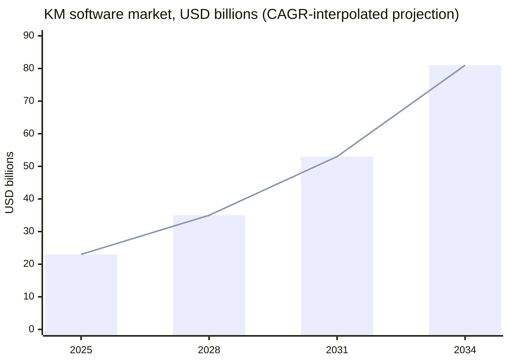
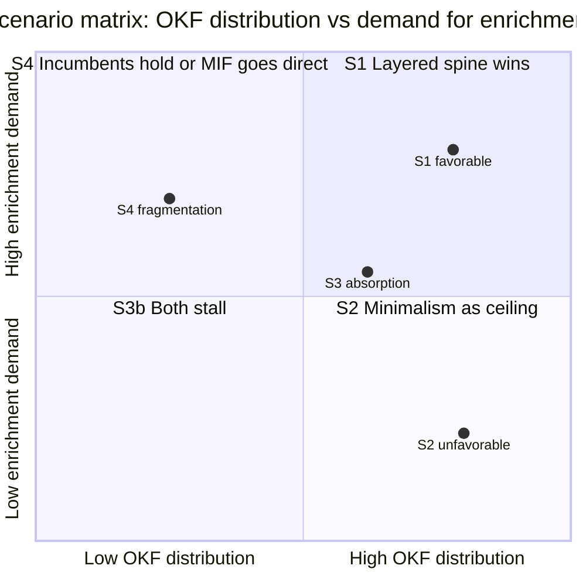
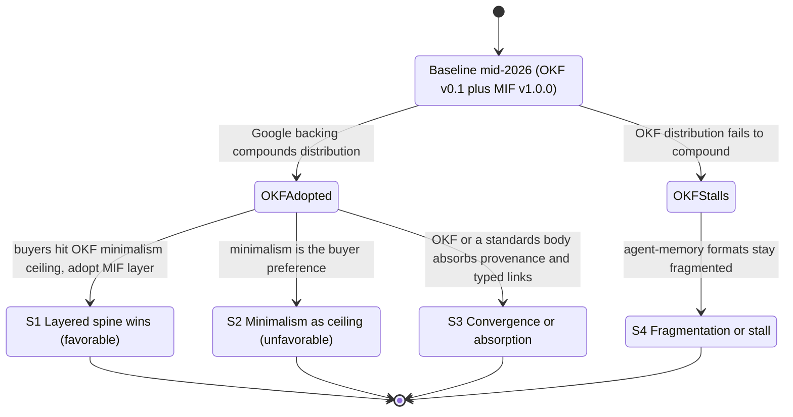

This trend-modeling synthesis covers 36 surviving finding(s) across the research.

## Trajectory

The headline movement is recent and unambiguous: between 2024 and mid-2026, structured, git-native, provenance-aware knowledge persistence moved from a niche practice toward the emerging default substrate for AI-agent context. This section establishes the direction of travel; later sections separate observed signals from projected scenarios, and state confidence per claim. The anchor for this report is a foresight convention (IFTF/WEF/APF practice), not a codified standard.

| Field | Value |
| --- | --- |
| Time horizon | 18 months (mid-2026 through end-2027) |
| As-of date | 2026-06-28 |
| Genre anchor | Foresight convention (IFTF/WEF/APF), not an ISO/NISO standard |

### Direction of travel: increasing

The practitioner default for LLM-context persistence has shifted to git-native structured markdown. Andrej Karpathy's April 2026 LLM-wiki gist, which proposes maintaining a git-native, LLM-updated markdown knowledge base instead of re-deriving answers from raw documents via RAG, accumulated 5,000+ stars and spawned dozens of independent implementations within months (Karpathy's GitHub gist). Google Cloud formalized the same pattern as OKF v0.1 on 12 June 2026, an Apache-2.0 markdown-directory specification that reached 5,440 stars and 416 forks within weeks (OKF SPEC.md; MarkTechPost; Techstrong.ai). That star velocity is a momentum signal, but it equally reflects a brand-new, pre-community-governed project, so it is read here as interest rather than installed-base adoption.

This formalization sits on an established base. Obsidian alone reports 1.5 million-plus active users growing at roughly 22% year over year (2025-2026), anchoring a broader second-brain movement in which markdown files in git are the de facto format, with AI integration now pulling in developers who previously ignored personal knowledge management (Obsidian complete guide; History of Obsidian). The architectural pull is reinforced on the retrieval side: pure vector RAG demonstrably fails on multi-hop reasoning and global synthesis, while hybrid graph-plus-vector systems achieve roughly 3.4x accuracy improvement and 90%-plus accuracy on schema-bound queries, making the 2024-2025 "vector plus graph" convergence the dominant production architecture and a direct source of demand for typed, structured knowledge (Microsoft Research GraphRAG; Graph RAG Guide 2025).

### Market trajectory: rising, with wide magnitude uncertainty

The addressable market spans two converging segments. The knowledge-management software market sits near $23B in 2025 growing at a 13-18% CAGR, and the enterprise knowledge-graph market sits in a $1.3-2.9B range in 2025 growing at 20-33% CAGR; together they define a TAM exceeding $25B in 2025 and are projected to surpass $85B by 2034, with the fastest-growing niche being AI-ready structured knowledge infrastructure tied to GraphRAG and agentic deployments (Knowledge Management Software Market reports, Straits Research and Fortune Business Insights; Enterprise Knowledge Graph reports, Grand View Research and MarketsandMarkets). The enterprise knowledge-graph segment specifically reached production maturity in 2024-2025 at 21-36% CAGR, with Gartner predicting that 50%-plus of AI-agent systems will use context graphs by 2028, and concrete proof points such as Microsoft's open-source GraphRAG (2024), Google Cloud Spanner Graph (GA January 2025), and LinkedIn's reported 63% efficiency gains (Gartner context graphs via Atlan; Grand View Research).

The figure below plots the KM-software segment trajectory. The two endpoints ($23B in 2025 and more than $85B by 2034) are the cited anchors; the intermediate points are CAGR-interpolated at the 15% midpoint of the cited 13-18% band and are a projection, not observed data. The full band implies roughly $71-107B by 2034.

### Where MIF sits on the curve

MIF has been public since approximately February 2026 (zircote.com introduction post) and reached v1.0.0 (Released, stabilized 2026-06-18) per the in-repo specification at mif-spec.dev, which means it predates OKF v0.1 and is at a more advanced, stabilized version. MIF fills a documented gap, the fragmentation of AI-memory formats, with genuine technical differentiation, but against OKF's Google-backed launch it still lacks a large independent adopter base and formal governance. Its open question is therefore distribution and adoption, not specification maturity; this distinction frames every scenario below.

Confidence: the direction of travel (rising demand for structured, provenance-aware knowledge persistence) is high-confidence and corroborated across landscape, technical, market, and trajectory findings. Absolute market magnitudes are lower-confidence: cross-firm sizing varies widely and several inputs are weakened (see Signals).

## Signals

Signals are the observable indicators behind the trajectory. Each is tied to a surviving finding and dated where the evidence allows. Leading signals point to where demand is forming; lagging signals quantify pain already on the books. Weakened findings are surfaced here with their caveats rather than hidden.

### Leading signals (demand forming)

The hardest unsolved problems in AI-agent memory as of 2026 are precisely the ones a provenance-and-time-aware spine addresses. The 2026 state of agent memory shows that memory staleness and provenance tracking (who asserted what, and when it changed) are the two hardest open architectural problems: systems scoring 92.5 and 94.4 on recall benchmarks still fail at temporal reasoning at scale (mem0 State of AI Agent Memory 2026; Zylos Research; PROV-AGENT; SSGM framework). This is a strong leading signal because it names the capability gap, first-class temporal validity and actor attribution, that the MIF provenance and bi-temporal model is built to fill.

The shift from static RAG toward structured knowledge graphs is creating direct demand for git-distributable, provenance-backed, typed knowledge that reduces hallucination, with GraphRAG enablement forecast at roughly 31% of the enterprise knowledge-graph market in 2026 (Gartner via Atlan; Kamiwaza; AI hallucination statistics 2026). Caveat (weakened 2026-06-28): this finding originally cited a Gartner figure of "80% agentic-AI adoption by Q1 2026, up from 33% in 2024" that is overstated against Gartner's own published prediction of 40% of enterprise applications featuring task-specific AI agents by 2026, up from under 5% in 2025 (Gartner Newsroom). The corrected 40%-by-2026 figure is used here; the demand direction stands, the magnitude was inflated, so the claim is treated at moderate confidence.

### Lagging signals (quantified pain on the books)

Institutional knowledge loss is the primary financial justification for enterprise knowledge investment: it costs Fortune 500 companies a reported $31.5B per year, the average U.S. enterprise loses about $4.5M per year to information silos, and 42% of institutional knowledge resides solely with individual employees (Inc. Magazine; Iterators HQ; WikiTeq). Provenance and temporal versioning address the most severe of these failure modes directly, which is why this is a durable, lagging demand signal rather than a fashion.

Five buyer segments carry documented pains a structured spine addresses: AI/ML teams needing LLM grounding, enterprise knowledge-engineering teams building semantic layers, research organizations tracking provenance and citations, think tanks preserving institutional memory, and developer or platform teams replacing fragmented wikis with git-distributable docs (Buyer-segment and think-tank KM sources). Caveat (weakened 2026-06-28): this finding also leaned on the same overstated Gartner 80%/Q1-2026 agent-adoption statistic; the segment structure is well supported, the adoption-rate magnitude is not, so it is reported at moderate confidence.

### Positioning and monetization signals

Competitively, the offering occupies the gap between personal KM tools (Notion, Obsidian, Confluence) that lack provenance and typed relationships, and enterprise knowledge-graph platforms (Neo4j, Stardog) that demand significant engineering overhead, making it the "structured but accessible" option: richer than wikis, more open and git-distributable than proprietary graph databases (competitive-positioning sources; Notion vs Obsidian comparisons). Adjacent markets reveal a consistent pricing architecture, an open-source format core with commercial enterprise tiers: enterprise knowledge-graph platforms command $15K-100K-plus per year for self-managed deployments (Stardog AWS Marketplace; Neo4j via Vendr), personal KM tools price at $5-16 per user per month (Obsidian pricing), and an OKF-plus-MIF spine would plausibly follow this open-core path (free format, paid governance, hosting, and audit layer). Caveat (weakened 2026-06-28): the AI-driven KM growth rate cited as 47% year over year traces to The Business Research Company rather than to GoSearch as originally attributed, cross-firm AI-KM sizing varies widely, and the finding's two growth rates do not reconcile; the open-core pattern is well evidenced, the specific growth figure is not, so it is reported at moderate confidence.

### Standards-momentum signal

The standards layer that a provenance model builds on is consolidating rather than fragmenting. The W3C RDF-star Working Group (established 2022) is advancing RDF 1.2 with SPARQL 1.2 toward Candidate Recommendation (targeted around Q3 2025), addressing the statement-qualification and provenance gaps that historically blocked RDF, while PROV-O remains the recommended provenance ontology and is being mapped to ISO 23494 for biotechnology (W3C RDF-star WG charter; PROV-O; PROV-O to BFO mapping). This is a moderate-strength leading signal: it lowers the long-run risk that the provenance substrate MIF aligns with becomes a dead end.

## Drivers & Inhibitors

Two sets of forces shape the trajectory: the technical capability gap that drives a layered OKF-plus-MIF spine, and the incumbents, alternatives, and adoption risks that could dampen it. The technical material here is comparative rather than time-series, but it is what determines whether the demand signals above convert into adoption.

### Drivers: the capability gap OKF leaves open

OKF v0.1 (Google Cloud, June 2026) represents knowledge as a directory of markdown files with YAML frontmatter whose only required field per concept is "type"; it intentionally omits formal typing systems, ontologies, provenance tracking, and typed relationship definitions (OKF SPEC.md). Its relationship model is untyped: inter-concept links are plain markdown hyperlinks whose semantic meaning lives only in surrounding prose, and consumers must tolerate broken links (OKF SPEC.md). Its provenance model is two optional prose conventions, a log.md update history and a Citations markdown section, neither of which is a machine-processable record with structured attribution, confidence, or agent identity (OKF SPEC.md; OKF grounding page). These deliberate omissions are the driver: they create the exact gap a richer layer can fill.

MIF supplies that layer as structured, validated fields on every concept. It provides a formal ontology reference (id, version, uri) plus an entity block, with a generic core ontology of five entity types (concept, person, organization, technology, file) that domain packs extend, where OKF's "type" is an unregistered producer-defined string with no schema enforcement (mif-spec.dev). It provides a first-class provenance object encoding W3C PROV-O-compatible attribution, a sourceType enum, numeric confidence, trustLevel, agent identity, and wasGeneratedBy/wasAttributedTo/wasDerivedFrom, replacing OKF's informal log.md with a machine-verifiable record (mif-spec.dev; PROV-O). It provides bi-temporal tracking (valid time versus recorded time), ISO-8601 duration TTL, and configurable decay models with half-life and strength, where OKF supports only a single timestamp, leaving OKF bundles unable to express claim-validity windows or automate staleness detection (mif-spec.dev; bi-temporal memory for AI agents).

MIF also adds typed relationships, the primary semantic capability OKF lacks: a relationships array of directed edges, each with an optional numeric strength and extensible metadata. Caveat (weakened 2026-06-28): the underlying finding described "nine structural-core predicates" listing supports, contradicts, derived-from, relates-to, supersedes, refines, part-of, depends-on, and updates, but per the relationship-types reference at mif-spec.dev the MIF-native core vocabulary is relates-to, derived-from, supersedes, conflicts-with, part-of, implements, uses, created-by, and mentioned-in; several predicates in the finding's list (supports, contradicts, refines, depends-on, updates) are custom-namespaced extensions, not native core. The capability and its status as the key differentiator over OKF are sound; the specific predicate list mixed core with extension types and is corrected here.

The layering is mechanically feasible because OKF's extension model is permissive: producers may add any frontmatter keys and consumers must preserve unknown keys, which is the seam through which MIF's typed-relationship, provenance, temporal, and ontology fields are injected as OKF frontmatter extensions. The central tension is OKF's permissive-consumer model versus MIF's fail-closed validation (OKF SPEC.md; mif-spec.dev). This is the driver that makes the two specs complementary rather than competing.

### Inhibitors: incumbents, alternatives, and adoption risk

Every adjacent standard solves a neighboring problem and none solves the knowledge-spine problem, which is both the opportunity and the inhibitor (buyers may judge an existing tool "good enough"). The PKM tools that OKF formalizes (Obsidian, Logseq, Roam) all use the same untyped wiki-link pattern and lack typed-relationship semantics, formal ontology, provenance, and agent-exportable structure (PKM comparison sources). On the semantic-rigor side, RDF/OWL delivers complete typed semantics and formal ontologies but at authoring and tooling costs that eliminate the accessibility advantage (RDF vs OWL via Atlan; OWL reasoners; OWL-plus-SHACL lessons). PROV-O covers the same provenance semantics as MIF's provenance layer but requires the full RDF toolchain, whereas MIF delivers PROV-O-compatible provenance at plain-JSON authoring cost without a triple store (PROV-O; PROV-Overview; PROV-JSONLD). SKOS publishes taxonomies and thesauri as linked data but explicitly omits provenance and cannot distinguish relationship sub-types beyond broader/narrower/related (SKOS W3C; SKOS primer; ISKO encyclopedia).

The web-data formats are similarly adjacent. JSON-LD and YAML-LD provide the @context mechanism for RDF-compatible typed linked data and can encode provenance, but require the Semantic Web toolchain and lack OKF's human-readable markdown body and git-native bundle distribution (JSON-LD 1.1; YAML-LD); schema.org supplies roughly 800 entity and 1,300 property types optimized for web search interoperability and embedded in HTML, not a markdown-first knowledge bundle (schema.org via Atlan; JSON-LD schema for AI discoverability). Frictionless Data Packages (also from the Open Knowledge Foundation) containerize tabular datasets with minimal provenance but omit typed relationships, formal ontology, decay modeling, and narrative bodies (Frictionless Data Package spec; Frictionless and FAIR). Each is a partial substitute that could anchor a buyer's status quo.

The sharpest inhibitor is adoption risk. OKF v0.1 was published just 16 days before this research, with no producer libraries, no consumer integrations, no governance tooling, and no enterprise adoption record; demand for OKF specifically (as distinct from demand for structured formats generally) is undemonstrated, and the live risk is that OKF's minimalism is the actual buyer preference, which would make a richer MIF layer a solution without a market segment that wants it (OKF nascency sources; WitsCode OKF guide; LetsDataScience). The broader buying climate adds friction: enterprise AI buyers have shifted heavily toward SaaS, though the open-format, git-native segment remains distinct for lock-in avoidance and on-premises compliance (open-source vs SaaS sources; State of Open Data 2025). Caveat (weakened 2026-06-28): the specific "76% SaaS in 2025, up from 50/50 in 2024" figure is not substantiated by the cited a16z enterprise survey on inspection, which supports only a qualitative shift toward buying; the directional claim holds, the precise split does not, so it is reported at moderate confidence.

History supplies the cautionary map. The Semantic Web failed to reach mass adoption because of toolchain complexity (RDF, OWL, SPARQL), misaligned developer incentives, and logical completeness prioritized over usability, while schema.org succeeded by being minimal and immediately useful (Ontotext 20 years later; Semantic Web past/present/future; Beyond OWL). The lesson, that specificity and pragmatism beat completeness and that any layer demanding a paradigm shift will stall, is the standing inhibitor on any enrichment layer, MIF included, and it is what makes the minimalism-as-ceiling risk credible.

## Scenarios

Over the 18-month horizon (mid-2026 through end-2027) the outcome turns on two largely independent variables: whether OKF's Google-backed distribution actually compounds into installed-base adoption, and whether buyers who adopt structured markdown then demand enrichment beyond OKF's minimalism. These two axes generate four plausible scenarios. None is presented as a forecast; each carries explicit triggers, confidence, and unknowns. The single most important framing, established in Trajectory, is that MIF's open question is distribution and adoption rather than specification maturity, since it shipped a stabilized v1.0.0 (RC, 2026-06-18) ahead of OKF v0.1.

The scenario matrix maps the two axes; the state diagram traces how the baseline branches into each path.

### S1: Layered spine wins (favorable)

OKF's distribution compounds on Google backing and the established git-native base (Karpathy momentum, Obsidian-scale PKM adoption, GraphRAG demand), and the buyers who adopt it quickly hit OKF's deliberate ceiling, untyped links, prose-only provenance, a single timestamp, and reach for typed relationships, machine-verifiable provenance, and bi-temporal validity. Because OKF's extension seam preserves unknown frontmatter keys, MIF rides in as the enrichment layer rather than a competing format (OKF-plus-MIF layering mechanics; competitive positioning). Triggers to watch: first independent producer/consumer libraries that emit MIF-style frontmatter on OKF bundles; enterprise pilots that cite provenance or staleness requirements OKF cannot meet; GraphRAG pipelines consuming typed edges. Confidence: moderate. Unknown: whether MIF specifically, versus an ad-hoc extension or a Google-blessed OKF v0.2, captures the layer.

### S2: Minimalism as ceiling (unfavorable)

OKF distribution succeeds, but minimalism turns out to be the buyer preference, exactly the documented risk that the richer layer is a solution without a segment that wants it (OKF nascency and risk). Buyers treat OKF's "good enough" markdown as the endpoint, and the cost of authoring or validating structured provenance is judged not worth it, echoing the Semantic Web's adoption failure where completeness lost to immediate usefulness. Triggers: OKF adoption rising while enrichment-extension usage stays flat; tooling that doubles down on simplicity rather than structure. Confidence: moderate; this is the most important downside to monitor because it is consistent with the strongest historical analogy.

### S3: Convergence or absorption

OKF, or the consolidating standards layer (RDF 1.2 / RDF-star, PROV-O mappings), absorbs typed relationships and structured provenance directly, eroding the differentiation of a separate enrichment layer (W3C RDF-star momentum; OKF-plus-MIF layering). The structured-knowledge thesis still wins, but the value migrates into the base spec or a standards body rather than a distinct layer. Triggers: an OKF v0.2 roadmap adding typed links or provenance; a W3C deliverable that makes plain-JSON provenance routine. Confidence: low-to-moderate over 18 months given standards-cycle latency, but the direction is real.

### S4: Fragmentation or stall

OKF distribution fails to compound, the agent-memory format space stays fragmented, and incumbents hold: PKM tools keep the untyped-markdown crowd, enterprise knowledge-graph platforms (Neo4j, Stardog) keep the high-end, and no neutral spine consolidates the middle (market sizing; competitive positioning). In this world MIF's path is direct adoption on its own merits rather than as an OKF layer, which returns to its core challenge of distribution. Triggers: OKF star growth decoupling from real integrations; continued proliferation of incompatible memory formats. Confidence: moderate; this is the default if neither network effect ignites.

## Implications & Watch-list

The decision this report supports is whether to bet on a layered OKF-plus-MIF knowledge spine, and if so where to place effort over the next 18 months. The surviving evidence establishes a strong, multiply-corroborated trajectory toward structured, provenance-aware, git-native knowledge persistence, and a genuine technical gap that MIF is positioned to fill. What it does not establish is OKF-specific demand or that buyers want enrichment beyond minimalism. The bet is therefore favorable on direction and unproven on segment, which argues for instrumenting the watch-list below before committing heavily.

### Implications

The capability case is settled and the adoption case is open. MIF's differentiation, typed relationships, machine-verifiable provenance, and bi-temporal validity, maps directly onto the two hardest open problems in agent memory, staleness and attribution (agent-memory provenance demand; OKF-plus-MIF layering mechanics). The standards substrate it aligns with is consolidating, not fragmenting, which lowers long-run platform risk (W3C RDF-star momentum). The pull from hybrid graph-plus-vector retrieval and from a growing enterprise knowledge-graph market gives the structured-knowledge thesis durable demand independent of OKF's fate (enterprise KG market growth). The residual risk is concentrated, not diffuse: it lives almost entirely in whether OKF distribution compounds and whether buyers demand more than minimalism (OKF nascency and risk; AI demand for structured provenance).

### Watch-list and early indicators

The following indicators select between the scenarios; each maps to a trigger named above.

| Watch item | Early indicator | Selects toward |
| --- | --- | --- |
| OKF distribution compounding | Independent producer/consumer libraries, not just stars | S1 or S2 over S4 |
| Enrichment demand | Adoption of MIF-style frontmatter extensions on OKF bundles | S1 over S2 |
| Minimalism as preference | OKF adoption rising while extension usage stays flat | S2 |
| Base-spec absorption | An OKF v0.2 roadmap adding typed links or provenance | S3 |
| Standards consolidation | RDF 1.2 / RDF-star and PROV-O mappings reaching recommendation | S3 |
| Buyer monetization | Open-core pricing taking hold in adjacent KG and KM tooling | S1 commercial viability |
| Segment realism | Named buyer pilots citing provenance or staleness requirements | S1 over S2 |

Three caveats travel with this watch-list and must not be dropped when it is acted on. First, the AI-agent adoption rate should be read at Gartner's corrected 40%-by-2026 figure, not the overstated 80%/Q1-2026 number that weakened two market findings (AI demand for structured provenance; buyer segments and pain points). Second, the open-core monetization signal rests on a weakened pricing finding whose specific growth rate did not reconcile across sources, so treat the pattern as directional, not quantified (pricing and business-model signals). Third, the typed-relationship differentiator is real but should be described using MIF's native-core predicate vocabulary (relates-to, derived-from, supersedes, conflicts-with, part-of, implements, uses, created-by, mentioned-in), distinguishing it from custom-namespaced extensions, per the corrected relationship-types reference (MIF typed relationships). Acting on the watch-list while honoring these three caveats is the disciplined way to convert a favorable-but-unproven trajectory into a staged commitment.

## Sources

- [a16z 'How 100 Enterprise CIOs Are Building and Buying Gen AI in 2025' - source does not substantiate the specific 76%/50-50 build-vs-buy figure on inspection (only a qualitative shift-to-buying)](<https://a16z.com/ai-enterprise-2025/>)
- [JSON-LD Schema Markup for AI Discoverability: Technical Guide 2026 - AgentVisibility.ai](<https://agentvisibility.ai/insights/json-ld-schema-ai-discoverability>)
- [Governing Evolving Memory in LLM Agents: Risks, Mechanisms, and the SSGM Framework — arXiv](<https://arxiv.org/html/2603.11768v1>)
- [A Decade of Scholarly Research on Open Knowledge Graphs - Research community KG adoption (arXiv)](<https://arxiv.org/pdf/2306.13186>)
- [OWL Reasoners still useable in 2023 (arXiv)](<https://arxiv.org/pdf/2309.06888>)
- [Semantic Web: Past, Present, and Future — arXiv 2412.17159](<https://arxiv.org/pdf/2412.17159>)
- [Semantic Web and Software Agents — A Forgotten Wave of Artificial Intelligence? arXiv 2503.20793](<https://arxiv.org/pdf/2503.20793>)
- [PROV-AGENT: Unified Provenance for Tracking AI Agent Interactions in Agentic Workflows (arXiv)](<https://arxiv.org/pdf/2508.02866>)
- [Gartner on Context Graphs: Trends, Capabilities, Setup in 2026 — Atlan](<https://atlan.com/know/gartner-context-graphs/>)
- [Ontology vs. Semantic Layer: Differences and schema.org limitations — Atlan](<https://atlan.com/know/ontology-vs-semantic-layer/>)
- [RDF vs OWL: Key Differences, Use Cases and Examples Explained - Atlan](<https://atlan.com/know/rdf-vs-owl/>)
- [Stardog Enterprise Knowledge Graph Platform Pricing (AWS Marketplace)](<https://aws.amazon.com/marketplace/pp/prodview-ulfm6fel7xgjq>)
- [Frictionless Data and FAIR Research Principles - Open Knowledge Foundation Blog](<https://blog.okfn.org/2018/08/14/frictionless-data-and-fair-research-principles/>)
- [Knowledge Management Statistics and Trends in 2025 - Worker productivity costs (CAKE)](<https://cake.com/blog/knowledge-management-statistics/>)
- [How the Open Knowledge Format can improve data sharing — Google Cloud Blog](<https://cloud.google.com/blog/products/data-analytics/how-the-open-knowledge-format-can-improve-data-sharing>)
- [Ontologies, Context Graphs, and Semantic Layers: What AI Actually Needs in 2026](<https://contextandchaos.substack.com/p/ontologies-context-graphs-and-semantic>)
- [Knowledge Management and Dissemination for Think Tanks (DataCalculus)](<https://datacalculus.com/en/blog/think-tanks/program-director/knowledge-management-and-dissemination-for-think-tanks>)
- [Personal Knowledge Management Software Market Research Report 2034 — DataIntelo](<https://dataintelo.com/report/personal-knowledge-management-software-market>)
- [Lessons Learned from the Combined Development of OWL and SHACL — ACM K-CAP 2025](<https://dl.acm.org/doi/full/10.1145/3731443.3771340>)
- [Top Knowledge Management Trends 2026 - Semantic layers and enterprise AI (Enterprise Knowledge)](<https://enterprise-knowledge.com/top-knowledge-management-trends-2026/>)
- [LLM Wiki — Karpathy GitHub Gist (April 2026)](<https://gist.github.com/karpathy/442a6bf555914893e9891c11519de94f>)
- [OKF SPEC.md — GoogleCloudPlatform/knowledge-catalog](<https://github.com/GoogleCloudPlatform/knowledge-catalog/blob/main/okf/SPEC.md>)
- [Frictionless Data Package — GitHub frictionlessdata/datapackage](<https://github.com/frictionlessdata/datapackage>)
- [MIF v1.0 — GitHub zircote/MIF](<https://github.com/zircote/MIF>)
- [Open Knowledge Format (OKF) — Official Grounding Page](<https://groundingpage.com/facts/open-knowledge-format/>)
- [JSON-LD - JSON for Linked Data (Official Site)](<https://json-ld.org/>)
- [Google Cloud Launches Open Knowledge Format Standard - sober adoption assessment (Let's Data Science)](<https://letsdatascience.com/news/google-cloud-launches-open-knowledge-format-standard-b9480a66>)
- [From LLMs to Knowledge Graphs: Building Production-Ready Graph Systems in 2025 — Medium](<https://medium.com/@claudiubranzan/from-llms-to-knowledge-graphs-building-production-ready-graph-systems-in-2025-2b4aff1ec99a>)
- [Beyond OWL: Reconsidering Ontologies in the Age of AI and the Semantic Web](<https://medium.com/@nfigay/beyond-owl-reconsidering-ontologies-in-the-age-of-ai-and-the-semantic-web-4059b519f23d>)
- [Open-Sourcing the Knowledge Graph Studio under MIT license (Medium/Enterprise RAG)](<https://medium.com/enterprise-rag/open-sourcing-the-whyhow-knowledge-graph-studio-powered-by-nosql-edce283fb341>)
- [State of AI Agent Memory 2026: Benchmarks, Architectures & Production Gaps — Mem0](<https://mem0.ai/blog/state-of-ai-agent-memory-2026>)
- [MIF Schema Reference — mif-spec.dev](<https://mif-spec.dev/>)
- [MIF relationship types (mif-spec.dev) - the core vocabulary is relates-to/derived-from/supersedes/conflicts-with/part-of/implements/uses/created-by/mentioned-in; supports/contradicts/refines/depends-on/updates are not MIF-native core, only custom namespaced](<https://mif-spec.dev/specification/relationship-types/>)
- [Open-Source vs SaaS Agent Platforms: Pros & Cons for Enterprises (OneReach.ai)](<https://onereach.ai/blog/open-source-frameworks-vs-saas-agent-platforms/>)
- [Enterprise Knowledge Graph Buyer's Guide 2026 - Pricing and ROI signals (Promethium)](<https://promethium.ai/guides/enterprise-knowledge-graph-buyers-guide-2026/>)
- [Graph RAG Guide 2025: Architecture, Implementation & ROI — Salfati Group](<https://salfati.group/topics/graph-rag>)
- [Obsidian Complete Guide: The Ultimate Markdown Editor for Knowledge Management Revolution 2025 — SmartScope](<https://smartscope.blog/en/obsidian-complete-guide/>)
- [Obsidian vs Logseq 2026: Which PKM Tool Wins? - SoftPicker](<https://softpicker.com/obsidian-vs-logseq/>)
- [Frictionless Data Specifications - Official Home](<https://specs.frictionlessdata.io/>)
- [Frictionless Data Package Specification — specs.frictionlessdata.io](<https://specs.frictionlessdata.io/data-package/>)
- [State of Open Data 2025 - FAIR data and open science trends](<https://stateofopendata.com/>)
- [Knowledge Management Software Market Size, Share, Growth, 2034 (Straits Research)](<https://straitsresearch.com/report/knowledge-management-software-market>)
- [AI Hallucination Statistics 2026: 50+ Sourced Data Points (Suprmind)](<https://suprmind.ai/hub/insights/ai-hallucination-statistics-research-report-2026/>)
- [Bi-temporal memory for AI coding agents — git-pinned context that survives context compaction](<https://sverklo.com/blog/bi-temporal-memory-for-ai-agents/>)
- [Google Launches a Universal Format for Karpathy's LLM Wiki — Techstrong.ai](<https://techstrong.ai/articles/google-launches-a-universal-format-for-karpathys-llm-wiki/>)
- [Google Just Standardized Karpathy's LLM Wiki Pattern — The Menon Lab](<https://themenonlab.blog/blog/google-okf-open-knowledge-format-karpathy-llm-wiki-standard>)
- [Obsidian Pricing 2026: Plans, Hidden Costs & Cheaper Alternatives (ToolRadar)](<https://toolradar.com/tools/obsidian/pricing>)
- [Agent-to-agent audit trail: provenance for AI ecosystems (TrueScreen)](<https://truescreen.io/articles/agent-to-agent-audit-trail/>)
- [Personal Knowledge Graphs in Obsidian - Volodymyr Pavlyshyn, Medium](<https://volodymyrpavlyshyn.medium.com/personal-knowledge-graphs-in-obsidian-528a0f4584b9>)
- [Why Bad Knowledge Management Is Killing Your Profits (WikiTeq)](<https://wikiteq.com/post/hidden-costs-poor-knowledge-management>)
- [2026 Enterprise AI Knowledge Management: AI-native KM market size (Windows Forum/GoSearch)](<https://windowsforum.com/threads/2026-enterprise-ai-knowledge-management-from-search-to-governed-agent-workflows.410816/>)
- [Open Knowledge Format (OKF) Complete 2026 Guide - ecosystem gaps identified (WitsCode)](<https://witscode.com/open-knowledge-format>)
- [AI-Ready Enterprise Knowledge Graph Market to Reach USD 6,550.0 Million by 2036 (AccessNewswire/FMI)](<https://www.accessnewswire.com/newsroom/en/business-and-professional-services/ai-ready-enterprise-knowledge-graph-market-to-reach-usd-6-550.0-1167718>)
- [Knowledge Management Software Market Size, Industry Share | Forecast 2034 (Fortune Business Insights)](<https://www.fortunebusinessinsights.com/knowledge-management-software-market-110376>)
- [Gartner Predicts 40% of Enterprise Apps Will Feature Task-Specific AI Agents by 2026, Up from Less Than 5% in 2025 (Gartner Newsroom)](<https://www.gartner.com/en/newsroom/press-releases/2025-08-26-gartner-predicts-40-percent-of-enterprise-apps-will-feature-task-specific-ai-agents-by-2026-up-from-less-than-5-percent-in-2025>)
- [Enterprise Knowledge Graph Market Industry Report 2033 — Grand View Research](<https://www.grandviewresearch.com/industry-analysis/enterprise-knowledge-graph-market-report>)
- [The Cost and Consequence of Institutional Memory Drain (Inc. Magazine)](<https://www.inc.com/bethmaser/the-cost-and-consequence-of-institutional-memory-drain/91178504>)
- [Simple Knowledge Organization System (SKOS) — ISKO Encyclopedia of KO](<https://www.isko.org/cyclo/skos.htm>)
- [Cost of Organizational Knowledge Loss and Countermeasures (Iterators HQ)](<https://www.iteratorshq.com/blog/cost-of-organizational-knowledge-loss-and-countermeasures/>)
- [Why AI Hallucinates in Your Enterprise (and how Context Graphs Fix it) - Kamiwaza](<https://www.kamiwaza.ai/insights/why-ai-hallucinates-in-your-enterprise>)
- [Knowledge Graph Market Worth $9.88 Billion by 2032 — MarketsandMarkets](<https://www.marketsandmarkets.com/PressReleases/knowledge-graph.asp>)
- [Google Cloud Introduces Open Knowledge Format (OKF) — MarkTechPost](<https://www.marktechpost.com/2026/06/16/google-cloud-introduces-open-knowledge-format-okf-a-vendor-neutral-markdown-spec-for-giving-ai-agents-curated-context/>)
- [Knowledge Graph vs Vector Database for RAG: Which Is Best? — Meilisearch](<https://www.meilisearch.com/blog/knowledge-graph-vs-vector-database-for-rag>)
- [GraphRAG: Unlocking LLM Discovery on Narrative Private Data — Microsoft Research Blog](<https://www.microsoft.com/en-us/research/blog/graphrag-unlocking-llm-discovery-on-narrative-private-data/>)
- [Project GraphRAG — Microsoft Research](<https://www.microsoft.com/en-us/research/project/graphrag/>)
- [A Semantic Approach to Mapping the Provenance Ontology to Basic Formal Ontology — Scientific Data](<https://www.nature.com/articles/s41597-025-04580-1>)
- [Notion vs Obsidian - minimalism as user preference (NotionApps)](<https://www.notionapps.com/blog/notion-vs-obsidian-knowledge-productivity-2025>)
- [The Semantic Web: 20 Years and a Handful of Enterprise Knowledge Graphs Later — Ontotext](<https://www.ontotext.com/blog/the-semantic-web-20-years-later/>)
- [Notion vs Obsidian vs Roam Research 2025: Best Note-Taking App for Productivity](<https://www.primeproductiv4.com/blog-articles/notion-vs-obsidian-vs-roam-research-productivity-comparison>)
- [History of Obsidian: Second Brain to AI Knowledge OS — Taskade Blog](<https://www.taskade.com/blog/obsidian-history>)
- [AI-Driven Knowledge Management System Market Report (The Business Research Company) - the '$7.71B 2025 / 47.2%' figure traces here, not to GoSearch; cross-firm AI-KM sizing varies widely and the finding's two growth rates do not reconcile](<https://www.thebusinessresearchcompany.com/report/ai-driven-knowledge-management-system-global-market-report>)
- [Neo4j Software Pricing & Plans 2026 (Vendr)](<https://www.vendr.com/marketplace/neo4j>)
- [SKOS Simple Knowledge Organization System - W3C Home Page](<https://www.w3.org/2004/02/skos/>)
- [RDF & SPARQL Working Group Charter — W3C (April 2025)](<https://www.w3.org/2025/04/rdf-star-wg-charter.html>)
- [JSON-LD 1.1 — W3C Recommendation](<https://www.w3.org/TR/json-ld11/>)
- [PROV-O: The PROV Ontology - W3C Recommendation](<https://www.w3.org/TR/prov-o/>)
- [PROV-Overview — W3C](<https://www.w3.org/TR/prov-overview/>)
- [SKOS Simple Knowledge Organization System Primer - W3C Recommendation](<https://www.w3.org/TR/skos-primer/>)
- [SKOS Simple Knowledge Organization System Reference — W3C](<https://www.w3.org/TR/skos-reference/>)
- [Ontologies and Knowledge Graphs in Industry Community Group — W3C](<https://www.w3.org/community/oki/>)
- [YAML-LD — W3C CG Final Report, December 2023](<https://www.w3.org/community/reports/json-ld/CG-FINAL-yaml-ld-20231206/>)
- [The PROV-JSONLD Serialization - W3C Member Submission 2024](<https://www.w3.org/submissions/2024/SUBM-prov-jsonld-20240825/>)
- [Introducing MIF: Memory Interchange Format — zircote.com (February 2026)](<https://zircote.com/blog/2026/02/introducing-mif-memory-interchange-format/>)
- [AI Agent Memory Architectures: From Context Windows to Persistent Knowledge — Zylos Research](<https://zylos.ai/research/2026-04-05-ai-agent-memory-architectures-persistent-knowledge/>)
