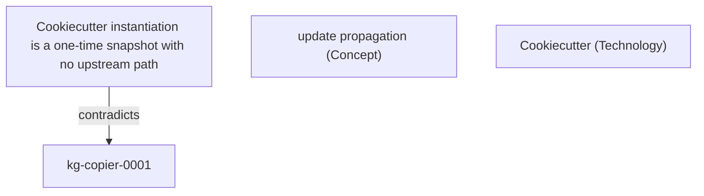
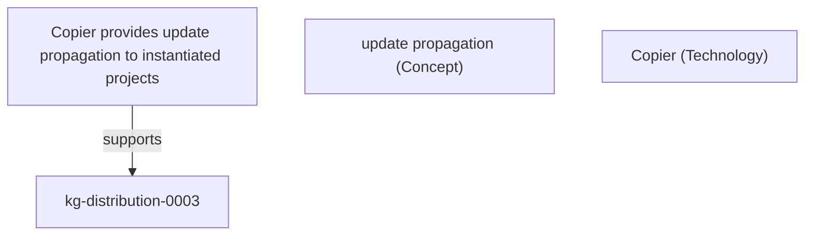
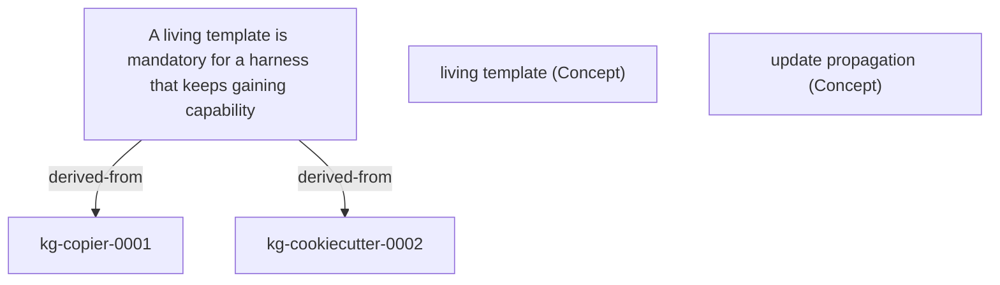

This general synthesis covers 3 surviving finding(s) across the research.

## Cookiecutter instantiation is a one-time snapshot with no upstream path

Cookiecutter and bare GitHub template repos generate a project once; there is no supported mechanism to re-apply later template changes. This contrasts with update-propagating engines.

Key entities: Cookiecutter (Technology), update propagation (Concept).

_Dimension: landscape · verification: survived._

Evidence:

- [Cookiecutter documentation](<https://cookiecutter.readthedocs.io/>)

## Copier provides update propagation to instantiated projects

Copier's `copier update` re-applies later template changes to an already-instantiated project via a three-way merge. This is the capability a living template needs.

Key entities: Copier (Technology), update propagation (Concept).

_Dimension: technical · verification: survived._

Evidence:

- [Copier — Updating a project](<https://copier.readthedocs.io/en/stable/updating/>)

## A living template is mandatory for a harness that keeps gaining capability

Because the harness keeps gaining skills, gates, and schema versions, a one-time snapshot freezes every clone at its instantiation date. An update-propagating template engine is therefore the decisive distribution choice.

Key entities: update propagation (Concept), living template (Concept).

_Dimension: trajectory · verification: survived._

Evidence:

- [Copier — Updating a project](<https://copier.readthedocs.io/en/stable/updating/>)

## Sources

- [Cookiecutter documentation](<https://cookiecutter.readthedocs.io/>)
- [Copier — Updating a project](<https://copier.readthedocs.io/en/stable/updating/>)
